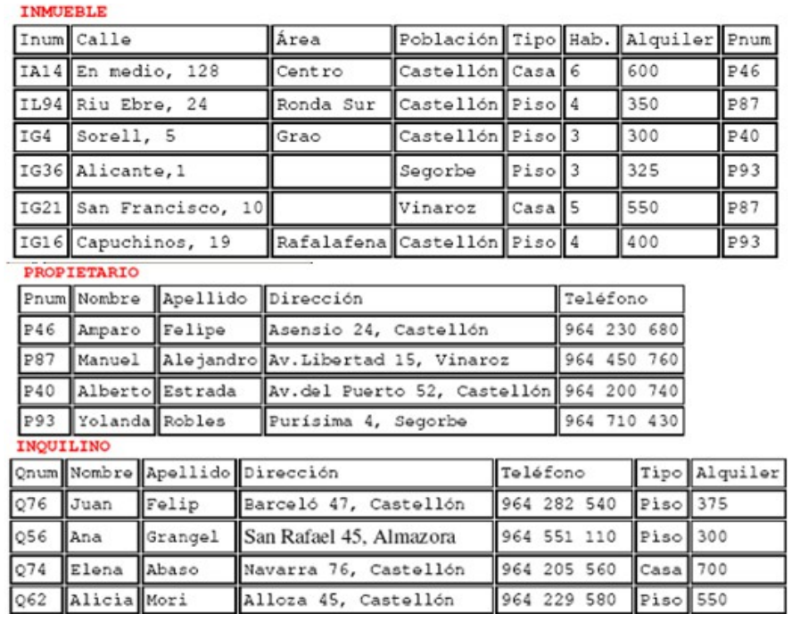
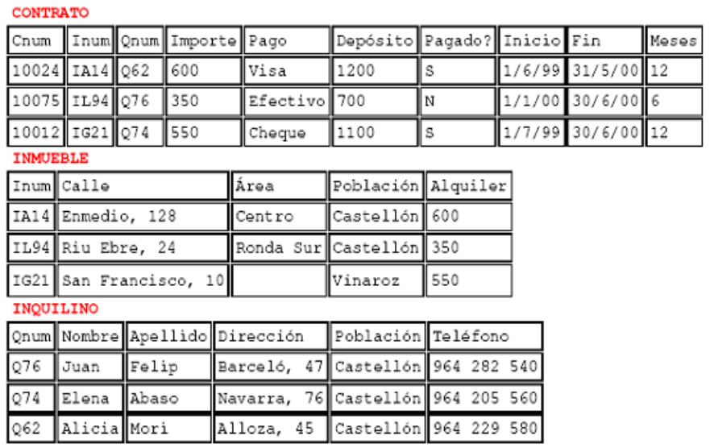
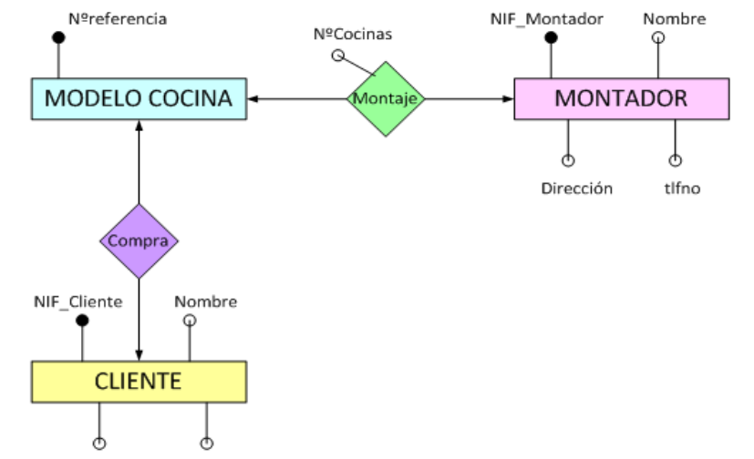
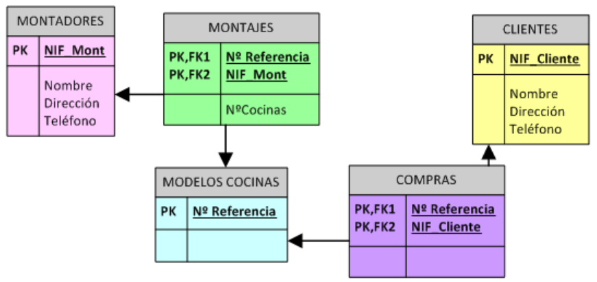
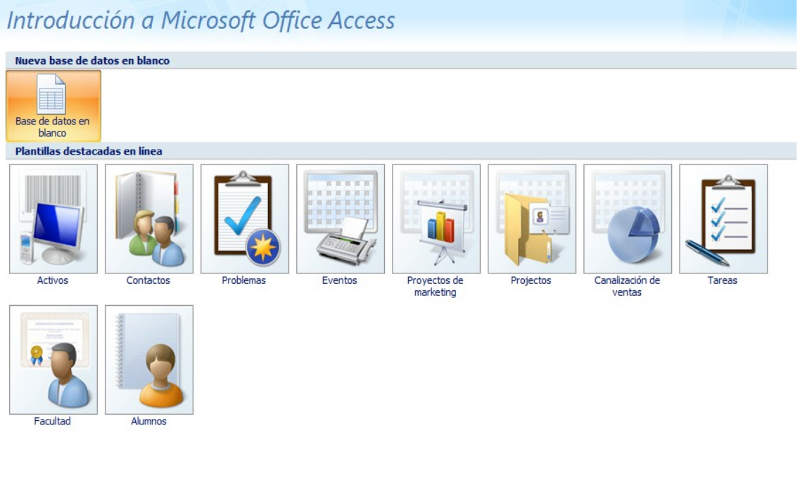

ACTIVIDADES PROPUESTAS
======================

Test
----

Para cada una de las siguientes cuestiones elige razonadamente cada una de las respuestas correctas.

¿Cuáles de los siguientes puntos representan inconvenientes de los Sistemas de Ficheros?
++++++++++++++++++++++++++++++++++++++++++++++++++++++++++++++++++++++++++++++++++++++++

a. Redundancia e Inconsistencia.
b. Sistema de Gestión de Datos independiente de la máquina y del SO.
c. Control de concurrencia.
d. Difícil modificación de los datos.

Los sistemas orientados a BD presentan las siguientes ventajas...
+++++++++++++++++++++++++++++++++++++++++++++++++++++++++++++++++

a. Integridad de los datos.
b. Redundancia.
c. Cada aplicación maneja sus propios datos.
d. Independencia entre los datos y las aplicaciones que los usan.

Los datos son ...
+++++++++++++++++

a. ... todo aquello de lo cual interesa guardar información.
b. ... hechos conocidos que pueden registrarse y que tienen un significado implícito.
c. ... información acerca de los metadados.
d. ... las claves primarias y foráneas de cada entidad.

Un SGBD ...
+++++++++++++++++

a. ... esta formado por datos acerca de los datos presentes en la base de datos.
b. ... es una aplicación que permite a los usuarios definir, crear y mantener una base de datos, y proporciona acceso controlado a la misma.
c.  ... permite a los usuarios tener acceso a la BD completa impidiendo restricciones.
d. ... permite la inserción, actualización, eliminación y consulta de datos mediante el lenguaje de manejo o manipulación de datos.

Cuestiones
---------------

Contesta los siguientes apartados
+++++++++++++++++++++++++++++++++++++++++++++++++++++++++++++++++

1. Explica brevemente los antecedentes de las BD actuales.
2. Enumera y explica brevemente los inconvenientes que presentan los antiguos sistemas de Archivos o de Ficheros.

¿Qué significa que los datos de una BD tienen un significado implícito? Por tres ejemplos, diferentes de los expuesto en el tema, que ilustren tu explicación.
+++++++++++++++++++++++++++++++++++++++++++++++++++++++++++++++++++++++++++++++++++++++++++++++++++++++++++++++++++++++++++++++++++++++++++++++++++++++++++++++++++++++++++++

Definir que es un SGBD
++++++++++++++++++++++++++++++

Indica las principales principales ventajas de las BD frente a los antiguos sistemas de ficheros.
++++++++++++++++++++++++++++++++++++++++++++++++++++++++++++++++++++++++++++++++++++++++++++++++++

Nombre los distintos tipos de bases de datos que existen según el modelo que siguen
++++++++++++++++++++++++++++++++++++++++++++++++++++++++++++++++++++++++++++++++++++

¿Qué son las vistas? ¿Para qué se utilizan?. Busca información en Internet para completar tu respuesta. ¿En qué se diferencia de una consulta?
++++++++++++++++++++++++++++++++++++++++++++++++++++++++++++++++++++++++++++++++++++++++++++++++++++++++++++++++++++++++++++++++++++++++++++++++++++++++++++++++

Describe el significado de las siguientes siglas: DDL, DML y DCL. Explica la utilidad de cada una.
++++++++++++++++++++++++++++++++++++++++++++++++++++++++++++++++++++++++++++++++++++++++++++++++++

¿Qué es un script o guión?
+++++++++++++++++++++++++++

Define los siguientes conceptos:
+++++++++++++++++++++++++++++++++++++++++++++++++++++++++++++++++

1. Dato
#. Tipo de Dato
#. Campo
#. Registro
#. Tabla
#. Relación
#. Consulta
#. Procedimiento

¿Qué es el diccionario de datos?
+++++++++++++++++++++++++++++++++

¿Qué quiere decir que una base de datos permita la concurrencia?
+++++++++++++++++++++++++++++++++++++++++++++++++++++++++++++++++

Utilizando el archivo “La biblia de Access” disponible en la moodle, contesta a las siguientes preguntas:
++++++++++++++++++++++++++++++++++++++++++++++++++++++++++++++++++++++++++++++++++++++++++++++++++++++++++

1. ¿Cuál es la extensión de un fichero que contiene la base de datos de ACCESS?
#. Describe dos formas de crear un formulario en ACCESS.
#. Indica los 10 tipos de datos básicos que existen en ACCESS.
#. Describe dos formas de crear una consulta en ACCESS.

Prácticas
--------------

PRÁCTICA 1
+++++++++++++

.. admonition:: PLANTEAMIENTO

  OBJETIVOS: Comparar un Sistema de Ficheros con un Sistema basado en BD.

  ENUNCIADO: Se plantea un problema real y se muestra la solución dada al mismo utilizando un sistema de ficheros. Se analizará dicha solución y se detectarán en ella ejemplos de cada uno de los inconvenientes visto en teoría para los Sistemas de Ficheros. Es decir, buscaremos ejemplos en la solución propuesta que ilustren los siguientes inconvenientes:

  - Coste de almacenamiento elevado.
  - Datos redundantes.
  - Probabilidad alta de inconsistencia en los datos.
  - Difícil modificación en los datos.
  - Tiempos de procesamiento elevados.

PROBLEMA REAL
*************

Una empresa se encarga de dar publicidad a los inmuebles que ofrece en alquiler, tanto en prensa local como nacional, entrevista a los posibles inquilinos, organiza las visitas a los inmuebles y negocia los contratos de alquiler. Una vez firmado el alquiler, la empresa asume la responsabilidad del inmueble, realizando inspecciones periódicas para comprobar su correcto mantenimiento. A continuación se describen los datos que se manejan en las oficinas de la empresa para llevar a cabo el trabajo diario.

**OFICINAS**

La empresa tiene varias oficinas en todo el país. Cada oficina tiene un código de identificación que es único, tiene una dirección (calle, número y ciudad), un número de teléfono y un número de fax. Cada oficina tiene su propia plantilla.

**PLANTILLA**

Cada oficina tiene un director que se encarga de supervisar todas sus gestiones. La empresa  sigue muy de cerca el trabajo de los directores y tiene registrada la fecha en que cada director empezó en el cargo en su oficina. Cada director tiene un pago anual por gastos de vehículo y una bonificación mensual que depende de los contratos de alquiler que haya realizado su oficina.
En cada oficina hay varios supervisores. Cada uno es responsable del trabajo diario de un grupo de entre cinco y diez empleados que realizan las gestiones de los alquileres. El trabajo administrativo de cada grupo lo lleva un administrativo.
Cada miembro de la plantilla tiene un código único que lo identifica en la empresa. De cada uno de ellos se quiere conocer el nombre, la dirección, el número de teléfono, la fecha de nacimiento, el número del DNI, su puesto en la empresa, el salario anual y la fecha en que entró en la empresa. De los administrativos se desea conocer también la velocidad con que escriben a máquina (en pulsaciones por minuto).
Además, de cada empleado se debe guardar información sobre uno de sus parientes más próximos: nombre, relación con el empleado, dirección y número de teléfono.

**INMUEBLES**

Cada oficina de la empresa tiene una serie de inmuebles para alquilar. Estos inmuebles se identifican por un código que es único dentro de la empresa. Los datos que se guardan de cada inmueble son los siguientes: dirección completa (calle, número y ciudad), tipo de inmueble, número de habitaciones y precio del alquiler en euros (este precio es mensual). El precio del alquiler se revisa de forma anual.
Cada inmueble se asigna a un empleado que es el responsable de su gestión. Cada miembro de la plantilla puede tener asignados hasta veinte inmuebles para alquilar.

**PROPIETARIOS**

Los propietarios de los inmuebles pueden ser particulares o empresas. A cada propietario se le asigna un código que es único en la empresa. De los particulares se guarda el nombre, la dirección y el número de teléfono. De las empresas se guarda el nombre comercial, tipo de empresa, la dirección, el número de teléfono y el nombre de la persona de contacto.

**INQUILINOS** (CLIENTES)

Cuando un cliente contacta con la empresa por primera vez, se toman sus datos: nombre, dirección, número de teléfono, tipo de inmueble que prefiere e importe máximo que está dispuesto a pagar al mes por el alquiler. Ya que es un posible inquilino, se le asigna un código que es único en toda la empresa. De la entrevista inicial que se realiza con cada cliente se guarda la fecha, el empleado que la realizó y unos comentarios generales sobre el posible inquilino.

**VISITAS A LOS INMUEBLES**

En la mayoría de los casos, los posibles inquilinos desean ver varios inmuebles antes de alquilar uno. De cada visita que se realiza se guarda la fecha y los comentarios realizados por el cliente respecto al inmueble.

**ANUNCIOS**

Cuando algún inmueble es difícil de alquilar, la empresa lo anuncia en la prensa local y nacional. De cada anuncio se guarda la fecha de publicación y el coste económico del anuncio. 
De los periódicos se guarda el nombre, la dirección, el número de teléfono, el número de fax y el nombre de la persona de contacto.

**CONTRATOS DE ALQUILER**

La empresa se encarga de redactar los términos de cada contrato de alquiler. Cada contrato tiene un número, un importe mensual, un método de pago, el importe del depósito, si se ha realizado el depósito, las fechas de inicio y finalización del contrato, la duración del contrato en meses y el miembro de la plantilla que lo formalizó. La duración mínima de un contrato es de tres meses y la duración máxima es de un año. Cada cliente puede tener alquilados uno o varios inmuebles al mismo tiempo.

**INSPECCIONES**

Como parte del servicio que presta la empresa, ésta se encarga de realizar inspecciones periódicas a los inmuebles para asegurarse de que se mantienen en buen estado. Cada inmueble se inspecciona al menos una vez cada seis meses. Se inspeccionan tanto los inmuebles alquilados, como los que están disponibles para alquilar. De cada inspección se anota la fecha y los comentarios sobre su estado que quiera incluir el empleado que la ha llevado a cabo.

**ACTIVIDADES DE CADA OFICINA**

En cada oficina se llevan a cabo las siguientes actividades para garantizar que cada empleado tenga acceso a la información necesaria para desempeñar su tarea de modo efectivo y eficiente.
Cada actividad está relacionada con una función específica de la empresa. Cada una de estas funciones corresponde a uno o varios puestos de los que ocupan los empleados, por lo que éstos se indican entre paréntesis.

SOLUCIÓN PROPUESTA SEGÚN EL ANTIGUO SISTEMA DE FICHEROS
********************************************************

**DEPARTAMENTO DE VENTAS**

En esta inmobiliaria, el departamento de ventas se encarga de alquilar inmuebles. Por ejemplo, cuando un propietario pasa por el departamento de ventas para ofrecer en alquiler su piso, se rellena un formulario en donde se recogen los datos del piso, como la dirección y el número de habitaciones, y los datos del propietario. El departamento de ventas también se encarga de atender a los clientes que desean alquilar un inmueble. Cuando un cliente (posible inquilino) pasa por este departamento se rellena un formulario con sus datos y sus preferencias: si quiere un piso o una casa, el importe mensual que está dispuesto a pagar por el alquiler, etc. Para gestionar toda esta información, el departamento de ventas posee un sistema de información. El sistema del departamento de ventas tiene tres ficheros: fichero de inmuebles, fichero de propietarios y fichero de inquilinos.

**DEPARTAMENTO DE CONTRATOS**

El departamento de contratos se ocupa de gestionar los contratos de alquiler de los inmuebles. Cuando un cliente desea formalizar un contrato, un empleado de la empresa rellena un formulario con los datos del inquilino y los datos del inmueble. Este formulario se pasa al departamento de contratos, que asigna un número al contrato y completa la información sobre el pago y el período del contrato. Para gestionar esta información, el departamento de contratos posee un sistema de información con tres ficheros: el fichero de los contratos, el fichero de los inmuebles alquilados y el fichero de los inquilinos que tienen en vigor un contrato de alquiler.

.. important::

 Al tratarse de una solución basada en Sistemas de ficheros, cada departamento accede a sus propios ficheros mediante una serie de programas de aplicación escritos especialmente para ellos. Estos programas son totalmente independientes entre un departamento y otro, y se utilizan para introducir datos, mantener los ficheros y generar los informes que cada departamento necesita. Es importante destacar que la estructura física de los ficheros de datos y de sus registros está definida dentro de los programas de aplicación.

La situación es muy similar en el resto de departamentos:

**DEPARTAMENTO DE NÓMINAS**

En el departamento de nóminas tiene un fichero con los datos de los salarios de los empleados. Los registros de este fichero tienen los siguientes campos: número de empleado, nombre, apellido, dirección, fecha de nacimiento, salario, DNI y número de la oficina en la que trabaja.

**DEPARTAMENTO DE PERSONAL**

El departamento de personal tiene un fichero con los datos de los empleados. Sus registros tienen los siguientes campos: número de empleado, nombre, apellidos, dirección, teléfono, puesto, fecha de nacimiento, salario, DNI y número de la oficina en la que trabaja.

CUESTIONES
**********

1. Completa una tabla buscando ejemplos en el enunciado de cada uno de los inconvenientes estudiados en los sistemas de ficheros. Deberás completar la respuesta con una breve explicación que ilustre el porqué dicho ejemplo presenta el inconveniente en cuestión.

.. csv-table:: INCONVENIENTES
   :header: "INCONVENIENTE", "EJEMPLO", "EXPLICACIÓN"
  
   "Coste de almacenamiento elevado",,
   "Datos redundantes",,
   "Probabilidad alta de inconsistencia de los datos",,
   "Difícil modificación de los datos",,
   "Tiempo de procesamiento elevado",,

.. note::

   La tabla la deberás entregar en formato apaisado para que puedas dar las explicaciones sin límite de espacio.

2. Supongamos ahora que quisiéramos resolver el problema real usando el enfoque actual de BD. Detecta en el enunciado ejemplos de los siguientes elementos fundamentales de una BD:

- Datos
- Entidades
- Claves principales
- Claves foráneas
- Integridad referencial
- Metadatos

.. note::
  
  Los tres últimos elementos pueden ser más difíciles de encontrar. Si es así, no os preocupéis porque estamos empezando.

3. Utiliza los ejemplos sobre datos detectados en el enunciado para explicar el concepto de “significado implícito” de los mismos.

PRÁCTICA 2
+++++++++++

.. admonition:: PLANTEAMIENTO

  OBJETIVO: Adentrarse en el diseño e implementación de BD a través de un ejemplo guiado. La realización autónoma de este tipo de prácticas será el objetivo esencial de este módulo.

  ENUNCIADO: Se plantea el enunciado de una base de datos y los esquemas conceptuales y lógicos que resultan y que ¡pronto sabrás realizar por ti mismo!. A partir de ellos, se explicará paso a paso como crear las tablas y las relaciones entre las mismas. Cómo introducir los datos y cómo realizar algunas consultas sencillas sobre ellos. Cuando finalicemos este módulo sabrás hacer todo esto solo y además en lenguaje SQL!!

  PROBLEMA: Se quiere realizar una BD para una empresa dedicada a la comercialización de cocinas.

.
     
:Ejercicio:     
        a. Detecta en el enunciado anterior todas las ENTIDADES y DATOS. Indica a qué tipo de Base de    Datos de entre los vistos en el tema, corresponde la solución planteada.

Al igual que antes de construir un edificio, se deben pasar por una serie de fases previas:

- recogerse con detalle las características que debe reunir,
- realizar los planos necesarios y una especificación de calidades,… antes de realizar una base de datos realizaremos también un diseño previo.

El Diseño de base de datos, se verá con detalle a partir de la próxima unidad. No obstante, y a modo de introducción, nos aceremos al mismo en el siguiente ejemplo guiado. Para entenderlo, hacemos una breve introducción de las distintas fases por las que pasa el análisis y el diseño de una BD:

.. admonition:: Fase de análisis: Especificación de Requisitos Software o E.R.S.

  Los informáticos se reúnen con los futuros usuarios del sistema para recopilar la información que necesitan para saber que desean dichos usuarios.

Supongamos que después de unas entrevistas previas, obtenemos que la empresa lo que desea es lo siguiente:

**Especificación de requisitos**

La empresa desea realizar un control de sus ventas y montajes, para lo cual se tiene en cuenta:

- De cada modelo de cocina nos interesa el número de referencia del modelo.
- De un montador nos interesa su NIF, nombre, dirección, teléfono de contacto y el número de cocinas que ha montado de cada modelo.
- Cada modelo cocina lo debe montar al menos un montador, y el mismo montador puede montar varios modelos, porque no se especializan en ninguno en concreto.
- De un cliente nos interesa su NIF, nombre, dirección y teléfono. Cada modelo de cocina pueden comprarlo uno o varios clientes, y el mismo cliente puede comprar varias modelos de cocinas.

.. admonition:: Fase 1 del Diseño: Diseño Conceptual. 

 A partir de la E.R.S., se diseñará un modelo que tienen un gran poder expresivo para poder comunicarse con el usuario que no experto en informática. El modelo que utilizaremos en este módulo y que explicaremos en la siguiente unidad es el modelo Entidad/relación.

**Diseño Conceptual**

A partir de la E.R.S, que supone una descripción del mundo real sobre el que queremos diseñar nuestra base de datos, el primer paso será diseñar el esquema conceptual que lo describe.

Es algo parecido al paso previo que realizan los arquitectos al crear el plano de un edificio antes de construirlo. Tiene sus propios símbolos que deben conocer todos los arquitectos para entender el plano. Al igual que ellos, vosotros tendréis que aprender a conocer los símbolos que utilizaréis e interpretaréis para poder diseñar una BD.
Estos símbolos se aprenderán en el Tema siguiente, pero en este y a modo de introducción, se presenta como quedaría la interpretación del mundo real de nuestro problema mediante el esquema conceptual llamado entidad/relación.

  b) ¿Cómo crees que hemos representado las entidades en el esquema anterior?
  c) ¿Cómo crees que hemos representado los datos en el esquema anterior?

.. admonition:: Fase 2 del diseño: Diseño Lógico. 

  A partir del modelo entidad/relación se creará un modelo que suele ser más difícil de entender para el usuario final y que generalmente tiene una traducción directa al modelo físico en que entiende el SGBD. El modelo lógico elegido dependerá de la BD, pues no es lo mismo modelizar una BD orientada a objetos que una BD relacional. El modelo que utilizaremos en este módulo es el modelo relacional.

**Diseño Lógico**

A partir del esquema conceptual, aprenderemos a obtener el esquema lógico, el cual va a depender del SGBD que utilicemos. En nuestro caso nos basaremos en el modelo relacional que es el más extendido. De nuevo, y a modo de ejemplos de ¡lo que seréis capaces de hacer en breve! os presento como quedaría el esquema relacional del ejemplo anterior.

Cada una de las “cajas” representadas en el esquema anterior recibirá el nombre de relación (por eso Modelo Relacional). Una relación no es otra cosa que una tabla y en ella se transformará en el diseño físico (Creación de la Bd en un SGBD)

  d) ¿Detectas algún ejemplo en el modelo que ilustre el concepto de "significado implícito" de los datos de una BD?

.. admonition:: Fase 3 del diseño: Diseño físico. 

  Es el resultado de aplicar el modelo lógico a un SGBD concreto. Generalmente está expresado en un lenguaje de programación de BBDD tipo SQL. Aunque en este primer ejemplo introductorio utilizaremos como SGBD Access, que se basa en herramientas gráficas para implementar la BD.

**Diseño Físico**

A partir del esquema lógico, aprenderemos a crear físicamente nuestra BD en el SGBD. Para interpretar el esquema sólo es necesario saber que:

- Cada relación o caja será una tabla en nuestro SGBD.
- Los campos precedidos de “PK” serán las claves principales en nuestras tablas.
- Los campos precedidos de “FK” serán las claves foráneas en nuestras tablas.

.. note::

  Para resolver la última parte de esta práctica utilizaremos como SGBD Microsoft ACCESS. Aunque es una aplicación muy extendida no es una herramienta verdaderamente potente para un Técnico informático. Es por eso que sólo la usaremos en las secciones introductorias y cuando nos adentremos en el módulo, pasaremos al uso de ORACLE. En concreto vamos a usar el manual de ACCESS 2007 y podréis consultarlo en todo momento ya que estará a vuestra disposición en la MOODLE. 

**Paso a Tablas usando Access**

1. Entraremos en ACCESS y crearemos una nueva base de datos en blanco a la que pondremos por nombre Práctica 2. A continuación iremos a Crear –> Diseño de tabla y procederemos a crear una a una las siguientes tablas: 

Utiliza las capturas de pantalla y el manual de ACCESS para crear las máscaras de entrada correspondientes. Se crearán máscaras para el NIF y el tlfno, del tipo 59567840-T y 676 987 659, tanto en las tablas MONTADORES como CLIENTES.

  .. image:: images/tema1-019.png

  .. image:: images/tema1-020.png
  
  .. image:: images/tema1-021.png
  
  .. image:: images/tema1-022.png
  
  .. image:: images/tema1-023.png

  
  e) A partir de las imágenes anteriores ¿qué identificarías como metadatos?
  f) Crea las tablas anteriores en ACCESS.

2. A continuación estableceremos las relaciones entre las tablas según el siguiente esquema antes de poder introducir los datos.

  .. image:: images/tema1-024.png

  g) Crea las relaciones en ACCESS: Herramientas de Bases de Datos-> Relaciones→ Agregar las tablas. Para estableces las relaciones deberás pinchar con el ratón sobre la clave principal y, sin soltar, ponerte sobre la clave foránea. Una vez sobre ella soltarás y marcarás las casilla “Exigir integridad referencial”

  .. image:: images/tema1-025.png

3. Ya estamos listos para introducir datos. Para hacerlo pincharemos sobre las tablas y accederemos a ellas en “Vista hoja de datos”. Se introducirán los datos siguientes:

  .. image:: images/tema1-026.png

4. El verdadero sentido de tener nuestros datos almacenados en una BD es poder consultarlos en caso de necesidad. A continuación vamos a ver ejemplos guiados de consultas de datos.
Vamos a ver ahora como se realizan algunas consultas sencillas. Iremos a las opciones Crear-> Diseño de consultas

  h) Muestra los nombres y teléfonos de todos los montadores. Sólo habrá que mostrar la tabla MONTADORES

  .. image:: images/tema1-027.png

Y de ella elegir los campos: Nombres y Teléfonos.

  .. image:: images/tema1-028.png

Una vez realizada tal selección se grabará la consulta con el nombre de Consulta1 Y para mostrarla elegiremos la pestaña “Consultas” de la lista desplegable de “Tablas”. Pinchado sobre “Consulta 1” se deberá abrir el resultado de la misma.

  .. image:: images/tema1-030.png

  i) Muestra los nombres y direcciones de los clientes y graba dicha consulta con el nombre de “Consulta2”.

  .. image:: images/tema1-031.png

  j) Muestra todas las cocinas montadas por el montador de NIF 87654329-F.

  .. image:: images/tema1-032.png

  k) Muestra el NIF de los clientes que han adquirido la cocina de modelo 2 y la cocina de modelo 6.

  .. image:: images/tema1-033.png 

  l) Muestra los nombres de los clientes que han adquirido una cocina del modelo 2 o del modelo 6

  .. image:: images/tema1-034.png

PRÁCTICA 3
+++++++++++

.. admonition:: PLANTEAMIENTO

  OBJETIVO: Adentrarse en el diseño e implementación de BD a través de un ejemplo no guiado.

  ENUNCIADO: Se plantea el enunciado de una base de datos y los esquemas conceptuales y lógicos que resultan y a partir de los cuales se deberán crear las tablas relacionadas en ACCESS.
  Un banco desea informatizar el seguimiento de las cuentas de ahorro que sus clientes tienen en sus sucursales así como la gestión del personal. Realiza la BD que represente este sistema y que cumpla las siguientes restricciones:
  Cada Cuenta de Ahorro tiene un número e interesa conocer el saldo de las mismas.
  Cada cliente puede tener 1 o varias cuentas en una o varias sucursales.
  El cliente se identifica por su DNI y guardamos también su nombre y dirección.
  De una cuenta de ahorro pueden ser titulares varios clientes.
  Cada sucursal se conoce por su número de sucursal y su dirección.
  El personal del banco se divide en: empleados de sucursal y directores de sucursal. De todos interesa conocer su código de empleado, DNI y su nombre.

Los empleados se encuentran destinados de forma exclusiva a una sucursal. De ellos interesa conocer además su sueldo.
Cada sucursal tiene un único director de sucursal.

a. Identifica las entidades y los datos que detectas en el enunciado anterior. 

b. Observa el siguiente **modelo Entidad/Relación** que se obtendría a partir del enunciado anterior. Detecta en él cuáles serían las entidades y los datos.

  .. image:: images/tema1-035.png

c. Observa el siguiente **modelo Relacional** que se obtendrá a partir del modelo Entidad/Relación anterior. Indica en él:

  .. image:: images/tema1-036.png

  - Cuáles son las tablas que deberás crear en ACCESS.
  - Cuáles son las claves principales.
  - Cuáles son las claves foráneas.
  - A qué tipo de Base de Datos y Sistema Gestor de Bases de Datos corresponde el diseño planteado.

d. Utiliza el modelo Relacional para crear la BD correspondiente en ACCESS. Deberás tener en cuenta que los campos cumplirán las siguientes condiciones:

  - Los códigos del personal empezarán por la letra P e irán seguidos de un número correlativo. Ejemplo: P1, P2, P3...
  - Los números de cuentas bancarios actuales están formados por 20 dígitos que tienen la estructura siguiente:

    + El código del banco al que pertenece la cuenta (4 dígitos).
    + El código de la sucursal en el que se abrió la cuenta (4 dígitos).
    + Un número de control, llamado dígito de control, que impide errores de teclado (2 dígitos).
    + Y por último, el número de cuenta (10 dígitos).

  - Como en nuestra BD todas las cuentas pertenecen a la misma entidad bancaria, el código de sucursal estará formado por 4 dígitos.
  - Los DNI incluirán la letra. Tendrá un tamaño de 9 caracteres.
  - El Saldo y el Sueldo serán campos numéricos. El sueldo siempre será un número mayor que 0, pero el saldo puede ser negativo (números rojos).
  - Los campos "Nombre" y "dirección" deben tener el tamaño adecuado para incluir los datos. Ponemos tamaño 50.

PRÁCTICA 4
+++++++++++

.. admonition:: PLANTEAMIENTO

  OBJETIVO: Se trata de una práctica de ampliación. Con ella se pretende que el alumno utilice el manual “Biblia de ACCESS 2007”. Para ello se proponen una serie de prácticas enumeradas del 1 al 12 para cuya realización se deberá buscar la información del manual. Es deseable que el alumno adquiera autonomía en el manejo de documentación y por eso habrá que intentar consultar al profesor sólo cuando sea estrictamente necesario. Todo lo que se requiere para solucionar la práctica está en el manual que podéis consultar en la plataforma Moodle del curso GBD.

  ENUNCIADO: Ejercicio de Microsoft ACCESS.

I. **Creación de una Base de Datos y diseño de varias tablas.**
 
  1. Crear una nueva Base de Datos. Llamarla CURSACC01.MDB

  2. Crear una tabla nueva para registrar la información de fichas de Clientes. Llamarla CLIENTES. Estará compuesta por los siguientes campos:

  .. image:: images/tema1-037.png

  3. Asignar como Clave Principal el campo CODCLIENTE.

  4. Crear una tabla nueva para registrar la información de fichas de Artículos. Llamarla ARTICULOS. Compuesta por los siguientes campos:

  .. image:: images/tema1-038.png

  5. Asignar como Clave Principal el campo CODARTIC.

  6. Crear una Tabla nueva para registrar la información de Pedidos. Llamarla PEDIDOS. Compuesta por los siguientes campos:

  .. image:: images/tema1-039.png

  7. Asignar como Clave principal el campo NUMPEDIDO.

  8. Crear una Tabla nueva para registrar la información de las zonas de Ventas. Llamarla ZONAS. Compuesta por los siguientes campos:

  .. image:: images/tema1-040.png

  9. Asignar como Clave principal el campo ZONA.

II. **Adquirir práctica en el uso de las hojas de datos.**
 
  1. Abra la tabla ARTICULOS, y cumplimente 6 ó 7 registros.
  Para los precios indique diversas cantidades entre 100 y 500 -esto será útil para algunos de los ejercicios posteriores-.

  .. hint::

    Invéntese los datos, pero utilice números consecutivos para el campo CODARTIC, para facilitar más adelante la introducción de datos en PEDIDOS.
  
  2. Abrir la tabla ZONAS, y cumplimentar 4 registros.

  .. hint::
  
    Zonas: Norte, Sur, Este y Oeste
  
  3. Abra la tabla CLIENTES y cumplimente al menos 10 registros.
  No es preciso cumplimentar todos los campos, pero necesariamente debe rellenar CODCLIENTE, NOMBRECLI, CODPOSTAL, POBLACION, DESCUENTO y ZONAVENTAS, pues utilizaremos estos datos más adelante.
  En el campo ZONAVENTAS utilice exclusivamente datos que haya insertado en el campo ZONA de la tabla ZONAS. Varios clientes deberán ser de Barcelona y Madrid.

  .. hint::
  
     Invéntese los datos, pero utilice números consecutivos para el campo CODCLIENTE, para facilitar más adelante la introducción de datos en PEDIDOS.

  Observe como las propiedades de campos que hemos definido, determinan el comportamiento de Access al introducir códigos postales (máscara) y descuentos (regla de validación); observe también que ocurre cuando intenta omitir ZONAVENTAS en algún registro (requerido). Observe como los nombres de los campos difieren de los de las columnas en aquellos campos para los cuales se ha definido la propiedad título.

  4. Con la tabla CLIENTES practique los siguientes puntos:

    - Redimensione el tamaño de las columnas a las necesidades de su contenido.
    - Ordene todos sus registros en base a los datos de la columna NOMBRECLI.
    - Observe el efecto de la ordenación en las otras columnas. Pruebe con otras columnas.
  
  5. Pida que Access busque un dato cualquiera dentro de su tabla.

  6. Cree y aplique un filtro cada vez, capaz de:

    - Mostrar solo clientes de la Zona de Ventas 1
    - Mostrar solo clientes de la Población de Barcelona
    - Mostrar solo clientes de Barcelona y con un Descuento superior al 5%

  7. Mueva la columna TELEFONO a la derecha de la columna NOMBRECLI. Pruebe otros movimientos.

  8. Oculte las columnas DESCUENTO y ZONAVENTAS. Vuelva a mostrarlas. Pruebe otras.

  9. Cree un nuevo registro con la particularidad que el contenido del campo CODCLIENTE ya exista en otro de sus registros. Observe la reacción del sistema (bloqueo frente la violación de la clave principal.)

III. **Establecer relaciones entre tablas y experimentar con la integridad referencial.**

  1) Abrir la ventana de Relaciones.

  2) Agregar las tablas CLIENTES, ARTICULOS, PEDIDOS y zonas para crear las relaciones entre las mismas.

  3) Crear las siguientes relaciones entre las tablas correspondientes:

    - Todas las relaciones se crearán exigiendo integridad referencial, con actualización y eliminación en cascada. 
    - Guardar el diseño de la relación.
  
  4) Abrir la tabla PEDIDOS y llenar entre 15 y 20 registros. Recordar que debido a la relación establecida con integridad referencial en los campos CODCLIENTE y CODARTIC solo se admitirán aquellos códigos existentes de la tabla CLIENTES y ARTICULOS respectivamente.

  5) Probar de entrar algún CODCLIENTE o CODARTIC inexistente en la tabla PEDIDOS y observar el resultado.

  6) Observar 2 ó mas registros en PEDIDOS con el mismo código de cliente (si no tiene registros que cumplan esta característica, créelos); estos dos registros se modificarán y se borrarán en el próximo ejercicio.

  7) Cerrar la tabla PEDIDOS.

  8) Abrir la tabla CLIENTES, localizar el registro correspondiente al cliente que hemos observado en el punto 6 y modificar el CODCLIENTE por otro Código no existente.

  9) Cerrar la tabla CLIENTES.

  10) Abrir la tabla PEDIDOS y comprobar como los dos pedidos introducidos en el ejercicio 6 han modificado su Código de Cliente. De manera análoga estos cambios podrían haber sido realizados en la tabla ARTICULOS.

  11) Cerrar la tabla PEDIDOS.

  12) Abrir la tabla CLIENTES, localizar el registro del cual se ha cambiado el Código y borrarlo.

  13) Cerrar la tabla CLIENTES.

  14) Abrir la tabla PEDIDOS y comprobar que los registros relacionados de esta tabla con el mismo código de cliente eliminado, se han borrado también de la tabla.

  15) Cerrar la tabla PEDIDOS.

IV. **Adquirir práctica en el diseño de consultas de selección**
 
  1) Diseñar una consulta que sea capaz de devolver todos los clientes que pertenezcan a la ZONA DE VENTAS número 1.
  
  2) Además de el criterio anterior, esta consulta solamente deberá mostrarnos los campos CODCLIENTE y NOMBRECLI, sin mostrar el campo de ZONA DE VENTAS.
  
  3) Modificar la consulta para que nos muestre también los registros de la ZONA DE VENTAS número 3.
  
  4) Guardar la consulta con el nombre SELECCIÓN ZONA DE VENTAS.
  
  5) Modificar la consulta para hacer que cada vez que ejecutemos la consulta nos solicite la ZONA DE VENTAS que deseamos ver. (Parámetros).
  
  6) Probar su funcionamiento con diferentes Zonas de ventas.
  
  7) Modificar la consulta para que en vez de solicitar el código de la zona de ventas, nos solicite el nombre de la zona (campo DESCRIPCION).
  
  8) Modificar la consulta para que aparezcan solamente aquellos registros de la tabla CLIENTES con las condiciones actuales de la consulta pero además solamente deberán salir aquellos que hayan realizado alguna venta.
  
  .. hint:: 

    Para comprobarlo asegúrese de crear algún cliente nuevo en una zona. Este cliente no debería aparecer en el resultado de la consulta, pues no tiene pedidos.

  9) Guardar la consulta.
 
  10) Crear una nueva consulta basada en la tabla CLIENTES en la cual aparezcan los campos: NOMBRECLI, CODPOSTAL y POBLACIÓN, debiendo aparecer solamente los registros que pertenezcan a la POBLACIÓN de Barcelona.
 
  11) Guardar la consulta con el nombre CLIENTES DE BARCELONA.
 
  12) Ejecutar la consulta.
 
  13) Guardar la consulta con el nombre AÑADIR REGISTROS.
 
  14) Abrir la tabla NUEVA TABLA PEDIDOS y comprobar que se han agregado los registros.
 
  15) Cerrar la tabla NUEVA TABLA PEDIDOS .
 
  16) Ejecutar otra vez la consulta y observar el mensaje que nos presenta Access.

V. **Adquirir práctica en el diseño de Formularios combinados con consultas**

  1) Crea una nueva consulta de selección en la que aparezcan los campos: NOMBRECLI, ARTICULO.DESCRIPCION, UNIDADES, PVP, DESCUENTO.
  
    - Añadir un campo calculado llamado NETO, que será el resultado de: Unidades * PVP * (1 – DESCUENTO). Aplicar a este campo calculado el formato Euro con 2 decimales.
    - Grabar la consulta con el nombre DESCUENTO.
  
  2) Crea un formulario para la consulta que hemos creado en el punto anterior.

    - El formulario deberá ser de Tipo Tabular y con todos los campos de la consulta.
    - Grabar el formulario con el nombre DESCUENTO.
  
  3) Crea un informe para la consulta DESCUENTO.
  
    - El informe será de tipo tabular con todos los campos de la consulta y deberá estar ordenado por NOMBRECLI.
    - Grabar el informe con el nombre DESCUENTO.
  
  4) Crea una consulta de selección en la que aparezcan los siguientes campos: NOMBRECLI, CODPOSTAL, POBLACION, DESCUENTO.

    - Esta consulta deberá preguntarme el nombre del cliente que quiero visualizar cada vez que la ejecute (parámetros ). 
    - Grabar esta consulta con el nombre PARÁMETROS DESCUENTO.
  
  .. hint::
  
    Usar en el criterio el operador “Como” para que se puedan utilizar comodines al introducir el nombre. 

VI. **Adquirir práctica en el diseño de Formularios**
  
  1) Crea una consulta de selección que nos presente de la tabla Artículos todos sus campos de aquellos que el articulo sea el 00001.

  2) Guarda la consulta con el nombre IDENTIFICACIÓN DEL ARTICULO.

  3) Crea un formulario de tipo simple para la consulta anterior.

  4) Modifica el aspecto del titulo del formulario añadiendo colores, bordes y cambiando el tipo de letra.

  5) Añade 2 registros a la tabla Artículos a través del formulario.

  6) Guarda el formulario con el nombre IDENTIFICACIÓN DEL ARTICULO.

  7) Comprueba que los registros que has añadido se encuentran en la tabla.

VII. **Adquirir práctica en el diseño de consultas**

  1) Abre la base de datos, en la cual están contenidas las tablas de CLIENTES, ARTÍCULOS y PEDIDOS.

  2) Crea una consulta de selección en que aparezcan: CODCLIENTE, NOMBRE, UNIDADES.

  3) Modifica la consulta anterior para que aparezca también el campo PVP , y me muestre solamente aquellos que las unidades son mayores a 70.

  4) Graba esta consulta con el nombre CONSULTA_SEL_1.

  5) Crea una consulta de CREACIÓN DE NUEVA TABLA en la que se creen los campos, CODARTIC, CODCLIENTE y DESCRIPCION, 
  pero solamente aquellos que la descripción este entre las Letras A y F.
  
  6) Llamar a la nueva tabla DESCRIPCION y guardar la consulta con el nombre DESCRIP_NUEVA.
  
  7) Ver el contenido de la nueva tabla creada.
  
  8) Crea una consulta del tipo DATOS AÑADIDOS, en la que aparezcan los campos CODARTIC, CODCLIENTE y DESCRIPCION y me agregue a la tabla con nombre DESCRIPCION aquellos registros que el PVP este entre 70 y 100.
  
  9) Guardarla con el nombre AÑADIR.
  
  10) Comprobar en la tabla DESCRIPCION el resultado de la consulta.

