INTRODUCCIÓN
===============

En el entorno del mercado actual, la competitividad y la rapidez de maniobra de una empresa son imprescindibles para su éxito. Para conseguirlo existe cada vez una mayor demanda de datos y, por tanto, más necesidad de gestionarlos. Esta demanda siempre ha estado patente en empresas y sociedades, pero en estos años se ha disparado debido al acceso multitudinario a las redes integradas en Internet y a la aparición de los dispositivos móviles que también requieren esa información.

En informática se conoce como **dato** a cualquier **elemento informativo que tenga relevancia para un usuario**. Desde su nacimiento, la informática se ha encargado de proporcionar herramientas que faciliten la manipulación de los datos.
Antes de la aparición de las aplicaciones informáticas, las empresas tenían como únicas herramientas de gestión de datos los ficheros con cajones, carpetas y fichas de cartón. En este proceso manual, el tiempo requerido para manipular estos datos era enorme. Pero la propia informática ha adaptado sus herramientas para que los elementos que el usuario utiliza en cuanto a manejo de datos se parezcan a los manuales. Por eso se sigue hablado de ficheros, formularios, carpetas, directorios,....

La clientela fundamental del profesional informático es la empresa. La empresa se puede entender como un sistema de información formado por diversos objetos: el capital, los recursos humanos, los inmuebles, los servicios que presta, etc.

Los sistemas de información actuales se basan en bases de datos (BD) y **sistemas de bases de datos (SGBD)** que se han convertido en elementos imprescindibles de la vida cotidiana de la sociedad moderna.

DEFINICIÓN DE BASE DE DATOS
==============================

Definición de Base de Datos
--------------------------------

Cada día, la mayoría de nosotros nos encontramos con actividades que requieren algún tipo de interacción con una base de datos (ingreso en un banco, reserva de una entrada para el teatro, solicitud de una suscripción a una revista, compra de productos, ...). Estas interacciones son ejemplos de lo que se llama aplicaciones tradicionales de bases de datos (básicamente información numérica o de texto), aunque los avances tecnológicos han permitido que también existan: bases de datos multimedia, sistemas de información geográfica (GIS), almacenes de datos, sistemas de proceso analítico on-line, ...

- Una **base de datos** se entenderá como una colección de datos relacionados entre sí y que tienen un significado implícito.

- Por **datos** queremos decir hechos conocidos que pueden registrarse y que tienen un significado implícito.

.. admonition:: Ejemplo

   Una agenda con los nombres y teléfonos de un conjunto de personas conocidas es una base de datos, puesto que es una colección de datos relacionados con un significado implícito.

La definición presentada anteriormente hace referencia a dos elementos para que un conjunto de datos constituya una Base de Datos:

1. **Relaciones entre datos**, tema que se tratará en las secciones siguientes.
2. **Significado implícito** de los datos que se atribuye dependiendo del contexto en que se utilizan los mismos. Por ejemplo, el dato fecha en una base de datos de VENTAS puede referirse a la fecha de emisión de las facturas, mientras que si la base de datos es de MÚSICA quizás corresponda a la fecha en que se grabó un tema musical. Es decir, el significado de un dato, depende de la BD que lo contenga.

Para manipular y gestionar las bases de datos surgieron herramientas software denominadas: sistemas gestores de bases de datos (SGBD en lo sucesivo) sobre los que se profundizará en las siguientes secciones.

EVOLUCIÓN HISTÓRICA Y TIPOS DE BD
====================================

Introducción
-----------------

Los predecesores de los sistemas gestores de bases de datos fueron los sistemas gestores de ficheros o sistemas de archivos tradicionales.

1. **Archivos tradicionales**. Consiste en almacenar los datos en archivos individuales, exclusivos para cada aplicación particular. En este sistema los datos pueden ser redundantes (repetidos innecesariamente) y la actualización de los archivos es más lenta que en una base de datos.
2. **Base de datos**. Es un almacenamiento de datos formalmente definido, controlado centralmente para intentar servir a múltiples y diferentes aplicaciones. La base de datos es una fuente de datos que son compartidos por numerosos usuarios para diversas aplicaciones.

Así, en un Sistema de archivos tradicional la información está dispersa en varios ficheros de datos y existe un cierto número de programas que los recuperan y agrupan.
Aunque los sistemas de ficheros o archivos supusieron un gran avance sobre los sistemas manuales, tienen inconvenientes bastante importantes que se solventaron, en gran medida, con la aparición de los sistemas de bases de datos.

Evolución y tipos de base de datos
---------------------------------------

Coincidiendo con la evolución histórica de las bases de datos éstas han utilizado distintos modelos:

- Jerárquicos
- En red.
- **Relacionales**.
- Multidimensionales.
- De objetos.

Bases de Datos con estructura jerárquica
+++++++++++++++++++++++++++++++++++++++++

La estructura jerárquica fue usada en las primeras BD. Las relaciones entre registros forman una estructura en árbol.
Actualmente las bases de datos jerárquicas más utilizadas son IMS de IBM y el Registro de Windows de Microsoft.

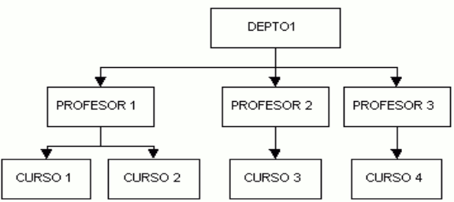

Bases de Datos con estructura en red
++++++++++++++++++++++++++++++++++++

Esta estructura contiene relaciones más complejas que las jerárquicas. Admite relaciones de cada registro con varios que se pueden seguir por distintos caminos.

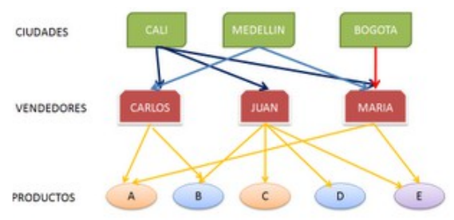

El inventor de este modelo fue Charles Bachman, y el estándar fue publicado en 1969 por CODASYL.

Bases de Datos con estructura relacional
++++++++++++++++++++++++++++++++++++++++

La estructura relacional es la más extendida hoy en día. Almacena los datos en **filas o registros** (tuplas) y **columnas o campos** (atributos). Estas tablas pueden estar conectadas entre sí por claves comunes.

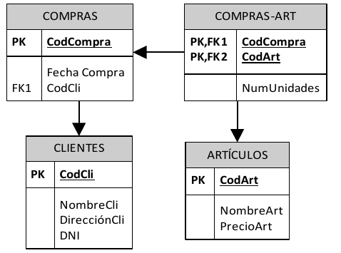

**En este libro nos centramos en el estudio de bases de datos relacionales.**

Bases de Datos con estructura multidimensional
++++++++++++++++++++++++++++++++++++++++++++++

La estructura multidimensional tiene parecidos a la del modelo relacional, pero en vez de las dos dimensiones filas-columnas, tiene N dimensiones. Esta estructura ofrece el aspecto de una hoja de cálculo.

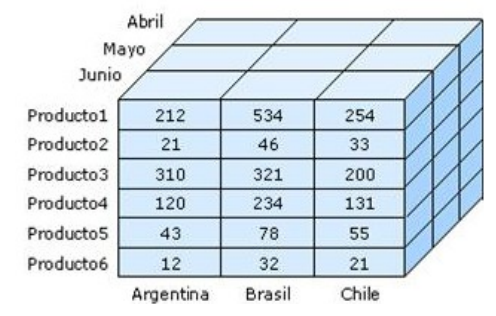

Bases de Datos con estructura orientada a objetos
+++++++++++++++++++++++++++++++++++++++++++++++++

La estructura orientada a objetos está diseñada siguiendo el paradigma de los lenguajes orientados a objetos. De este modo soporta los tipos de datos gráficos, imágenes, voz y texto de manera natural. Esta estructura tiene gran difusión en aplicaciones web para aplicaciones multimedia.

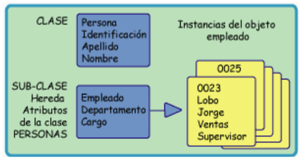

Sistemas de ficheros tradicionales
---------------------------------------

En estos sistemas, cada programa almacenaba y utilizaba sus propios datos de forma un tanto caótica. 
La única ventaja que conlleva esto es que los procesos son independientes, por lo que la modificación de uno no afecta al resto.

Pero tiene grandes inconvenientes:

- **Datos redundantes**. Ya que se repiten continuamente.
- **Coste de almacenamiento elevado**. Al almacenarse varias veces el mismo dato en distintas aplicaciones, se requiere más espacio en los discos.
- **Tiempos de procesamiento elevados**. Al no poder optimizar el espacio de almacenamiento.
- **Probabilidad alta de inconsistencia en los datos**. Ya que un proceso cambia sus datos y no el resto. Por lo que el mismo dato puede tener valores distintos según qué aplicación acceda a él.
- **Difícil modificación en los datos**. Debido a la probabilidad de inconsistencia, cada modificación se debe repetir en todas las copias del dato (algo que normalmente es imposible).

En la siguiente figura se muestra un sistema de información basado en ficheros. En ella se ve que la información aparece inconexa y redundante.

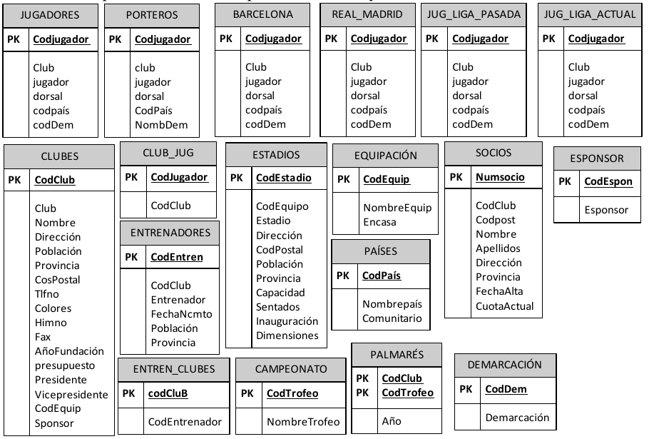

Sistemas de base de datos relacional
----------------------------------------- 

En este tipo de sistemas los datos se centralizan en una base de datos común a todas las aplicaciones. Estos serán los sistemas que estudiaremos en este curso.

Sus **ventajas** son las siguientes:

- **Menor redundancia**. No hace falta tanta repetición de datos. Aunque, sólo los buenos diseños de datos tienen poca redundancia.
- **Menor espacio de almacenamiento**. Gracias a una mejor estructuración de los datos.
- **Acceso a los datos más eficiente**. La organización de los datos produce un resultado más óptimo en rendimiento.
- **Datos más documentados**. Gracias a los metadatos que permiten describir la información de la base de datos.
- **Independencia de los datos y los programas y procesos**. Esto permite modificar los datos sin modificar el código de las aplicaciones.
- **Integridad de los datos**. Mayor dificultad de perder los datos o de realizar incoherencias con ellos.
- **Mayor seguridad en los datos**. Al limitar el acceso a ciertos usuarios.

Como contrapartida encontramos los siguientes **inconvenientes**:

- **Instalación costosa**. El control y administración de bases de datos requiere de un software y hardware potente.
- **Requiere personal cualificado**. Debido a la dificultad de manejo de este tipo de sistemas.
- **Implantación larga y difícil**. Debido a los puntos anteriores. La adaptación del personal es mucho más complicada y lleva bastante tiempo.

En la siguiente figura se muestra un sistema de información basado en bases de datos. La información está relacionada y no es redundante.

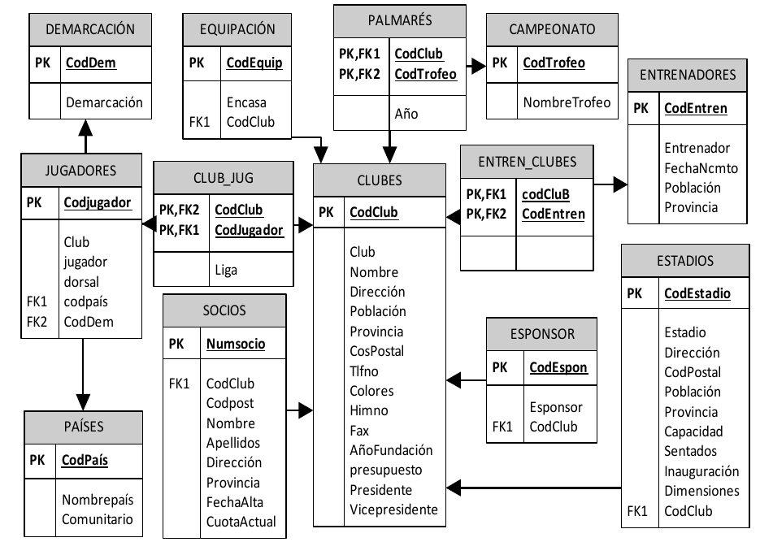

Ejemplo de archivos tradicionales
--------------------------------------

Se cuenta con dos archivos: CLIENTES y FACTURAS. 

El primer archivo tiene los datos básicos de los clientes, mientras que en el segundo se almacenan las ventas realizadas. Al emitir cada factura se ingresan nuevamente los datos num, nombre, domicilio.

.. csv-table:: CLIENTES
   :header: "Num", "Nombre", "Dirección", "Teléfono", "FechaNacimiento", "e-mail"
   :widths: 10,20,20,20,20,30

   1225, Juan García,        Guaná 1202,   985674863,  13/08/1972,      jgarcia@adinet.com
   1226, Fernando Martínez,  Rincón 876,   984568643,  23/02/1987,      fmar@gmail.com
   "…",  "…",                "…",          "…",        "…",             "…" 

.. csv-table:: FACTURAS
   :header: "Num", "Nombre", "Dirección", "Producto", "Precio"
   :widths: 10, 30, 30, 20, 10

   1225, "Joaquín García", "Guaná 1202", "Azulejos", 1250 
   1226, "Fernando Martínez", "Rincón 876", "Pintura", 900
   "…", "…", "…", "…", "…" 

Desventajas:

- Se presentan **redundancias de datos** (datos repetidos innecesariamente: nombre, dirección). Se duplican esfuerzos.
- Se pueden producir **contradicciones entre los datos**, si por ejemplo se ingresan nombres diferentes para un mismo cliente (Juan por Joaquín).

CONCEPTOS BÁSICOS DE UNA BD
==============================

Resulta fundamental para un Técnico Superior en Informática que conozca los siguientes conceptos básicos:

Datos
----------

.. epigraph::

 *Datos son hechos conocidos que pueden registrarse y que tienen un significado implícito.*
                                                 -- **Ramez Elmasri y Shamkant B. Navathe**

.. admonition:: Ejemplo

  Pueden constituir datos los nombres, números telefónicos y direcciones de personas que conocemos.

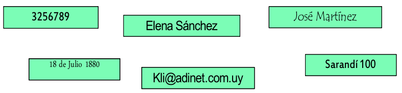

Entidades
--------------

Una entidad es todo aquello de lo cual interesa guardar datos, por ejemplo:

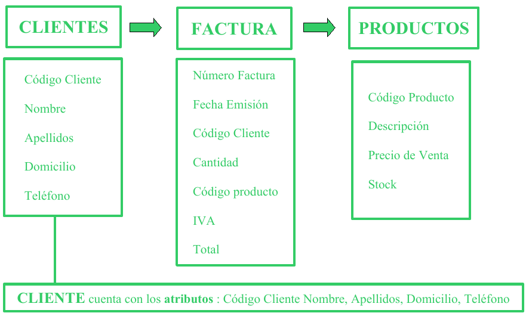

Claves primarias y claves foráneas. Relaciones
---------------------------------------------------

Cada entidad tiene una **clave primaria** o **campo clave** o **llave** que identifica unívocamente al conjunto de datos.
Cuando en una entidad figura la clave primaria de otra entidad, ésta se denomina **clave foránea** o **clave ajena**.
Las entidades se **relacionan** entre sí a través de las claves foráneas.

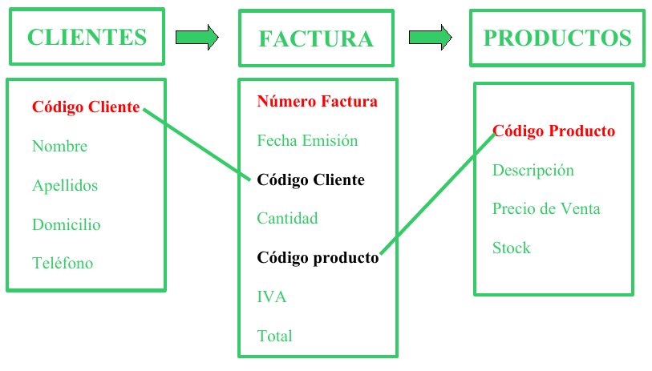

**CLAVES PRIMARIAS**

- **Código Cliente** es la clave primaria de **CLIENTES**. A cada cliente se le asocia un código y a cada código le corresponde un cliente. 
- **Número Factura** es clave primaria de **FACTURAS**.
- **Código Producto** es clave primaria de **PRODUCTOS**.

**CLAVES FORÁNEAS**

- En **FACTURAS**, son claves foráneas **Código Cliente** y **Código Producto**. CLIENTES se relaciona con FACTURAS a través del Código Cliente que figura en ambas tablas y con PRODUCTOS mediante el Código Producto.

Restricciones de integridad referencial
--------------------------------------------

- Código Cliente en Facturas debe cumplir que exista en Clientes y que sea clave primaria
- Código Producto en Facturas debe cumplir que exista en Productos y que sea clave primaria

Retomando la Definición de Base de Datos, la cual señala que ésta “*...es un conjunto de datos relacionados entre sí y que tienen un significado implícito*”, se observa en la imagen que los datos de las tablas se relacionan a través de las claves y que éstos tienen el significado implícito que se les atribuye en dicho contexto. Así, por ejemplo, el significado del dato Nombre se refiere al del CLIENTE, el de Fecha emisión a la de la FACTURAS y el de Descripción a la del PRODUCTO.

Metadatos
--------------

Metadatos son **datos acerca de los datos** presentes en la base de datos.

Por ejemplo:

- qué tipo de datos se van a almacenar (si son texto o números o fechas ...)
- qué nombre se le da a cada dato (nombre, apellidos, fecha, precio, edad,...)
- cómo están agrupados los datos
- cómo se relacionan,....

Ejemplo de Metadatos:

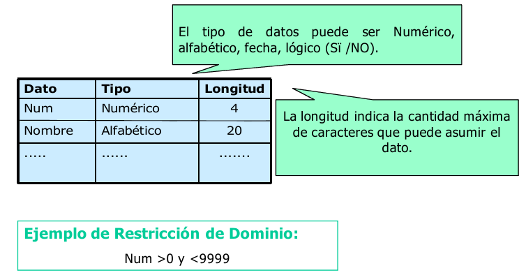

Otros conceptos sobre Bases de Datos
-----------------------------------------

Además de los conceptos básicos anteriores, a modo de aclarar algunos de los componentes que se pueden encontrar en una base de datos, y que se verán en las próximas unidades, se definen los siguientes conceptos:

- **Tabla**: Es un conjunto de filas y columnas bajo un mismo nombre que representa el conjunto de valores almacenados para una serie de datos. Por ejemplo,la  información de todos los clientes de una BD se almacenarán en una tabla llamada CLIENTES.
- **Campo**: Cada una de las **columnas** de una tabla. Identifica una familia de datos. Por ejemplo, el campo fechaNacimiento representa las fechas de nacimiento de todos los clientes que contiene una tabla CLIENTES.
- **Registro**: Corresponde a cada una de las **filas** de la tabla. También se llaman tuplas. Por ejemplo en la siguiente tabla CLIENTES, observamos dos registros, que corresponden a la información sobre los clientes Juan García y Fernándo Martínez:

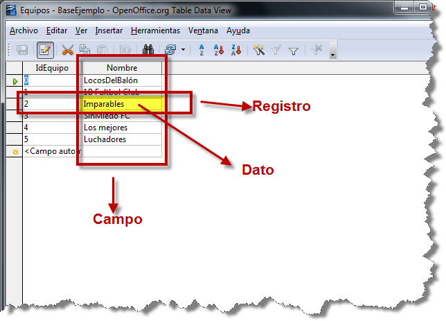

- **Tipo de Dato**: El tipo de dato indica la naturaleza del campo. Así, se puede tener datos numéricos, que son aquellos con los que se pueden realizar cálculos aritméticos (sumas, restas, multiplicaciones...), los datos alfanuméricos, que son los que contienen caracteres alfabéticos y números...
- **Consulta**: Es una instrucción para hacer peticiones a una BD.
- **Índice**: Es una estructura que almacena los campos clave de una tabla, organizándolos para hacer más fácil encontrar y ordenar los registros.
- **Vista**: Se obtienen al guardar una consulta de una o varias tablas. De esta forma se obtiene una tabla virtual, es decir, no está almacenada en los dispositivos de almacenamiento del ordenador, aunque sí se almacena su definición.
- **Informe**: Es un listado ordenado de los campos y registros seleccionados en un formato fácil de leer. Por ejemplo, un informe de las facturas impagadas del mes de enero ordenadas por nombre de cliente.
- **Guiones o scripts**: Son un conjunto de instrucciones, que ejecutadas de forma ordenada, realizan operaciones avanzadas o mantenimiento de los datos almacenados en la BD.
- **Procedimientos**: Son un tipo especial de script que están almacenados en la BD y forman parte de su esquema.

SISTEMAS DE GESTIÓN DE BASES DE DATOS: TIPOS
===============================================

Sistema Gestor de Bases de Datos
-------------------------------------

Un sistema gestor de bases de datos (SGBD) es una aplicación que permite a los usuarios definir, crear y mantener una base de datos, y proporciona acceso controlado a la misma.

En general, un SGBD proporciona los siguientes servicios:

- Permite la **definición de la base de datos** mediante el lenguaje de definición de datos (**DDL – Data Description Language**). Este lenguaje permite especificar la estructura y el tipo de los datos, así como las restricciones sobre los datos. Todo esto se almacenará en la base de datos.
- Permite la **inserción, actualización, eliminación y consulta de datos** mediante el lenguaje de manejo o manipulación de datos (**DML - Data Manipulation Language**).
- Proporciona un acceso controlado a la base de datos mediante:

  + Un sistema de seguridad, de modo que los usuarios no autorizados no puedan acceder a la base de datos, mediante el lenguaje de control de datos (**DCL - Data Control Language**);
  + Un sistema de integridad que mantiene la integridad y la consistencia de los datos;
  + Un sistema de control de concurrencia que permite el acceso compartido a la base de datos;
  + Un sistema de control de recuperación que restablece la base de datos después de que se produzca un fallo del hardware o del software;
  + **Un diccionario de datos o catálogo** accesible por el usuario que contiene la descripción de los datos de la base de datos.

La principal herramienta de un SGBD es la interfaz de programación con el usuario. Esta interfaz consiste en un lenguaje muy sencillo mediante el cual el usuario interactua con el servidor. Este lenguaje comúnmente se denomina **SQL, Structure Query Language**, está estandarizado por la ISO 1, es decir, todas las BD que soporten SQL deben tener la misma sintaxis a la hora de aplicar el lenguaje.

Tipos de SGBD
------------------

Los SGBD se pueden clasificar según las BD que gestionan (jerárquicas, relacionales, orientadas a objetos,...), pero como actualmente la mayoría de los SGBD integran múltiples filosofías, los clasificaremos según su capacidad y potencia del propio gestor, resultado los siguientes SGBD:

- **SGBD ofimáticos**: manipulas BD pequeñas orientadas a almacenar datos domésticos o de pequeñas empresas. Ejemplos típicos son Microsoft ACCESS y LibreOffice Base.
- **SGBD corporativos**: tienen la capacidad de gestionar BD enormes, de medianas o grandes empresas con una carga de datos y transacciones que requieren de un servidor de gran capacidad. Un ejemplo típico de BD corporativas es ORACLE, actualmente junto de DB2 el servidor de BD más potente del mercado (también el más caro). Nosotros para nuestro aprendizaje utilizamos una versión gratuita con fines educativos, que aunque bastante limitada, nos sirve para introducirnos en la filosofía de ORACLE.

