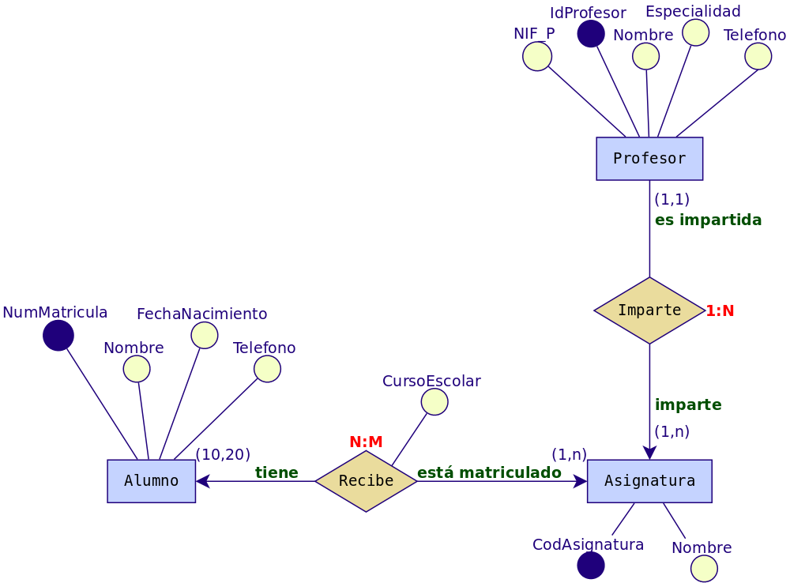
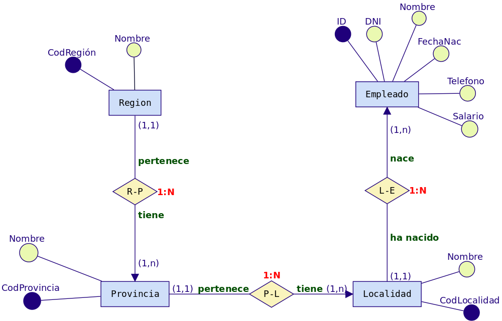
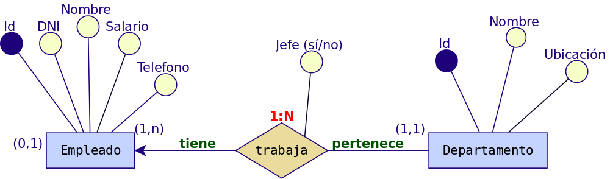
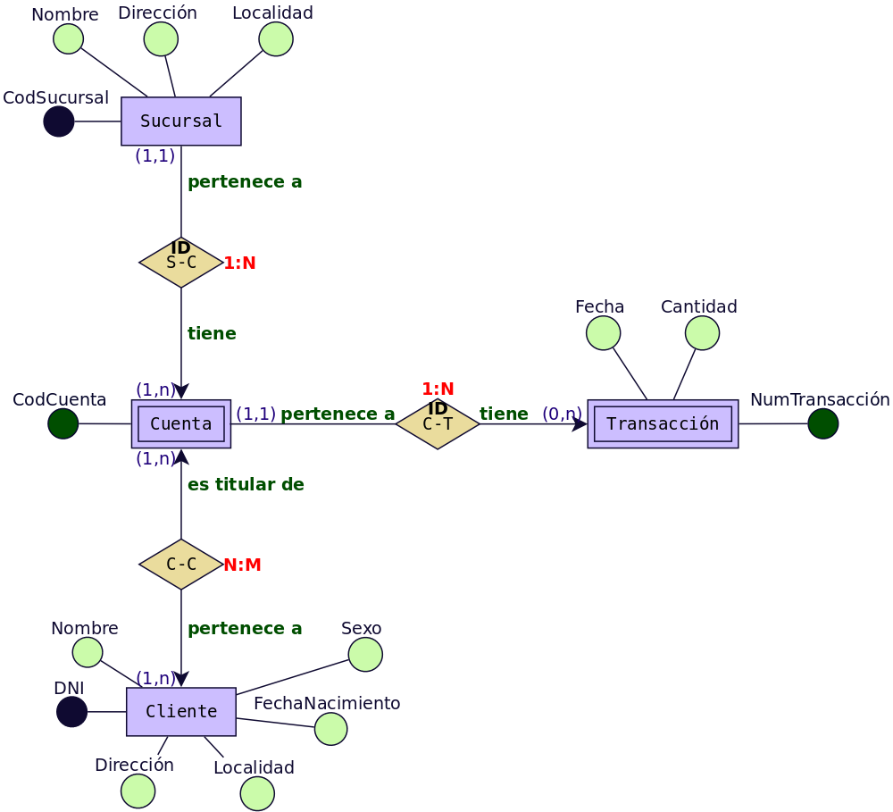
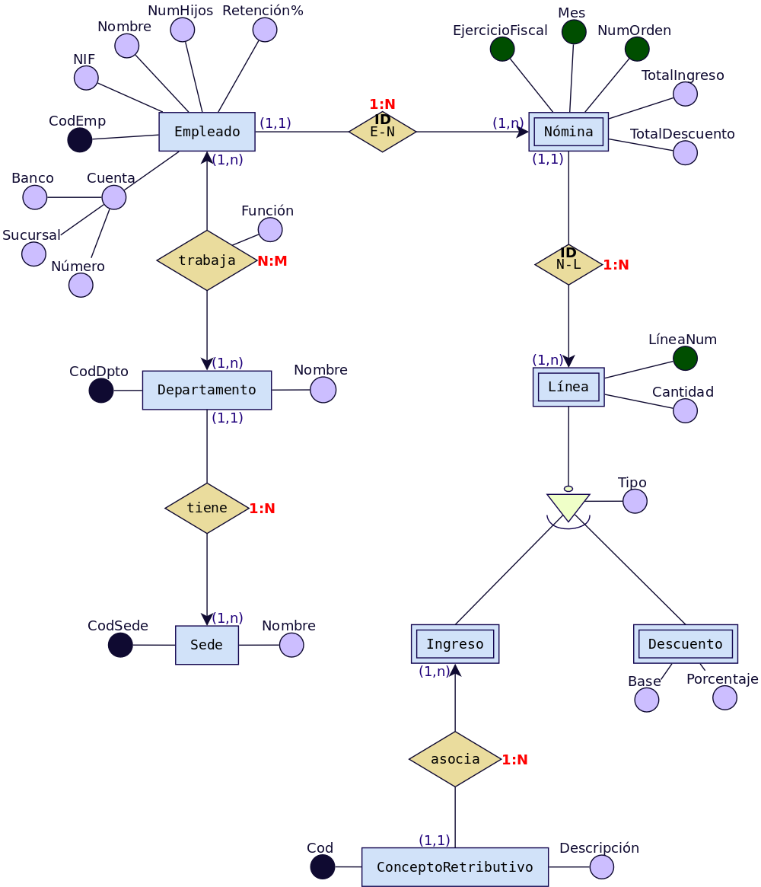
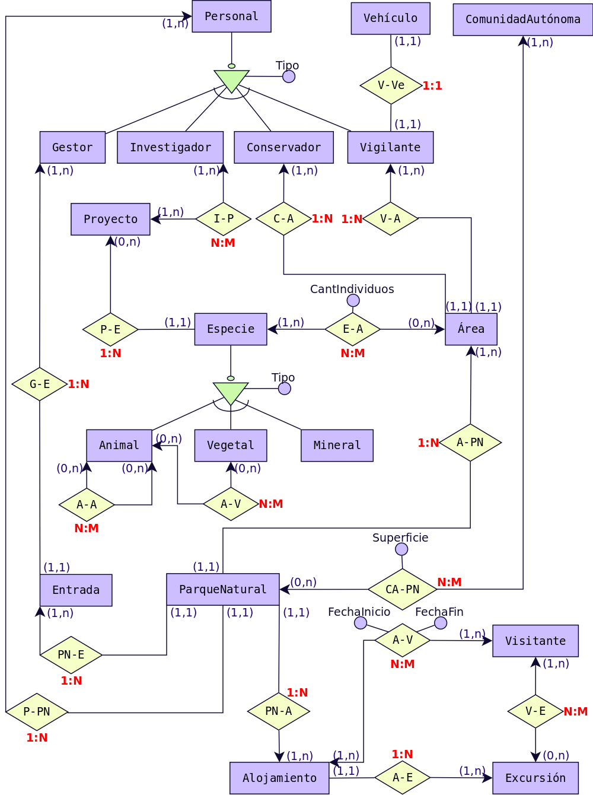
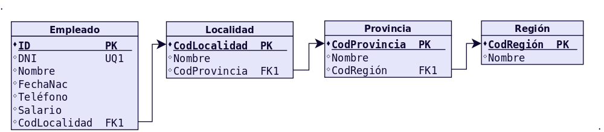
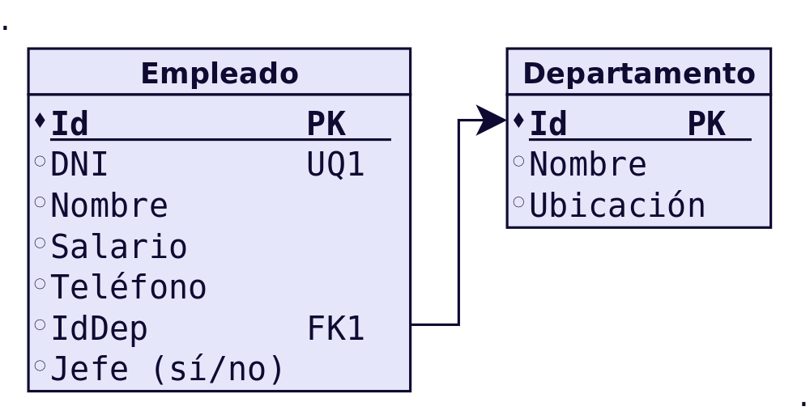
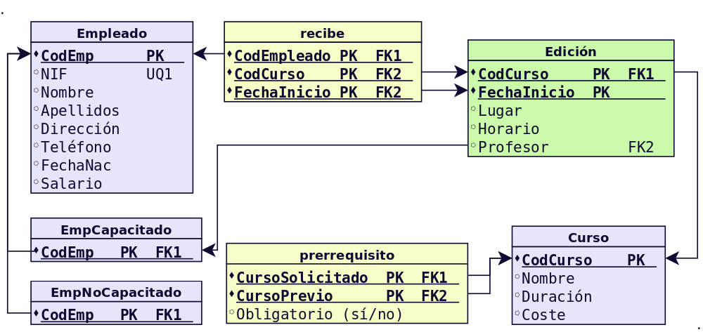
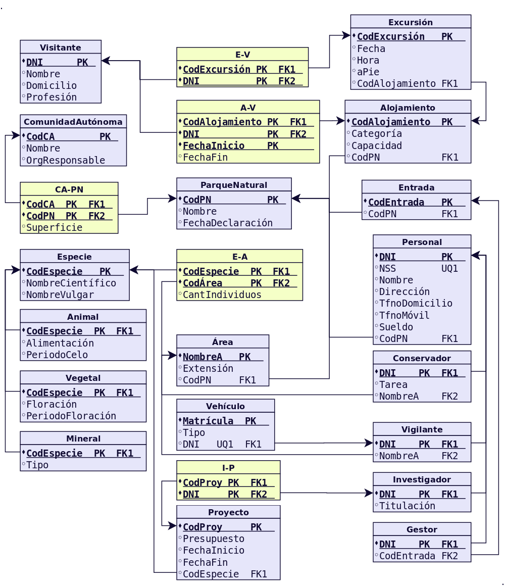

# ACTIVIDADES RESUELTAS
# DISEÑO DE MODELOS LÓGICOS NORMALIZADOS

> IES Luis Vélez de Guevara  
> Departamento de Informática


## Test

> **MODELO ENTIDAD-RELACIÓN**

Para cada una de las siguientes cuestiones elige razonadamente cada una de las respuestas correctas.

1. Un modelo conceptual de datos:
a. Define una serie de símbolos para describir la realidad de la BD que se desea crear.
b. Es un modelo que describe como se almacenan los datos a nivel físico.
c. Permite realizar una representación del mundo real.

2. El modelo Entidad/Relación:
a. Utiliza rombos para representar las entidades.
b. Utiliza círculos para representar las relaciones.
c. Cuenta con símbolos diferentes para representar las entidades fuertes y las débiles.

3. Las relaciones del modelo E/R...
a) Son objetos reales o abstractos de los que se desea guardar información en una BD.
b) Pueden ser fuerte o débiles.
c) Pueden ser de dependencia en identificación o en existencia.

4. Los atributos del modelo E/R ...
a) Que identifican unívocamente cada ocurrencia de la entidad se llaman Clave principal.
b) Aparecen sólo en las entidades.
c) Aparecen sólo en las relaciones.

5. La cardinalidad...
a) 1:1 es una cardinalidad binaria que significa que a cada ocurrencia de una entidad le corresponde una sola ocurrencia de la otra entidad.
b) En el caso de relaciones entre tres entidades pueden ser de los tipos: 1:1, 1:N o N:M.
c) Toma las participaciones máximas de cada entidad.

## Cuestiones

> **MODELO ENTIDAD-RELACIÓN**

### 1. Define brevemente los siguientes conceptos:
a) Entidad.

Una entidad es cualquier objeto o elemento acerca del cual se pueda almacenar información en la BD. Las entidades pueden ser concretas como una persona o abstractas como una fecha.

b) Relación.

Una relación es la asociación que existe entre dos a más entidades. Cada relación tiene un nombre que describe su función. 

c) Atributo de una entidad.

Un atributo es una propiedad o campo, que representa alguna característica de una entidad. Los atributos de una entidad pueden tomar un conjunto de valores permitidos al que se le conoce como dominio del atributo.

d) Identificador de una entidad.

Es un atributo o conjunto de atributos que identifican de manera unívoca cada ocurrencia de una entidad. También se llaman clave primaria o clave principal.

e) Atributo de una relación.

Es aquel cuyo valor sólo se puede obtener en la relación, puesto que dependen de todas las entidades que participan en la relación. Se denominan atributos propios. 

f) Rol de una entidad en una relación.

Es la función que tiene la entidad en una relación. También se conoce como papel.
En el siguiente ejemplo se representa en texto color verde:


g) Participación de una entidad en una relación.

Se conoce también como cardinalidad de la entidad dentro de una relación. La participación de una entidad nos indica las ocurrencias mínimas y máximas de dicha entidad dentro de una relación concreta. En el siguiente ejemplo se representa en texto color azul:


h) Cardinalidad de una relación.

Es el número de ocurrencias de una entidad asociadas a una ocurrencia de la otra entidad. Se obtiene a partir de las participaciones máximas de las entidades involucradas.

### 2. Indica cuales son los dos tipos posibles de entidades y explica brevemente cada una de ellas.

Hay dos tipos de entidades: 
- Fuertes: es una entidad que no depende de ninguna otra para su existencia.
- Débiles: es una entidad cuya existencia depende de la existencia de otra entidad. 

### 3. Clasifica los distintos tipos de relaciones existentes entre dos entidades según su cardinalidad y pon un ejemplo de cada una de ellas distinto de los vistos en el tema.

Existen 3 tipos:
- Relación uno a uno 1:1  → A cada elemento de la primera entidad le corresponde no más de un elemento de la segunda entidad, y a la inversa. Por ejemplo una relación entre PRESIDENTE y el PAÍS que gobierna.
- Relación uno a muchos 1:N → Significa que cada elemento de una entidad del tipo A puede relacionarse con cualquier cantidad de elementos de una entidad del tipo B, y un elemento de una entidad del tipo B solo puede estar relacionado con un elemento de una entidad del tipo A. Por ejemplo una relación entre un PAIS y sus distintas REGIONES.
- Muchos a muchos N:M →  Establece que cualquier cantidad de elementos de una entidad del tipo A pueden estar relacionados con cualquier cantidad de elementos de una entidad del tipo B. Por ejemplo una relación entre los CLIENTES y los tipos de PRODUCTOS comprados en un mercado.

### 4. Clasifica los distintos tipos de relaciones de dependencia existentes y pon un ejemplo de cada una de ellas distinto de los vistos en el tema.
Hay dos tipos de relaciones de dependencia:
- Dependencia en existencia
  Se produce cuando una entidad débil necesita de la presencia de una fuerte para existir. Si desaparece la existencia de la entidad fuerte, la de la débil carece de sentido. Suele darse pocas veces. Un caso sería el de una SUBCONTRATA con sus propios TRABAJADORES.  Si nuestra empresa no necesita más los servicios de dicha SUBCONTRATA, entonces no tiene sentido registrar en nuestra base de datos dichos TRABAJADORES.
- Dependencia en identificación
  Se produce cuando una entidad débil necesita de la fuerte para identificarse. Por sí sola la débil no es capaz de identificar de manera unívoca sus ocurrencias. Por ejemplo si tenemos una entidad fuerte HOTEL y una entidad débil HABITACIÓN. Para identificar de forma unívoca cada HABITACIÓN, dentro de un conjunto de hoteles, necesitamos la combinación CodHotel + NumHabitación.

### 5. Explica brevemente la Restricción de exclusividad entre dos tipos de relaciones R1 y R2 respecto a la entidad E1. Pon un ejemplo distinto del visto en el tema.

La restricción de exclusividad entre dos tipos de relaciones R1 y R2 respecto a la entidad E1 significa que E1 está relacionada, o bien con E2 o bien con E3, pero  no pueden darse ambas relaciones simultáneamente.
	


Un ejemplo sería el de una aerolínea donde el PERSONAL trabaja como PILOTO o como AZAFATA, pero no puede trabajar en los 2 puestos.

### 6. Explica brevemente la Restricción de inclusión entre dos tipos de relaciones R1 y R2. Pon un ejemplo distinto del visto en el tema.

La restricción de inclusión entre dos tipos de relaciones R1 y R2 significa que la entidad E1 participa en la relación R2 con E2 solo si antes previamente ha participado en  la relación R1.


Siguiendo con el caso anterior, un ejemplo sería el de una aerolínea donde se registran las salidas y llegadas de aviones. Un PILOTO sale hacia un DESTINO. Solo puede registrarse la llegada a ese DESTINO si previamente el PILOTO había salido hacia él.

### 7. Dado el siguiente esquema:


(a) Indica cuáles son las entidades del modelo, diferenciado entre entidades fuertes y débiles, si las hubiera.
Las entidades del modelo son: EQUIPO, JUGADOR y PARTIDO.
Todas son entidades fuertes pues se representan con un rectángulo con borde simple. 
(b) Señala las relaciones e indica cual es la cardinalidad de cada una. Trata de indicar también la participación de cada entidad en las relaciones así como su rol.
Se representan en color rojo la cardinalidad de cada relación y de color azul la participación de cada entidad dentro de cada relación. Podemos observar que la entidad JUGADOR tiene  2 participaciones distintas, una para cada relación en la que participa.

Un equipo tiene en plantilla varios jugadores (11 o más), pero un jugador sólo puede estar en un equipo como máximo (podría estar en periodo de fichaje y por tanto no estar asignado a ningún equipo aún). Es una relación 1:N.
Un jugador puede jugar en varios partidos y un partido es jugado por varios jugadores (relación N:M). Se necesitan un mínimo de 22 jugadores para disputar un partido. Si hay sustituciones pueden ser más jugadores. Un jugador podría no disputar ningún partido (si tiene mala suerte por lesión u otro motivo) o disputar varios.
(c) Señala si hay alguna relación de dependencia o reflexiva.
No hay ninguna relación de dependencia puesto que no existen entidades débiles, y tampoco existe ninguna relación reflexiva donde una entidad tenga una relación consigo misma.
(d) Trata de escribir atributos lógicos para cada una de las entidades e indica en cada caso cual podría ser el identificador.
Se subraya el atributo que podemos utilizar como identificador.
EQUIPO (CIF, Nombre, Presidente, Sede)
JUGADOR (NIF, Nombre, Apellidos, FechaNacimiento, Nacionalidad)
PARTIDO (Número, Fecha, Estadio, TotalGoles)
El identificador ha de ser único para cada ocurrencia dentro de la entidad.
(e) ¿Qué significado tiene el atributo “NºGoles”?¿Por qué está en la relación en lugar de estar en JUGADOR o en PARTIDO? 
El atributo NºGoles es un atributo relativo a un JUGADOR concreto en un PARTIDO concreto. Por tanto es un atributo propio de la relación. En este caso representa los goles que realiza un jugador en un partido determinado. 
Si el atributo NºGoles apareciese sólo en JUGADOR, indicaría los goles totales que lleva ese jugador.
Si el atributo NºGoles apareciese sólo en PARTIDO, indicaría los goles que se han producido en ese partido.


### 8. Obtén el diagrama E/R con las tres entidades siguientes:
```
ALUMNO (Núm_Matrícula, Nombre, FechaNacimiento, Teléfono)
ASIGNATURA (Código_asignatura, Nombre)
PROFESOR (Id_P, NIF_P, Nombre, Especialidad, Teléfono)
```
Teniendo en cuenta:
- Un alumno puede estar matriculado de una o varias asignaturas.
- Además puede estar matriculado en la misma asignatura más de un curso escolar (si repite).
- Se quiere saber el curso escolar en el que cada alumno está matriculado de cada asignatura.
- En una asignatura habrá como mínimo 10 y como máximo 25 alumnos.
- Una asignatura es impartida por un único profesor.
- Un profesor podrá impartir varias asignaturas.




### 9. Obtén el diagrama E/R con las cuatro entidades siguientes:
```
REGIÓN( Nombre_Región)
PROVINCIA (CódigoProvincia, Nombre_provincia)
LOCALIDAD (Código_localidad, Nombre)
EMPLEADO(Id_E, DNI_E, Nombre, Teléfono, Salario)
```
Se quiere guardar información de la localidad donde ha nacido cada uno de los empleados teniendo en cuenta que:
- Un empleado ha nacido en una sola localidad.
- Cada localidad pertenece a una única provincia.
- Cada provincia pertenece a una única región del país.




### 10. Obtén el diagrama E/R con las dos entidades siguientes:
```
EMPLEADO(Id_E, DNI_E, Nombre, Teléfono, Salario)
DEPARTAMENTO(Código_D, Nombre, Localización)
```
Teniendo en cuenta:
- Un empleado pertenece a un único departamento y en un departamento puede haber varios empleados. Pero sólo uno será el jefe del departamento.
- Un empleado podrá ser jefe o no. Si no es jefe, su jefe será el del departamento al que pertenece.
A continuación se presentan 3 soluciones. Ninguna de ellas es totalmente satisfactoria, puesto que para ello deberíamos crear una entidad separada para JEFE.
La solución 1 no nos asegura que el Jefe de un Empleado trabaje en el mismo Departamento. Igual sucede con la solución 2. La solución 3 es la mejor, aunque en este caso podrían darse varios Jefes en un Departamento.


**Solución 1**


**Solución****



**Solución 3**


### 11. Obtén el diagrama E/R para el siguiente supuesto.
Una empresa dedicada a la instalación de dormitorios juveniles a medida quiere realizar una base de datos donde se reflejen las ventas y montajes, para lo cual se tiene en cuenta:
- Cada modelo de dormitorio lo debe montar, al menos, dos montadores.
- El mismo montador puede montar varios modelos de dormitorios.
- De cada modelo dormitorio nos interesa conocer su código de modelo.
- El mismo montador puede montar el mismo modelo en diferentes fechas. Nos interesa conocer la fecha en la que realiza cada montaje.
- De un montador nos interesa su NIF, nombre, dirección, teléfono de contacto y el número de dormitorios que ha montado de cada modelo.
- Cada modelo de dormitorio puede ser comprado por uno o varios clientes y el mismo cliente podrá comprar uno o varios dormitorios. De un cliente nos interesa su NIF, nombre, dirección, teléfono y fecha de compra de cada modelo.


> NOTA: Para obtener la cantidad total de dormitorios de un modelo montados por un montador no debemos poner ningún atributo. En la base de datos final sumaremos los registros que aparecen en la tabla "monta" correspondientes al montador y modelo deseados. 

### 12. Se desea diseñar una base de datos sobre la información de las reservas de una empresa dedicada al alquiler de automóviles teniendo en cuenta que:
- Un determinado cliente puede tener en un momento dado hechas varias reservas.
- De cada cliente se desea almacenar su DNI, nombre, dirección y teléfono.
- Además dos clientes se diferencian por un único código.
- De cada reserva es importante registrar su número de identificación, la fecha de inicio y final de la reserva, el precio total.
- De cada coche se requiere la matrícula, el modelo, el color y la marca. Cada coche tiene un precio de alquiler por hora.
- Además en una reserva se pueden incluir varios coches de alquiler. Queremos saber los coches que incluye cada reserva y los litros de gasolina en el depósito en el momento de realizar la reserva, pues se cobrarán aparte.
- Cada cliente puede ser avalado por otro cliente de la empresa.


### 13. Tenemos esta información sobre una cadena editorial:
- La editorial tiene varias sucursales, con su domicilio, teléfono y un código de sucursal.
- Cada sucursal tiene varios empleados, de los cuales tendremos sus datos personales, DNI y teléfono. Un empleado trabaja en una única sucursal.
- En cada sucursal se publican varias revistas, de las que almacenaremos su título, número de registro, periodicidad y tipo.
- La editorial tiene periodistas (que no trabajan en las sucursales) que pueden escribir artículos para varias revistas. Almacenaremos los mismos datos que para los empleados, añadiendo su especialidad.
- Para cada revista, almacenaremos información de cada número, que incluirá la fecha, número de páginas y el número de ejemplares vendidos.


> NOTA: Los atributos discriminantes de las entidades débiles se muestran con un círculo verde oscuro.

### 14. La cadena de Video-Clubs Glob-Gusters ha decidido, para mejorar su servicio, emplear una base de datos para almacenar la información referente a las películas que ofrece en alquiler. Esta información es la siguiente:
Una película se caracteriza por su título, nacionalidad, productora y fecha. Puede haber varias películas con el mismo título pero rodadas en fechas distintas.

En una película pueden participar varios actores (nombre, nacionalidad, sexo) algunos de ellos como actores principales.
Una película está dirigida por un director (nombre, nacionalidad).

De cada película se dispone de uno o varios ejemplares diferenciados por un número de ejemplar y caracterizados por su estado de conservación.

Un ejemplar se puede encontrar alquilado a algún socio (DNI, nombre, dirección, teléfono) . Se desea almacenar la fecha de comienzo del alquiler y la de devolución.

Un socio tiene que ser avalado por otro socio que responda de él en caso de tener problemas en el alquiler.
Los atributos discriminantes de las entidades débiles se muestran con un círculo verde oscuro.


### 15. Diseñar un esquema E/R que recoja la organización de un sistema de información en el que se quiere tener los datos sobre municipios, viviendas y personas. Cada persona sólo puede habitar una vivienda, pero puede ser propietaria de varias. También nos interesa la relación de las personas con su cabeza de familia.


> NOTA: Suponemos que existe un único cabeza de familia por vivienda y establecemos una restricción de relación de inclusión para exigir que dicho cabeza de familia viva en dicha vivienda. Pueden existir viviendas vacías, en las que no viva nadie.
> Hemos supuesto que una persona sólo puede vivir en una casa. 

### 16. Se desea diseñar una BD de una entidad bancaria que contenga información sobre los clientes, las cuentas, las sucursales y las transacciones producidas. Construir el Modelo E/R teniendo en cuenta las siguientes restricciones:
- Una transacción viene determinada por un número de transacción (único para cada cuenta), la fecha y la cantidad.
- Un cliente puede tener muchas cuentas.
- Una cuenta puede ser de muchos clientes.
- Una cuenta sólo puede estar en una sucursal.



> NOTA: Los atributos discriminantes de las entidades débiles se muestran con un círculo verde oscuro.

### 17. Una base de datos para una pequeña empresa debe contener información acerca de clientes, artículos y pedidos. Hasta el momento se registran los siguientes datos en documentos varios:
Para cada cliente: Número de cliente (único), Direcciones de envío (varias por cliente), Saldo, Límite de crédito, Descuento.

Para cada artículo: Número de artículo (único), Fábricas que lo distribuyen, Existencias de ese artículo en cada fábrica, Descripción del artículo.

Para cada pedido: Cada pedido se registrará en un documento impreso que tiene una cabecera y el cuerpo del pedido. Para generar dicho informe se necesitará la siguiente información:

La cabecera está formada por el número de cliente, dirección de envío y fecha del pedido.

El cuerpo del pedido son varias líneas, en cada línea se especifican el número del artículo pedido y la cantidad.

Además, se ha determinado que se debe almacenar la información de las fábricas. Sin embargo, dado el uso de distribuidores, se usará: Número de la fábrica (único) y Teléfono de contacto.

Y se desean ver cuántos artículos (en total) provee la fábrica. También, por información estratégica, se podría incluir información de fábricas alternativas respecto de las que ya fabrican artículos para esta empresa.


### 18. Se pide hacer el diagrama ER para la base de datos que represente esta información. Le contratan para hacer una BD que permita apoyar la gestión de un sistema de ventas.
La empresa necesita llevar un control de proveedores, clientes, productos y ventas. Un proveedor tiene un código único, nombre, dirección, teléfono y página web. Un cliente también tiene un código único, nombre, dirección, pero puede tener varios teléfonos de contacto. La dirección se entiende por calle, número, comuna y ciudad.

Un producto tiene un id único, nombre, precio actual, stock y nombre del proveedor. Además se organizan en categorías, y cada producto va sólo en una categoría. Una categoría tiene id, nombre y descripción. Por razones de contabilidad, se debe registrar la información de cada venta con un id, fecha, cliente, descuento y monto final. Además se debe guardar el precio al momento de la venta, la cantidad vendida y el monto total por el producto. 


> **MODELO ENTIDAD-RELACIÓN EXTENDIDO**

### 19. El departamento de formación de una empresa desea construir una base de datos para planificar y gestionar la formación de sus empleados.
La empresa organiza cursos internos de formación de los que se desea conocer el código de curso, el nombre, una descripción, el número de horas de duración y el coste del curso.

Un curso puede tener como prerrequisito haber realizado otro u otros previamente, y a su vez, la realización de un curso puede ser prerrequisito de otros. Un curso que es un prerrequisito de otro puede serlo de forma obligatoria o sólo recomendable.

Un mismo curso tiene diferentes ediciones, es decir, se imparte en diferentes lugares, fechas y con diferentes horarios (intensivo, de mañana o de tarde). En una misma fecha de inicio sólo puede impartirse una edición de un mismo curso.

Los cursos se imparten por personal de la propia empresa.

De los empleados se desea almacenar su código de empleado, nombre y apellidos, dirección, teléfono, NIF (Número de Identificación Fiscal), fecha de nacimiento, nacionalidad, sexo, firma y salario, así como si está o no capacitado para impartir cursos.

Un mismo empleado puede ser docente en una edición de un curso y alumno en otra edición, pero nunca puede ser ambas cosas a la vez (en una misma edición de curso o lo imparte o lo recibe).

Realiza el Modelo Entidad/Relación


> Los atributos discriminantes de las entidades débiles se muestran con un círculo verde oscuro.
> Suponemos que cada edición de un curso puede ser impartida por un único docente.
> Establecemos una restricción de exclusión entre las relaciones recibe e imparte.

### 20. Una Empresa decide informatizar su gestión de nóminas. Del resultado del análisis realizado, se obtienen las siguientes informaciones:
A cada empleado se le entregan múltiples nóminas a lo largo de su vida laboral en la empresa y al menos una mensualmente.
A cada empleado se le asigna un número de empleado en el momento de su incorporación a la empresa, y éste es el número usado a efectos internos de identificación. Además, se registran el Número de Identificación Fiscal del empleado, nombre, número de hijos, porcentaje de retención para Hacienda, datos de cuenta corriente en la que se le ingresa el dinero (banco, sucursal y número de cuenta) y departamentos en los que trabaja.
Un empleado puede trabajar en varios departamentos y en cada uno de ellos trabajará con un función distinta.
De un departamento se mantiene el nombre y cada una de sus posibles sedes.
Son datos propios de una nómina el ingreso total percibido por el empleado y el descuento total aplicado.
La distinción entre dos nóminas se hará, además de mediante el número de identificación del empleado, mediante el ejercicio fiscal y número de mes al que pertenece y con un número de orden en el caso de varias nóminas recibidas el mismo mes.
Cada nómina consta de varias líneas (al menos una de ingresos) y cada línea se identifica por un número de línea dentro de la correspondiente nómina.
Una línea puede corresponder a un ingreso o a un descuento. En ambos casos, se recoge la cantidad que corresponde a la línea (en positivo si se trata de un ingreso o en negativo si se trata de un descuento); en el caso de los descuentos, se recoge la base sobre la cual se aplica y el porcentaje que se aplica para el cálculo de éstos.
Toda línea de ingreso de una nómina responde a un único concepto retributivo.
En un mismo justificante, puede haber varias líneas que respondan al mismo concepto retributivo.
De los conceptos retributivos se mantiene un código y una descripción.
Realiza el Modelo Entidad/Relación



> Los atributos discriminantes de las entidades débiles se muestran con un círculo verde oscuro.
> Suponemos que en una misma sede se ubica un único departamento. Si hubiésemos supuesto que podría haber varios, la relación sería N:M. Suponemos que para cada empleado tenemos una sola cuenta para el ingreso de nómina.


### 21. La ministra de Medio Ambiente ha decidido crear un sistema de información sobre los parques naturales gestionados por cada comunidad autónoma. Después de realizar un detallado análisis, se ha llegado a las siguientes conclusiones:
Una comunidad autónoma (CA) puede tener varios parques naturales. En toda comunidad autónoma existe uno y sólo un organismo responsable de los parques. Un parque puede estar compartido por más de una comunidad.

Un parque natural se identifica por un nombre, fue declarado en una fecha, se compone de varias áreas identificadas por un nombre y caracterizadas por una determinada extensión. Por motivos de eficiencia se desea favorecer las consultas referentes al número de parques existentes en cada comunidad y la superficie total declarada parque natural en cada CA.

En cada área forzosamente residen especies que pueden ser de tres tipos: vegetales, animales y minerales. Cada especie tiene una denominación científica, una denominación vulgar y un número inventariado de individuos por área. De las especies vegetales se desea saber si tienen floración y en qué periodo se produce ésta; de las animales se desea saber su tipo de alimentación (herbívora, carnívora u omnívora) y sus periodos de celo; de las minerales se	desea saber si se trata de cristales o de rocas.

Además, interesa registrar qué especies sirven de alimento a otras especies, teniendo en cuenta que ninguna especie mineral se considera alimento de cualquier otra especie y que una especie vegetal no se alimenta de ninguna otra especie.

Del personal del parque se guarda el DNI, número de seguridad social, nombre, dirección, teléfonos (domicilio, móvil) y sueldo. Se distinguen los siguientes tipos de personal:
- Personal de gestión: registra los datos de los visitantes del parque y están destinados en una entrada del parque (las entradas se identifican por un número).
- Personal de vigilancia: vigila un área determinada del parque que recorre en un vehículo (tipo y matrícula).
- Personal investigador: Tiene una titulación que ha de recogerse y pueden realizar (incluso conjuntamente) proyectos de investigación sobre una determinada especie. Un proyecto de investigación tiene un presupuesto y un periodo de realización. 
- Personal de conservación: mantiene y conserva un área determinada del parque. Cada uno lo realiza en una especialidad determinada (limpieza, caninos...). 

Un visitante (DNI, nombre, domicilio y profesión) debe alojarse dentro de los alojamientos de que dispone el parque; éstos tienen una capacidad limitada y tienen una determinada categoría. 

Los alojamientos organizan excursiones al parque, en vehículo o a pie, en determinados días de la semana y a una hora determinada. A estas excursiones puede acudir cualquier visitante del parque.
Por comodidad, suponemos que un visitante tiene, obligatoriamente, que alojarse en el parque. Suponemos también, que cada vigilante tiene su vehículo propio que sólo utiliza él. 




> Por motivos de claridad no representaremos en el diagrama los atributos de las entidades. Sólo aparecerán en él los atributos propios de las relaciones.
> Los atributos de cada entidad son los siguientes (clave principal en negrita):
>
```
ComunidadAutónoma → **CodCA**, Nombre, OrgResponsable.
ParqueNatural → **CodPN**, Nombre, FechaDeclaración.
Entrada → **CodEntrada**.
Área → **Nombre**, Extensión.
Personal → **DNI**, NSS, Nombre, Dirección, TfnoDomicilio, TfnoMóvil, Sueldo.
Investigador → Titulación.
Conservador → Tarea.
Gestor → .
Vigilante → .
Vehículo → **Matrícula**, Tipo. 
Proyecto → **CodProy**, Presupuesto, FechaInicio, FechaFin.
Especie → **CodEspecie**, NombreCientífico, NombreVulgar.
Animal → Alimentación (carnívoro, herbívoro, omnívoro), PeriodoCelo.
Vegetal → Floración (sí,no), PeriodoFloración.
Mineral → Tipo (cristal, roca).
Visitante → **DNI**, Nombre, Domicilio, Profesión.
Alojamiento → **CodAlojamiento**, Categoría, Capacidad.
Excursión → **CodExcursión**, Fecha, Hora, Pie (sí/no).

Para algunos atributos hemos puesto entre paréntesis el dominio de valores que admite.
```


> **MODELO RELACIONAL**

En las soluciones aparece primero el diagrama Entidad-Relación de referencia por motivos de completitud.

### 22. Obtén el diagrama Relacional a partir el E/R obtenido en la cuestión 8.
El diagrama E/R es:


Su diagrama Relacional es:


> Hemos añadido CursoEscolar como parte de la clave principal de la tabla Recibe porque un alumno puede estar matriculado varias veces de la misma asignatura. Esto haría que la pareja (NumMat,CodAsignatura) se pudiese repetir y, por tanto, no sirviese como clave principal.


### 23. Obtén el diagrama Relacional a partir el E/R obtenido en la cuestión 9.
El diagrama E/R es:


Su diagrama Relacional es:




### 24. Obtén el diagrama Relacional a partir el E/R obtenido en la cuestión 10.

**Solución 1**

El diagrama E/R es:


Su diagrama Relacional es:


**Solución 2**

Su diagrama E/R es:


Su diagrama Relacional es:


**Solución 3**

El diagrama E/R es:


Su diagrama Relacional es:




**Solución final**

El diagrama E/R es:


Su diagrama Relacional es:


### 25. Obtén el diagrama Relacional a partir el E/R obtenido en la cuestión 11.

El diagrama E/R es:


Su diagrama Relacional es:


>Un mismo cliente puede comprar un modelo en distintas fechas. Por tanto la combinación (NIF_C, Modelo) puede repetirse, por tanto no podría funcionar como PK. Si añadimos FechaCompra a la clave primaria sí, siempre que entendamos que no puede comprar el mismo modelo varias veces el mismo día.  Igualmente ocurre en la relación del montador con el modelo de dormitorio.

### 26. Obtén el diagrama Relacional a partir el E/R obtenido en la cuestión 12.

El diagrama E/R es:


Su diagrama Relacional es:


### 27. Obtén el diagrama Relacional a partir el E/R obtenido en la cuestión 13.

El diagrama E/R es:


Su diagrama Relacional es:


### 28. Obtén el diagrama Relacional a partir el E/R obtenido en la cuestión 14.

El diagrama E/R es:


Su diagrama Relacional es:


### 29. Obtén el diagrama Relacional a partir el E/R obtenido en la cuestión 15.

El diagrama E/R es:


Su diagrama Relacional es:


### 30. Obtén el diagrama Relacional a partir el E/R obtenido en la cuestión 16.

El diagrama E/R es:


Su diagrama Relacional es:


### 31. Obtén el diagrama Relacional a partir el E/R obtenido en la cuestión 17.

El diagrama E/R es:


Su diagrama Relacional es:


### 32. Obtén el diagrama Relacional a partir el E/R obtenido en la cuestión 18.

El diagrama E/R es:


Su diagrama Relacional es:


### 33. Obtén el diagrama Relacional a partir el E/R obtenido en la cuestión 19.

El diagrama E/R es:


Su diagrama Relacional es:




### 34. Obtén el diagrama Relacional a partir el E/R obtenido en la cuestión 20.

El diagrama E/R es:


Su diagrama Relacional es:


Vamos a realizar una aproximación inicial y después simplificaremos el esquema.

**Solución 1**

Dentro de la tabla Empleado descomponemos el atributo compuesto Cuenta en 3 campos. Como resulta, además, que la Cuenta participa en otras relaciones, creamos una tabla para ella.


**Solución 2**

Como se puede observar en la solución anterior nos quedaban claves primarias compuestas por numerosos campos. Podemos simplificar esto creando un nueva clave primaria para su identificación (posteriormente puede implementarse mediante un código autononúmerico) y pasando la clave primaria compuesta anterior a clave alternativa. Para no perder contenido semántico debemos establecer una restricción de unicidad en dicha clave alternativa. 
Asimismo hemos eliminado la tabla Línea, puesto que no participa en ninguna relación fuera la jerarquía, y sus campos han pasado a las entidades subtipo.


### 35. Obtén el diagrama Relacional a partir el E/R obtenido en la cuestión 21.

El diagrama E/R es:


Su diagrama Relacional es:




