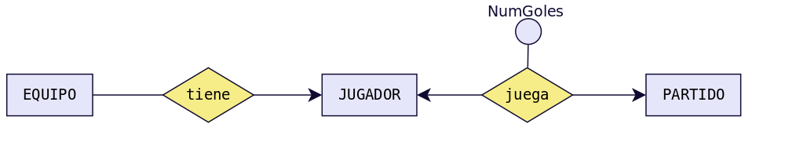
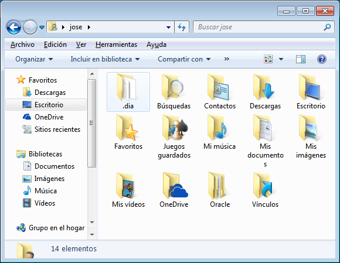
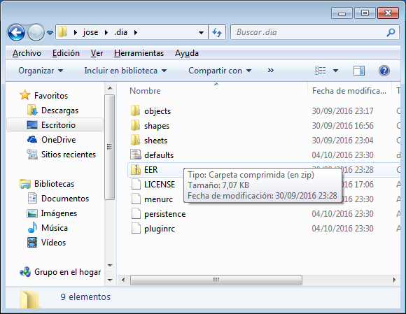
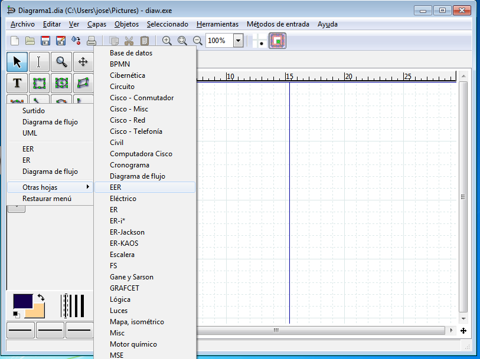
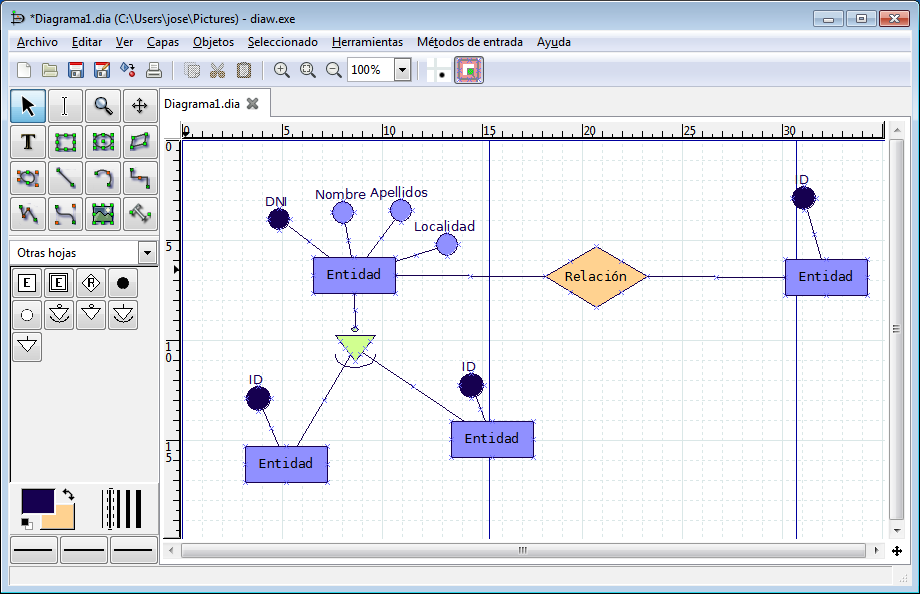
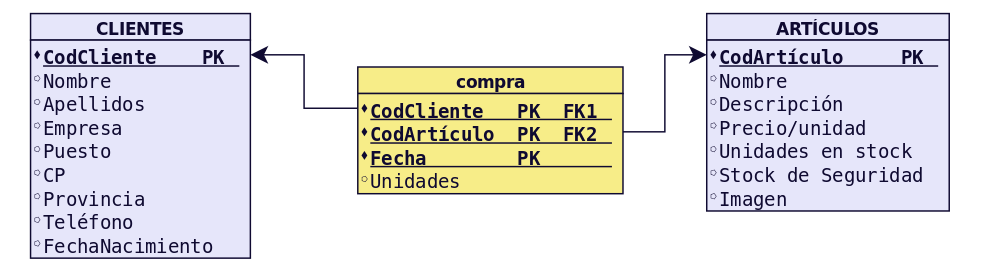
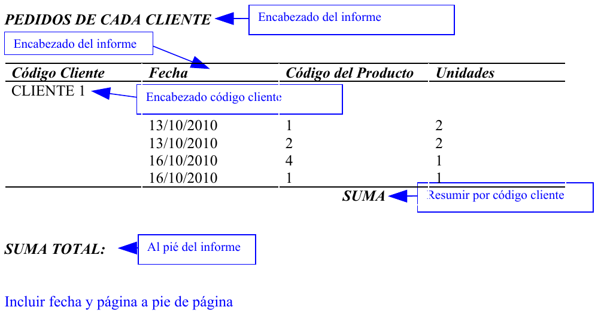
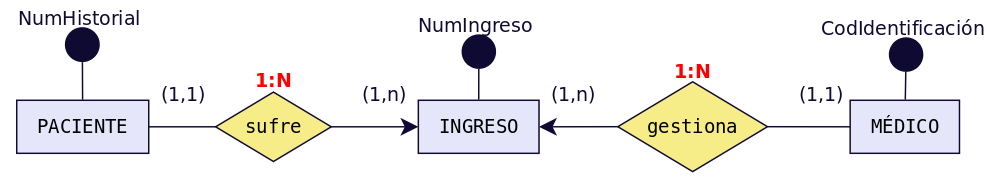

ACTIVIDADES PROPUESTAS
======================

Test
-----

**MODELO ENTIDAD-RELACIÓN**

Para cada una de las siguientes cuestiones elige razonadamente cada una de las respuestas correctas.

1. Un modelo conceptual de datos:

  a. Define una serie de símbolos para describir la realidad de la BD que se desea crear.
  b. Es un modelo que describe como se almacenan los datos a nivel físico.
  c. Permite realizar una representación del mundo real.

2. El modelo Entidad/Relación:

  a. Utiliza rombos para representar las entidades.
  b. Utiliza círculos para representar las relaciones.
  c. Cuenta con símbolos diferentes para representar las entidades fuertes y las débiles.

3. Las relaciones del modelo E/R...

  a. Son objetos reales o abstractos de los que se desea guardar información en una BD.
  b. Pueden ser fuerte o débiles.
  c. Pueden ser de dependencia en identificación o en existencia.

4. Los atributos del modelo E/R ...

  a. Que identifican unívocamente cada ocurrencia de la entidad se llaman Clave principal.
  b. Aparecen sólo en las entidades.
  c. Aparecen sólo en las relaciones.

5. La cardinalidad...

  a. 1:1 es una cardinalidad binaria que significa que a cada ocurrencia de una entidad le corresponde una sola ocurrencia de la otra entidad.
  b. En el caso de relaciones entre tres entidades pueden ser de los tipos: 1:1, 1:N o N:M.
  c. Toma las participaciones máximas de cada entidad.

Cuestiones
-----------

**MODELO ENTIDAD-RELACIÓN**

1. Define brevemente los siguientes conceptos:
++++++++++++++++++++++++++++++++++++++++++++++

a) Entidad.

b) Relación.

c) Atributo de una entidad.

d) Identificador de una entidad.

e) Atributo de una relación.

f) Rol de una entidad en una relación.

g) Participación de una entidad en una relación.

h) Cardinalidad de una relación.

2. Indica cuáles son los dos tipos posibles de entidades y explica brevemente cada una de ellas.
++++++++++++++++++++++++++++++++++++++++++++++++++++++++++++++++++++++++++++++++++++++++++++++++

3. Clasifica los distintos tipos de relaciones existentes entre dos entidades según su cardinalidad y pon un ejemplo de cada una de ellas distinto de los vistos en el tema.
++++++++++++++++++++++++++++++++++++++++++++++++++++++++++++++++++++++++++++++++++++++++++++++++++++++++++++++++++++++++++++++++++++++++++++++++++++++++++++++++++++++++++++++

4. Clasifica los distintos tipos de relaciones de dependencia existentes y pon un ejemplo de cada una de ellas distinto de los vistos en el tema.
+++++++++++++++++++++++++++++++++++++++++++++++++++++++++++++++++++++++++++++++++++++++++++++++++++++++++++++++++++++++++++++++++++++++++++++++++++++++++

5. Explica brevemente la Restricción de exclusividad entre dos tipos de relaciones R1 y R2 respecto a la entidad E1. Pon un ejemplo distinto del visto en el tema.
++++++++++++++++++++++++++++++++++++++++++++++++++++++++++++++++++++++++++++++++++++++++++++++++++++++++++++++++++++++++++++++++++++++++++++++++++++++++++++++++++++

6. Explica brevemente la Restricción de inclusión entre dos tipos de relaciones R1 y R2. Pon un ejemplo distinto del visto en el tema.
++++++++++++++++++++++++++++++++++++++++++++++++++++++++++++++++++++++++++++++++++++++++++++++++++++++++++++++++++++++++++++++++++++++++

7. Dado el siguiente esquema:
++++++++++++++++++++++++++++++

a. Indica cuáles son las entidades del modelo, diferenciado entre entidades fuertes y débiles, si las hubiera.

b. Señala las relaciones e indica cual es la cardinalidad de cada una. Trata de indicar también la participación de cada entidad en las relaciones así como su rol.

c. Señala si hay alguna relación de dependencia o reflexiva.

d. Trata de escribir atributos lógicos para cada una de las entidades e indica en cada caso cual podría ser el identificador.

e. ¿Qué significado tiene el atributo “NºGoles”?¿Por qué está en la relación en lugar de estar en JUGADOR o en PARTIDO? 

8. Obtén el diagrama E/R con las tres entidades siguientes:
+++++++++++++++++++++++++++++++++++++++++++++++++++++++++++

- **ALUMNO** (Núm_Matrícula, Nombre, FechaNacimiento, Teléfono)
- **ASIGNATURA** (Código_asignatura, Nombre)
- **PROFESOR** (Id_P, NIF_P, Nombre, Especialidad, Teléfono)

Teniendo en cuenta:

- Un alumno puede estar matriculado de una o varias asignaturas.
- Además puede estar matriculado en la misma asignatura más de un curso escolar (si repite).
- Se quiere saber el curso escolar en el que cada alumno está matriculado de cada asignatura.
- En una asignatura habrá como mínimo 10 y como máximo 25 alumnos.
- Una asignatura es impartida por un único profesor.
- Un profesor podrá impartir varias asignaturas.

9. Obtén el diagrama E/R con las cuatro entidades siguientes:
+++++++++++++++++++++++++++++++++++++++++++++++++++++++++++++

- **REGIÓN** ( Nombre_Región)
- **PROVINCIA** (CódigoProvincia, Nombre_provincia)
- **LOCALIDAD** (Código_localidad, Nombre)
- **EMPLEADO** (Id_E, DNI_E, Nombre, Teléfono, Salario)

Se quiere guardar información de la localidad donde ha nacido cada uno de los empleados teniendo en cuenta que:

- Un empleado ha nacido en una sola localidad.
- Cada localidad pertenece a una única provincia.
- Cada provincia pertenece a una única región del país.

10. Obtén el diagrama E/R con las dos entidades siguientes:
++++++++++++++++++++++++++++++++++++++++++++++++++++++++++++

- **EMPLEADO** (Id_E, DNI_E, Nombre, Teléfono, Salario)
- **DEPARTAMENTO** (Código_D, Nombre, Localización)

Teniendo en cuenta:

- Un empleado pertenece a un único departamento y en un departamento puede haber varios empleados. Pero sólo uno será el jefe del departamento.
- Un empleado podrá ser jefe o no. Si no es jefe, su jefe será el del departamento al que pertenece.

11. Obtén el diagrama E/R para el siguiente supuesto.
+++++++++++++++++++++++++++++++++++++++++++++++++++++

Una empresa dedicada a la instalación de dormitorios juveniles a medida quiere realizar una base de datos donde se reflejen las ventas y montajes, para lo cual se tiene en cuenta:

- Cada modelo de dormitorio lo debe montar, al menos, dos montadores.
- El mismo montador puede montar varios modelos de dormitorios.
- De cada modelo dormitorio nos interesa conocer su código de modelo.
- El mismo montador puede montar el mismo modelo en diferentes fechas. Nos interesa conocer la fecha en la que realiza cada montaje.
- De un montador nos interesa su NIF, nombre, dirección, teléfono de contacto y el número de dormitorios que ha montado de cada modelo.
- Cada modelo de dormitorio puede ser comprado por uno o varios clientes y el mismo cliente podrá comprar uno o varios dormitorios. De un cliente nos interesa su NIF, nombre, dirección, teléfono y fecha de compra de cada modelo.

12. Se desea diseñar una base de datos sobre la información de las reservas de una empresa dedicada al alquiler de automóviles teniendo en cuenta que:
++++++++++++++++++++++++++++++++++++++++++++++++++++++++++++++++++++++++++++++++++++++++++++++++++++++++++++++++++++++++++++++++++++++++++++++++++++++++++++++++++++++++

- Un determinado cliente puede tener en un momento dado hechas varias reservas.
- De cada cliente se desea almacenar su DNI, nombre, dirección y teléfono.
- Además dos clientes se diferencian por un único código.
- De cada reserva es importante registrar su número de identificación, la fecha de inicio y final de la reserva, el precio total.
- De cada coche se requiere la matrícula, el modelo, el color y la marca. Cada coche tiene un precio de alquiler por hora.
- Además en una reserva se pueden incluir varios coches de alquiler. Queremos saber los coches que incluye cada reserva y los litros de gasolina en el depósito en el momento de realizar la reserva, pues se cobrarán aparte.
- Cada cliente puede ser avalado por otro cliente de la empresa.

13. Tenemos esta información sobre una cadena editorial:
++++++++++++++++++++++++++++++++++++++++++++++++++++++++

- La editorial tiene varias sucursales, con su domicilio, teléfono y un código de sucursal.
- Cada sucursal tiene varios empleados, de los cuales tendremos sus datos personales, DNI y teléfono. Un empleado trabaja en una única sucursal.
- En cada sucursal se publican varias revistas, de las que almacenaremos su título, número de registro, periodicidad y tipo.
- La editorial tiene periodistas (que no trabajan en las sucursales) que pueden escribir artículos para varias revistas. Almacenaremos los mismos datos que para los empleados, añadiendo su especialidad.
- Para cada revista, almacenaremos información de cada número, que incluirá la fecha, número de páginas y el número de ejemplares vendidos.

14. La cadena de Video-Clubs Glob-Gusters ha decidido, para mejorar su servicio, emplear una base de datos para almacenar la información referente a las películas que ofrece en alquiler. 
+++++++++++++++++++++++++++++++++++++++++++++++++++++++++++++++++++++++++++++++++++++++++++++++++++++++++++++++++++++++++++++++++++++++++++++++++++++++++++++++++++++++++++++++++++++++++++++++++

Esta información es la siguiente:

- Una película se caracteriza por su título, nacionalidad, productora y fecha. Puede haber varias películas con el mismo título pero rodadas en fechas distintas.
- En una película pueden participar varios actores (nombre, nacionalidad, sexo) algunos de ellos como actores principales.
- Una película está dirigida por un director (nombre, nacionalidad).
- De cada película se dispone de uno o varios ejemplares diferenciados por un número de ejemplar y caracterizados por su estado de conservación.
- Un ejemplar se puede encontrar alquilado a algún socio (DNI, nombre, dirección, teléfono) . Se desea almacenar la fecha de comienzo del alquiler y la de devolución.
- Un socio tiene que ser avalado por otro socio que responda de él en caso de tener problemas en el alquiler.

15. Diseñar un esquema E/R que recoja la organización de un sistema de información en el que se quiere tener los datos sobre municipios, viviendas y personas. 
+++++++++++++++++++++++++++++++++++++++++++++++++++++++++++++++++++++++++++++++++++++++++++++++++++++++++++++++++++++++++++++++++++++++++++++++++++++++++++++++++++++++++++++++++++++++++++++++++

Cada persona sólo puede habitar una vivienda, pero puede ser propietaria de varias. También nos interesa la relación de las personas con su cabeza de familia.

16. Se desea diseñar una BD de una entidad bancaria que contenga información sobre los clientes, las cuentas, las sucursales y las transacciones producidas. 
+++++++++++++++++++++++++++++++++++++++++++++++++++++++++++++++++++++++++++++++++++++++++++++++++++++++++++++++++++++++++++++++++++++++++++++++++++++++++++++++++++++++++++++++++++++++++++++++++

Construir el Modelo E/R teniendo en cuenta las siguientes restricciones:

- Una transacción viene determinada por un número de transacción (único para cada cuenta), la fecha y la cantidad.
- Un cliente puede tener muchas cuentas.
- Una cuenta puede ser de muchos clientes.
- Una cuenta sólo puede estar en una sucursal.

17. Una base de datos para una pequeña empresa debe contener información acerca de clientes, artículos y pedidos. 
++++++++++++++++++++++++++++++++++++++++++++++++++++++++++++++++++++++++++++++++++++++++++++++++++++++++++++++++++

Hasta el momento se registran los siguientes datos en documentos varios:

- Para cada cliente: Número de cliente (único), Direcciones de envío (varias por cliente), Saldo, Límite de crédito, Descuento.
- Para cada artículo: Número de artículo (único), Fábricas que lo distribuyen, Existencias de ese artículo en cada fábrica, Descripción del artículo.
- Para cada pedido: Cada pedido se registrará en un documento impreso que tiene una cabecera y el cuerpo del pedido. - Para generar dicho informe se necesitará la siguiente información:
- La cabecera está formada por el número de cliente, dirección de envío y fecha del pedido.
- El cuerpo del pedido son varias líneas, en cada línea se especifican el número del artículo pedido y la cantidad.
- Además, se ha determinado que se debe almacenar la información de las fábricas. Sin embargo, dado el uso de distribuidores, se usará: Número de la fábrica (único) y Teléfono de contacto.
- Y se desean ver cuántos artículos (en total) provee la fábrica. También, por información estratégica, se podría incluir información de fábricas alternativas respecto de las que ya fabrican artículos para esta empresa.

18. Se pide hacer el diagrama ER para la base de datos que represente esta información. Le contratan para hacer una BD que permita apoyar la gestión de un sistema de ventas.
+++++++++++++++++++++++++++++++++++++++++++++++++++++++++++++++++++++++++++++++++++++++++++++++++++++++++++++++++++++++++++++++++++++++++++++++++++++++++++++++++++++++++++++++++++++++++++++++++

La empresa necesita llevar un control de proveedores, clientes, productos y ventas. Un proveedor tiene un código único, nombre, dirección, teléfono y página web. Un cliente también tiene un código único, nombre, dirección, pero puede tener varios teléfonos de contacto. La dirección se entiende por calle, número, comuna y ciudad.

Un producto tiene un id único, nombre, precio actual, stock y nombre del proveedor. Además se organizan en categorías, y cada producto va sólo en una categoría. Una categoría tiene id, nombre y descripción. Por razones de contabilidad, se debe registrar la información de cada venta con un id, fecha, cliente, descuento y monto final. Además se debe guardar el precio al momento de la venta, la cantidad vendida y el monto total por el producto. 

**MODELO ENTIDAD-RELACIÓN EXTENDIDO**

19. El departamento de formación de una empresa desea construir una base de datos para planificar y gestionar la formación de sus empleados.
+++++++++++++++++++++++++++++++++++++++++++++++++++++++++++++++++++++++++++++++++++++++++++++++++++++++++++++++++++++++++++++++++++++++++++++++++++++++++++++++++++++++++++++++++++++++++++++++++

La empresa organiza cursos internos de formación de los que se desea conocer el código de curso, el nombre, una descripción, el número de horas de duración y el coste del curso.

Un curso puede tener como prerrequisito haber realizado otro u otros previamente, y a su vez, la realización de un curso puede ser prerrequisito de otros. Un curso que es un prerrequisito de otro puede serlo de forma obligatoria o sólo recomendable.

Un mismo curso tiene diferentes ediciones, es decir, se imparte en diferentes lugares, fechas y con diferentes horarios (intensivo, de mañana o de tarde). En una misma fecha de inicio sólo puede impartirse una edición de un mismo curso.

Los cursos se imparten por personal de la propia empresa.

De los empleados se desea almacenar su código de empleado, nombre y apellidos, dirección, teléfono, NIF (Número de Identificación Fiscal), fecha de nacimiento, nacionalidad, sexo, firma y salario, así como si está o no capacitado para impartir cursos.

Un mismo empleado puede ser docente en una edición de un curso y alumno en otra edición, pero nunca puede ser ambas cosas a la vez (en una misma edición de curso o lo imparte o lo recibe).

Realiza el Modelo Entidad/Relación

20. Una Empresa decide informatizar su gestión de nóminas. Del resultado del análisis realizado, se obtienen las siguientes informaciones:
+++++++++++++++++++++++++++++++++++++++++++++++++++++++++++++++++++++++++++++++++++++++++++++++++++++++++++++++++++++++++++++++++++++++++++++++++++++++++++++++++++++++++++++++++++++++++++++++++

- A cada empleado se le entregan múltiples nóminas a lo largo de su vida laboral en la empresa y al menos una mensualmente.
- A cada empleado se le asigna un número de empleado en el momento de su incorporación a la empresa, y éste es el número usado a efectos internos de identificación. Además, se registran el Número de Identificación Fiscal del empleado, nombre, número de hijos, porcentaje de retención para Hacienda, datos de cuenta corriente en la que se le ingresa el dinero (banco, sucursal y número de cuenta) y departamentos en los que trabaja.
- Un empleado puede trabajar en varios departamentos y en cada uno de ellos trabajará con un función distinta.
- De un departamento se mantiene el nombre y cada una de sus posibles sedes.
- Son datos propios de una nómina el ingreso total percibido por el empleado y el descuento total aplicado.
- La distinción entre dos nóminas se hará, además de mediante el número de identificación del empleado, mediante el ejercicio fiscal y número de mes al que pertenece y con un número de orden en el caso de varias nóminas recibidas el mismo mes.
- Cada nómina consta de varias líneas (al menos una de ingresos) y cada línea se identifica por un número de línea dentro de la correspondiente nómina.
- Una línea puede corresponder a un ingreso o a un descuento. En ambos casos, se recoge la cantidad que corresponde a la línea (en positivo si se trata de un ingreso o en negativo si se trata de un descuento); en el caso de los descuentos, se recoge la base sobre la cual se aplica y el porcentaje que se aplica para el cálculo de éstos.
- Toda línea de ingreso de una nómina responde a un único concepto retributivo.
- En un mismo justificante, puede haber varias líneas que respondan al mismo concepto retributivo.
- De los conceptos retributivos se mantiene un código y una descripción.

Realiza el Modelo Entidad/Relación

21. La ministra de Medio Ambiente ha decidido crear un sistema de información sobre los parques naturales gestionados por cada comunidad autónoma. 
+++++++++++++++++++++++++++++++++++++++++++++++++++++++++++++++++++++++++++++++++++++++++++++++++++++++++++++++++++++++++++++++++++++++++++++++++++++++++++++++++++++++++++++++++++++++++++++++++

Después de realizar un detallado análisis, se ha llegado a las siguientes conclusiones:

- Una comunidad autónoma (CA) puede tener varios parques naturales. En toda comunidad autónoma existe uno y sólo un organismo responsable de los parques. Un parque puede estar compartido por más de una comunidad.
- Un parque natural se identifica por un nombre, fue declarado en una fecha, se compone de varias áreas identificadas por un nombre y caracterizadas por una determinada extensión. Por motivos de eficiencia se desea favorecer las consultas referentes al número de parques existentes en cada comunidad y la superficie total declarada parque natural en cada CA.
- En cada área forzosamente residen especies que pueden ser de tres tipos: vegetales, animales y minerales. Cada especie tiene una denominación científica, una denominación vulgar y un número inventariado de individuos por área. De las especies vegetales se desea saber si tienen floración y en qué periodo se produce ésta; de las animales se desea saber su tipo de alimentación (herbívora, carnívora u omnívora) y sus periodos de celo; de las minerales se	desea saber si se trata de cristales o de rocas.
- Además, interesa registrar qué especies sirven de alimento a otras especies, teniendo en cuenta que ninguna especie mineral se considera alimento de cualquier otra especie y que una especie vegetal no se alimenta de ninguna otra especie.
- Del personal del parque se guarda el DNI, número de seguridad social, nombre, dirección, teléfonos (domicilio, móvil) y sueldo. Se distinguen los siguientes tipos de personal:

  - Personal de gestión: registra los datos de los visitantes del parque y están destinados en una entrada del parque (las entradas se identifican por un número).
  - Personal de vigilancia: vigila un área determinada del parque que recorre en un vehículo (tipo y matrícula).
  - Personal investigador: Tiene una titulación que ha de recogerse y pueden realizar (incluso conjuntamente) proyectos de investigación sobre una determinada especie. Un proyecto de investigación tiene un presupuesto y un periodo de realización. 
  - Personal de conservación: mantiene y conserva un área determinada del parque. Cada uno lo realiza en una especialidad determinada (limpieza, caninos...). 

- Un visitante (DNI, nombre, domicilio y profesión) debe alojarse dentro de los alojamientos de que dispone el parque; éstos tienen una capacidad limitada y tienen una determinada categoría. 
- Los alojamientos organizan excursiones al parque, en vehículo o a pie, en determinados días de la semana y a una hora determinada. A estas excursiones puede acudir cualquier visitante del parque.
- Por comodidad, suponemos que un visitante tiene, obligatoriamente, que alojarse en el parque. Suponemos también, que cada vigilante tiene su vehículo propio que sólo utiliza él. 

**MODELO RELACIONAL**

22. Obtén el diagrama Relacional a partir el E/R obtenido en la cuestión 8.
+++++++++++++++++++++++++++++++++++++++++++++++++++++++++++++++++++++++++++++

23. Obtén el diagrama Relacional a partir el E/R obtenido en la cuestión 9.
++++++++++++++++++++++++++++++++++++++++++++++++++++++++++++++++++++++++++++++++++

24. Obtén el diagrama Relacional a partir el E/R obtenido en la cuestión 10.
++++++++++++++++++++++++++++++++++++++++++++++++++++++++++++++++++++++++++++++++++++++

25. Obtén el diagrama Relacional a partir el E/R obtenido en la cuestión 11.
++++++++++++++++++++++++++++++++++++++++++++++++++++++++++++++++++++++++++++++++++

26. Obtén el diagrama Relacional a partir el E/R obtenido en la cuestión 12.
+++++++++++++++++++++++++++++++++++++++++++++++++++++++++++++++++++++++++++++++

27. Obtén el diagrama Relacional a partir el E/R obtenido en la cuestión 13.
+++++++++++++++++++++++++++++++++++++++++++++++++++++++++++++++++++++++++++++++++++

28. Obtén el diagrama Relacional a partir el E/R obtenido en la cuestión 14.
++++++++++++++++++++++++++++++++++++++++++++++++++++++++++++++++++++++++++++++

29. Obtén el diagrama Relacional a partir el E/R obtenido en la cuestión 15.
+++++++++++++++++++++++++++++++++++++++++++++++++++++++++++++++++++++++++++++

30. Obtén el diagrama Relacional a partir el E/R obtenido en la cuestión 16.
++++++++++++++++++++++++++++++++++++++++++++++++++++++++++++++++++++++++++++++

31. Obtén el diagrama Relacional a partir el E/R obtenido en la cuestión 17.
++++++++++++++++++++++++++++++++++++++++++++++++++++++++++++++++++++++++++++++

32. Obtén el diagrama Relacional a partir el E/R obtenido en la cuestión 18.
++++++++++++++++++++++++++++++++++++++++++++++++++++++++++++++++++++++++++++++

33. Obtén el diagrama Relacional a partir el E/R obtenido en la cuestión 19.
++++++++++++++++++++++++++++++++++++++++++++++++++++++++++++++++++++++++++++++

34. Obtén el diagrama Relacional a partir el E/R obtenido en la cuestión 20.
++++++++++++++++++++++++++++++++++++++++++++++++++++++++++++++++++++++++++++++

35. Obtén el diagrama Relacional a partir el E/R obtenido en la cuestión 21.
++++++++++++++++++++++++++++++++++++++++++++++++++++++++++++++++++++++++++++++

Prácticas
----------

**MODELO ENTIDAD-RELACIÓN**

PRÁCTICA 1 
+++++++++++

.. admonition:: PLANTEAMIENTO

   OBJETIVO: Aprender el uso básico del programa Dia, que utilizaremos para para realizar diagramas. En concreto diagramas ER extendidos y relacionales.

   ENUNCIADO: Instala el programa Dia y la hoja de símbolos EER.zip para los símbolos utilizados en diagramas Entidad-Relación extendidos. Con la ayuda del profesor, examina la forma de uso de dicho programa.

Para ello deberás seguir los siguientes pasos:

1. Descarga de la plataforma Moodle el programa Dia.
2. Procede a su instalación.
3. Ejecutalo por primera vez para que se cree una subcarpeta .dia en tu directorio personal.

4. Descarga de la plataforma Moodle el archivo EER.zip que contiene los símbolos necesarios para diagramas E/R extendidos (Extended Entity-Relationship).

También puede descargarse desde el siguiente enlace:

https://github.com/jamj2000/GestionBasesDatos/blob/master/Tema2/EER.zip

5. Copia este archivo a la subcarpeta .dia y descomprímelo ahí.

6. Se generará un nuevo archivo LICENSE y dos carpetas:  shapes y sheets.
7. Reinicia el programa Dia.
8. Debajo de las herramientas, selecciona Otras hojas → EER.

PRÁCTICA 2
+++++++++++

.. admonition:: PLANTEAMIENTO
 
   OBJETIVO: Recordar todo lo visto en el tema 1 ahora que ya somos capaces de crear diagramas que modelen la realidad de nuestro problemas.
   
   ENUNCIADO: Responde a las siguientes cuestiones.

Con ayuda de el profesor y lo visto sobre el tema referente al modelo relacional deberás:

a) Realizar el paso a tablas de la cuestión 6.2.8.

- ALUMNO (Núm_Matrícula, Nombre, FechaNacimiento, Teléfono)
- ASIGNATURA (Código_asignatura, Nombre)
- PROFESOR (Id_P, NIF_P, Nombre, Especialidad, Teléfono)

b) Crea la BD que resulta en Microsoft ACCESS o LibreOffice BASE eligiendo los tipos de datos y las restricciones.
c) Introduce 7 registros en la tabla ASIGNATURAS, 4 en la tabla PROFESORES y 15 en la tabla ALUMNOS. Además resultará una tabla MATRÍCULAS que deberás completar con el curso escolar en que cada alumno ha estado matriculado de cada asignatura. Asígnalos como estimes más oportuno. Recuerda que en cada asignatura habrá un mínimo de 10 alumnos.
d) En la tabla PROFESORES mueva la columna TELEFONO a la izquierda de la columna ESPECIALIDAD. Pruebe otros movimientos.
e) Oculte las columnas Fecha_nac y Tlfno de la tabla ALUMNOS. Vuelva a mostrarlas. Pruebe otras.
f) Diseñar una consulta del tipo Eliminación capaz de eliminar de la tabla ALUMNOS solo aquellos registros comprendidos entre dos fechasNac límite que nos deberá preguntar cada vez que ejecutemos la consulta (Parametros).
g) Crea una nueva consulta en la que muestres el no de matrícula, el nombre y la asignatura en la que está o ha estado matriculado cada alumno, incluyendo el curso de la matrícula.
h) Crea un formulario para la consulta que hemos creado en el punto anterior. El formulario deberá ser de Tipo Tabular y con todos los campos de la consulta.
i) Crea un informe para la consulta anterior. El informe será de tipo tabular con todos los campos de la consulta y deberá estar ordenado por NoMatrícula.
j) Modifica el aspecto del titulo del formulario añadiendo colores, bordes y cambiando el tipo de letra.

PRÁCTICA 3
+++++++++++

.. admonition:: PLANTEAMIENTO

	OBJETIVO: Recordar todo lo visto en el tema 1 ahora que ya somos capaces de crear diagramas que modelen la realidad de nuestro problemas.

	ENUNCIADO: Responde a las siguientes cuestiones.

Con ayuda del profesor deberás:

a) Realizar el paso a tablas de la cuestión 6.2.10.
b) Crea la BD que resulta en Microsoft ACCESS o LibreOffice BASE eligiendo los tipos de datos y las restricciones. 
c) Introduce registros en cada una de las tablas.
d) Inventa cinco consultas y ejecútalas.
e) Para una de las consultas anteriores Crea un formulario de tipo Tabular y modifica un poco su aspecto.
f) Para la misma consulta que hayas elegido en el apartado anterior, crea un informe de Tipo Tabular y con todos los campos de la consulta.

**MODELO ENTIDAD-RELACIÓN EXTENDIDO**

PRÁCTICA 4
+++++++++++

.. admonition:: PLANTEAMIENTO

	OBJETIVO: Recordar todo lo visto previamente y ampliarlo con lo nuevo aprendido en este tema.
	
	ENUNCIADO: Resuelve los apartados siguientes.

a) Realizar el modelo Entidad-Relación para modelar la situación real siguiente:

- Queremos crear una base de datos para una empresa que fabrica y distribuye electrodomésticos. Debe contener información acerca de los departamentos, los empleados, los artículos, los clientes y los pedidos.
- De los departamentos queremos saber su código de identificación y el presupuesto medio con el que cuenta. Dicho presupuesto medio no podrá superar nunca los 60.000 €. Los departamentos se agrupan en sectores: Financiero, Productivo, Recursos Humanos y Ventas. De los departamentos financieros queremos saber también y su dirección y la entidad bancaria con la que trabajan. De los departamentos del sector productivo queremos conocer los artículos que fabrican.
- De los empleados guardaremos su NIF, nombre, dirección, fecha de nacimiento y departamento en el que trabajan. Cada empleado trabaja en un único departamento.
- De cada artículo: Número de artículo (único), nombre, Departamento que lo fabrica y existencias de ese artículo en cada departamento.
- Para cada cliente: Número de cliente (único), Direcciones de envío (varias por cliente), Saldo, Límite de crédito (depende del cliente, pero en ningún caso debe superar los 18.000 €), Descuento.
- Para cada pedido: número del pedido (único para cada cliente), dirección de envío y fecha del pedido.
- Además queremos saber el número de artículos de cada tipo que incluye cada pedido.

b) Con ayuda de la profesor, obtendrás el modelo relacional que aprenderás a realizar un poco más adelante.
c) Crea la BD que resulta en Microsoft ACCESS o LibreOffice BASE eligiendo los tipos de datos y las restricciones.
d) Introduce registros en cada una de las tablas.
e) Inventa cinco consultas y ejecútalas.
f) Para una de las consultas anteriores Crea un formulario de tipo Tabular y modifica un poco su aspecto.
g) Para la misma consulta que hayas elegido en el apartado anterior, crea un informe de Tipo Tabular y con todos los campos de la consulta.

**MODELO RELACIONAL**

PRÁCTICA 5
++++++++++

.. admonition:: PLANTEAMIENTO
   
   OBJETIVO: Recordar todo lo visto y ampliarlo con lo nuevo aprendido.
   
   ENUNCIADO: Resuelve los apartados siguientes.

A continuación mostramos un modelo E/R (hemos simplificado el número de atributos) del que se ha obtenido el correspondiente esquema relacional.

a) Crea la BD en un SGBD doméstico (Microsoft ACCESS o LibreOffice BASE) teniendo en cuenta la siguiente información adicional:

.. csv-table:: CLIENTE	
   :header: CAMPO, TIPO, TAMAÑO, PREDETERMINADO, VALIDACIÓN

   Código Cliente, Autonumérico,,,
   Nombre, Texto, 50,,No vacío
   Apellidos, Texto, 50,,
   Empresa, Texto, 50,,
   Puesto, Texto, 50,,
   Dirección, Texto, 50,,
   Población, Texto, 25, Écija,
   CP, Texto, 5, 41400,
   Provincia, Texto, 25, Sevilla,
   Teléfono, Texto, 9,,
   Fecha_Nacimiento, Fecha/hora,,,

.. csv-table:: ARTÍCULO
   :header: CAMPO, TIPO, PROPIEDADES, PREDETERMINADO, VALIDACIÓN

   Código Artículo, Autonumérico,,,
   Nombre, Texto,,,No vacío
   Descripción, Texto,,,No vacío
   Precio/unidad, Moneda, No negativo,,No vacío
   Unidades en stock, Numérico, "[0,100]",,
   Stock de Seguridad, Numérico, No inferior a 2, 2
   Imagen, Objeto OLE,,,

.. csv-table:: COMPRA
   :header: CAMPO, TIPO, PROPIEDADES, PREDETERMINADO, VALIDACIÓN

   Código Cliente, Numérico, Se seleccionarán desde la tabla Cliente,,
   Código Artículo, Numérico, Se elegirán de la tabla Artículo,,
   Fecha, Fecha/hora,,Fecha_Actual,
   Unidades, Numérico,No negativo,,No inferior a 1

b) Introduce los datos siguientes en la BD.

.. csv-table:: CLIENTE	
   :header: Cod_Cli, Nombre, Apellidos, Empresa, Puesto, Dirección, Población, CP, Provincia, Teléfono, Fecha_nac

   1, José, Fernández Ruiz, Estudio Cero, Gerente, "Cervantes,13", Écija, 41400, Sevilla, 656789043, 13/06/1968
   2, Luis, Fernández Chacón, Beep, Dependiente, "Aurora, 4", Écija, 41400, Sevilla, 675894566, 24/05/1982
   3, Antonio, Ruiz Gómez, Comar, Dependiente, "Osuna, 23", Écija, 41400, Sevilla, 654345544, 06/08/1989
   4, Andrea, Romero Vázquez, Estudio Cero, Dependiente, "Cervantes, 25", Écija, 41400, Sevilla, 646765657, 23/11/1974
   5, José, Pérez Pérez, Beep, Gerente, "Córdoba, 10", Écija, 41400, Sevilla, 645345543, 10/04/1978

.. csv-table:: ARTÍCULO
   :header: Cod_Art, Nombre, Descripción, Precio/Unidad, Unidades en stock, Stock Seg, Imagen

   1, NETGEAR switch prosafe, Switch 8 puertos GigabitEthernet, 125 €, 3, 2,
   2, Switch SRW224G4-EU de Linksys, CISCO switch 24 puertos 10/100, "202,43 €", 2, 2, 
   3, Switch D-link, D-Link smart switch 16 puertos, "149,90 €", 7, 4, 
   4, Switch D-link, D-Link smart switch 48 puertos, "489,00 €", 4, 2,

.. csv-table:: COMPRA
   :header: Cod_Cli, Cod_Art, Fecha, Unidad

   1, 1, 13/10/2010, 2
   1, 2, 13/10/2010, 1
   2, 3, 15/10/2010, 1
   2, 4, 15/10/2010, 1
   3, 1, 15/10/2010, 2
   4, 2, 15/10/2010, 1
   5, 3, 15/10/2010, 3
   1, 4, 16/10/2010, 1
   1, 1, 16/10/2010, 2
   2, 2, 17/10/2010, 1
   3, 3, 18/10/2010, 4
   4, 4, 19/10/2010, 2
   5, 1, 19/10/2010, 1

c) Diseña un formulario para introducir los datos de cada compra.
d) Diseña un informe donde se resuman los pedidos para cada cliente.

e) Realiza las siguientes consultas de la BD.

  1) Mostrar los nombres y apellidos de los clientes llamados José o Luis ordenados alfabéticamente por nombres.
  2) Obtener el nombre y el teléfono de los clientes cuya edad está comprendida entre 20 y 25 años ordenados por edad.
  3) Mostrar nombre y apellidos de los clientes que no tengan teléfono.
  4) Mostrar aquellos productos cuyo stock en almacén sea menor que cuatro.
  5) Mostrar el nombre, la descripción y la imagen de los productos que valgan menos de 200 €.

PRÁCTICA 6
+++++++++++

.. admonition:: PLANTEAMIENTO
   
   OBJETIVO: Recordar todo lo visto hasta el momento.
   
   ENUNCIADO: Resuelve los apartados siguientes.

Queremos un sistema de gestión de datos de un hospital. En él queremos guardar la información para cada uno de los ingresos hospitalarios indicando el paciente objeto del ingreso y el médico que autoriza el mismo. A continuación mostramos el modelo E/R que resulta del análisis de datos.

Las tablas que resultan para dicha BD tendrán los campos que se muestran a continuación:

.. csv-table:: MÉDICOS
   :header: Campo, Tipo, Largo, Otros

   Codigo identificación, Texto, 4, Campo Clave
   Nombre del Médico, Texto, 15,
   Apellidos del Médico, Texto, 30,
   Especialidad, Texto, 25,
   Fecha de ingreso, Fecha,,
   Cargo, Texto, 25,
   Número de Colegiado, Número,,
   Observaciones, Memo,,

.. csv-table:: PACIENTES
   :header: Campo, Tipo, Largo, Otros

   N Seguridad Social, Texto, 15,
   Nombre, Texto, 15,
   Apellidos, Texto, 30,
   Domicilio, Texto, 30,
   Población, Texto, 25,
   Provincia, Texto, 15,
   Código Postal, Texto, 5,
   Teléfono, Texto, 12,
   Número de Historial, Texto, 9, Campo Clave
   Sexo, Texto, 1, Regla de validación: "H" o "M"

.. csv-table:: INGRESOS
   :header: Campo, Tipo, Largo, Otros

   Número de Ingreso, Autonumérico,,Campo Clave
   Número de Historial, Texto, 9,
   Fecha de Ingreso, Fecha,,
   Código de Identificación, Texto, 4,
   Número de planta, Número,,
   Número de cama, Número,,
   Alérgico, Sí/No,,
   Observaciones, Memo,,
   Coste del tratamiento, Número,, Formato de moneda
   Diagnóstico, Texto, 40,

a) Crea el modelo Relacional a partir del cual se habrán deducido dichas tablas
b) Crea la BD en  Microsoft ACCESS o LibreOffice BASE teniendo en cuenta la información adicional que se muestra en las tablas anteriores.
c) Introduce los datos siguientes en la BD.

Las tabla se dividen en dos porque contienen muchas columnas

.. csv-table:: PACIENTES (inicio)
   :header: N Seguridad Social, Nombre, Apellidos, Domicilio, Población

   08/7888888, José Eduardo, Romerales Pinto, "C/ Azorín, 34 3o", Móstoles
   08/7234823, Ángel, Ruíz Picasso, "C/ Salmerón, 212", Madrid
   08/7333333, Mercedes, Romero Carvajal, "C/ Málaga, 13", Móstoles
   08/7555555, Martín, Fernández López, "C/ Sastres, 21", Madrid

.. csv-table:: PACIENTES (continuación)
   :header: Provincia, Código Postal, Teléfono, Número de Historial, Sexo

   Madrid, 28935, 91-345-87-45, 10203-F, H
   Madrid, 28028, 91-565-34-33, 11454-L, H
   Madrid, 28935, 91-455-67-45, 14546-E, M
   Madrid, 28028, 91-333-33-33, 15413-S, H

.. csv-table:: INGRESOS (inicio)
   :header: Número de Ingreso, Número de Hist., Fecha de Ingreso, Código de Identi., Número de planta

   1, 10203-F, 23/01/2009, AJH, 5
   2, 15413-S, 13/03/2009, RLQ, 2
   3, 11454-L, 25/05/2009, RLQ, 3
   4, 15413-S, 29/01/2010, CEM, 2
   5, 14546-E, 24-02/2010, AJH, 1

.. csv-table:: INGRESOS (continuación)
   :header: Número de cama, Alérgico, Observaciones

   121, No, Epiléptico
   5, Sí, Alérgico a la penicilina
   31, No,
   13, No, 
   5, Sí, Alérgico al Paidoterín

.. csv-table:: MÉDICOS (inicio)
   :header: Código de Ident., Nombre del Médico, Apellidos del Médico, Especialidad, Fecha toma posesión

   AJH, Antonio, Jaén Hernández, Pediatría, 12-08-82
   CEM, Carmen, Esterill Manrique, Psiquiatría, 13-02-92
   RLQ, Rocío, López Quijada, Médico de familia, 23-09-94

.. csv-table:: MÉDICOS (continuación)
   :header: Cargo, Número de Colegiado, Observaciones

   Adjunto, 2113, Está próxima su retirada
   Jefe de sección, 1231, 
   Titular, 1331, 

d) Realiza las siguientes consultas:

  1) Nombre y fecha de toma de posesión de los médicos pediatras del hospital.
  2) Nombre de los pacientes residentes en Madrid capital.
  3) Nombre de los médicos que autorizaron ingresos entre enero y febrero de 2010.
  4) Nombre y número de la Seguridad social de todos los pacientes.
  5) Nombres y apellidos de los pacientes que ingresaron entre enero y mayo de 2009 y son alérgicos.
  6) Habitación y la planta en la que ingresaron los pacientes de Móstoles.
  7) Pacientes cuyo ingreso haya sido autorizado por el doctor Antonio Jaén Hernández.
  8) Nombre y Teléfono de los pacientes que ingresaron en 2010.
  9) Nombre de los pacientes ingresados que sufren epilepsia.
  10) Nombre y fecha de ingreso de aquellos pacientes que hayan sido atendidos por un psiquiatra.
