INTRODUCCIÓN
==============================================

En este tema veremos como hacer el diseño conceptual y lógico de una base de datos. 
Empezaremos elaborando el modelo conceptual usando diagramas Entidad-Relación y Entidad-Relación extendidos. Este diseño es de más alto nivel, más próximo al usuario y más alejado del diseño físico de la BD.
A continuación, a partir del modelo Entidad-Relación, procederemos a generar el modelo relacional, el cual ya se halla muy próximo al modelo físico de BD. Veremos las reglas de transformación que hemos de seguir para ello.
Por último deberemos normalizar las tablas obtenidas para evitar redundancias.
Resumiendo, los 2 modelos lógicos, de mayor a menor nivel de abstracción, que veremos en este tema son:

- **Modelo Entidad-Relación (extendido)**
- **Modelo Relacional**

En el siguiente tema, realizaremos el diseño físico de la BD a partir del modelo relacional.

DISEÑO DE BD
==============================================

El diseño de una base de datos consiste en extraer todos los datos relevantes de un problema, por ejemplo, saber que datos están implicados en el proceso de facturación de una empresa que vende artículos de informática, o, que datos son necesarios para llevar el control de pruebas diagnósticas en un centro de radiológico.
Para extraer estos datos, se debe realizar un análisis en profundidad del problema, para averiguar qué datos son esenciales para la base de datos y descartar los que no sean necesarios. Una vez extraídos los datos esenciales comenzamos a construir los modelos adecuados. Es decir, construimos, mediante una herramienta de diseño de base de datos, un esquema que exprese con total exactitud todos los datos que el problema requiere almacenar. Ya dijimos en el tema anterior, que es algo equivalente al dibujo de un plano previo a la construcción de un edificio.
También introdujimos en el tema 1, las distintas fases por las que atraviesa el proceso de diseño de una Base de Datos. Además, previo al diseño es necesario realizar una primera fase denominada de análisis.

Fase de Análisis: Especificación de requisitos Software (E.R.S.)
----------------------------------------------------------------------

Antes de pasar a diseñar una BD hay que tener claro que es lo que queremos hacer. Para ello, típicamente los informáticos se reúnen con los futuros usuarios del sistema para recopilar la información que necesitan para saber que desean dichos usuarios. Normalmente se hace una reunión inicial a y partir de ella se elabora una batería de preguntas para entrevistar a los usuarios finales en una segunda reunión y obtener de ella una información detallada de lo que se espera de nuestra BD. De estas entrevistas, se extrae el documento más importante del análisis, el documento de Especificación de Requisitos Software o E.R.S.
A partir de dicha E.R.S. Se extrae toda la información necesaria para la modelización de datos.

Fase 1 del diseño. Diseño Conceptual: Modelo Entidad/Relación (E/R)
----------------------------------------------------------------------

Habitualmente quien realiza la modelización es un analista informático que no tiene porqué ser un experto en el problema que pretende resolver (Contabilidad, Gestión de Reservas hoteleras, medicina, economía, etc.). Es por esto que es imprescindible contar con la experiencia de un futuro usuario de la BD que conozca a fondo todos los entresijos del negocio, y que, a su vez, no tienen porqué tener ningún conocimiento de informática.
El objetivo de esta fase del diseño consiste es representar la información obtenida del usuario final y concretada en el E.R.S. mediante estándares para que el resto de la comunidad informática pueda entender y comprender el modelo realizado. El modelo que se utiliza en esta primera fase del diseño tiene un gran poder expresivo para poder comunicarse con el usuario que no es experto en informática y se denomina Modelo Conceptual.
El modelo conceptual que utilizaremos es el Modelo Entidad/Relación e iremos profundizando en él a lo largo de esta unidad.

Fase 2 del diseño. Diseño Lógico: Modelo Relacional
----------------------------------------------------------------------
Este modelo es más técnico que el anterior porque está orientado al personal informático y generalmente tiene traducción directa al al modelo físico que entiende el SGBD.
Se obtienen a partir del modelo conceptual y dependerá de la implementación de la BD. Así, no es lo mismo implementar una base de datos jerárquica u orientada a objetos que una BD relacional. El modelo que se usará en este módulo es el Modelo Relacional.

Fase 3 del diseño. Diseño Físico: Modelo Físico
----------------------------------------------------------------------

Es el resultado de aplicar el modelo lógico a un SGBD concreto. Generalmente está expresado en un lenguaje de programación de BBDD tipo SQL. En este módulo, transformaremos el Modelo Relacional en el modelo físico mediante el sublenguaje DDL de SQL. Esto se estudiará en el próximo tema.

.. image:: images/tema2-001.png

MODELO ENTIDAD/RELACIÓN
==============================================

El modelo Entidad-Relación es el modelo más utilizado para el diseño conceptual de bases de datos. Fue introducido por Peter Chen en 1976 y se basa en la existencia de objetos a los que se les da el nombre de entidades, y asociaciones entre ellos, llamadas relaciones. Sus símbolos principales se representan en el cuadro siguiente.

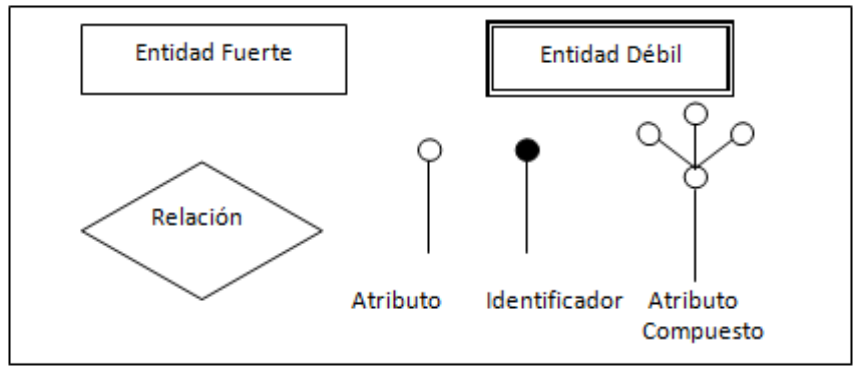

A continuación se detallan los elementos fundamentes de este modelo.

Entidades
----------------------

Una entidad es cualquier objeto o elemento acerca del cual se pueda almacenar información en la BD. Las entidades pueden ser concretas como una persona o abstractas como una fecha. Las entidades se representan gráficamente mediante rectángulos y su nombre aparece en el interior. Un nombre de entidad sólo puede aparecer una vez en el esquema conceptual.

**Tipos de entidades**

Hay dos tipos de entidades: fuertes y débiles. Una entidad débil es una entidad cuya existencia depende de la existencia de otra entidad. Una entidad fuerte es una entidad que no es débil.

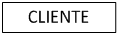

Atributos
----------------------

Una entidad se caracteriza y distingue de otra por los atributos, en ocasiones llamadas propiedades o campos, que representan las características de una entidad. Los atributos de una entidad pueden tomar un conjunto de valores permitidos al que se le conoce como dominio del atributo. Dando valores a estos atributos, se obtienen las diferentes ocurrencias de una entidad.

En esencia, existen dos tipos de atributos:
- Identificadores de entidad (también llamados clave primaria o clave principal): son atributos que identifican de manera unívoca cada ocurrencia de una entidad.
- Descriptores de entidad: son atributos que muestran unas características de la entidad.

Siempre debe existir, al menos, un atributo identificativo.

Ejemplos de atributos:

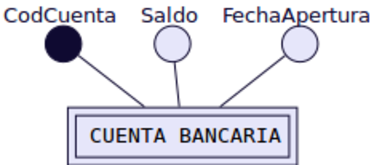
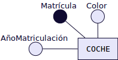

Tipos de atributos
+++++++++++++++++++

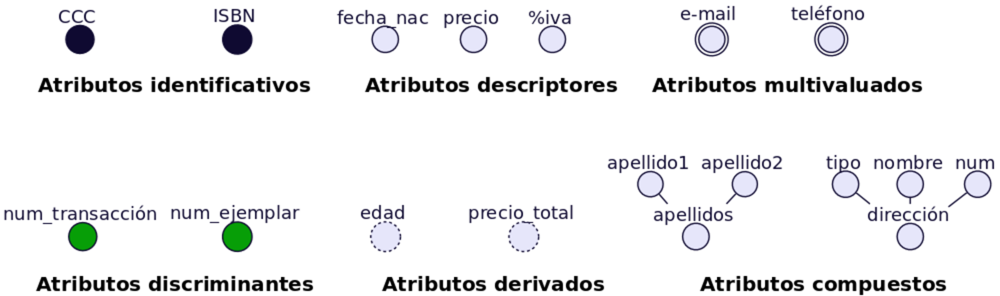

- **Atributos identificadores o identificativos**: Son atributos cuyos valores no se repiten dentro de una misma entidad o relación. Sirven para identificar de forma unívoca cada ocurrencia. Actúan como clave principal o primaria. Por ejemplo CCC (Código Cuenta Corriente) que identifica cada cuenta bancaria. O ISBN (International Standard Book Number) que identifica cada libro que se publica. Un atributo identificativo puede ser un atributo compuesto. Por ejemplo CCC podría descomponerse en 3 atributos: num_banco, num_sucursal y num_cuenta.
- **Atributos discriminadores o discriminantes**: Son atributos que discriminan distintas ocurrencias de una entidad débil en identificación dentro de la entidad fuerte de la que dependen. Lo representaremos con un círculo relleno de un color distinto a los atributos identificadores y descriptivos. Por ejemplo num_transacción dentro de una CCC o num_ejemplar dentro de un ISBN.
- **Atributos descriptores o descriptivos**: Son los atributos que describen diversas propiedades de una entidad o relación (¡la relaciones también pueden tener atributos!). Son los más frecuentes.
- **Atributos derivados**: Son atributos cuyos valores se calculan a partir de los valores de otros atributos. Por ejemplo podemos disponer de un atributo fecha_nac que sería un atributo descriptivo normal y calcular el valor del atributo edad a partir de él. El precio_total también podría calcularse a partir del precio + %iva.
- **Atributos multivaluados**: Son atributos descriptores que poseen varios valores de un mismo dominio. Por ejemplo, si necesitamos almacenar varios e-mail de una misma persona entonces deberemos utilizar un atributo multivaluado. Igual sucede con el teléfono. Si sólo necesitamos almacenar un sólo valor utilizaremos un atributo descriptivo normal.
- **Atributos compuestos**: Muchas veces se confunden con los anteriores, aunque no tienen nada que ver con ellos. Un atributo compuesto es un atributo que puede ser descompuesto en otros atributos pertenecientes a distintos dominios.

Relaciones
----------------------

Una relación es la asociación que existe entre dos a más entidades. Cada relación tiene un nombre que describe su función. Las relaciones se representan gráficamente mediante rombos y su nombre aparece en el interior. Normalmente le pondremos de nombre la primera o primeras letras de las entidades que relaciona.
Las entidades que están involucradas en una determinada relación se denominan entidades participantes.
El número de participantes en una relación es lo que se denomina grado de la relación. Por ejemplo la relación CLIENTE-COCHE es de grado 2 o binaria, ya que intervienen dos entidades.

.. image:: images/tema2-010.png

Observa que el nombre que ponemos a la relación usa las primeras letras de cada entidad. En este caso como ambas empiezan por "C" se añade algunas letras más para hacer referencia a CLIENTES. También podríamos haber puesto como nombre de la relación uno más descriptivo de la misma, por ejemplo "Compra" (CLIENTE compra COCHE), pero esta nomenclatura puede conducir a confusión a la hora de determinar la cardinalidad de la relación cuando estamos aprendiendo.
La relación PUBLICAR, es de grado 3, ya que involucra las entidades LIBRO, EDITORIAL y AUTOR.

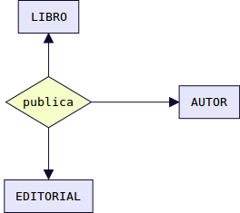

Cuando una entidad está relacionada consigo misma, hablamos de relación reflexiva.

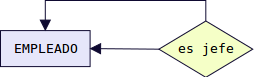

Aunque el modelo E-R permite relaciones de cualquier grado, la mayoría de las aplicaciones del modelo sólo consideran relaciones del grado 2.

El Papel o Rol de una entidad en una relación
++++++++++++++++++++++++++++++++++++++++++++++++

Es la función que tiene en una relación. Se especifican los papeles o roles cuando se quiera aclarar el significado de una entidad en una relación. A continuación mostramos los mismos ejemplos del punto anterior pero incluyendo el papel o rol de cada entidad en las relaciones:

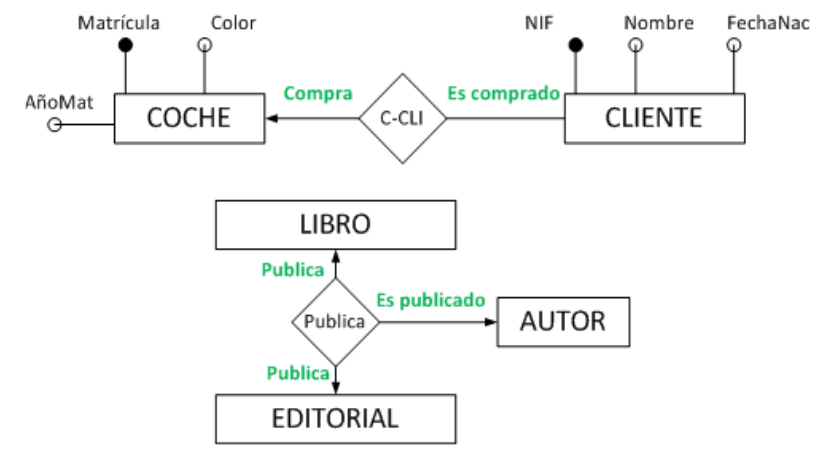

La Cardinalidad de una relación
++++++++++++++++++++++++++++++++

Cuando la relación es binaria, cosa que ocurre en la mayoría de los casos, la cardinalidad es el número de ocurrencias de una entidad asociadas a una ocurrencia de la otra entidad.
Existen principalmente tres tipos de cardinalidades binarias:

**Relación uno a uno 1:1**
	A cada elemento de la primera entidad le corresponde no más de un elemento de la segunda entidad, y a la inversa.Es representado gráficamente de la siguiente manera:

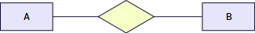

Ejemplo cardinalidad 1:1

.. image:: images/tema2-015.png

**Relación uno a muchos 1:N**
	Significa que cada elemento de una entidad del tipo A puede relacionarse con cualquier cantidad de elementos de una entidad del tipo B, y un elemento de una entidad del tipo B solo puede estar relacionado con un elemento de una entidad del tipo A. Su representación gráfica es la siguiente:
	Nótese en este caso que el extremo punteado de la flecha de la relación de A y B, indica un elemento de A conectado a muchos de B.

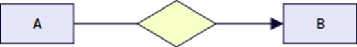

Ejemplo cardinalidad 1:N

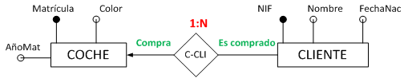

**Muchos a muchos N:M**
	Establece que cualquier cantidad de elementos de una entidad del tipo A pueden estar relacionados con cualquier cantidad de elementos de una entidad del tipo B.
	El extremo de la flecha que se encuentra punteada indica el "varios" de la relación.

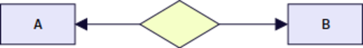

Ejemplo cardinalidad N:M

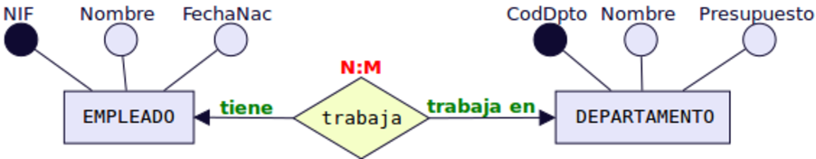

La Participación de una entidad
++++++++++++++++++++++++++++++++

La participación de una entidad también se conoce como cardinalidad de la entidad dentro de una relación. Una misma entidad puede tener distinta cardinalidad dentro de distintas relaciones.
Para obtener la participación, se debe fijar una ocurrencia concreta de una entidad y averiguar cuántas ocurrencias de la otra entidad le corresponden como mínimo y como máximo. Después realizar lo mismo en el otro sentido.
Estas ocurrencias mínimas y máximas (llamadas también participación de una entidad) se representarán entre paréntesis y con letras minúsculas en el lado de la relación opuesto a la entidad cuyas ocurrencias se fijan.
Para determinar la cardinalidad nos quedamos con las participaciones máximas de ambas y se representan con letras mayúsculas separadas por dos puntos junto al símbolo de la relación. Veamos algunos ejemplos:

Ejemplo 1

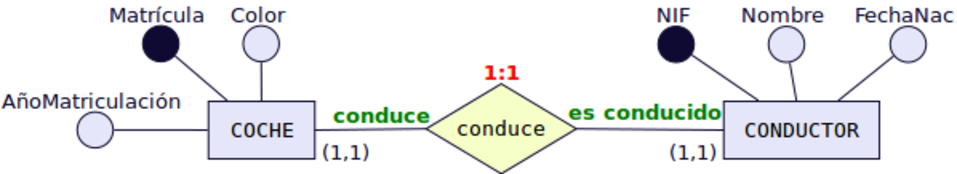

Un conductor "conduce" como mínimo 1 coche y como máximo 1 coche → Participación (1,1) y se pone en el lado opuesto a CONDUCTOR, es decir, junto a COCHE.
Un coche "es conducido" como mínimo por 1 conductor y como máximo por 1 conductor → Participación (1,1) y se pone en el lado opuesto a COCHE, es decir, junto a CONDUCTOR.
Para determinar la cardinalidad nos quedamos con las dos participaciones máximas. Es decir → 1:1.

Ejemplo 2

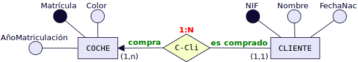

Un cliente "compra" como mínimo 1 coche y como máximo puede comprar más de un coche, es decir, varios coches. Ese varios se representa con la letra "n" → Participación (1,n)) y se pone en el lado opuesto a CLIENTE, es decir, junto a COCHE.
Un coche "es comprado" como mínimo por 1 cliente y como máximo por 1 cliente → Participación (1,1) y se pone en el lado opuesto a COCHE, es decir, junto a CLIENTE.
Para determinar la cardinalidad nos quedamos con las dos participaciones máximas y la "n" se pone en mayúsculas "N". Es decir → 1:N.

Ejemplo 3

.. image:: images/tema2-021.png

Un empleado "trabaja" como mínimo 1 departamento y como máximo puede trabajar en varios. Ese varios se representa con la letra "n" → Participación(1,n)) y se pone en el lado opuesto a EMPLEADO, es decir, junto a DEPARTAMENTO.
Un departamento "tiene" como mínimo por 1 empleado y como máximo puede tener varios → Participación (1,n) y se pone en el lado opuesto a DEPARTAMENTO, es decir, junto a EMPLEADO.
Para determinar la cardinalidad nos quedamos con las dos participaciones máximas y la "n" se pone en mayúsculas "N" y para diferenciar el otro "varios" en lugar de "N" ponemos "M" (Igual que cuando en matemáticas había dos variables no se ponía x e x sino x e y). Es decir → N:M.

Atributos propios de una relación
++++++++++++++++++++++++++++++++++

Las relaciones también pueden tener atributos, se les denominan atributos propios. Son aquellos atributos cuyo valor sólo se puede obtener en la relación, puesto que dependen de todas las entidades que participan en la relación. Veamos un ejemplo.

Ejemplo: 

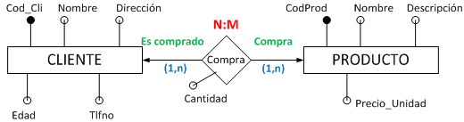

Tenemos la relación "Compra" entre cliente y producto. Así un cliente puede comprar uno o varios productos, y un producto puede ser comprado por uno o varios clientes. Encontramos una serie de atributos propios de cada una de las entidades [CLIENTE (Cod_Cliente, Nombre, Dirección, edad, teléfono) y PRODUCTO (Cod_Producto, Nombre, Descripción, Precio_Unidad)], pero también podemos observar como el atributo "Cantidad" es un atributo de la relación. ¿Por qué? Pues porque un mismo cliente puede comprar distintas cantidades de distintos productos y un mismo producto puede ser comprado en distintas cantidades por distintos clientes. Es decir el atributo cantidad depende del cliente y del producto de que se traten. 

Relaciones de dependencia: Entidades Fuertes y Entidades Débiles
+++++++++++++++++++++++++++++++++++++++++++++++++++++++++++++++++

Al definir las entidades hablamos de dos tipos de ellas: fuertes y débiles. Una entidad débil está unida a una entidad fuerte a través de una relación de dependencia.
Hay dos tipos de relaciones de dependencia:

**Dependencia en existencia**
Se produce cuando una entidad débil necesita de la presencia de una fuerte para existir. Si desaparece la existencia de la entidad fuerte, la de la débil carece de sentido. Se representa con una barra atravesando el rombo y la letra E en su interior. Son relaciones poco frecuentes.

Ejemplo:

.. image:: images/tema2-023.png

En la figura se muestra el caso de que un empleado puede tener ninguno, uno o varios hijos, por lo que los datos de los hijos deben sacarse en una entidad aparte, aunque siguen siendo datos propios de un empleado. Si se eliminase un registro de un empleado, no tendría sentido seguir manteniendo en la base datos la información sobre sus hijos.

**Dependencia en identificación**
Se produce cuando una entidad débil necesita de la fuerte para identificarse. Por sí sola la débil no es capaz de identificar de manera unívoca sus ocurrencias. La clave de la entidad débil se forma al unir la clave de la entidad fuerte con los atributos identificadores de la entidad débil.

Ejemplo:

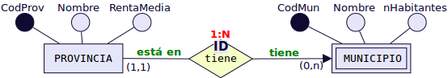

En la figura se observa que la provincia tiene uno o varios municipio y que un municipio pertenece a una sola provincia. Ahora bien si lo que identifica a los municipios es el código que aparece en el código postal, se tiene que las dos primeras cifras corresponden al código de la provincia y las tres últimas al del municipio. Por ejemplo, el C.P de Écija es 41400, dónde 41 es el código de la provincia y 400 el del municipio. De esta forma, habrá distintos municipios con código 400 en distintas provincias. Uno de estos municipios se distinguirá del resto al anteponerle las dos primeras cifras correspondientes al código de la provincial.

Símbolos de exclusividad o inclusividad entre relaciones
+++++++++++++++++++++++++++++++++++++++++++++++++++++++++

Otros símbolos usados en el modelo E/R son los siguientes:

**Restricción de exclusividad** entre dos tipos de relaciones R1 y R2 respecto a la entidad E1. Significa que E1 está relacionada, o bien con E2 o bien con E3, pero  no pueden darse ambas relaciones simultáneamente.
	

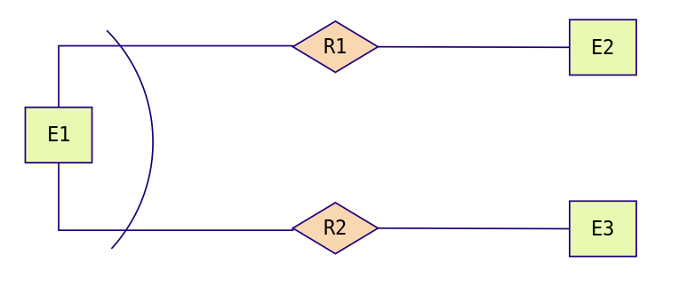

Ejemplo: Un empleado puede estar en una empresa, o bien realizando prácticas, en cuyo caso está asignado a un grupo de prácticas y no pertenece a ningún departamento en concreto. O bien puede ser empleado en plantilla y en este caso pertenece a un departamento.

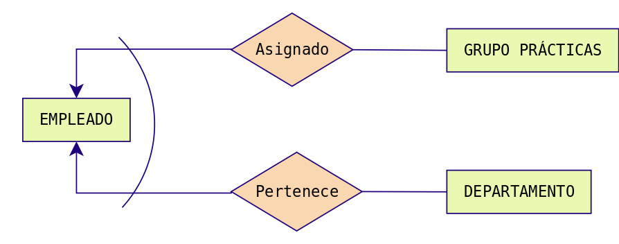

**Restricción de inclusividad** entre dos tipos de relaciones R1 y R2 respecto a la entidad E1. Para que la entidad E1 participe en la relación R2 debe participar previamente en la relación R1. 

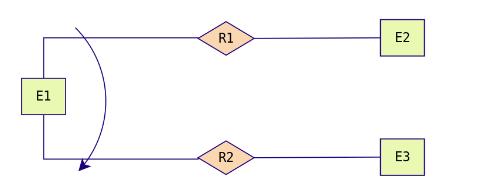

Ejemplo: Para  que un empleado pueda trabajar como diseñador de productos debe   haber asistido, al menos, a dos cursos.

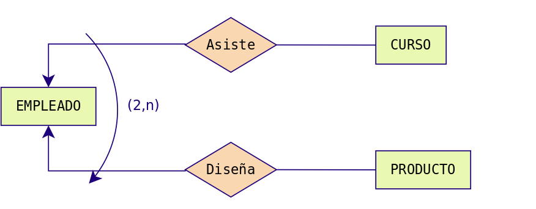

**Restricción de exclusión** entre dos tipos de relaciones R1 y R2. Significa que E1 está relacionada con E2 bien mediante R1, o bien mediante R2 pero que no pueden darse ambas relaciones simultáneamente.

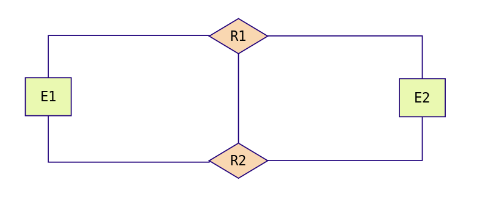

Ejemplo: Los empleados, en función de sus capacidades, o son diseñadores de productos o son operarios y los fabrican, no es posible que ningún empleado sea diseñador y fabricante a la misma vez.

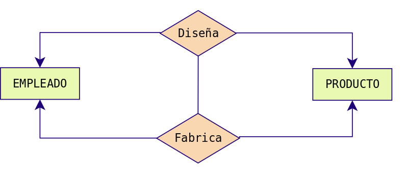

**Restricción de inclusión** entre dos tipos de relaciones R1 y R2. Para que la entidad E1 participe en la relación R2 con E2 debe participar previamente en la relación R1.

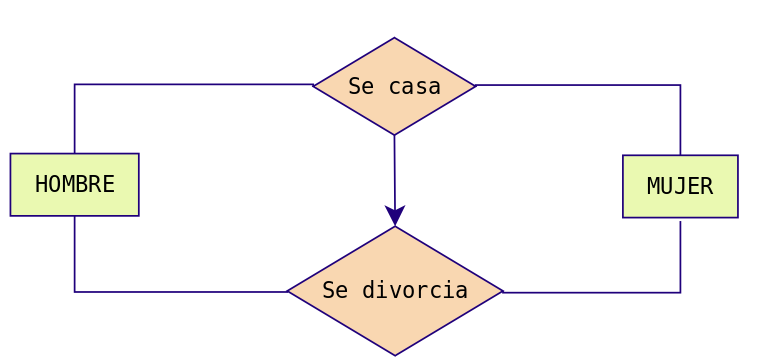

Ejemplo: Para que un hombre se divorcie de una mujer, previamente ha de haberse casado con ella.

.. image:: images/tema2-039.png

MODELO E/R EXTENDIDO
==============================================

El modelo Entidad/Relación extendido incluye todo lo visto en el modelo Entidad/Relación pero además las **Relaciones de Jerarquía**. Una relación de jerarquía se produce cuando una entidad se puede relacionar con otras a través de una relación cuyo rol sería "Es un tipo de".

Por ejemplo, imaginemos la siguiente situación.

Queremos hacer una BD sobre los animales de un Zoo. Tenemos las entidades ANIMAL, FELINO, AVE, REPTIL, INSECTO.
FELINO, AVE, REPTIL e INSECTO tendrían el mismo tipo de relación con ANIMAL: "son un tipo de". Ahora bien, su representación mediante el E/R clásico sería bastante engorrosa:

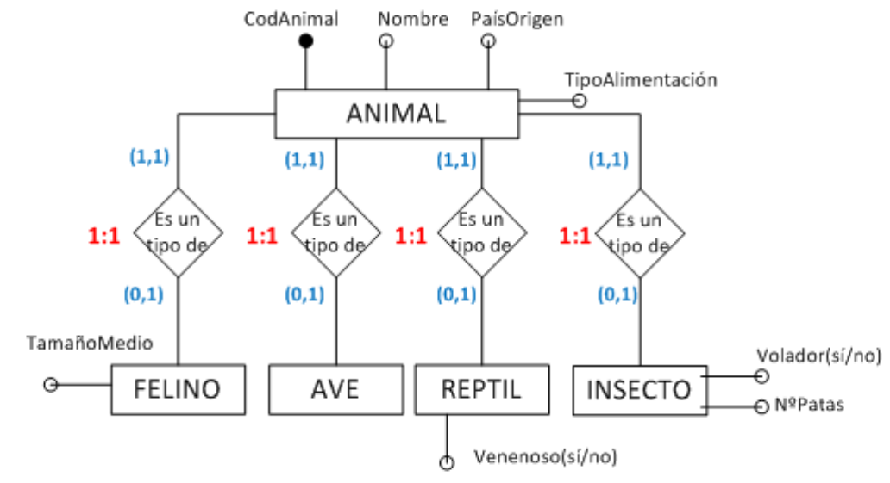

Para evitar tener que repetir tantas veces el rombo de la misma relación, se utilizan unos símbolos especiales para estos casos y se sustituyen todos los rombos de relación "es un tipo de" por un triángulo invertido, donde la entidades de abajo son siempre un tipo de la entidad de arriba y se llaman subtipo e entidades hijas. La de arriba se denominará supertipo o entidad padre. Las relaciones jerárquicas siempre se hacen en función de un atributo que se coloca al lado de la relación "es_un". En la figura siguiente sería "tipo".
El ejemplo anterior quedaría del modo siguiente utilizando símbolos del E/R extendido.

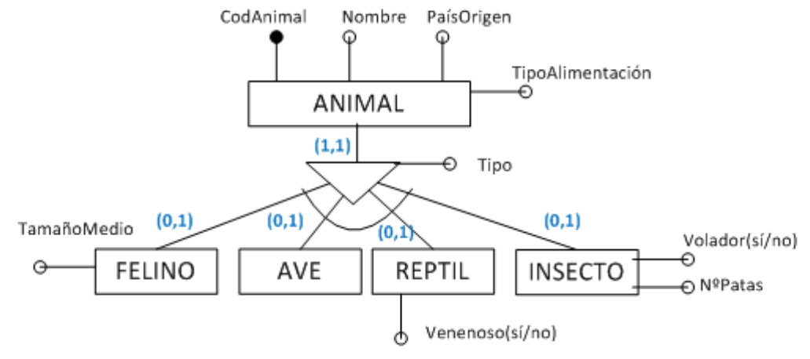

Relaciones de Jerarquía
------------------------------

Vamos a ver los distintos tipos de relaciones de jerarquía existentes:

- **Total**: Subdividimos la entidad Empleado en: Ingeniero, Secretario y Técnico y en nuestra BD no hay ningún otro empleado que no pertenezca a uno de estos tres tipos.
- **Parcial**: Subdividimos la entidad Empleado en: Ingeniero, Secretario y Técnico pero en nuestra BD puede haber empleados que no pertenezcan a ninguno de estos tres tipos.
- **Solapada**: Subdividimos la entidad Empleado, en: Ingeniero, Secretario y Técnico y en nuestra BD puede haber empleados que sean a la vez Ingenieros y secretarios, o secretarios y técnicos, etc.
- **Exclusiva**: Subdividimos la entidad Empleado en: Ingeniero, Secretario y Técnico. En nuestra BD ningún empleado pertenece a más de una subentidad.

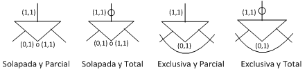

Ejemplos:

Jerarquía solapada y parcial
+++++++++++++++++++++++++++++

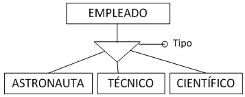

En esta BD un empleado podría ser simultáneamente técnico, científico y astronauta o técnico y astronauta, etc. (solapada). Además puede ser técnico, astronauta, científico o desempeñar otro empleo diferente (parcial).

Jerarquía solapada y total
++++++++++++++++++++++++++

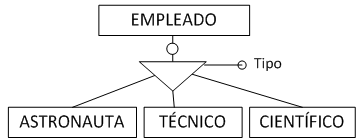

En esta BD un empleado podría ser simultáneamente técnico, científico y astronauta o técnico y astronauta, etc. (solapada). Además puede ser solamente técnico, astronauta o científico (total).

Jerarquía exclusiva y parcial
+++++++++++++++++++++++++++++

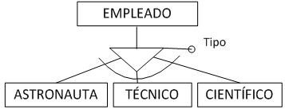

En esta BD un empleado sólo puede desempeñar una de las tres ocupaciones (exclusiva) . Además puede ser técnico, o ser astronauta, o ser científico o también desempeñar otro empleo diferente, por ejemplo, podría ser FÍSICO (parcial).

Jerarquía exclusiva y total
++++++++++++++++++++++++++++

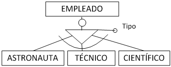

Un empleado puede ser solamente técnico, astronauta o científico (total) y no ocupar más de un puesto (exclusiva)

.. note::

   Podéis observar que en los ejemplos hemos omitido las participaciones. La mayoría de las veces estas no se ponen.

MODELO RELACIONAL
==============================================

Introducción
--------------

Los SGBD se pueden clasificar de acuerdo con el modelo lógico que soportan, el número de usuarios, el número de puestos, el coste... La clasificación más importante de los SGBD se basa en el modelo lógico, siendo los principales modelos que se utilizan en el mercado los siguientes: Jerárquico, en Red, Relacional y Orientado a Objetos.

La mayoría de los SGBD comerciales actuales están basados en el modelo relacional, en el que nos vamos a centrar, mientras que los sistemas más antiguos estaban basados en el modelo de red o el modelo jerárquico.

Los motivos del éxito del modelo relacional son fundamentalmente dos:
- Se basan en el álgebra relacional que es un modelo matemático con sólidos fundamentos. En esta sección se presenta el modelo relacional. Realizaremos la descripción de los principios básicos del modelo relacional: la estructura de datos relacional y las reglas de integridad. 
Ofrecen sistemas simples y eficaces para representar y manipular los datos.
- La estructura fundamental del modelo relacional es precisamente esa, la "**relación**", es decir una tabla bidimensional constituida por **filas** (registros o tuplas) y **columnas** (atributos o campos). Las relaciones o tablas representan las entidades del modelo E/R, mientras que los atributos de la relación representarán las propiedades o atributos de dichas entidades. Por ejemplo, si en la base de datos se tienen que representar la entidad PERSONA, está pasará a ser una relación o tabla llamada "PERSONAS", cuyos atributos describen las características de las personas (tabla siguiente). Cada tupla o registro de la relación "PERSONAS" representará una persona concreta.

Estructura de datos relacional
------------------------------

.. csv-table:: PERSONAS
   :header: "D.N.I.", "Nombre", "Apellido", "Nacimiento", "Sexo", "Estado civil"

   "52.768.987", "Juan", "Loza", "15/06/1976", "H", "Soltero"
   "06.876.983", "Isabel", "Gálvez", "23/12/1969", "M", "Casada"
   "34.678.987", "Micaela", "Ruiz", "02/10/1985", "M", "Soltera"

En realidad, siendo rigurosos, una RELACIÓN del MODELO RELACIONAL es sólo la definición de la estructura de la tabla, es decir su nombre y la lista de los atributos que la componen. Una representación de la definición de esa relación podría ser la siguiente:

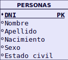

Para distinguir un registro de otro, se usa la "**clave primaria o clave principal**".

En una relación puede haber más combinaciones de atributos que permitan identificar unívocamente una fila (estos se llamarán "llaves o claves candidatas"), pero entre éstas se elegirá una sola para utilizar como llave primaria. Los atributos de la llave primaria no pueden asumir el valor nulo.

Elementos y propiedades del modelo relacional
----------------------------------------------

- **Relación (tabla)**: Representan las entidades de las que se quiere almacenar información en la BD. Esta formada por:

  - **Filas (Registros o Tuplas)**: Corresponden a cada ocurrencia de la entidad.
  - **Columnas (Atributos o campos)**: Corresponden a las propiedades de la entidad. Siendo rigurosos una relación está constituida sólo por los atributos, sin las tuplas.

- Las relaciones tienen las siguientes **propiedades**:

  - Cada relación tiene un nombre y éste es distinto del nombre de todas las demás relaciones de la misma BD.
  - No hay dos atributos que se llamen igual en la misma relación.
  - El orden de los atributos no importa: los atributos no están ordenados.
  - Cada tupla es distinta de las demás: no hay tuplas duplicadas. (Como mínimo se diferenciarán en la clave principal)
  - El orden de las tuplas no importa: las tuplas no están ordenadas.

- **Clave candidata**: atributo que identifica unívocamente una tupla. Cualquiera de las claves candidatas se podría elegir como clave principal.
- **Clave Principal**: Clave candidata que elegimos como identificador de la tuplas.
- **Clave Alternativa**: Toda clave candidata que no es clave primaria (las que no hayamos elegido como clave principal)
- Una clave principal no puede asumir el valor nulo (**Integridad de la entidad**).
- **Dominio de un atributo**: Conjunto de valores que pueden ser asumidos por dicho atributo.
- **Clave Externa o foránea o ajena**: el atributo o conjunto de atributos que forman la clave principal de otra relación. Que un atributo sea clave ajena en una tabla significa que para introducir datos en ese atributo, previamente han debido introducirse en la tabla de origen. Es decir, los valores presentes en la clave externa tienen que corresponder a valores presentes en la clave principal correspondiente (**Integridad Referencial**).

Transformación de un esquema E/R a esquema relacional
------------------------------------------------------

Pasamos ya a enumerar las normas para traducir del Modelo E/R al modelo relacional, ayudándonos del siguiente ejemplo:

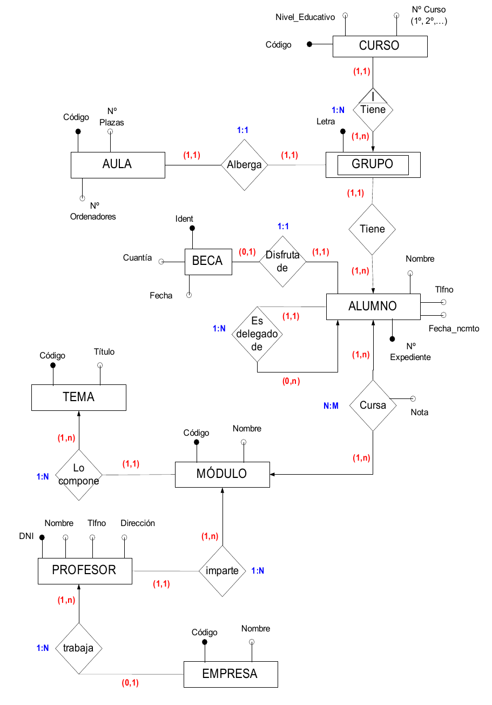

.. note:: Al pasar del esquema E/R al esquema Relacional deberemos añadir las **claves foráneas** necesarias para establecer las interrelaciones entre las tablas. Dichas claves foráneas no aparecen representadas en el esquema E/R.

.. important:: Se deben elaborar los diagramas relacionales de tal forma que, posteriormente al introducir datos, **no quede ninguna clave foránea a valor nulo (NULL)**. Para ello se siguen las reglas que se muestran a continuación.

Entidades
+++++++++

Cada entidad se transforma en una tabla. El identificador (o identificadores) de la entidad pasa a ser la clave principal de la relación y aparece subrayada o con la indicación: **PK (Primary Key)**. Si hay clave alternativa esta se pone en "negrita".

Ejemplo: Todas las entidades del ejemplo anterior generan tabla. En concreto, la entidad AULA genera la siguiente tabla:

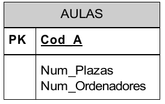

Relaciones binarias (de grado 2)
+++++++++++++++++++++++++++++++++

**Relaciones N:M**:  Es el caso más sencillo. **Siempre generan tabla**. Se crea una tabla que incorpora como claves ajenas o foráneas **FK (Foreign Key)** cada una de las claves de las entidades que participan en la relación. La clave principal de esta nueva tabla está compuesta por dichos campos. Es importante resaltar que no se trata de 2 claves primarias, sino de una clave primaria compuesta por 2 campos.
Si hay atributos propios, pasan a la tabla de la relación. Se haría exactamente igual si hubiera participaciones mínimas 0.
Orden de los atributos en las claves compuestas: Se deben poner a la izquierda todos los atributos que forman la clave. El orden de los atributos que forman la clave vendrá determinado por las consultas que se vayan a realizar. Las tuplas de la tabla suelen estar ordenadas siguiendo como índice la clave. Por tanto, conviene poner primero aquel/los atributos por los que se va a realizar la consulta.

Ejemplo: Realicemos el paso a tablas de la relación N:M entre MÓDULO (1,n) y ALUMNO (1,n). Este tipo de relación siempre genera tabla y los atributos de la relación, pasan a la tabla que ésta genera.

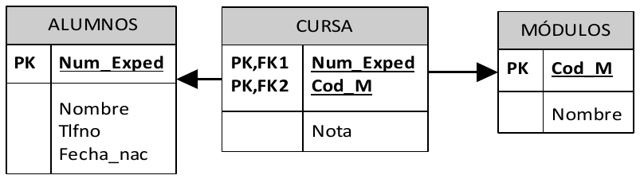

**Relaciones 1:N**: Por lo general no generan tabla. Se dan 2 casos:

- Caso 1: Si la entidad  del lado "1" presenta participación (0,1), entonces se crea una nueva tabla para la relación que incorpora como claves ajenas las claves de ambas entidades. La clave principal de la relación será sólo la clave de la entidad del lado "N".
- Caso 2: Para el resto de situaciones, la entidad del lado "N" recibe como clave ajena la clave de la entidad del lado "1". Los atributos propios de la relación pasan a la tabla donde se ha incorporado la clave ajena.

Ejemplo de caso 1: Realicemos el paso a tablas de la relación 1:N entre PROFESOR (1,n) y EMPRESA (0,1). Como en el lado "1" encontramos participación mínima 0, se generará una nueva tabla.

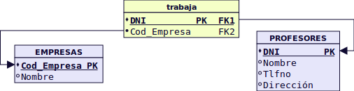

Ejemplo de caso 2: Realicemos el paso a tablas de la relación 1:N entre MÓDULO (1,1) y TEMA (1,n). Como no hay participación mínima "0" en el lado 1, no genera tabla y la clave principal del lado "1" pasa como foránea al lado "n". 

**Relaciones 1:1**: Por lo general no generan tabla.  Se dan 3 casos:

- Caso 1:  Si las dos entidades participan con participación (0,1), entonces se crea una nueva tabla para la relación.
- Caso 2:  Si alguna entidad, pero no las dos, participa con participación mínima 0 (0,1), entonces se pone la clave ajena en dicha entidad, para evitar en lo posible, los valores nulos.
- Caso 3: Si tenemos una relación 1:1 y ninguna tiene participación mínima 0,  elegimos la clave principal de una de ellas y la introducimos como clave clave ajena en la otra tabla. Se elegirá una u otra forma en función de como se quiera organizar la información para facilitar las consultas. Los atributos propios de la relación pasan a la tabla donde se introduce la clave ajena.

Ejemplo de caso 1: No se presenta ninguna situación así en el esquema estudiado.     Una situación donde puede darse este caso es en HOMBRE (0,1) se casa con MUJER (0,1).  Es similar al caso 1 del apartado anterior en relaciones 1:N, aunque en este caso debemos establecer una restricción de valor único para FK2.

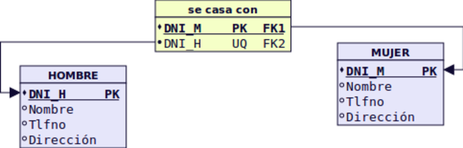

Ejemplo de caso 2 (y 3): Realicemos el paso a tablas de la relación 1:1 entre ALUMNO (1,1) y BECA (0,1). Como BECA tiene participación mínima 0, incorporamos en ella, como clave foránea, la clave de ALUMNO. Esta forma de proceder también es válida para el caso 3, pudiendo acoger la clave foránea cualquiera de las entidades.

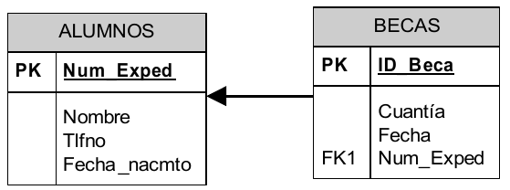

------

.. tip:: A continuación se muestra un resumen de los casos disponibles en relaciones N:M, 1:N y 1:1.

  .. image:: images/Esquema-Paso-ER-a-Relacional_(simplificado).png

------

Relaciones de dependencia (Siempre de grado 2 y cardinalidad 1:N)
+++++++++++++++++++++++++++++++++++++++++++++++++++++++++++++++++++

**Relaciones de dependencia en existencia**: Se comportan como una 1:N normal. La clave principal del lado 1 pasa al lado "N" como foránea (hacia adonde apunta la flecha)
Ejemplo: No encontramos ningún ejemplo, reseñado como tal, en el supuesto anterior. Ahora bien, se comportan en el paso a tablas como cualquier otra relación 1:N. Sólo se tendría en cuenta, el hecho de ser débil en existencia para en el momento de creación de la BD, imponer que al borrar una ocurrencia en el lado "1", se borren las asociadas en el lado "n".

**Relaciones de dependencia en identificación**: Por lo general no generan tablas, porque suelen ser 1:1 o 1:N. Como en toda relación 1:N, La clave de la entidad fuerte debe introducirse en la tabla de la entidad débil como foránea y, además en este caso, formar parte de la clave de ésta. En las entidades débiles, la clave de la entidad fuerte debe ir la primera y, a continuación, los discriminadores de la débil.
Ejemplo: Realicemos el paso a tablas de la relación débil en identificación entre CURSO Y GRUPO.

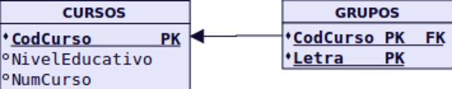

Relaciones de grado mayor que 2
+++++++++++++++++++++++++++++++

Relaciones n-arias (solo veremos hasta grado 3): Siempre generan tabla. Las claves principales de las entidades que participan en la relación pasan a la nueva tabla como claves foráneas. Y solo las de los lados "n" forman la principal. Si hay atributos propios de la relación, estos se incluyen en esa tabla.
Ejemplo: No encontramos ningún ejemplo de relación de más de grado 2 en el supuesto anterior. Se verán cuando aparezcan en algún ejercicio.

Relaciones reflexivas
+++++++++++++++++++++

Relaciones Reflexivas o Recursivas: Generan tabla o no en función de la cardinalidad.
Si es 1:1, no genera tabla. En la entidad se introduce dos veces la clave, una como clave principal y otra como clave ajena. Se suele introducir una modificación en el nombre por diferenciarlas.
Si es 1:N, se puede generar tabla o no. Si hubiese participación 0 en el lado 1, obligatoriamente se generaría tabla.
Si es N:N, la relación genera tabla.

Ejemplo:
Realicemos el paso a tablas de la relación reflexiva de ALUMNO. Como no tiene participación mínima "0" en el lado 1, no genera tabla. La clave principal de ALUMNOS, volverá a aparecer en ALUMNOS como clave foránea, igual que en cualquier relación 1:N. Ahora bien, como no puede haber dos campos con el mismo nombre en la misma tabla, deberemos cambiar un poco el nombre de la clave principal, para que haga referencia al papel que ocupa como clave foránea.

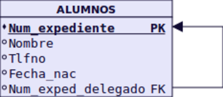

Jerarquías
+++++++++++

Eliminación de las relaciones jerárquicas: Las relaciones jerárquicas son un caso especial. Se pueden dar algunas guías que sirvan de referencia, pero en la mayoría de los casos, va a depender del problema concreto. Estas guías son:
Se creará una tabla para la entidad supertipo. A no ser que tenga tan pocos atributos que dejarla sea una complicación.
Si la entidad subtipo no tiene atributos y no está relacionada con ninguna otra entidad, desaparece.
Si la entidad subtipo tiene algún atributo, se crea una tabla. Si no tiene clave propia, hereda la de la entidad supertipo.
Si la relación es exclusiva, el atributo que genera la jerarquía se incorpora en la tabla de la entidad supertipo. Si se ha creado una tabla por cada una de las entidades subtipo, no es necesario incorporar dicho atributo a la entidad supertipo.
Ejemplo: No encontramos ningún ejemplo de relación de jerarquía 2 en el supuesto anterior. Su paso a tablas, se verán en cuando aparezcan en los ejemplos concretos.

NORMALIZACIÓN
==============================================

El diseño de una BD relacional se puede realizar aplicando al mundo real, en una primera fase, un modelo como el modelo E/R, a fin de obtener un esquema conceptual; en una segunda fase, se transforma dicho esquema al modelo relacional mediante las correspondientes reglas de transformación. También es posible, aunque quizás menos recomendable, obtener el esquema relacional sin realizar ese paso intermedio que es el esquema conceptual. En ambos casos, es conveniente (obligatorio en el modelo relacional directo) aplicar un conjunto de reglas, conocidas como Teoría de normalización, que nos permiten asegurar que un esquema relacional cumple unas ciertas propiedades, evitando:

- La redundancia de los datos: repetición de datos en un sistema.
- Anomalías de actualización: inconsistencias de los datos como resultado de datos redundantes y actualizaciones parciales.
- Anomalías de borrado: pérdidas no intencionadas de datos debido a que se han borrado otros datos.
- Anomalías de inserción: imposibilidad de adicionar datos en la base de datos debido a la ausencia de otros datos.

En la práctica, si la BD se ha diseñado haciendo uso de modelos semánticos como el modelo E/R no suele ser necesaria la normalización. Por otro lado **si nos proporcionan una base de datos creada sin realizar un diseño previo, es muy probable que necesitemos normalizar**.  

En la teoría de bases de datos relacionales, las **formas normales (FN)** proporcionan los criterios para determinar el grado de vulnerabilidad de una tabla a inconsistencias y anomalías lógicas. Cuanto más alta sea la forma normal aplicable a una tabla, menos vulnerable será a inconsistencias y anomalías.
Edgar F. Codd originalmente definió las tres primeras formas normales (**1FN, 2FN, y 3FN**) en 1970. Estas formas normales se han resumido como requiriendo que **todos los atributos sean atómicos, dependan de la clave completa y en forma directa (no transitiva)**. La forma normal de Boyce-Codd  (**FNBC**) fue introducida en 1974 por los dos autores que aparecen en su denominación. Las cuarta y quinta formas normales (**4FN y 5FN**) se ocupan específicamente de la representación de las relaciones muchos a muchos y uno a muchos entre los atributos y fueron introducidas por Fagin en 1977 y 1979 respectivamente.Cada forma normal incluye a las anteriores.

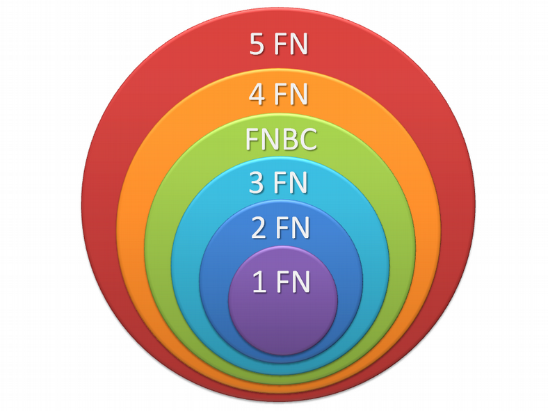

Antes de dar los conceptos de formas normales veamos unas definiciones previas:

- **Dependencia funcional: A → B**, representa que B es funcionalmente dependiente de A. Para **un valor de A** siempre aparece **un valor de B**. 
  Ejemplo: Si A es el D.N.I., y B el Nombre, está claro que para un número de  D.N.I, siempre aparece el mismo nombre de titular.

- **Dependencia funcional completa: A → B**, si B depende de A en su totalidad.
  Ejemplo: Tiene sentido plantearse este tipo de dependencia cuando A está compuesto por más de un atributo. Por ejemplo, supongamos que A corresponde al atributo compuesto: D.N.I._Empleado + Cod._Dpto. y B es Nombre_Dpto. En este caso B depende del Cod_Dpto., pero no del D.N.I._Empleado. Por tanto no habría dependencia funcional completa.

- **Dependencia transitiva: A→B→C**. Si A→B y B→C, Entonces decimos que C depende de forma transitiva de A.
  Ejemplo: Sea A el D.N.I. de un alumno, B la localidad en la que vive y  C la provincia. Es un caso de dependencia transitiva A→ B → C.

- **Determinante funcional**: todo atributo, o conjunto de ellos, de los que depende algún otro atributo.
  Ejemplo: El D.N.I. es un determinante funcional pues atributos como nombre, dirección, localidad, etc, dependen de él.

- **Dependencia multivaluada: A→→B**. Son un tipo de dependencias en las que un determinante funcional no implica un único valor, sino un conjunto de ellos. **Un valor de A** siempre implica **varios valores de B**.
  Ejemplo: CursoBachillerato →→ Modalidad. Para primer curso siempre va a aparecer en el campo Modalidad uno de los siguientes valores: Ciencias, Humanidades/Ciencias Sociales o Artes. Igual para segundo curso.

Primera Forma Normal: 1FN
----------------------------------

Una Relación está en 1FN si y sólo si cada atributo es atómico.

Ejemplo: Supongamos que tenemos la siguiente tabla con datos de alumnado de un centro de enseñanza secundaria.

.. csv-table:: Alumnos
   :header: DNI, Nombre, Curso, FechaMatrícula, Tutor, LocalidadAlumno, ProvinciaAlumno, Teléfonos

   11111111A, Eva, 1ESO-A, 01-Julio-2016, Isabel, Écija, Sevilla, 660111222
   22222222B, Ana, 1ESO-A, 09-Julio-2016, Isabel, Écija, Sevilla, "660222333 660333444 660444555"
   33333333C, Susana, 1ESO-B, 11-Julio-2016, Roberto, Écija, Sevilla, 
   44444444D, Juan, 2ESO-A, 05-Julio-2016, Federico, "El Villar", Córdoba,
   55555555E, José, 2ESO-A, 02-Julio-2016, Federico, "El Villar", Córdoba, "661000111 661000222"

Como se puede observar, esta tabla no está en 1FN puesto que el campo Teléfonos contiene varios datos dentro de una misma celda y por tanto no es un campo cuyos valores sean atómicos. La solución sería la siguiente:

.. csv-table:: Alumnos
   :header: DNI, Nombre, Curso, FechaMatrícula, Tutor, LocalidadAlumno, ProvinciaAlumno

   11111111A, Eva, 1ESO-A, 01-Julio-2016, Isabel, Écija, Sevilla
   22222222B, Ana, 1ESO-A, 09-Julio-2016, Isabel, Écija, Sevilla
   33333333C, Susana, 1ESO-B, 11-Julio-2016, Roberto, Écija, Sevilla
   44444444D, Juan, 2ESO-A, 05-Julio-2016, Federico, "El Villar", Córdoba
   55555555E, José, 2ESO-A, 02-Julio-2016, Federico, "El Villar", Córdoba

.. csv-table:: Teléfonos
   :header: DNI, Teléfono

   11111111A, 660111222
   22222222B, 660222333
   22222222B, 660333444
   22222222B, 660444555
   55555555E, 661000111
   55555555E, 661000222

Segunda Forma Normal: 2FN
----------------------------------

Una Relación esta en 2FN si y sólo si está en 1FN y todos los atributos que no forman parte de la Clave Principal tienen dependencia funcional completa de ella.

Ejemplo: Seguimos con el ejemplo anterior. Trabajaremos con la siguiente tabla:

.. csv-table:: Alumnos
   :header: DNI, Nombre, Curso, FechaMatrícula, Tutor, LocalidadAlumno, ProvinciaAlumno

   11111111A, Eva, 1ESO-A, 01-Julio-2016, Isabel, Écija, Sevilla
   22222222B, Ana, 1ESO-A, 09-Julio-2016, Isabel, Écija, Sevilla
   33333333C, Susana, 1ESO-B, 11-Julio-2016, Roberto, Écija, Sevilla
   44444444D, Juan, 2ESO-A, 05-Julio-2016, Federico, "El Villar", Córdoba
   55555555E, José, 2ESO-A, 02-Julio-2016, Federico, "El Villar", Córdoba

Vamos a examinar las dependencias funcionales. El gráfico que las representa es el siguiente:

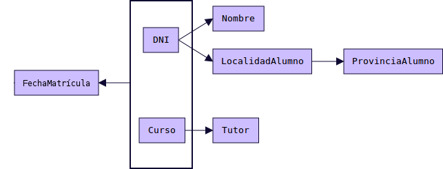

- Siempre que aparece un DNI aparecerá el Nombre correspondiente y la LocalidadAlumno correspondiente. Por tanto  DNI → Nombre  y  DNI → LocalidadAlumno. Por otro lado siempre que aparece un Curso aparecerá el Tutor correspondiente. Por tanto Curso → Tutor. Los atributos Nombre y LocalidadAlumno no dependen funcionalmente de Curso, y el atributo Tutor no depende funcionalmente de DNI. 
- El único atributo que sí depende de forma completa de la clave compuesta DNI y Curso es FechaMatrícula: (DNI,Curso) → FechaMatrícula.

A la hora de establecer la Clave Primaria de una tabla debemos escoger un atributo o conjunto de ellos de los que dependan funcionalmente el resto de atributos. Además debe ser una dependencia funcional completa. 
Si escogemos DNI como clave primaria, tenemos un atributo (Tutor) que no depende funcionalmente de él. Si escogemos Curso como clave primaria, tenemos otros atributos que no dependen de él. 

Si escogemos la combinación (DNI, Curso) como clave primaria, entonces sí tenemos todo el resto de atributos con dependencia funcional respecto a esta clave. Pero es una dependencia parcial, no total (salvo FechaMatrícula, donde sí existe dependencia completa).  Por tanto esta tabla no está en 2FN. La solución sería la siguiente:

.. csv-table:: Alumnos
   :header: DNI, Nombre, Localidad, Provincia

   11111111A, Eva, Écija, Sevilla
   22222222B, Ana, Écija, Sevilla
   33333333C, Susana, "El Villar", Córdoba
   44444444D, Juan, "El Villar", Córdoba
   55555555E, José, Écija, Sevilla

.. csv-table:: Matrículas
   :header: DNI, Curso, FechaMatrícula

   11111111A, 1ESO-A, 01-Julio-2016
   22222222B, 1ESO-A, 09-Julio-2016
   33333333C, 1ESO-B, 11-Julio-2016
   44444444D, 2ESO-A, 05-Julio-2016
   55555555E, 2ESO-A, 02-Julio-2016
 

.. csv-table:: Cursos
   :header: Curso, Tutor

   1ESO-A, Isabel
   1ESO-B, Roberto
   2ESO-A, Federico

Tercera Forma Normal: 3FN
----------------------------------

Una Relación esta en 3FN si y sólo si está en 2FN y no existen dependencias transitivas. Todas las dependencias funcionales deben ser respecto a la clave principal.

Ejemplo: Seguimos con el ejemplo anterior. Trabajaremos con la siguiente tabla:

.. csv-table:: Alumnos
   :header: DNI, Nombre, Localidad, Provincia

   11111111A, Eva, Écija, Sevilla
   22222222B, Ana, Écija, Sevilla
   33333333C, Susana, "El Villar", Córdoba
   44444444D, Juan, "El Villar", Córdoba
   55555555E, José, Écija, Sevilla

Las dependencias funcionales existentes son las siguientes. Como podemos observar existe una dependencia funcional transitiva: DNI → Localidad → Provincia

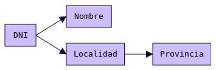

Para que la tabla esté en 3FN, no pueden existir dependencias funcionales transitivas. Para solucionar el problema deberemos crear una nueva tabla. El resultado es:

.. csv-table:: Alumnos
   :header: DNI, Nombre, Localidad

   11111111A, Eva, Écija 
   22222222B, Ana, Écija
   33333333C, Susana, El Villar
   44444444D, Juan, El Villar
   55555555E, José, Écija

.. csv-table:: Localidades
   :header: Localidad, Provincia

   Écija, Sevilla
   El Villar, Córdoba

**RESULTADO FINAL**

.. csv-table:: Alumnos
   :header: DNI, Nombre, Localidad

   11111111A, Eva, Écija 
   22222222B, Ana, Écija
   33333333C, Susana, El Villar
   44444444D, Juan, El Villar
   55555555E, José, Écija

.. csv-table:: Localidades
   :header: Localidad, Provincia

   Écija, Sevilla
   El Villar, Córdoba

.. csv-table:: Teléfonos
   :header: DNI, Teléfono

   11111111A, 660111222
   22222222B, 660222333
   22222222B, 660333444
   22222222B, 660444555
   55555555E, 661000111
   55555555E, 661000222

.. csv-table:: Matrículas
   :header: DNI, Curso, FechaMatrícula

   11111111A, 1ESO-A, 01-Julio-2016
   22222222B, 1ESO-A, 09-Julio-2016
   33333333C, 1ESO-B, 11-Julio-2016
   44444444D, 2ESO-A, 05-Julio-2016
   55555555E, 2ESO-A, 02-Julio-2016
 

.. csv-table:: Cursos
   :header: Curso, Tutor

   1ESO-A, Isabel
   1ESO-B, Roberto
   2ESO-A, Federico

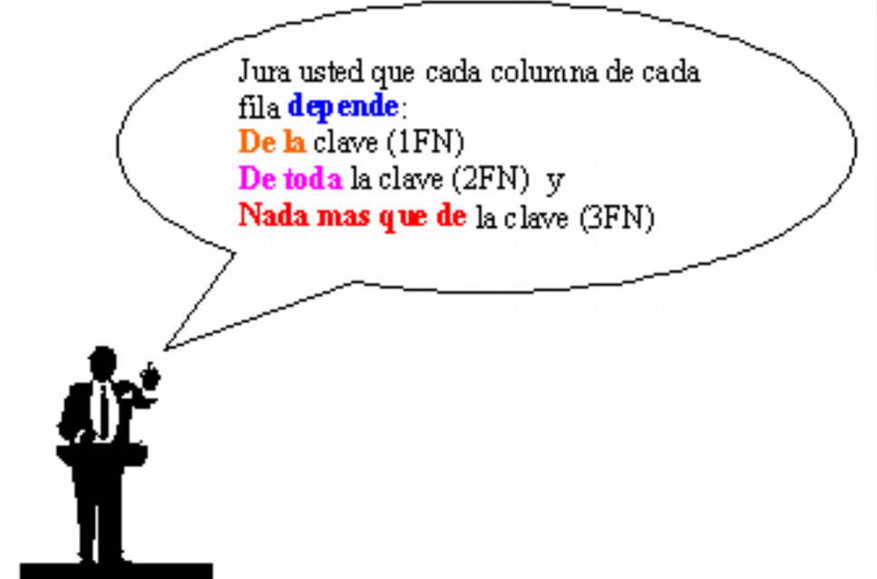

Forma Normal de Boyce-Codd: FNBC
----------------------------------

Una Relación esta en FNBC si está en 3FN y no existe solapamiento de claves candidatas. Solamente hemos de tener en cuenta esta forma normal cuando tenemos varias claves candidatas compuestas y existe solapamiento entre ellas. Pocas veces se da este caso.

Ejemplo: Tenemos una tabla con información de proveedores, códigos de piezas y cantidades de esa pieza que proporcionan los proveedores. Cada proveedor tiene un nombre único. Los datos son:

.. csv-table:: Suministros
   :header: CIF, Nombre, CódigoPieza, CantidadPiezas

   S-11111111A, Ferroman, 1, 10
   B-22222222B, Ferrotex, 1, 7
   M-33333333C, Ferropet, 3, 4
   S-11111111A, Ferroman, 2, 20
   S-11111111A, Ferroman, 3, 15
   B-22222222B, Ferrotex, 2, 8
   B-22222222B, Ferrotex, 3, 4

 
El gráfico de dependencias funcionales es el siguiente:

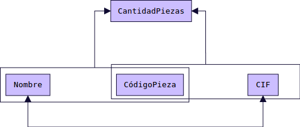

El atributo CantidadPiezas tiene dependencia funcional de dos claves candidatas compuestas, que son:

- (NombreProveedor, CodigoPieza)
- (CIFProveedor, CódigoPieza)

Existe también una dependencia funcional en doble sentido (que no nos afecta): NombreProveedor <-> CIFProveedor.

Para esta tabla existe un solapamiento de 2 claves candidatas compuestas. Para evitar el solapamiento de claves candidatas dividimos la tabla. La solución es:

.. csv-table:: Proveedores
   :header: CIF, Nombre

   S-11111111A, Ferroman
   B-22222222B, Ferrotex
   M-33333333C, Ferropet

.. csv-table:: Suministros
   :header: CIF, CódigoPieza, CantidadPiezas

   S-11111111A, 1, 10
   B-22222222B, 1, 7
   M-33333333C, 3, 4
   S-11111111A, 2, 20
   S-11111111A, 3, 15
   B-22222222B, 2, 8
   B-22222222B, 3, 4

Cuarta Forma Normal: 4FN
----------------------------------

Una Relación esta en 4FN si y sólo si está en 3FN (o FNBC) y las únicas dependencias  multivaluadas son aquellas que dependen de las claves candidatas.

Ejemplo: Tenemos una tabla con la información de nuestros alumnos y alumnas y las asignaturas que cursan así como los deportes que practican. 

.. csv-table:: Alumnado
   :header: Estudiante, Asignatura, Deporte

   11111111A, "Matemáticas, Lengua", Baloncesto
   22222222B, Matemáticas, "Fútbol, Natación"

.. csv-table:: Alumnado
   :header: Estudiante, Asignatura, Deporte

   11111111A, Matemáticas, Natación
   11111111A, Matemáticas, Baloncesto
   11111111A, Lengua, Natación
   11111111A, Lengua, Baloncesto
   22222222B, Matemáticas, Fútbol
   22222222B, Matemáticas, Natación

Para normalizar esta tabla, debemos darnos cuenta que la oferta de asignaturas está compuesta por un conjunto de valores limitado. Igual sucede con los deportes. 
Por tanto existen dos dependencias multivaluadas: 

- Estudiante →→ Asignatura
- Estudiante →→ Deporte 

Por otro lado no existe ninguna dependencia entre la asignatura cursada y el deporte practicado. 
Para normalizar a 4FN creamos 2 tablas:

.. csv-table:: EstudiaAsignatura
   :header: Estudiante, Asignatura

   11111111A, Matemáticas
   11111111A, Lengua
   22222222B, Matemáticas

.. csv-table:: PracticaDeporte
   :header: Estudiante, Deporte

   11111111A, Natación
   11111111A, Baloncesto
   22222222B, Fútbol
   22222222B, Natación

Diagrama E/R equivalente

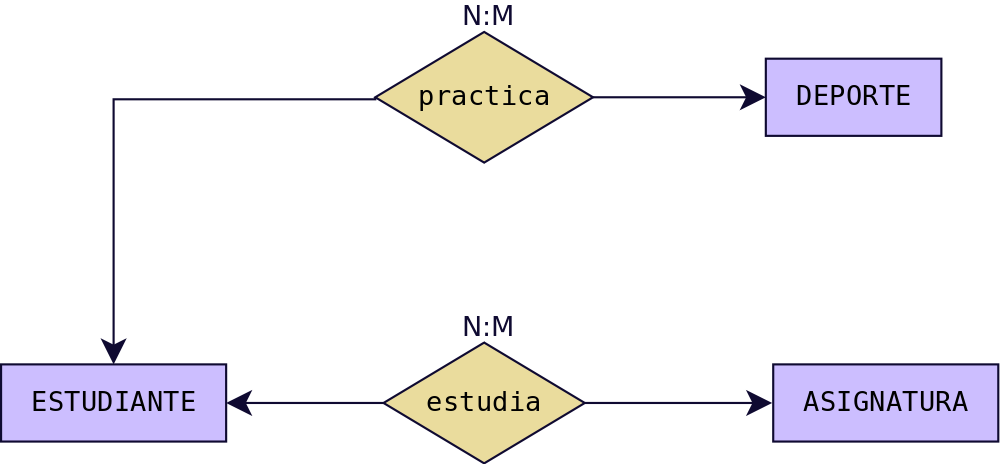

Quinta Forma Normal: 5FN
----------------------------------

La quinta forma normal (5FN), es una generalización de la anterior. También conocida como forma normal de proyección-unión (PJ/NF). Una tabla se dice que está en 5NF si y sólo si está en 4NF y cada dependencia de unión (join) en ella es implicada por las claves candidatas.
Ejemplo: Tenemos una tabla con varios proveedores que nos proporcionan piezas para distintos proyectos. Asumimos que un Proveedor suministra ciertas Piezas en particular, un Proyecto usa ciertas Piezas, y un Proyecto es suplido por ciertos Proveedores, entonces tenemos las siguientes dependencias multivaluadas:

- Proveedor →→ Pieza
- Pieza →→ Proyecto
- Proyecto →→ Proveedor

Se puede observar como se produce un ciclo: 

- Proveedor →→ Pieza →→ Proyecto →→ Proveedor (nuevamente)

.. csv-table:: Suministros
   :header: Proveedor, Pieza, Proyecto
    
    "E1, E4, E6", "PI3, PI6", "PR2, PR4"
    "E2, E5", "PI1, PI2", "PR1, PR3"
    "E3, E7", "PI4, PI5", "PR5, PR6"

.. csv-table:: Suministros
   :header: Proveedor, Pieza, Proyecto

   E1, PI3, PR2
   E1, PI3, PR4
   E1, PI6, PR2
   E1, PI6, PR4
   E4, PI3, PR2
   E4, PI3, PR4
   E4, PI6, PR2
   E4, PI6, PR4
   E6, PI3, PR2
   E6, PI3, PR4
   E6, PI6, PR2
   E6, PI6, PR4
   E2, PI1, PR1
   E2, PI1, PR3
   E2, PI2, PR1
   E2, PI2, PR3
   E5, PI1, PR1
   E5, PI1, PR3
   E5, PI2, PR1
   E5, PI2, PR3
   E3, PI4, PR5
   E3, PI4, PR6
   E3, PI5, PR5
   E3, PI5, PR6
   E7, PI4, PR5
   E7, PI4, PR6
   E7, PI5, PR5
   E7, PI5, PR6

Descomponemos la tabla en 3 tabla nuevas:  Proveedor-Pieza, Pieza-Proyecto, Proyecto-Proveedor.

.. csv-table:: Proveedor-Pieza
   :header: Proveedor, Pieza

   E1, PI3
   E1, PI6
   E4, PI3
   E4, PI6
   E6, PI3
   E6, PI6
   E2, PI1
   E2, PI2
   E5, PI1
   E5, PI2
   E3, PI4
   E3, PI5
   E7, PI4
   E7, PI5

.. csv-table:: Pieza-Proyecto
   :header: "Pieza", "Proyecto"

   PI3, PR2
   PI3, PR4
   PI6, PR2
   PI6, PR4
   PI1, PR1
   PI1, PR3
   PI2, PR1
   PI2, PR3
   PI4, PR5
   PI4, PR6
   PI5, PR5
   PI5, PR6

.. csv-table:: Proyecto-Proveedor
   :header: "Proyecto", "Proveedor"

   PR2, E1
   PR4, E1
   PR2, E4
   PR4, E4
   PR2, E6
   PR4, E6
   PR1, E2
   PR3, E2
   PR1, E5
   PR3, E5
   PR5, E3
   PR6, E3
   PR5, E7
   PR6, E7

El producto natural de estas 3 tablas nos da la tabla original.
Proveedor-Pieza \|x\| Pieza-Proyecto \|x\| Proyecto-Proveedor = Suministros

Diagrama E/R equivalente

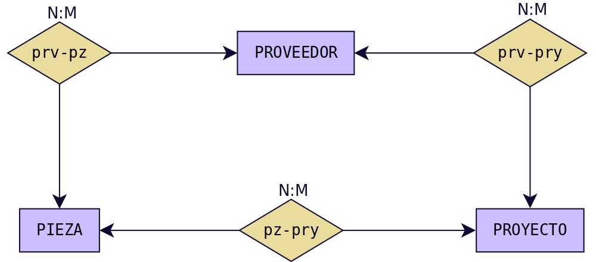

