ACTIVIDADES RESUELTAS
=====================

.. admonition:: IMPORTANTE

   Todos los scripts que aparecen a continuación deben ejecutarse en SQL*Plus.

Cuestiones (I)
--------------

2. Pon un ejemplo de un tipo de dato numérico, otro alfanumérico y otro fecha/hora.
+++++++++++++++++++++++++++++++++++++++++++++++++++++++++++++++++++++++++++++++++++++++++++++++
  
- Dato numérico: PRECIO, IVA, EDAD, …
- Dato alfanumérico: DNI, DIRECCIÓN, …
- Dato tipo fecha: FECHA_NACIMIENTO, FECHA_INICIO, FECHA_FIN, ...

3. ¿Qué diferencia hay entre VARCHAR y CHAR?
+++++++++++++++++++++++++++++++++++++++++++++++++++++++++++++++++++++++++++++++++++++++++++++++++

Tanto CHAR como VARCHAR2 se utilizan para almacenar valores de cadena de caracteres, sin embargo, se comportan de manera muy diferente. 

- CHAR se debe utilizar para almacenar cadenas de caracteres de longitud fija. Siempre se reserva en memoria el espacio indicado. Los valores de cadena serán espaciados (puestos en blanco) hasta la longitud especificada antes de almacenarse en el disco. 
- VARCHAR2 se utiliza para almacenar cadenas de caracteres de longitud variable. Se reserva unicamente la memoria necesaria hasta el máximo indicado en la longitud.

5. Realiza la instalación de Oracle Database 11g Express Edition sobre Windows.
++++++++++++++++++++++++++++++++++++++++++++++++++++++++++++++++++++++++++++++++++++++++++++++++++++++++++++++++++++

6. Una vez instalado dicho Sistema Gestor de Bases de Datos Relacional (RDBMS), lo iniciaremos pulsando en "Start Database". 
++++++++++++++++++++++++++++++++++++++++++++++++++++++++++++++++++++++++++++++++++++++++++++++++++++++++++++++++++++++++++++++++

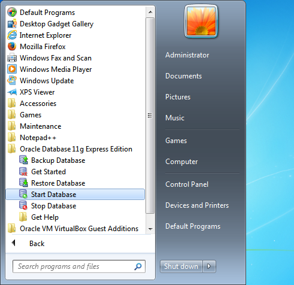

7. Y después iniciamos la interfaz web APEX  (APplication EXpress) para trabajar con dicho SGBD. 
++++++++++++++++++++++++++++++++++++++++++++++++++++++++++++++++++++++++++++++++++++++++++++++++++++++++++++++++++++

Para ello pulsamos sobre "Get Started". Y se abrirá el navegador web con esta URL: http://127.0.0.1:8080/apex/f?p=4950.

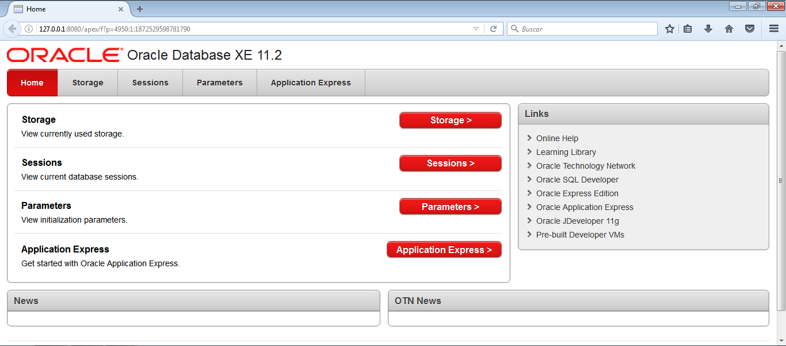

8. A continuación configuraremos el Terminal CMD. En Windows, ejecuta el programa CMD.EXE y realiza la configuración siguiente:
++++++++++++++++++++++++++++++++++++++++++++++++++++++++++++++++++++++++++++++++++++++++++++++++++++++++++++++++++++++++++++++++

- Pulsa con el botón secundario del ratón en la barra de título y luego haz clic en Propiedades.

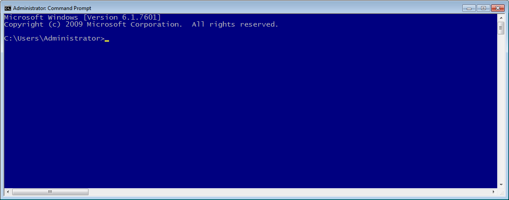

- Configura la Fuente, la Disposición y los Colores como se muestra más abajo.

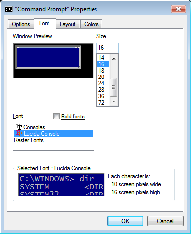
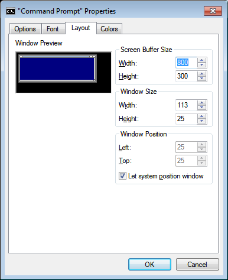
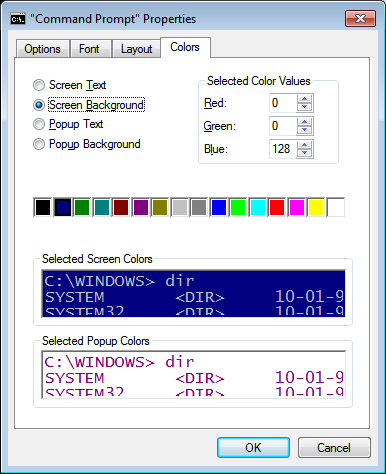

- Pulsa OK.

9. Cambia la "Página de Código" a Windows-1252.
++++++++++++++++++++++++++++++++++++++++++++++++++++++++++++++++++++++++++++++++++++++++++++++++++++++++++++++++++++

Para que se muestren correctamente las tildes y ciertos caracteres como la letra Ñ y similares deberemos ejecutar el comando CHCP 1252 (CHange CodePage). Esto cambia la CP850 por la CP1252 que soporta el conjunto de caracteres ISO 8859, necesarios por los motivos indicados anteriormente. Esta configuración no se queda guardada, por lo que deberemos ejecutarla cada vez que iniciemos el terminal.

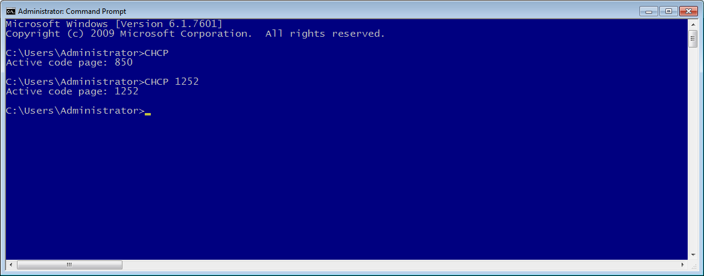

10. Ya podemos lanzar el cliente SQL*Plus como aparece en la imagen. Lo haremos como SYSDBA (permisos de DataBase Administrator).
+++++++++++++++++++++++++++++++++++++++++++++++++++++++++++++++++++++++++++++++++++++++++++++++++++++++++++++++++++++++++++++++++++++

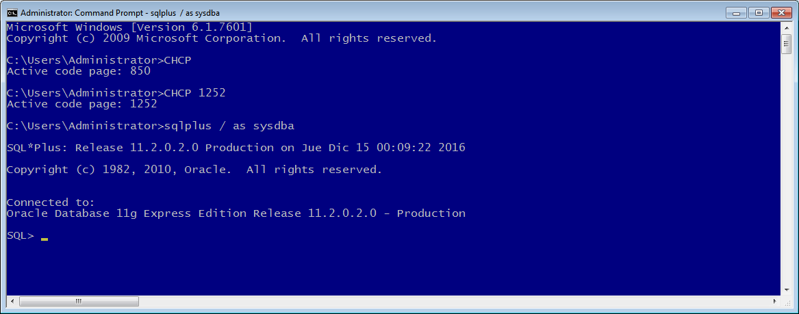

Para comprobar que SQL\*Plus y la base de datos Oracle están funcionando bien, realizaremos lo siguiente. Con Oracle se instala un esquema (usuario) de ejemplo llamado HR (Human Resources). Por defecto está bloqueado. Los desbloqueamos. Le concedemos roles CONNECT y RESOURCE y asignamos una contraseña. 

.. code-block:: sql

  sqlplus / as sysdba
  ...
  SQL> alter user hr account unlock;
  User altered.
  SQL> grant connect,resource to hr identified by "HR";
  Grant succeeded.

11.  Ahora conectamos con usuario/contraseña anterior y vemos las tablas que tiene dicho esquema (usuario).
++++++++++++++++++++++++++++++++++++++++++++++++++++++++++++++++++++++++++++++++++++++++++++++++++++++++++++++++++++

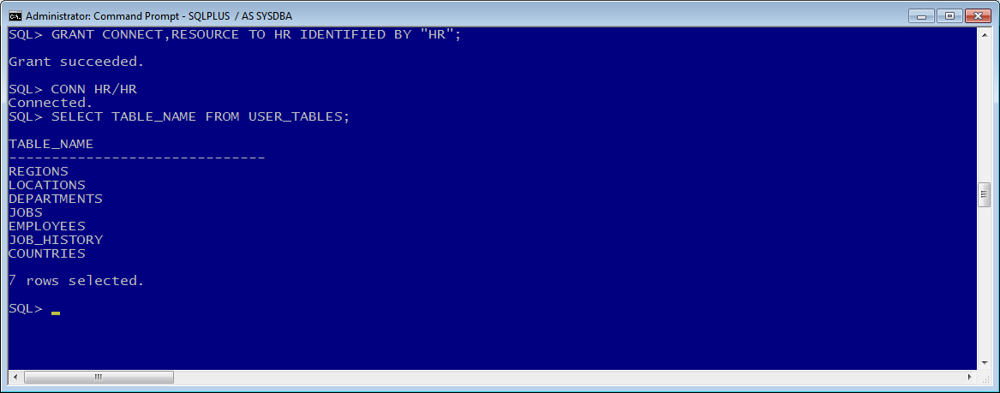

12. Insertamos algunos datos con tildes y caracteres tales como la letra Ñ.
++++++++++++++++++++++++++++++++++++++++++++++++++++++++++++++++++++++++++++++++++++++++++++++++++++++++++++++++++++

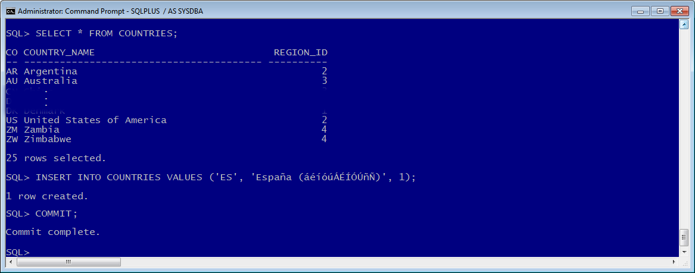

13. Comprobamos ahora la interfaz web APEX. Pulsamos en Application Express. Luego introducimos la clave del usuario SYSTEM que establecimos durante la instalación.
++++++++++++++++++++++++++++++++++++++++++++++++++++++++++++++++++++++++++++++++++++++++++++++++++++++++++++++++++++++++++++++++++++++++++++++++++++++++++++++++++++

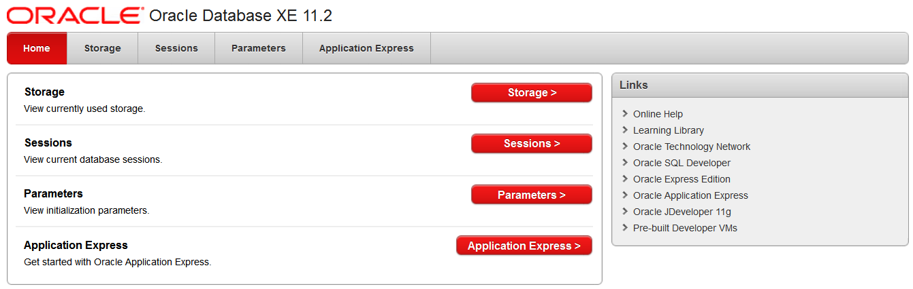

.. warning::

   En las contraseñas se distingue entre mayúsculas y minúsculas.

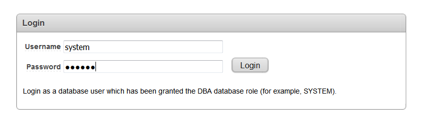

14. Una vez dentro nos creamos un espacio de trabajo (Workspace) como aparece en la siguiente imagen. Luego pulsaremos "Create Workspace".
++++++++++++++++++++++++++++++++++++++++++++++++++++++++++++++++++++++++++++++++++++++++++++++++++++++++++++++++++++++++++++++++++++++++++++++++++++

.. image:: images/tema3-028.png

Como usuario y contraseña de APEX, por motivos de comodidad, utilizaremos siempre los siguientes: 

- Username: YO
- Password: YO

15. Ya podemos trabajar con el esquema HR en APEX. Para ello pulsamos en "Already have an acount? Login Here"
++++++++++++++++++++++++++++++++++++++++++++++++++++++++++++++++++++++++++++++++++++++++++++++++++++++++++++++++++++

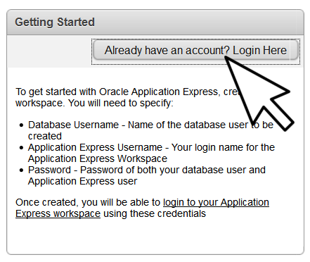
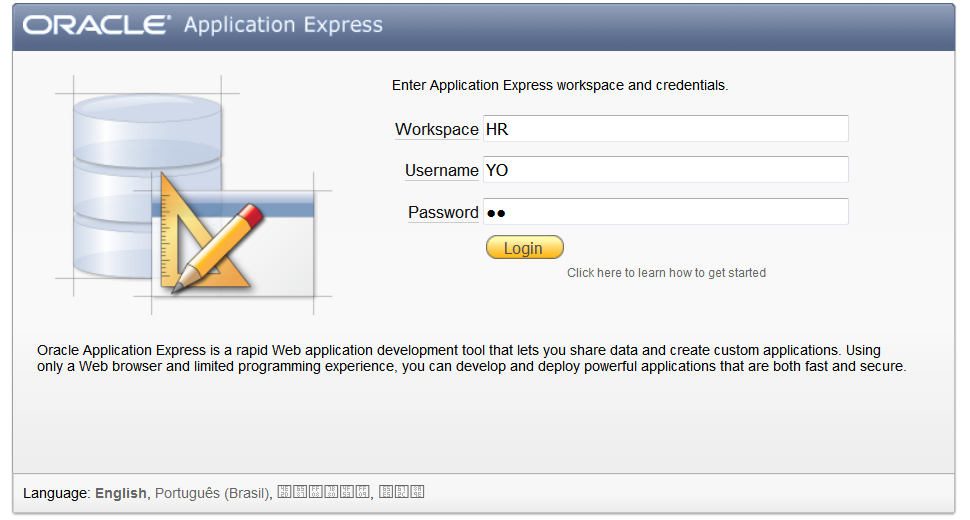

16. Después pulsamos sobre "SQL WorkShop" y "SQL Commands". Realizamos la consulta `SELECT * FROM COUNTRIES;` para comprobar que aparece el registro introducido anteriormente con las tildes correctas.
+++++++++++++++++++++++++++++++++++++++++++++++++++++++++++++++++++++++++++++++++++++++++++++++++++++++++++++++++++++++++++++++++++++++++++++++++++++++++++++++++++++++++++++++++++++++++++++++++++++++++++

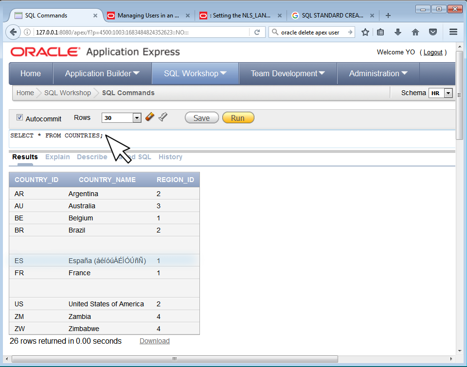

Cuestiones  (II)
-------------------

1. Realiza el diseño físico para el siguiente modelo relacional. Asigna el tipo de datos que consideres más adecuado. Realiza el diseño sin poner nombres a las restricciones. Esquema E01, contraseña "E01".
++++++++++++++++++++++++++++++++++++++++++++++++++++++++++++++++++++++++++++++++++++++++++++++++++++++++++++++++++++++++++++++++++++++++++++++++++++++++++++++++++++++++++++++++++++++++++++++++++++++++++++++++++++++++

.. image:: images/tema3-035.png

.. literalinclude:: scripts/E01.SQL
   :language: sql

.. note:: 

   Observa el orden en el que creamos las tablas. Las tablas que contienen claves foráneas deben crearse después de crear las tablas que contienen las claves primarias a las que apuntan. 

Otra forma de crear la tabla RECIBE es así:

.. code-block:: sql

  CREATE TABLE RECIBE 
  (
    NUMMATRICULA  NUMBER(3),
    CODASIGNATURA CHAR(6),
    CURSOESCOLAR  CHAR(9),
    PRIMARY KEY (NUMMATRICULA, CODASIGNATURA, CURSOESCOLAR),
    FOREIGN KEY (NUMMATRICULA)  REFERENCES ALUMNOS(NUMMATRICULA),
    FOREIGN KEY (CODASIGNATURA) REFERENCES ASIGNATURA(CODASIGNATURA)
  );

2. Realiza el diseño físico para el siguiente modelo relacional. Asigna el tipo de datos que consideres más adecuado. Realiza el diseño sin poner nombres a las restricciones. Esquema E02, contraseña "E02".
++++++++++++++++++++++++++++++++++++++++++++++++++++++++++++++++++++++++++++++++++++++++++++++++++++++++++++++++++++++++++++++++++++++++++++++++++++++++++++++++++++++++++++++++++++++++++++++++++++++++++++++++++++++++

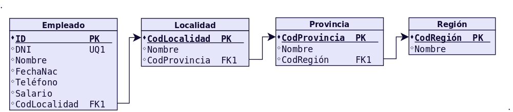

.. literalinclude:: scripts/E02.SQL
   :language: sql
  
Otra forma de crear la tabla EMPLEADO es ésta:

.. code-block:: sql

  CREATE TABLE EMPLEADO
  (
    ID           NUMBER(3),
    DNI          CHAR(9),
    NOMBRE       VARCHAR2(50),
    FECHANAC     DATE,
    TELEFONO     CHAR(9),
    SALARIO      NUMBER(6,2),
    CODLOCALIDAD NUMBER(5),
    PRIMARY KEY (ID),
    UNIQUE      (DNI),
    FOREIGN KEY (CODLOCALIDAD) REFERENCES LOCALIDAD(CODLOCALIDAD)
  );

3. Realiza el diseño físico para el siguiente modelo relacional. Asigna el tipo de datos que consideres más adecuado. Realiza el diseño sin poner nombres a las restricciones. Esquema E03, contraseña "E03".
++++++++++++++++++++++++++++++++++++++++++++++++++++++++++++++++++++++++++++++++++++++++++++++++++++++++++++++++++++++++++++++++++++++++++++++++++++++++++++++++++++++++++++++++++++++++++++++++++++++++++++++++++++++++

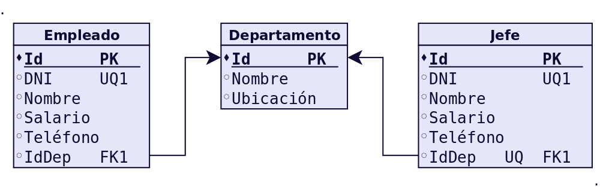

.. literalinclude:: scripts/E03.SQL
   :language: sql

La tabla JEFE podría haberse creado también de esta forma:

.. code-block:: sql

  CREATE TABLE JEFE
  (
    ID           NUMBER(3),
    DNI          CHAR(9),
    NOMBRE       VARCHAR2(50),
    SALARIO      NUMBER(6,2),
    TELEFONO     CHAR(9),
    IDDEP        NUMBER(5),
    PRIMARY KEY  (ID),
    UNIQUE       (DNI),  
    UNIQUE       (IDDEP),  
    FOREIGN KEY  (IDDEP) REFERENCES DEPARTAMENTO(ID)
  );

4. Realiza el diseño físico para el siguiente modelo relacional. Asigna el tipo de datos que consideres más adecuado. Realiza el diseño sin poner nombres a las restricciones. Esquema E04, contraseña "E04".
+++++++++++++++++++++++++++++++++++++++++++++++++++++++++++++++++++++++++++++++++++++++++++++++++++++++++++++++++++++++++++++++++++++++++++++++++++++++++++++++++++++++++++++++++++++++++++++++++++++++++++++++++++++++++

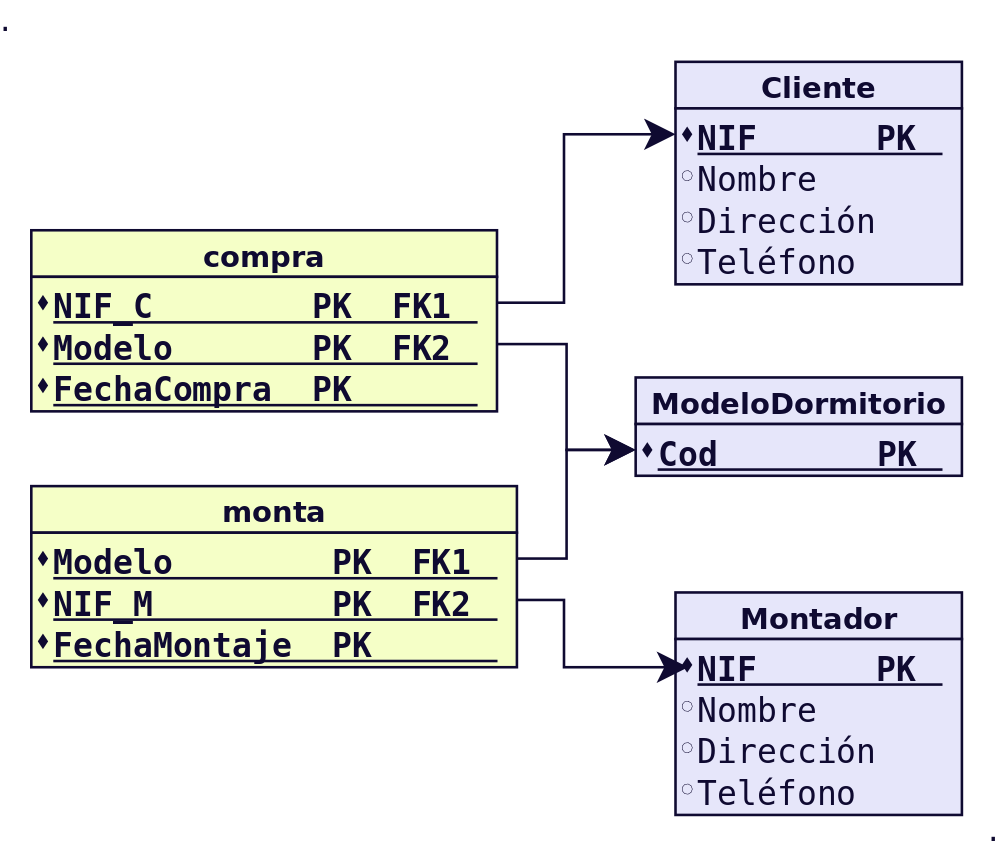

.. literalinclude:: scripts/E04.SQL
   :language: sql

5. Realiza el diseño físico para el siguiente modelo relacional. Asigna el tipo de datos que consideres más adecuado. Realiza el diseño poniendo nombres a las restricciones. Esquema E05, contraseña "E05".  
++++++++++++++++++++++++++++++++++++++++++++++++++++++++++++++++++++++++++++++++++++++++++++++++++++++++++++++++++++++++++++++++++++++++++++++++++++++++++++++++++++++++++++++++++++++++++++++++++++++++++++++++++++++++

No pueden ser nulos los siguientes campos: Nombre de Cliente, Marca y Modelo de Coche. Crear una secuencia para el Número de Reserva.

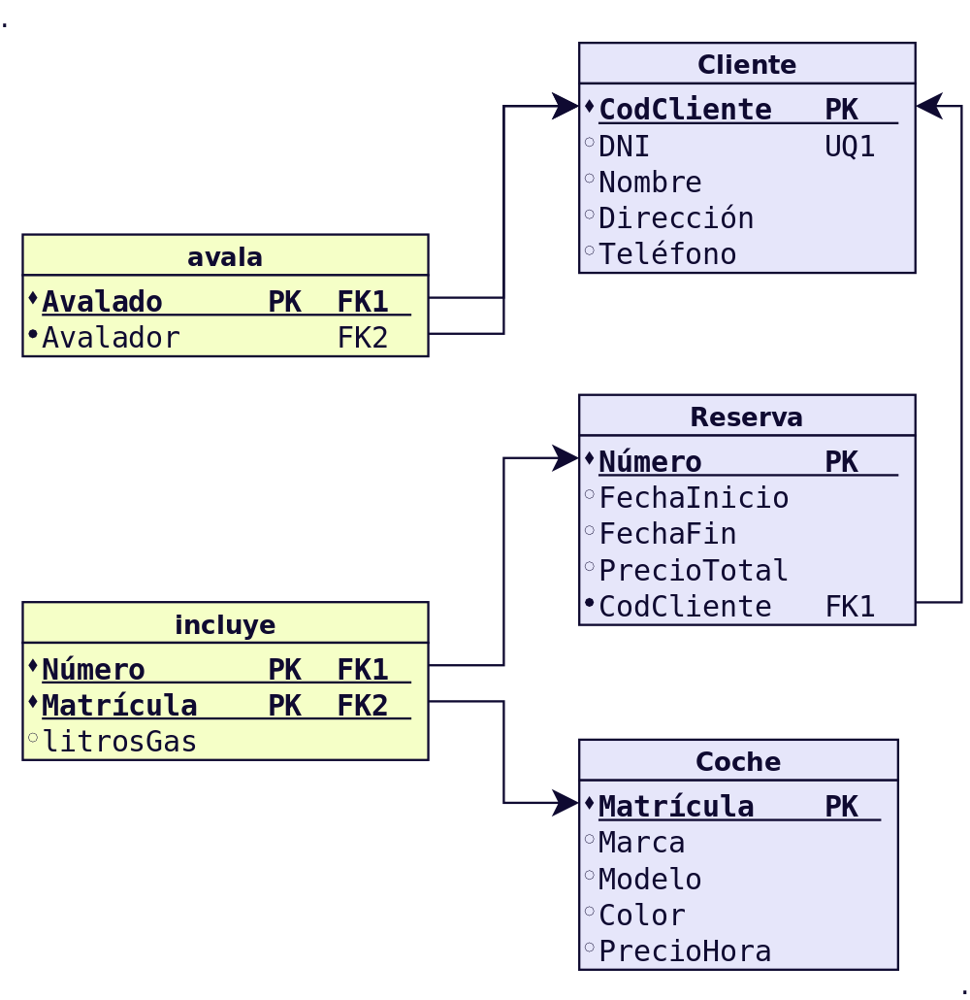

.. literalinclude:: scripts/E05.SQL
   :language: sql

Otra forma de crear las tablas AVALA e INCLUYE

.. code-block:: sql

  CREATE TABLE AVALA
  (
    AVALADO  CHAR(4) CONSTRAINT PK_AVALA PRIMARY KEY,
    AVALADOR CHAR(4),
    CONSTRAINT FK1_AVALA FOREIGN KEY(AVALADO) 
      REFERENCES CLIENTE(COD_CLIENTE),
    CONSTRAINT FK2_AVALA FOREIGN KEY(AVALADOR) 
      REFERENCES CLIENTE(COD_CLIENTE)
  );

  CREATE TABLE INCLUYE
  (
    NUMERO    NUMBER(4) CONSTRAINT FK1_INCLUYE 
      REFERENCES RESERVA(NUMERO),
    MATRICULA CHAR(7)   CONSTRAINT FK2_INCLUYE 
      REFERENCES COCHE(MATRICULA),
    LITROSGAS NUMBER,
    CONSTRAINT PK_INCLUYE PRIMARY KEY (NUMERO, MATRICULA)
  );

6. Realiza el diseño físico para el siguiente modelo relacional. Asigna el tipo de datos que consideres más adecuado. Realiza el diseño poniendo nombres a las restricciones. Esquema E06, contraseña "E06". 
++++++++++++++++++++++++++++++++++++++++++++++++++++++++++++++++++++++++++++++++++++++++++++++++++++++++++++++++++++++++++++++++++++++++++++++++++++++++++++++++++++++++++++++++++++++++++++++++++++++++++++++++++++++++

No pueden ser nulos los siguientes campos: Nombre de Empleado, Nombre de Periodista, Título de Revista. La Periodicidad toma uno de los siguientes valores: Semanal, Quincenal, Mensual, Trimestral o Anual, siendo el valor por defecto Mensual. NumPaginas debe ser mayor que 0.

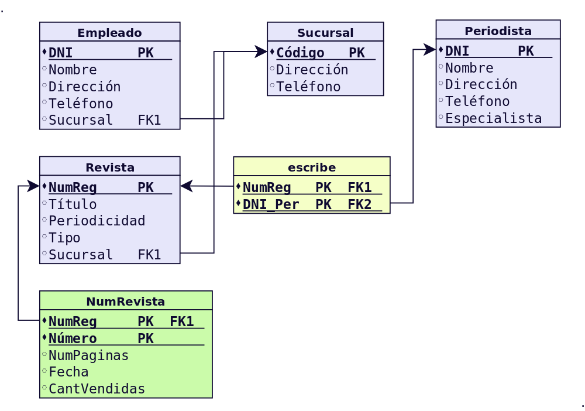

.. literalinclude:: scripts/E06.SQL
   :language: sql

7. Realiza el diseño físico para el siguiente modelo relacional. Asigna el tipo de datos que consideres más adecuado. Realiza el diseño poniendo nombres a las restricciones. Esquema E07, contraseña "E07". 
++++++++++++++++++++++++++++++++++++++++++++++++++++++++++++++++++++++++++++++++++++++++++++++++++++++++++++++++++++++++++++++++++++++++++++++++++++++++++++++++++++++++++++++++++++++++++++++++++++++++++++++++++++++++

No pueden ser nulos los siguientes campos: Nombre de Socio, Título de Película. Sexo toma los valores H o M. Por defecto si no se indica nada un actor o actriz no es Protagonista (este campo toma valores S o N). FechaDevolución debe ser mayor que FechaAlquiler.

.. image:: images/tema3-041.png

.. literalinclude:: scripts/E07.SQL
   :language: sql

8. Realiza el diseño físico para el siguiente modelo relacional. Asigna el tipo de datos que consideres más adecuado. Realiza el diseño poniendo nombres a las restricciones. Esquema E08, contraseña "E08". 
++++++++++++++++++++++++++++++++++++++++++++++++++++++++++++++++++++++++++++++++++++++++++++++++++++++++++++++++++++++++++++++++++++++++++++++++++++++++++++++++++++++++++++++++++++++++++++++++++++++++++++++++++++++++

No pueden ser nulos los siguientes campos: Nombre de Persona, NombreVía, Número de Vivienda, Nombre de Municipio. Sexo toma los valores H o M. Por defecto si no se indica nada el TipoVia es Calle.

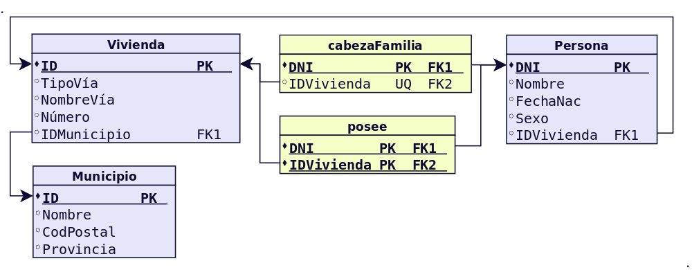

.. literalinclude:: scripts/E08.SQL
   :language: sql

9. Realiza el diseño físico para el siguiente modelo relacional. Asigna el tipo de datos que consideres más adecuado. Realiza el diseño sin poner nombres a las restricciones. Esquema E09, contraseña "E09".
++++++++++++++++++++++++++++++++++++++++++++++++++++++++++++++++++++++++++++++++++++++++++++++++++++++++++++++++++++++++++++++++++++++++++++++++++++++++++++++++++++++++++++++++++++++++++++++++++++++++++++++++++++++++

Crea las tablas sin restricciones y añádelas después con el comando ALTER TABLE. Crea índices para los siguientes campos: Nombre de Sucursal, Nombre de Cliente. También para  Localidad de Cliente, Localidad de Sucursal. Crea una secuencia que inicie en 1 para CodSucursal.

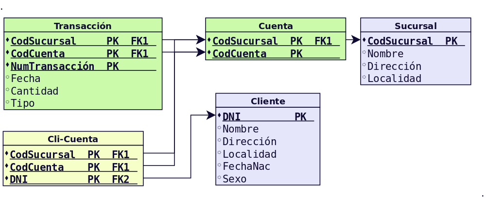

.. literalinclude:: scripts/E09.SQL
   :language: sql

10. Realiza el diseño físico para el siguiente modelo relacional. Asigna el tipo de datos que consideres más adecuado. Realiza el diseño sin poner nombres a las restricciones. Esquema E10, contraseña "E10".
++++++++++++++++++++++++++++++++++++++++++++++++++++++++++++++++++++++++++++++++++++++++++++++++++++++++++++++++++++++++++++++++++++++++++++++++++++++++++++++++++++++++++++++++++++++++++++++++++++++++++++++++++++++++

Crea las tablas sin restricciones y añádelas después con el comando ALTER TABLE.  Crea secuencias que inicien en 1 para:  NumCliente, NumArtículo, NumFabrica y NumPedido.

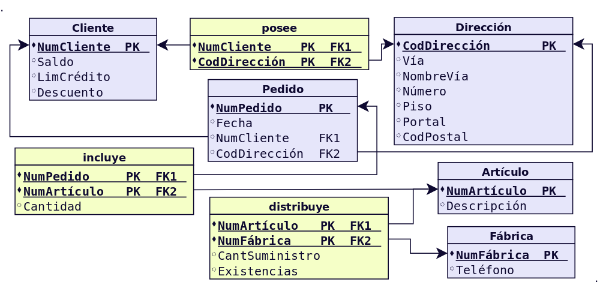

.. literalinclude:: scripts/E10.SQL
   :language: sql

11. Realiza el diseño físico para el siguiente modelo relacional. Asigna el tipo de datos que consideres más adecuado. Realiza el diseño sin poner nombres a las restricciones. Esquema E11, contraseña "E11".  
++++++++++++++++++++++++++++++++++++++++++++++++++++++++++++++++++++++++++++++++++++++++++++++++++++++++++++++++++++++++++++++++++++++++++++++++++++++++++++++++++++++++++++++++++++++++++++++++++++++++++++++++++++++++

Crea las tablas sin restricciones y añádelas después con el comando ALTER TABLE.  Crea índices para los siguientes campos: Nombre de Cliente, Nombre de Categoría, Nombre de Proveedor, Ciudad de Cliente. Crea una secuencia para IDVenta.

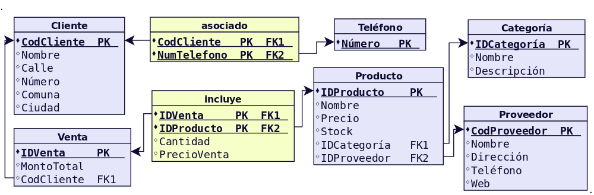

.. literalinclude:: scripts/E11.SQL
   :language: sql

12. Realiza el diseño físico para el siguiente modelo relacional. Asigna el tipo de datos que consideres más adecuado. Realiza el diseño sin poner nombres a las restricciones. Esquema E12, contraseña "E12".
++++++++++++++++++++++++++++++++++++++++++++++++++++++++++++++++++++++++++++++++++++++++++++++++++++++++++++++++++++++++++++++++++++++++++++++++++++++++++++++++++++++++++++++++++++++++++++++++++++++++++++++++++++++++

Crea las tablas sin restricciones y añádelas después con el comando ALTER TABLE. Crea índices para los siguientes campos: Apellidos de Empleado, Lugar de Edición, Horario de Edición.  Para el indicar si un prerrequisito es obligatorio o no utilizamos ‘S’ o ‘N’.

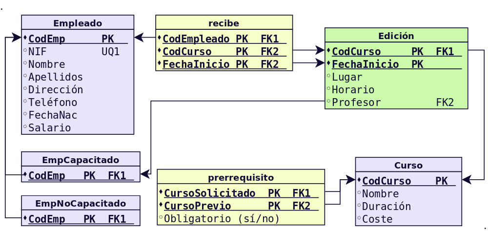

.. literalinclude:: scripts/E12.SQL
   :language: sql

13. Realiza el diseño físico para el siguiente modelo relacional. Asigna el tipo de datos que consideres más adecuado. Realiza el diseño sin poner nombres a las restricciones. Esquema E13, contraseña "E13".
++++++++++++++++++++++++++++++++++++++++++++++++++++++++++++++++++++++++++++++++++++++++++++++++++++++++++++++++++++++++++++++++++++++++++++++++++++++++++++++++++++++++++++++++++++++++++++++++++++++++++++++++++++++++

Crea las tablas sin restricciones y añádelas después con el comando ALTER TABLE. Crea una secuencia para IDCuenta, otra para IDNomina y otra para LineaNum.

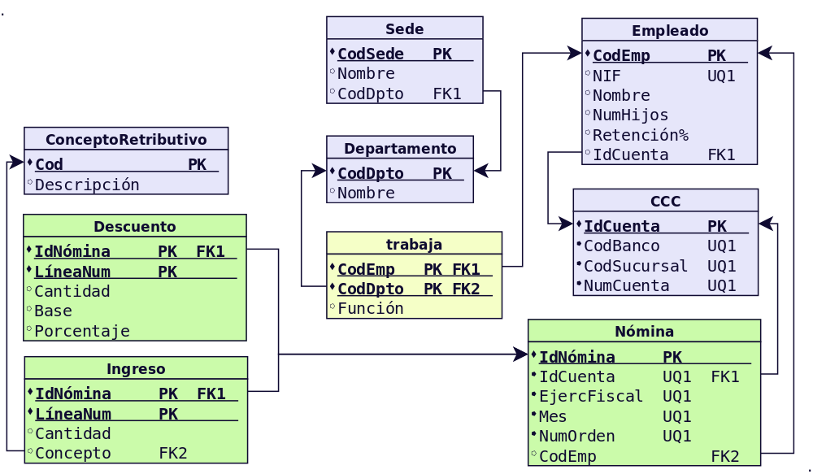

.. literalinclude:: scripts/E13.SQL
   :language: sql

14. Realiza el diseño físico para el siguiente modelo relacional. Asigna el tipo de datos que consideres más adecuado. Realiza el diseño sin poner nombres a las restricciones. Esquema E14, contraseña "E14".  
++++++++++++++++++++++++++++++++++++++++++++++++++++++++++++++++++++++++++++++++++++++++++++++++++++++++++++++++++++++++++++++++++++++++++++++++++++++++++++++++++++++++++++++++++++++++++++++++++++++++++++++++++++++++

Crea las tablas sin restricciones y añádelas después con el comando ALTER TABLE.

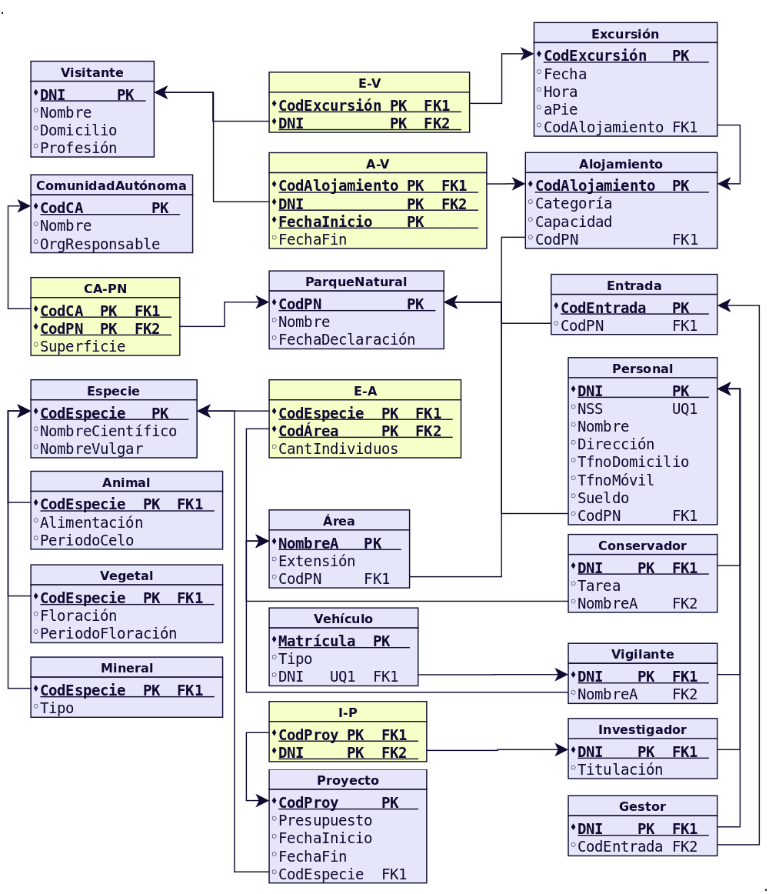

.. literalinclude:: scripts/E14.SQL
   :language: sql

Cuestiones (III)
-------------------

1. Nombra los distintos tipos de instrucciones DDL que puede haber, distinguiendo el tipo de objeto que se puede crear, borrar o modificar.
++++++++++++++++++++++++++++++++++++++++++++++++++++++++++++++++++++++++++++++++++++++++++++++++++++++++++++++++++++++++++++++++++++++++++++++++

.. code-block:: sql

                DATABASE

                USER
  CREATE
                TABLE
  DROP                                nombre ... ;
                VIEW
  ALTER
                SEQUENCE

                INDEX

                SYNONYM
                

2. Realiza un esquema resumen de las cláusulas SQL utilizadas en la modificación de tablas. 
++++++++++++++++++++++++++++++++++++++++++++++++++++++++++++++++++++++++++++++++++++++++++++++++

- **Eliminar todo el contenido**

.. code-block:: sql
   
   TRUNCATE TABLE tabla;

- **Renombar tabla**

.. code-block:: sql
   
   RENAME tabla TO tabla2;

- **Añadir/Borrar/Modificar campos**

.. code-block:: sql
   
   ALTER TABLE tabla  
   ADD/MODIFY (campo tipo restricciones, campo tipo restricciones, ...);
   
   ALTER TABLE tabla 
   DROP (campo, campo, ...) [CASCADE CONSTRAINTS];  

- **Añadir/Borrar/Modificar restricciones**

.. code-block:: sql

   ALTER TABLE tabla  
   ADD/MODIFY CONSTRAINT nombre_restriccion ...;
   
   ALTER TABLE tabla 
   DROP CONSTRAINT nombre_restriccion [CASCADE]; 
   
   ALTER TABLE tabla 
   RENAME CONSTRAINT nombre_restriccion TO nuevo_nombre;  
   
   ALTER TABLE tabla  
   ENABLE/DISABLE CONSTRAINT nombre_restriccion ...;

3. Desde SQLPlus crea un esquema (usuario) llamado TIENDAS con contraseña TIENDAS. Concédele los roles CONNECT y RESOURCE. Accede con dicho usuario/contraseña.
++++++++++++++++++++++++++++++++++++++++++++++++++++++++++++++++++++++++++++++++++++++++++++++++++++++++++++++++++++++++++++++++++++++++++++++++++++++++++++++++++++

.. code-block:: sql

  CHCP 1252
  sqlplus / as sysdba
  ...
  SQL> create user TIENDAS identified by "TIENDAS";
  User created.
  SQL> grant connect,resource to TIENDAS;
  Grant succeeded.
  SQL> connect TIENDAS/TIENDAS;
  Connected.

4. Crear las siguientes tablas de acuerdo con las restricciones que se mencionan:
++++++++++++++++++++++++++++++++++++++++++++++++++++++++++++++++++++++++++++++++++++++++++++++++++++++++++++++++++++

.. csv-table:: TIENDAS
  :header: Columna, Tipo de dato

  NIF, VARCHAR2(10)
  NOMBRE, VARCHAR2(20)
  DIRECCION, VARCHAR2(20)
  POBLACION, VARCHAR2(20)
  PROVINCIA, VARCHAR2(20)
  CODPOSTAL, NUMBER(5)

Crear tabla sin restricciones. Después añadir las siguientes restricciones:

-  La clave primaria es NIF.
- PROVINCIA ha de almacenarse en mayúscula.
- Cambia la longitud de NOMBRE a 30 caracteres y no nulo.

.. csv-table:: FABRICANTES
  :header: Columna, Tipo de dato

  COD_FABRICANTE, NUMBER(3)
  NOMBRE, VARCHAR2(15)
  PAIS, VARCHAR2(15)

Restricciones:

- La clave primaria es COD_FABRICANTE.
- Las columnas NOMBRE y PAIS han de almacenarse en mayúscula.

.. csv-table:: ARTICULOS
   :header: Columna, Tipo de dato

   ARTICULO, VARCHAR2(20)
   COD_FABRICANTE, NUMBER(3)
   PESO, NUMBER(3)
   CATEGORIA, VARCHAR2(10)
   PRECIO_VENTA, NUMBER(6,2)
   PRECIO_COSTO, NUMBER(6,2)
   EXISTENCIAS, NUMBER(5)

Restricciones:

- La clave primaria está formada por las columnas:  ARTICULO, COD_FABRICANTE, PESO y CATEGORIA.
- COD_FABRICANTE es clave ajena que referencia a la tabla FABRICANTES.
- PRECIO_VENTA, PRECIO_COSTO y PESO han de ser > 0.
- CATEGORIA ha de ser ‘Primera’, ‘Segunda’ o ‘Tercera’.

.. csv-table:: VENTAS
   :header: Columna, Tipo de dato

   NIF, VARCHAR2(10)
   ARTICULO, VARCHAR2(20)
   COD_FABRICANTE, NUMBER(3)
   PESO, NUMBER(3)
   CATEGORIA, VARCHAR2(10)
   FECHA_VENTA, DATE
   UNIDADES_VENDIDAS, NUMBER(4)

Restricciones:

- La clave primaria está formada por las columnas:  NIF, ARTICULO, COD_FABRICANTE, PESO, CATEGORIA y FECHA_VENTA.
- NIF es clave ajena que referencia a la tabla TIENDAS.
- ARTICULO, COD_FABRICANTE, PESO y CATEGORIA es clave ajena que referencia a la tablas ARTICULOS.
- UNIDADES_VENDIDAS han de ser > 0.
- CATEGORIA  ha de ser ‘Primera’, ‘Segunda’ o ‘Tercera’. 

.. csv-table:: PEDIDOS
   :header: Columna, Tipo de dato

   NIF, VARCHAR2(10)
   ARTICULO, VARCHAR2(20)
   COD_FABRICANTE, NUMBER(3)
   PESO, NUMBER(3)
   CATEGORIA, VARCHAR2(10)
   FECHA_PEDIDO, DATE
   UNIDADES_PEDIDAS, NUMBER(4)
   EXISTENCIAS, NUMBER(5)

Restricciones:

- La clave primaria está formada por las columnas:  NIF, ARTICULO, COD_FABRICANTE, PESO, CATEGORIA y FECHA_PEDIDO.
- NIF es clave ajena que referencia a la tabla TIENDAS.
- ARTICULO, COD_FABRICANTE, PESO y CATEGORIA es clave ajena que referencia a la tablas ARTICULOS.
- UNIDADES_PEDIDAS han de ser > 0.
- CATEGORIA ha de ser ‘Primera’, ‘Segunda’ o ‘Tercera’. 

.. code-block:: sql

  -- Tabla TIENDAS
  CREATE TABLE TIENDAS
  (
    NIF        VARCHAR2 (10),
    NOMBRE     VARCHAR2 (20),
    DIRECCION  VARCHAR2 (20),
    POBLACION  VARCHAR2 (20),
    PROVINCIA  VARCHAR2(20),
    CODPOSTAL  NUMBER (5)
  );

  ALTER TABLE TIENDAS
  ADD CONSTRAINT PK_ELNIF PRIMARY KEY (NIF);

  ALTER TABLE TIENDAS
  ADD CONSTRAINT MAYUSCU CHECK (PROVINCIA = UPPER (PROVINCIA));

  ALTER TABLE TIENDAS
  MODIFY (NOMBRE VARCHAR2 (30) NOT NULL);

  -- Tabla FABRICANTES
  CREATE TABLE FABRICANTES
  (
    COD_FABRICANTE  NUMBER (3) ,
    NOMBRE          VARCHAR2 (15) ,
    PAIS            VARCHAR2 (15) ,
    CONSTRAINT CODFAB_PK PRIMARY KEY (COD_FABRICANTE),
    CONSTRAINT NOMBRE_MAYUSCULA CHECK (NOMBRE = UPPER(NOMBRE)),
    CONSTRAINT PAIS_MAYUSCULAS CHECK (PAIS = UPPER (PAIS))
  );

  -- Tabla ARTICULOS
  CREATE TABLE ARTICULOS
  (
    ARTICULO        VARCHAR2 (20),
    COD_FABRICANTE  NUMBER (3),
    PESO            NUMBER (3),
    CATEGORIA       VARCHAR2 (10),
    PRECIO_VENTA    NUMBER (6,2),
    PRECIO_COSTO    NUMBER (6,2),
    EXISTENCIAS     NUMBER (5),
    CONSTRAINT FK_CODFAB FOREIGN KEY (COD_FABRICANTE) 
      REFERENCES FABRICANTES ON DELETE CASCADE,
    CONSTRAINT PK_CLAVEP 
      PRIMARY KEY (ARTICULO, COD_FABRICANTE, PESO,  CATEGORIA),
    CONSTRAINT MAYORQUE0 
      CHECK (PRECIO_VENTA > 0 AND PRECIO_COSTO > 0 AND PESO > 0),
    CONSTRAINT CATEGORI 
      CHECK (CATEGORIA IN ('PRIMERA', 'SEGUNDA', 'TERCERA'))
  );

  -- Tabla VENTAS
  CREATE TABLE VENTAS
  (
    NIF                VARCHAR2 (10),
    ARTICULO           VARCHAR2 (20),
    COD_FABRICANTE     NUMBER (3),
    PESO               NUMBER (3),
    CATEGORIA          VARCHAR2 (10),
    FECHA_VENTA        DATE,
    UNIDADES_VENDIDAS  NUMBER (4),
    CONSTRAINT PK_CLAVEPV PRIMARY KEY 
      (NIF, ARTICULO, COD_FABRICANTE, PESO, CATEGORIA,FECHA_VENTA),
    CONSTRAINT VENDIDAS_MAY0 CHECK (UNIDADES_VENDIDAS >0),
    CONSTRAINT CATEGORIV 
      CHECK (CATEGORIA IN ('PRIMERA', 'SEGUNDA', 'TERCERA')),
    CONSTRAINT FK_CLAVEAJEV 
      FOREIGN KEY (ARTICULO, COD_FABRICANTE, PESO, CATEGORIA)
      REFERENCES ARTICULOS ON DELETE CASCADE,
    CONSTRAINT FK_NIFV FOREIGN KEY (NIF) 
      REFERENCES TIENDAS ON DELETE CASCADE
  );

  -- Tabla PEDIDOS
  CREATE TABLE PEDIDOS
  (
    NIF               VARCHAR2 (10),
    ARTICULO          VARCHAR2 (20),
    COD_FABRICANTE    NUMBER (3),
    PESO              NUMBER (3),
    CATEGORIA         VARCHAR2 (10),
    FECHA_PEDIDO      DATE,
    UNIDADES_PEDIDAS  NUMBER (4),
    EXISTENCIAS       NUMBER (5),
    CONSTRAINT PK_CLAVEPP PRIMARY KEY 
      (NIF, ARTICULO, COD_FABRICANTE, PESO, CATEGORIA,FECHA_PEDIDO),
    CONSTRAINT FK_CLAVENIFP FOREIGN KEY (NIF) 
      REFERENCES TIENDAS ON DELETE CASCADE,
    CONSTRAINT FK_CLAVEAJEP 
      FOREIGN KEY (ARTICULO, COD_FABRICANTE, PESO, CATEGORIA)
      REFERENCES ARTICULOS ON DELETE CASCADE,
    CONSTRAINT CATEGORIP 
      CHECK (CATEGORIA IN ('PRIMERA', 'SEGUNDA', 'TERCERA'))
  );

5. Añadir una restricción a la tabla TIENDAS para que el NOMBRE de la tienda sea de tipo título (InitCap).
++++++++++++++++++++++++++++++++++++++++++++++++++++++++++++++++++++++++++++++++++++++++++++++++++++++++++++++++++++

.. code-block:: sql

  ALTER TABLE TIENDAS
  ADD CONSTRAINT NOMBRETIENDAMAY CHECK (NOMBRE = INITCAP (NOMBRE));

  INSERT INTO TIENDAS
  VALUES (16789654, 'romero', 'Valderejo 5', 'VIZCAYA', 'EREMUA', 56342);

6. Visualizar las CONSTRAINTS definidas para las tablas anteriores.
++++++++++++++++++++++++++++++++++++++++++++++++++++++++++++++++++++++++++++++++++++++++++++++++++++++++++++++++++++

.. code-block:: sql

  SELECT CONSTRAINT_NAME, COLUMN_NAME FROM USER_CONS_COLUMNS WHERE TABLE_NAME = 'TIENDAS';

7. Modificar las columnas de las tablas PEDIDOS y VENTAS para que las UNIDADES_VENDIDAS y las UNIDADES_PEDIDAS puedan almacenar cantidades numéricas de 6 dígitos.
+++++++++++++++++++++++++++++++++++++++++++++++++++++++++++++++++++++++++++++++++++++++++++++++++++++++++++++++++++++++++++++++++++++++++++++++++++++++++++++++++++++++++

.. code-block:: sql

  ALTER TABLE PEDIDOS
  MODIFY (UNIDADES_PEDIDAS NUMBER (6));

  ALTER TABLE VENTAS
  MODIFY (UNIDADES_VENDIDAS NUMBER (6));

8. Impedir que se den de alta más tiendas en la provincia de 'TOLEDO'.
++++++++++++++++++++++++++++++++++++++++++++++++++++++++++++++++++++++++++++++++++++++++++++++++++++++++++++++++++++

.. code-block:: sql

  ALTER TABLE TIENDAS
  ADD CONSTRAINT PROVNOTOLEDO CHECK (PROVINCIA != 'TOLEDO');

9. Añadir a las tablas PEDIDOS y VENTAS una nueva columna para que almacenen el PVP del artículo.
++++++++++++++++++++++++++++++++++++++++++++++++++++++++++++++++++++++++++++++++++++++++++++++++++++++++++++++++++++

.. code-block:: sql

  ALTER TABLE PEDIDOS ADD (PVP NUMBER (9));

  ALTER TABLE VENTAS  ADD (PVP NUMBER (9));

10. Crear una vista que se llame CONSERJES que contenga el nombre del centro y el nombre de sus conserjes.
++++++++++++++++++++++++++++++++++++++++++++++++++++++++++++++++++++++++++++++++++++++++++++++++++++++++++++++++++++

.. code-block:: sql

  CREATE VIEW CONSERJES(CENTRO, NOMBRE_CONSERJE)
  AS SELECT C.NOMBRE, P.APELLIDOS FROM CENTROS C, PERSONAL P
  WHERE C.COD_CENTRO = P.COD_CENTRO AND P.FUNCION = 'CONSERJE';

11. Crear un sinónimo llamado CONSER asociado a la vista creada antes.
++++++++++++++++++++++++++++++++++++++++++++++++++++++++++++++++++++++++++++++++++++++++++++++++++++++++++++++++++++

.. code-block:: sql

  CREATE SYNONYM CONSER FOR CONSERJES;

12. Añadir a la tabla PROFESORES una columna llamada COD_ASIG con dos posiciones numéricas.
++++++++++++++++++++++++++++++++++++++++++++++++++++++++++++++++++++++++++++++++++++++++++++++++++++++++++++++++++++

.. code-block:: sql

  ALTER TABLE PROFESORES ADD (COD_ASIG NUMBER (2));

13. Crear la tabla TASIG con las siguientes columnas: COD_ASIG numérico, 2 posiciones y NOM_ASIG cadena de 20 caracteres.
+++++++++++++++++++++++++++++++++++++++++++++++++++++++++++++++++++++++++++++++++++++++++++++++++++++++++++++++++++++++++++++++++

.. code-block:: sql

  CREATE TABLE TASIG
  (
    NOM_ASIG VARCHAR2 (20),
    COD_ASIG NUMBER (2)
  );

14. Añadir la restricción de clave primaria a la columna COD_ASIG de la tabla TASIG.
++++++++++++++++++++++++++++++++++++++++++++++++++++++++++++++++++++++++++++++++++++++++++++++++++++++++++++++++++++

.. code-block:: sql

  ALTER TABLE TASIG
  ADD CONSTRAINT PK_CODASIG PRIMARY KEY (COD_ASIG);

15. Añadir la restricción de clave ajena a la columna COD_ASIG de la tabla PROFESORES.
++++++++++++++++++++++++++++++++++++++++++++++++++++++++++++++++++++++++++++++++++++++++++++++++++++++++++++++++++++

.. code-block:: sql

  ALTER TABLE PROFESORES
  ADD CONSTRAINT FK_CODASIG FOREIGN KEY (COD_ASIG)
  REFERENCES TASIG ON DELETE CASCADE;

Se pone ON DELETE CASCADE si queremos que se borre en las dos al actualizar.
Visualizar los nombres de CONSTRAINTS y las columnas afectadas para las tablas TASIG y PROFESORES.

16. Cambiar de nombre la tabla PROFESORES y llamarla PROFES.
++++++++++++++++++++++++++++++++++++++++++++++++++++++++++++++++++++++++++++++++++++++++++++++++++++++++++++++++++++

.. code-block:: sql

  RENAME PROFESORES TO PROFES;

17. Borrar la tabla TASIG.
++++++++++++++++++++++++++++++++++++++++++++++++++++++++++++++++++++++++++++++++++++++++++++++++++++++++++++++++++++

.. code-block:: sql

  DROP TABLE TASIG;

18. Devolver la tabla PROFESORES a su situación inicial.
++++++++++++++++++++++++++++++++++++++++++++++++++++++++++++++++++++++++++++++++++++++++++++++++++++++++++++++++++++

.. code-block:: sql

  RENAME PROFES TO PROFESORES;

Prácticas
------------

PRÁCTICA 1
+++++++++++

.. admonition:: PLANTEAMIENTO

   OBJETIVOS:  Realizar el diseño físico de bases de datos utilizando asistentes, herramientas gráficas y el lenguaje de definición de datos.

   ENUNCIADO: Dado el siguiente esquema E/R:

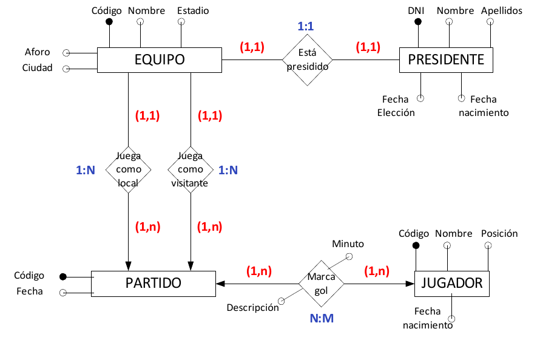

a) Obtén el esquema relacional correspondiente.

b) Comprueba que está en 3FN.

  Todas las tablas están en 3FN puesto que cumplen:
  
  - 1FN: Todos los campos toman valores atómicos.
  - 2FN: Todos los atributos no clave dependen funcionalmente de forma completa de su clave primaria.
  - 3FN: No existen atributos con dependencias funcionales transitivas.

c) Crea las tablas en ORACLE procurando que las columnas tengan el tipo y tamaño adecuado y con las siguientes restricciones:

  1. El Color de los coches es verde, rojo o azul.
  2. La matrícula está formada por cuatro números y tres letras.
  3. Los DNI terminan en letra.
  4. Las Horas de mano de obra de una operación nunca pasan de 10.
  5. Señala todas las claves primarias, ajenas y candidatas.
  6. La cantidad de Piezas por Operación por defecto es 1.
  7. La marca y modelo del coche no pueden dejarse en blanco.
  8. Los teléfonos empiezan por 6 o por 9.
  9. El precio de un coche está entre 10000 y 40000.

.. literalinclude:: scripts/P31.SQL
   :language: sql

PRÁCTICA 2
+++++++++++

.. admonition:: PLANTEAMIENTO

   OBJETIVO: Realizar el diseño físico de bases de datos utilizando asistentes, herramientas gráficas y el lenguaje de definición de datos.

   ENUNCIADO: Dado el siguiente esquema E/R:

.. image:: images/tema3-050.png

a) Obtén el esquema relacional correspondiente.

b) Comprueba que está en 3FN.

  Todas las tablas están en 3FN puesto que cumplen:
  
  - 1FN: Todos los campos toman valores atómicos.
  - 2FN: Todos los atributos no clave dependen funcionalmente de forma completa de su clave primaria.
  - 3FN: No existen atributos con dependencias funcionales transitivas.

c) Crea las tablas en ORACLE procurando que las columnas tengan el tipo y tamaño adecuado y con las siguientes restricciones:

  1. Todas las claves primarias, ajenas y candidatas.
  2. No hay partidos en verano (desde el 21/06 al 21/09)
  3. Los partidos no pueden durar más de 100 minutos incluyendo el descuento.
  4. La posición de un jugador puede ser Portero, Defensa, Centrocampista o Delantero.
  5. Los jugadores han de tener como mínimo 16 años en el momento en que se dan de alta en la base de datos. 
  6. Si no se sabe el aforo de un estadio, se guardará un 0 por defecto.
  7. La fecha de un partido es un campo obligatorio.
  8. Un partido se juega entre un EquipoLocal y EquipoVisitante (no pueden ser el mismo equipo.

d) Una vez creadas las tablas:

  1. Añade una columna NumTitulos a la tabla Equipos.
  2. Elimina la columna Ciudad.
  3. Añade la restricción: Todos los equipos se han fundado después del año1890.
  4. Añade la restricción: La hora de comienzo de los partidos estará entre las 12:00 y las 22:00 horas.

.. literalinclude:: scripts/P32.SQL
   :language: sql

PRÁCTICA 3
+++++++++++

.. admonition:: PLANTEAMIENTO

   OBJETIVO: Realizar el diseño físico de bases de datos utilizando asistentes, herramientas gráficas y el lenguaje de definición de datos.

   ENUNCIADO: Dado el siguiente esquema relacional crear en Oracle el modelo físico, asignando nombre a las restricciones.

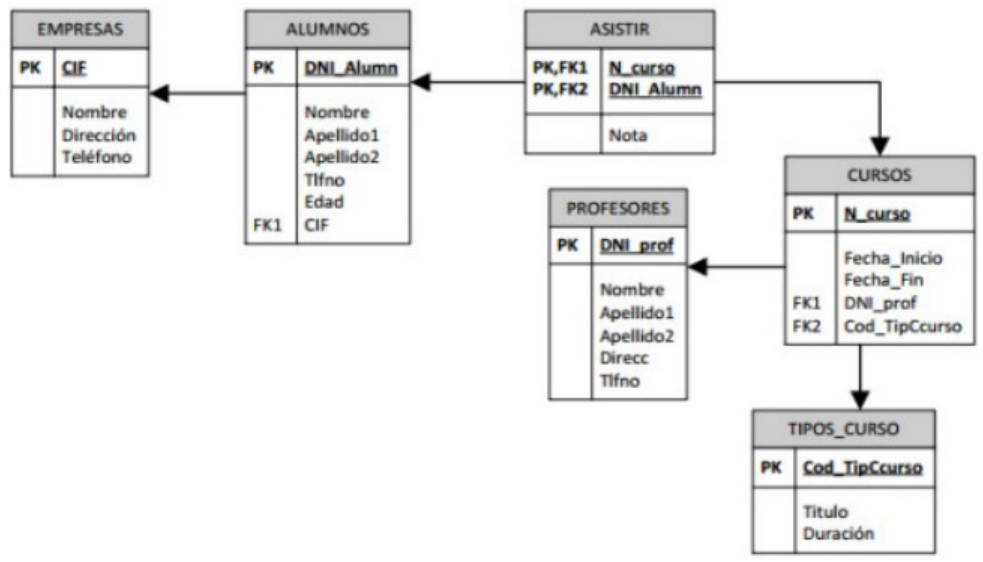

.. literalinclude:: scripts/P33.SQL
   :language: sql
