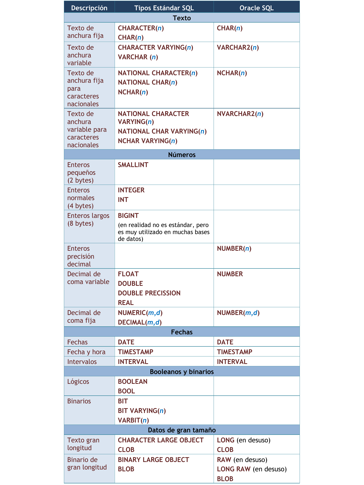

INTRODUCCIÓN
=============

En la fase de análisis hemos realizado la E.R.S. A partir de dicha especificación de requisitos, en la unidad anterior, aprendimos a realizar el diseño conceptual de una BD mediante el Modelo E/R y el Modelo E/R extendido respectivamente.

También vimos como hacer el modelo lógico mediante el modelo relacional que se obtenía a partir del modelo E/R y 
aprendimos a comprobar que dicho modelo estaba normalizado.

Siguiendo con el proceso de desarrollo, lo que debemos hacer ahora es pasar al diseño  físico de la BD. Es decir, implementar la Base de Datos. Para ello, se programarán las diferentes tablas que constituirán la Base de Datos, se introducirán los datos y, más adelante, se construirán las consultas. Todo ello se hará programando en el lenguaje más extendido para la definición y manipulación de datos en SGBDR: **SQL**.

Las prácticas del módulo de Gestión Bases de Datos se van a realizar utilizando el **Sistema de Gestión de Bases de Datos Relacional (RDBMS) ORACLE**. Varias son las razones que justifican la impartición de estas prácticas utilizando ORACLE:

- En primer lugar, ORACLE es un producto comercial ampliamente extendido y utilizado, que cuenta con una importante cuota de mercado dentro del mundo de las bases de datos, estando disponible para prácticamente la totalidad de plataformas posibles (Windows, MAC, UNIX, LINUX, ...) con la ventaja de que las aplicaciones realizadas para una plataforma concreta pueden ser portadas de forma automática a cualquiera de las otras plataformas.
- ORACLE permite almacenar y manejar gran cantidad de información de forma rápida y segura, destacando además su valor educativo, ya que la herramienta que utiliza ORACLE para acceder a la base de datos es el lenguaje no procedural SQL, y este lenguaje implementa prácticamente toda la funcionalidad y características del modelo relacional teórico.

EL LENGUAJE SQL
==================

Historia
---------

El nacimiento del lenguaje SQL data de 1970 cuando E. F. Codd publica su libro: "Un modelo de datos relacional para grandes bancos de datos compartidos". Ese libro dictaría las direcrices de las bases de datos relacionales. Apenas dos años después IBM (para quien trabajaba Codd) utiliza las directrices de Codd para crear el Standard English Query Language (Lenguaje Estándar Inglés para Consultas) al que se le llamó SEQUEL. Más adelante se le asignaron las siglas SQL (Standard Query Language, lenguaje estándar de consulta) aunque en inglés se siguen pronunciando secuel. En español se pronuncia esecuele.

En 1979 Oracle presenta la primera implementación comercial del lenguaje. Poco después se convertía en un estándar en el mundo de las bases de datos avalado por los organismos ISO y ANSI. En el año 1986 se toma como lenguaje estándar por ANSI de los SGBD relacionales. Un año después lo adopta ISO, lo que convierte a SQL en estándar mundial como lenguaje de bases de datos relacionales.

En 1989 aparece el estándar ISO (y ANSI) llamado SQL89 o SQL1. En 1992 aparece la nueva versión estándar de SQL (a día de hoy sigue siendo la más conocida) llamada SQL92. En 1999 se aprueba un nuevo SQL estándar que incorpora mejoras que incluyen triggers, procedimientos, funciones,... y otras características de las bases de datos objeto-relacionales; dicho estándar se conoce como SQL99. El último estándar es el del año 2011 (SQL2011)
Elementos de SQL

SQL se basa en la Teoría Matemática del Álgebra Relacional. El lenguaje SQL consta de varios elementos:

- **Lenguaje de definición de datos (DDL)**: proporciona órdenes para definir, modificar o eliminar los distintos objetos de la base de datos (tablas, vistas, índices...).
- **Lenguaje de Manipulación de Datos (DML)**: proporciona órdenes para insertar, suprimir y modificar registros o filas de las tablas. También contempla la realización de consultas sobre la BD.
- **Lenguaje de Control de Datos (DCL)**: permite establecer derechos de acceso de los usuarios sobre los distintos objetos de la base de datos. Lo forman las instrucciones **GRANT** y **REVOKE**.
- Oracle contempla además **sentencias para transacciones**. Administran las modificaciones creadas por las instrucciones DML. Lo forman las instrucciones **ROLLBACK**, **COMMIT** y **SAVEPOINT**.

Proceso de ejecución de sentencia SQL
--------------------------------------

El proceso de una instrucción SQL es el siguiente:

1)  Se analiza la instrucción. Para comprobar la sintaxis de la misma
2)  Si es correcta se valora si los metadatos de la misma son correctos. Se comprueba esto en el diccionario de datos.
3)  Si es correcta, se optimiza, a fin de consumir los mínimos recursos posibles.
4)  Se ejecuta la sentencia y se muestra el resultado al emisor de la misma.

Criterios de notación 
----------------------

La notación utilizada para la especificación de los comandos de SQL es la siguiente:

.. admonition:: CRITERIOS DE NOTACIÓN

	- Palabras clave de la sintaxis SQL en MAYÚSCULAS.
	- Los corchetes [ ] indican opcionalidad.
	- Las llaves {} delimitan alternativas separadas por | de las que se debe elegir una.
	- Los puntos suspensivos ... indican repetición varias veces de la opción anterior.

Normas de escritura
--------------------

En SQL no se distingue entre mayúsculas y minúsculas. Da lo mismo como se escriba. El final de una instrucción o sentencia lo marca el signo de punto y coma. 

Las sentencias SQL (SELECT, INSERT, ...) se pueden escribir en varias líneas siempre que las palabras no sean partidas. 
Los comentarios en el código SQL pueden ser de 2 tipos:

- de bloque: comienzan por /\* y terminan por \*/ 
- de línea:  comienzan por --  y terminan en final de línea

Ejemplos:

.. code-block:: plpgsql

	/*
	  Esto es un comentario
	  de varias líneas.

	  Fin.
	*/

	-- Esto es un comentario de una línea

LENGUAJE DE DEFINICIÓN DE DATOS: DDL
========================================

Tipos de datos y conversión entre tipos
----------------------------------------

Los tipos de datos principales de ORACLE son los siguientes:

- **CHAR(n)**

	Cadena de caracteres de longitud fija. Se puede especificar el número de caracteres que tendrá (n).

- **VARCHAR2(n)**

	Cadena de caracteres de longitud variable. Se debe especificar el número de caracteres que tendrá (n).

- **NUMBER(n)**

	Dato de tipo numérico de un máximo de 40 dígitos, además del signo y el punto decimal. Se puede utilizar notación científica (1.273E2 es igual a 127.3). Se usa para Números enteros. Se puede especificar el número de dígitos (n).

- **NUMBER(p,d)**

	Números reales. Donde “p” especifica el número total de dígitos (máximo 38 dígitos) y “d” el número total de decimales. Por ejemplo NUMBER(4,2) tiene como máximo valor 99.99.

- **DATE**. El tipo DATE permite almacenar fechas.

Comparativa estándar SQL y Oracle SQL
++++++++++++++++++++++++++++++++++++++

Cadenas de caracteres: CHAR(n) y VARCHAR(n)
++++++++++++++++++++++++++++++++++++++++++++

Las cadenas de caracteres se delimitan utilizando comillas simples.

Por ejemplo: 'Hola', 'Una cadena'.

Conviene poner suficiente espacio para almacenar los valores. En el caso de los VARCHAR, Oracle no malgasta espacio por poner más espacio del deseado ya que si el texto es más pequeño que el tamaño indicado, el resto del espacio se ocupa.

Además de los operadores de igualdad ( =, !=, ...) otras funciones útiles para trabajar con cadenas son:

 - **cad1 || cad2** : concatena dos cadenas.
 - **LENGTH(cad)**: devuelve la longitud de la cadena.
 - **LOWER(cad)**: convierte todas las letras de la cadena a minúsculas.
 - **UPPER(cad)**: ídem a mayúsculas.

Números: NUMBER
++++++++++++++++

El tipo NUMBER es un formato versátil que permite representar todo tipo de números. Su rango recoge números de entre 1 x 10-130 to 9.99...9 x 10125. Fuera de estos rangos Oracle devuelve un error.

Los números decimales (números de coma fija) se indican con NUMBER(p,d), donde p es la precisión máxima y d es el número de decimales a la derecha de la coma. Por ejemplo, NUMBER (8,3) indica que se representan números de ocho cifras de precisión y tres decimales. Los decimales en Oracle se presenta con el punto y no con la coma.

Para números enteros se indica NUMBER(p) donde p es el número de dígitos. Eso es equivalente a NUMBER(p,0).

Para números de coma flotante (equivalentes a los float o double de muchos lenguajes de programación) simplemente se indica el texto NUMBER sin precisión ni escala.

Además de las operaciones típicas con valores numéricos (+, -, \*, /), otras funciones útiles son:

 - **ABS(num)**: devuelve el valor absoluto.
 - **SQRT(num)**: devuelve la raíz cuadrada.
 - **POWER(b,e)**: devuelve la potencia de b elevado a e.

Existen otras funciones para grupos de valores (suma, media, máximo, ...) que se verán en apartados posteriores.

Fechas: DATE
+++++++++++++

Las fechas se pueden escribir en formato día, mes y año entre comillas simples. El separador puede ser una barra de dividir, un guión y casi cualquier símbolo.

Tanto el día como el año tiene formato numérico y el mes se indica con las tres primeras letras del nombre del mes en el idioma soportado por el servidor ORACLE. 

Ejemplos: '1-JAN-96', '28-jul-74'. Además de esta información, un valor de tipo fecha almacena también la hora en formato hh:mm:ss.

Las fechas se pueden comparar con los operadores típicos de comparación (<, >, !=, =, ...).

La función **SYSDATE devuelve la fecha actual** (fecha y hora). Con las fechas es posible realizar operaciones aritméticas como sumas y restas de fechas, teniendo en cuenta que a una fecha se le suman días y que la diferencia entre dos fechas se devuelve también en días. Por ejemplo SYSDATE + 1 devuelve la fecha de mañana.

Datos de gran tamaño
++++++++++++++++++++

Son tipos pensados para almacenar datos de tamaño muy grande. No pueden poseer índices ni ser parte de claves. 

- **CLOB** (Character Large OBject)

  Utilizado para almacenar datos de texto de gran tamaño (hasta  hasta 128 TB texto)

- **BLOB** (Binary Large OBject)

  Utilizado para guardar datos binarios de hasta 128 TB de tamaño. Se utilizan para almacenar datos binarios, típicamente imágenes, vídeos, documentos con formato como PDF o similares, ...

Conversión entre datos
++++++++++++++++++++++

Oracle permite tanto la conversión de tipos implícita como la explícita.

- La **conversión de tipos implícita** (Oracle la hace automáticamente) significa que cuando Oracle encuentra en un lugar determinado (por ejemplo en una expresión) un dato de un tipo diferente al esperado, entonces aplica una serie de reglas para intentar convertir ese dato al tipo esperado. Por ejemplo, si un atributo de una tabla determinada es de tipo NUMBER y se intenta introducir el valor de tipo caracter '1221', entonces automáticamente se convierte en su valor numérico equivalente sin producirse ningún error.
- La **conversión de tipos explícita** se realiza básicamente con las siguientes funciones, y se verá en profundidad más adelante:

 - Conversión número-cadena: **TO_CHAR** (número [, formato]).
 - Conversión cadena-número: **TO_NUMBER** (cadena [,formato]).
 - Conversión fecha-cadena: **TO_CHAR** (fecha [, formato]).
 - Conversión cadena-fecha: **TO_DATE** (cadena [, formato]).

Expresiones y operadores condicionales
---------------------------------------

Las condiciones son expresiones lógicas (devuelven verdadero o falso) que se sitúan normalmente junto a una cláusula SQL que utilizan muchos comandos. Dentro del DDL se utilizarán con la cláusula CHECK que sirve para establecer las condiciones que deben cumplir sobre los valores que se almacenarán en una tabla.

Las condiciones se construyen utilizando los operadores de comparación y los operadores lógicos. A continuación se describen los operadores más importantes junto con ejemplos de su utilización.

Operadores de comparación: =, <>, !=, <=, >=, < y >
++++++++++++++++++++++++++++++++++++++++++++++++++++++++

Con ellos podemos realizar comparaciones de igualdad, desigualdad, ...

Ejemplos:

.. code-block:: plpgsql

	horas >= 10.5
	nombre = 'PEPE'
	fecha < '1-ene-93'

[NOT] IN *lista_valores*
+++++++++++++++++++++++++

Comprueba la pertenencia a la lista de valores. Generalmente, los valores de la lista se habrán obtenido como resultado de un comando SELECT (comando de consulta).

Ejemplo: 

.. code-block:: plpgsql

	nombre NOT IN ('PEPE', 'LOLA')

*oper* {ANY | SOME} *lista_valores*
++++++++++++++++++++++++++++++++++++

Comprueba que se cumple la operación *oper* con algún elemento de la lista de valores. *oper* puede ser =, <>, !=, <, >, <=, >=.

Ejemplo: 

.. code-block:: plpgsql

	nombre = ANY ('PEPE', 'LOLA')

*oper* ALL *lista_valores*
++++++++++++++++++++++++++

Comprueba que se cumple la operación oper con todos los elementos de la lista de valores. *oper* puede ser =, <>, !=, <, >, <=, >=

Ejemplo: 

.. code-block:: plpgsql

	nombre <> ALL ('PEPE', 'LOLA')

[NOT] BETWEEN *x* AND *y*
+++++++++++++++++++++++++

Comprueba la pertenencia al rango *x* - *y*.

Ejemplo: 

.. code-block:: plpgsql

	horas BETWEEN 10 AND 20    -- que equivale a horas >= 10 AND horas <= 20

[NOT] EXISTS *lista_valores* 
+++++++++++++++++++++++++++++

Comprueba si la lista de valores contiene algún elemento.

Ejemplos:

.. code-block:: plpgsql

	EXISTS ('ALGO')      -- devuelve verdadero.
	NOT EXISTS ('ALGO')  -- devuelve falso.

[NOT] LIKE *texto*
+++++++++++++++++++

Permite comparar cadenas alfanuméricas haciendo uso de símbolos comodín. 

Los símbolos comodín que pueden usarse son dos:

- **_** : sustituye a un único carácter.
- **%** : sustituye a varios caracteres.

Ejemplos:

.. code-block:: plpgsql

	nombre LIKE 'Pedro%'
	codigo NOT LIKE 'cod1_'

Si dentro de una cadena se quieren utilizar los caracteres '%' o '_' tienen que ser escapados utilizando el símbolo '/'.

IS [NOT] NULL
++++++++++++++

Cuando el valor de un atributo, o es desconocido, o no es aplicable esa información, se hace uso del valor nulo (NULL). Para la comparación de valores nulos se utiliza el operador IS [NOT] NULL.

Ejemplo: 

.. code-block:: plpgsql

	teléfono IS NULL

Operadores lógicos: OR, AND y NOT
++++++++++++++++++++++++++++++++++++++

Los operadores lógicos junto con el uso de paréntesis permiten combinar condiciones simples obteniendo otras más complejas. Los operadores lógicos son:

- *condición1* **OR** *condición2*: Cierto en todos los casos, salvo que las 2 condiciones sean falsas.
- *condición1* **AND** *condición2*: Falso en todos los casos, salvo que las 2 condiciones sean ciertas.
- **NOT** *condición*: Invierte la condición.

Ejemplos:

.. code-block:: plpgsql

	nombre = 'PEPE' OR horas BETWEEN 10 AND 20
	horas > 10 AND telefono IS NULL
	NOT (nombre IN ('PEPE','LUIS'))

Creación, Modificación y Eliminación de bases de datos
-------------------------------------------------------

En Oracle la creación, eliminación y modificación de una base de datos resulta una tarea relativamente compleja. Por ahora sólo se comenta de forma muy simple. 

Creación de una Base de datos
+++++++++++++++++++++++++++++

Crear la base de datos implica indicar los archivos y ubicaciones que se utilizarán para la misma, además de otras indicaciones técnicas y administrativas que no se comentarán en este tema.
Lógicamente sólo es posible crear una base de datos si se tienen privilegios DBA (DataBase Administrator) (SYSDBA en el caso de Oracle).

El comando SQL de creación de una base de datos es **CREATE DATABASE**. Este comando crea una base de datos con el nombre que se indique. Ejemplo:

.. code-block:: plpgsql

	CREATE DATABASE prueba;

Pero normalmente se indican más parámetros. Ejemplo (parámetros de Oracle):

.. code-block:: plpgsql

	CREATE DATABASE prueba
	LOGFILE prueba.log
	MAXLOGFILES 25
	MAXINSTANCES 10
	ARCHIVELOG
	CHARACTER SET AL32UTF8
	NATIONAL CHARACTER SET UTF8
	DATAFILE prueba1.dbf AUTOEXTEND ON MAXSIZE 500MB;

.. note:

   Lo que Oracle llama una "base de datos" es generalmente diferente de lo que la mayoría de los otros productos de base de datos llaman una "base de datos". Una "base de datos" en MySQL o SQL Server está mucho más cerca de lo que Oracle llama un "esquema" que es el conjunto de objetos propiedad de un usuario en particular. En Oracle, por lo general sólo tendrá una base de datos por servidor (aunque en un servidor grande podría haber varias bases de datos) donde cada base de datos tiene muchos esquemas diferentes. Si estás utilizando la edición express de Oracle, sólo se te permite tener 1 base de datos por servidor.

Eliminación de una Base de datos
++++++++++++++++++++++++++++++++++

La sentencia que se utiliza para ello es **DROP DATABASE**. 

.. code-block:: plpgsql

	DROP DATABASE prueba;

Modificación de una Base de datos
++++++++++++++++++++++++++++++++++

Se utiliza la sentencia **ALTER DATABASE** que posee innumerables cláusulas. 

.. code-block:: plpgsql

	ALTER DATABASE prueba ...;

Creación, Modificación y Eliminación de esquemas 
-------------------------------------------------------

Según los estándares actuales, una base de datos es un conjunto de objetos pensados para gestionar datos. Estos objetos (tablas, vistas, secuencias, …)  están contenidos en esquemas, los esquemas suelen estar asociados al perfil de un usuario en particular. En Oracle, cuando se crea un usuario, se crea un esquema cuyo nombre es idéntico al  del usuario.

Creación de un Esquema
+++++++++++++++++++++++

En Oracle para crear un esquema o usuario se utiliza la sentencia **CREATE USER**.
La forma más sencilla de uso es:

.. code-block:: plpgsql

	CREATE USER nombre IDENTIFIED BY contraseña;

Aunque, con frecuencia, se añaden diversas cláusulas. Una sentencia más detallada es:

.. code-block:: plpgsql

	CREATE USER nombre 
	IDENTIFIED BY clave 
	DEFAULT TABLESPACE users 
	QUOTA 10M ON users
	TEMPORARY TABLESPACE temp
	QUOTA 5M ON temp 
	PASSWORD EXPIRE;

Eliminación de un Esquema
++++++++++++++++++++++++++

Se realiza mediante la sentencia **DROP USER**:

.. code-block:: plpgsql
	
	DROP USER usuario [CASCADE];

La opción **CASCADE** elimina los objetos del esquema del usuario antes de eliminar al propio usuario. Es obligatorio si el esquema contiene objetos.  

Modificación de un Esquema
+++++++++++++++++++++++++++

Cada parámetro indicado en la creación del esquema puede modificarse mediante la instrucción **ALTER USER**, que se utiliza igual que CREATE USER. Ejemplo:

.. code-block:: plpgsql
	
	ALTER USER nombre IDENTIFIED BY "nuevaclave";
	ALTER USER nombre QUOTA UNLIMITED ON users;

Creación, Modificación y Eliminación de tablas
-----------------------------------------------

En este apartado veremos los comandos SQL que se utilizarán para crear y modificar la definición de una tabla, así como para eliminarla de la base de datos.

Creación de Tablas
+++++++++++++++++++

El nombre de las tablas debe cumplir las siguientes reglas:

- Deben comenzar con una letra
- No deben tener más de 30 caracteres
- Sólo se permiten utilizar letras del alfabeto (inglés), números o el signo de subrayado (también el signo $ y #, pero esos se utilizan de manera especial por lo que no son recomendados)
- No puede haber dos tablas con el mismo nombre para el mismo usuario (pueden coincidir los nombres si están en distintos esquemas)
- No puede coincidir con el nombre de una palabra reservada de SQL

Para la creación de tablas con SQL se utiliza el comando **CREATE TABLE**. Este comando tiene una sintaxis más compleja de la que aquí se expone, pero vamos a comenzar por la sintaxis básica. Sintaxis básica de creación de tablas:

.. code-block:: plpgsql

	CREATE TABLE nombre_tabla (
	  columna1  tipo_dato  [ restricciones de columna1 ],
	  columna2  tipo_dato  [ restricciones de columna2 ],
	  columna3  tipo_dato  [ restricciones de columna3 ],
	  ...
	  [ restricciones de tabla ]
	);

Para realizar las separaciones se utiliza la coma. **La última línea, antes del paréntesis de cierre, no lleva coma**.

Donde las restricciones de columna tienen la siguiente sintaxis:

.. code-block:: plpgsql

	CONSTRAINT nombre_restricción {
	  [NOT] NULL | UNIQUE | PRIMARY KEY | DEFAULT valor | CHECK (condición)
	} 

Y las restricciones de tabla tienen la siguiente sintaxis:

.. code-block:: plpgsql

	CONSTRAINT nombre_restricción {
	  PRIMARY KEY (columna1 [,columna2] ... ) 
	| UNIQUE (columna1 [,columna2] ... )
	| FOREIGN KEY (columna1 [,columna2] ... ) 
	    REFERENCES nombre_tabla (columna1 [,columna2] ... ) 
	    [ON DELETE {CASCADE | SET NULL}]
	| CHECK (condición)
	}

Obligatoriamente debemos crear una restricción de tabla cuando una misma restricción afecte a varias columnas. Por ejemplo si tenemos una clave primaria compuesta por varios campos, debemos establecer una restricción de tabla, no de columna.

El significado de las distintas opciones que aparecen en la sintaxis CREATE TABLE es:

- **PRIMARY KEY**: establece ese atributo o conjunto de atributos como la clave primaria de la tabla. Esta restricción ya implica las restricciones UNIQUE y NOT NULL.

- **UNIQUE**: impide que se introduzcan valores repetidos para ese atributo o conjunto de atributos. No se puede utilizar junto con PRIMARY KEY. Se utiliza para claves alternativas.

- **NOT NULL**: evita que se introduzcan filas en la tabla con valor NULL para ese atributo.  No se utiliza con PRIMARY KEY.

- **DEFAULT** valor_por_defecto:  permite asignar un valor por defecto al campo que se está definiendo. 

- **CHECK** (condición): permite establecer condiciones que deben cumplir los valores de la tabla que se introducirán en dicha columna.

  - Si un CHECK se especifica como una restricción de columna, la condición sólo se puede referir a esa columna.
  - Si el CHECK se especifica como restricción de tabla, la condición puede afectar a todas las columnas de la tabla.
  - Sólo se permiten condiciones simples, por ejemplo, no está permitido referirse a columnas de otras tablas o formular subconsulas dentro de un CHECK.
  - Además las funciones SYSDATE y USER no se pueden utilizar dentro de la condición. En principio están permitidas comparaciones simples de atributos y operadores lógicos (AND, OR y NOT).

- **FOREIGN KEY**: define una clave externa de la tabla respecto de otra tabla. Esta restricción especifica una columna o una lista de columnas como clave externa de una tabla referenciada. No se puede definir una restricción de integridad referencial que se refiere a una tabla antes de que dicha tabla haya sido creada. Es importante resaltar que una clave externa debe referenciar a una clave primaria completa de la tabla padre, y nunca a un subconjunto de los atributos que forman esta clave primaria.

  - **ON DELETE CASCADE**: especifica que se mantenga automáticamente la integridad referencial borrando los valores de la llave externa correspondientes a un valor borrado de la tabla referenciada (tabla padre). Si se omite esta opción no se permitirá borrar valores de una tabla que sean referenciados como llave externa en otras tablas.
  - **ON DELETE SET NULL**: especifica que se ponga a NULL los valores de la llave externa correspondientes a un valor borrado de la tabla referenciada (tabla padre).

.. note::

   En Oracle, el valor predeterminado es que las filas de la tabla principal no se pueden eliminar si existe una fila en la tabla secundaria que se refiere a esta fila principal, si no indicamos ON DELETE CASCADE o ON DELETE SET NULL. El estándar SQL define muchas más opciones.
   
.. note:: 

   El estándar SQL define 5 opciones para manejar esta situación de tablas principal/secundaria de varias maneras. Estas opciones son:

        - **ON DELETE CASCADE**: si se elimina una fila de la tabla principal, se eliminan todas las filas coincidentes en la tabla secundaria.
        - **ON DELETE SET NULL**: si se elimina una fila de la tabla principal, todas las columnas de referencia en todas las filas coincidentes de la tabla secundaria se establecen en NULL.
        - **ON DELETE SET DEFAULT**: si se elimina una fila de la tabla principal, todas las columnas de referencia en todas las filas coincidentes de la tabla secundaria se configuran en el valor predeterminado de la columna.
        - **ON DELETE RESTRICT**: está prohibido eliminar una fila de la tabla principal si esa fila tiene alguna fila coincidente en la tabla secundaria. El punto en el tiempo cuando realiza la comprobación se puede aplazar hasta que se realice COMMIT.
        - **ON DELETE NO ACTION** (el valor predeterminado): se prohíbe eliminar una fila de la tabla primaria si esa fila tiene filas coincidentes en la tabla secundaria.

   Análoga a la opción ON DELETE hay una opción ON UPDATE. Define las mismas 5 opciones para el caso de cambiar una columna en la tabla principal a la que hace referencia la columna de una tabla secundaria.

        - **ON UPDATE CASCADE**: Cualquier cambio en una columna referenciada en la tabla primaria provoca el mismo cambio en la columna de referencia correspondiente en las filas coincidentes de la tabla secundaria.
        - **ON UPDATE SET NULL**: Cualquier cambio en una columna referenciada en la tabla primaria provoca que la columna de referencia correspondiente en las filas coincidentes de la tabla secundaria se establezca como nula.
        - **ON UPDATE SET DEFAULT**: Cualquier cambio en una columna referenciada en la tabla principal provoca que la columna de referencia correspondiente en las filas coincidentes de la tabla de secundaria se establezca en su valor predeterminado.
        - **ON UPDATE RESTRICT**: está prohibido cambiar una fila de la tabla principal si esa fila tiene filas coincidentes en la tabla secundaria. El punto en el tiempo cuando se realiza la comprobación se puede aplazar hasta que se realice COMMIT.
        - **ON UPDATE NO ACTION** (valor predeterminado): está prohibido cambiar una fila de la tabla principal si esa fila tiene alguna fila coincidente en la tabla secundaria.
	
   Si ON DELETE o ON UPDATE no están especificados, se producirá la acción predeterminada NO ACTION. En algunos sistemas, NO ACTION se implementa en el sentido de la opción RESTRICT.

En la definición de una tabla pueden aparecer varias cláusulas FOREIGN KEY, tantas como llaves externas tenga la tabla, sin embargo sólo puede existir una llave primaria, si bien esta llave primaria puede estar formada por varios atributos.

La utilización de la cláusula **CONSTRAINT nombre_restricción** establece un nombre determinado para la restricción de integridad, lo cual permite buscar en el Diccionario de Datos de la base de datos con posterioridad y fácilmente las restricciones introducidas para una determinada tabla.

Ejemplos:

.. code-block:: plpgsql

	CREATE TABLE usuarios (
	  id  		NUMBER       PRIMARY KEY,
	  dni 		CHAR(9)      UNIQUE,
	  nombre	VARCHAR2(50) NOT NULL,
	  edad 		NUMBER 	     CHECK (edad>=0 and edad<120)
	);

En el caso anterior no hemos asignado nombre a las restricciones, así que Oracle le asignará un nombre de la forma SYS_Cn, donde n es un número. Esta forma no es recomendable puesto que si deseamos modificar posteriormente el diseño de la tabla nos será muy difícil gestionar las restricciones.

Otra forma más adecuada es dando nombre a las restricciones:

.. code-block:: plpgsql

	CREATE TABLE usuarios (
	  id        NUMBER       CONSTRAINT usu_id_pk  PRIMARY KEY,
	  dni       CHAR(9)      CONSTRAINT usu_dni_uq UNIQUE,
	  nombre    VARCHAR2(50) CONSTRAINT usu_nom_nn NOT NULL,
	  edad      NUMBER       CONSTRAINT usu_edad_ck 
	                            CHECK (edad>=0 and edad<120)
	);

La **vista USER_TABLES** contiene una lista de las tablas del usuario actual (o del esquema actual). Así para sacar la lista de tablas del usuario actual, se haría:

.. code-block:: plpgsql

	SELECT * FROM USER_TABLES;

Esta vista obtiene numerosas columnas, en concreto la columna TABLES_NAME muestra el nombre de cada tabla.
La vista ALL_TABLES mostrará una lista de todas las tablas de la base de datos (no solo del usuario actual), aunque oculta las que el usuario no tiene derecho a ver.

Finalmente la vista DBA_TABLES es una tabla que contiene absolutamente todas las tablas del sistema;  esto es accesible sólo por el usuario administrador (DBA).

.. note:: 

	El comando **DESCRIBE**, permite obtener la estructura de una tabla.

Ejemplo:

.. code-block:: plpgsql

	DESCRIBE COCHES;

Y aparecerán los campos de la tabla COCHES

**Criterios de notación para los nombres de restricciones**

Para la Restricción de Clave principal (solo una en cada tabla):

.. code-block:: plpgsql

	CONSTRAINT tabla_campo_pk PRIMARY KEY ...

Para Restricciones de Clave foránea (puede haber varias en cada tabla):

.. code-block:: plpgsql

	CONSTRAINT tabla_campo_fk1 FOREING KEY ...
	CONSTRAINT tabla_campo_fk2 FOREING KEY ...
	CONSTRAINT tabla_campo_fk3 FOREING KEY ...
	...

Para Restricciones de tipo CHECK (puede haber varias en cada tabla)

.. code-block:: plpgsql

	CONSTRAINT tabla_campo_ck1 CHECK ...
	CONSTRAINT tabla_campo_ck2 CHECK ...
	...

Para Restricciones de tipo UNIQUE (puede haber varias en cada tabla)

.. code-block:: plpgsql

	CONSTRAINT tabla_campo_uq1 UNIQUE ...
	CONSTRAINT tabla_campo_uq2 UNIQUE ...
	...

Ejemplo:

.. code-block:: plpgsql

	CREATE TABLE COCHES (
	  matricula		VARCHAR2(8),
	  marca			VARCHAR2(15) NOT NULL,
	  color			VARCHAR2(15),
	  codTaller		VARCHAR2(10),
	  codProp		VARCHAR2(10),
	  CONSTRAINT coches_mat_pk PRIMARY KEY (matricula),
	  CONSTRAINT coches_codtaller_fk1 FOREIGN KEY (codTaller) 
	      REFERENCES TALLER(codTaller),
	  CONSTRAINT coches_codprop_fk2 FOREIGN KEY (codProp) 
	      REFERENCES PROPIETARIO(codProp),
	  CONSTRAINT coches_color_ck1 
	      CHECK (color IN ('ROJO','AZUL','BLANCO','GRIS','VERDE','NEGRO'))
	);

Se puede utilizar la vista USER_CONSTRAINTS del diccionario de datos para identificar las restricciones colocadas por el usuario. La vista ALL_CONSTRAINTS permite mostrar las restricciones de todos los usuarios, pero sólo está permitida a los administradores). Además, la vista USER_CONS_COLUMNS, nos muestra información sobre las columnas que participan en una restricción.  

Eliminación de Tablas
+++++++++++++++++++++

La sentencia en SQL para eliminar tablas es **DROP TABLE**. Su sintaxis es:

.. code-block:: plpgsql

	DROP TABLE nombre_tabla
	[ CASCADE CONSTRAINTS ];

La opción **CASCADE CONSTRAINTS** permite eliminar una tabla que contenga atributos referenciados por otras tablas, eliminando también todas esas referencias.

Si la clave principal de la tabla es una clave foránea en otra tabla y no utiliza la opción CASCADE CONSTRAINTS, entonces no se podrá eliminar la tabla.

.. danger::
	
	**El borrado de una tabla es irreversible y no hay ninguna petición de confirmación**, por lo que conviene ser muy cuidadoso con esta operación. Al borrar una tabla se borran todos los datos que contiene.

Ejemplos:	

.. code-block:: plpgsql

	DROP TABLE COCHES;

Se eliminará la tabla COCHES, siempre que su clave principal no sea clave foránea de ninguna tabla de la BD.

.. code-block:: plpgsql

	DROP TABLE COCHES CASCADE CONSTRAINTS;

Se eliminará la tabla COCHES aunque su clave principal sea clave foránea de alguna tabla de la BD. Automáticamente se borrará la restricción de clave foránea asociada.

Modificación de Tablas
++++++++++++++++++++++

**Cambiar de nombre una tabla**

La orden RENAME permite el cambio de nombre de cualquier objeto. Sintaxis:

.. code-block:: plpgsql

	RENAME nombre  TO nombre_nuevo;

Ejemplo:

.. code-block:: plpgsql

	RENAME COCHES TO AUTOMOVILES;

Cambia el nombre de la tabla COCHES y a partir de ese momento se llamará AUTOMOVILES

**Borrar el contenido de una tabla**

.. danger::

	La orden TRUNCATE TABLE seguida del nombre de una tabla, hace que se elimine el contenido de la tabla, pero no la tabla en sí. Incluso borra del archivo de datos el espacio ocupado por la tabla. (**Esta orden no puede anularse con un ROLLBACK**)

Ejemplo:

.. code-block:: plpgsql
	
	TRUNCATE TABLE AUTOMOVILES;

Borra los datos de la tabla AUTOMOVILES.

Trabajo con columnas y restricciones
++++++++++++++++++++++++++++++++++++++++++++++

La cláusula **ALTER TABLE** permite hacer cambios en la estructura de una tabla: añadir columna, borrar columna, modificar columna.

**Añadir Columnas**

.. code-block:: plpgsql

	ALTER TABLE nombre ADD ( 
	  columna1  tipo  [ restricciones ][,
	  columna2  tipo  [ restricciones ]
	  ... ]
	);

Permite añadir nuevas columnas a la tabla. Se deben indicar su tipo de datos y sus propiedades si es necesario (al estilo de CREATE TABLE). Las nuevas columnas se añaden al final, no se puede indicar otra posición.

Ejemplos:

Añadimos la columna “fechaMatric” a la tabla VEHÍCULOS:

.. code-block:: plpgsql
	
	ALTER TABLE VEHICULOS ADD ( fechaMatric DATE );

Añadimos las columnas “fechaMatric” y “tipoFaros” a la tabla VEHÍCULOS:

.. code-block:: plpgsql

	ALTER TABLE VEHICULOS ADD (
	  fechaMatric		DATE,
	  tipoFaros		VARCHAR2(20) NOT NULL
	);

**Borrar Columnas**

.. code-block:: plpgsql

	ALTER TABLE nombre_tabla DROP (nombre_columna, nombre_columna2, ...);

Elimina la columna indicada de manera irreversible e incluyendo los datos que contenía. No se pueden eliminar todas las columnas, para la última columna habrá que usar DROP TABLE.

Ejemplo:

.. code-block:: plpgsql

	ALTER TABLE VEHICULOS DROP (tipoFaros);

Borra la columna “tipoFaros” de la tabla VEHICULOS y los datos que contuviera de manera irreversible.

**Modificar columnas**

Permite cambiar el tipo de datos y propiedades de una determinada columna. Sintaxis:

.. code-block:: plpgsql

	ALTER TABLE nombre_tabla MODIFY (
	  columna1  tipo_dato  [ restricciones de columna1 ][,
	  columna2  tipo_dato  [ restricciones de columna2 ]
	  ... ]
	);

Ejemplo:

.. code-block:: plpgsql

	ALTER TABLE AUTOMOVILES
	MODIFY (color VARCHAR2(20) NOT NULL, codTaller VARCHAR2(15));

Modifica dos campos o columnas de la tabla AUTOMOVILES cambiando su tamaño y además en Color, añadiendo la condición de que sea no nulo.

Los cambios que se permiten son:

- Incrementar precisión o anchura de los tipos de datos
- Sólo se puede reducir la anchura máxima de un campo si esa columna posee nulos en todos los registros, o no hay registros.
- Se puede pasar de CHAR a VARCHAR2 y viceversa (si no se modifica la anchura).
- Se puede pasar de DATE a TIMESTAMP y viceversa.

**Añadir Comentarios a la Tabla**

Se le pueden poner comentarios a las tablas y las columnas. Un comentario es un texto descriptivo utilizado para documentar la tabla. Sintaxis:

.. code-block:: plpgsql

	COMMENT ON {TABLE nombre_tabla | COLUMN nombre_tabla.columna } 
	IS 'Comentario';

Para mostrar los comentarios puestos se realizan consultas al diccionario de datos mediante la instrucción SELECT usando las siguientes vistas:

- USER_TAB_COMMENTS. Comentarios de las tablas del usuario actual.
- USER_COL_COMMENTS. Comentarios de las columnas del usuario actual.
- ALL_TAB_COMMENTS. Comentarios de las tablas de todos los usuarios (sólo administradores)
- ALL_COL_COMMENTS. Comentarios de las columnas de todos los usuarios (sólo administradores).

**Añadir o Modificar Restricciones**

Sabemos que una restricción es una condición de obligado cumplimiento para una o más columnas de la tabla. A cada restricción se le pone un nombre, en el caso de no poner un nombre (en las que eso sea posible) entonces el propio Oracle le coloca el nombre que es un nemotécnico con el nombre de tabla, columna y tipo de restricción.

Hemos visto que se pueden añadir al crear la tabla, o bien, podemos hacerlo mediante modificación posterior de la tabla. También se puede modificar una restricción creada. Su sintaxis general es:

.. code-block:: plpgsql

	ALTER TABLE nombre_tabla { ADD | MODIFY } ( 
	  CONSTRAINT nombre_restricción1   tipo_restricción  (columnas) 
	  [, CONSTRAINT nombre_restricción2   tipo_restricción  (columnas) ] ... 
	);

**Borrar Restricciones**

Su sintaxis es la siguiente:

.. code-block:: plpgsql

	ALTER TABLE nombre_tabla
	DROP { 
	  PRIMARY KEY 
	| UNIQUE  (columnas) 
	| CONSTRAINT nombre_restricción [ CASCADE ]
	}

La opción PRIMARY KEY elimina una clave principal (también quitará el índice UNIQUE sobre las campos que formaban la clave. UNIQUE elimina índices únicos. La opción CONSTRAINT elimina la restricción indicada.
La opción CASCADE hace que se eliminen en cascada las restricciones de integridad que dependen de la restricción eliminada. Por ejemplo en:

.. code-block:: plpgsql

	CREATE TABLE CURSOS (
	  codCurso	CHAR(7) CONSTRAINT cursos_pk PRIMARY KEY,
	  fechaIni	DATE,
	  fechaFin	DATE,
	  titulo  	VARCHAR2(60),
	  codSigCurso	CHAR(7),
	  CONSTRAINT cursos_ck1 CHECK (fechaFin > FechaIni),
	  CONSTRAINT cursos_fk1 FOREIGN KEY (codSigCurso) 
	      REFERENCES CURSOS ON DELETE SET NULL
	);

Tras esa definición la siguiente instrucción produce error:

.. code-block:: plpgsql

	ALTER TABLE CURSOS DROP PRIMARY KEY;

.. code-block:: none

	ORA-02273: a esta clave única/primaria hacen referencia algunas claves ajenas

Para ello habría que utilizar esta instrucción:

.. code-block:: plpgsql

	ALTER TABLE CURSOS DROP PRIMARY KEY CASCADE;

Esa instrucción elimina la clave secundaria antes de eliminar la principal.

También produciría error esta instrucción:

.. code-block:: plpgsql

	ALTER TABLE CURSOS DROP (fechaIni);

.. code-block:: none

	ERROR en línea 1:
	ORA-12991: se hace referencia a la columna en una restricción de multicolumna

El error se debe a que no es posible borrar una columna que forma parte de la definición de una restricción. La solución es utilizar **CASCADE CONSTRAINTS** para eliminar las restricciones en las que la columna a borrar estaba implicada:

.. code-block:: plpgsql
	
	ALTER TABLE CURSOS DROP COLUMN (fechaIni) CASCADE CONSTRAINTS;

Esta instrucción elimina la restricción de tipo CHECK en la que aparecía la fecha_inicio y así se puede eliminar la columna.

**Desactivar Restricciones**

A veces conviene temporalmente desactivar una restricción para saltarse las reglas que impone. La sintaxis es:

.. code-block:: plpgsql

	ALTER TABLE nombre_tabla DISABLE CONSTRAINT restricción [ CASCADE ];

La opción **CASCADE** hace que se desactiven también las restricciones dependientes de la que se desactivó.

**Activar Restricciones**

Anula la desactivación. Formato:

.. code-block:: plpgsql

	ALTER TABLE nombre_tabla ENABLE CONSTRAINT restricción [ CASCADE ];

Sólo se permite volver a activar si los valores de la tabla cumplen la restricción que se activa.
Si hubo desactivado en cascada, habrá que activar cada restricción individualmente.

**Cambiar de nombre la Restricciones**

Para hacerlo se utiliza este comando:

.. code-block:: plpgsql

	ALTER TABLE nombre_tabla 
	RENAME CONSTRAINT nombre_restricción TO nombre_restricción_nuevo;

Creación, Modificación y Eliminación de vistas
-----------------------------------------------

Una vista no es más que una consulta almacenada a fin de utilizarla tantas veces como se desee. Una vista no contiene datos sino la instrucción SELECT necesaria para crear la vista, eso asegura que los datos sean coherentes al utilizar los datos almacenados en las tablas.

Las vistas se emplean para:

- Realizar consultas complejas más fácilmente
- Proporcionar tablas con datos completos
- Utilizar visiones especiales de los datos

Hay dos tipos de vistas:

- **Simples**. Las forman una sola tabla y no contienen funciones de agrupación. Su ventaja es que permiten siempre realizar operaciones DML sobre ellas.
- **Complejas**. Obtienen datos de varias tablas, pueden utilizar funciones de agrupación. No siempre permiten operaciones DML.

Creación de Vistas
++++++++++++++++++

Sintaxis:

.. code-block:: plpgsql

	CREATE [ OR REPLACE ] VIEW nombre_vista [ (alias1 [, alias2] ...) ]
	AS SELECT ...

- **OR REPLACE**. Especifique OR REPLACE para volver a crear la vista si ya existe. Puede utilizar esta cláusula para cambiar la definición de una vista existente sin eliminar, volver a crear y volver a conceder los privilegios de objeto previamente concedidos.
- alias. Lista de alias que se establecen para las columnas devueltas por la consulta SELECT en la que se basa esta vista. El número de alias debe coincidir con el número de columnas devueltas por SELECT. La sentencia SELECT la trataremos en profundidad en el tema siguiente.

Lo bueno de las vistas es que tras su creación se utilizan como si fueran una tabla.
La **vista USER_VIEWS** del diccionario de datos permite mostrar una lista de todas las vistas que posee el usuario actual. La columna TEXT de esa vista contiene la sentencia SQL que se utilizó para crear la vista (sentencia que es ejecutada cada vez que se invoca a la vista). 

Eliminación de Vistas
++++++++++++++++++++++

Se utiliza el comando **DROP VIEW**:

.. code-block:: plpgsql
	
	DROP VIEW nombre_vista;

Modificación de Vistas
+++++++++++++++++++++++

Sólo se utiliza la instrucción **ALTER VIEW** para recompilar explícitamente una vista que no es válida. Si desea cambiar la definición de una vista se debe ejecutar la sentencia **CREATE OR REPLACE nombre_vista**.

La sentencia ALTER VIEW le permite localizar errores de recompilación antes de la ejecución. Para asegurarse de que la alteración no afecta a la vista u otros objetos que dependen de ella, puede volver a compilar explícitamente una vista después de alterar una de sus tablas base.

Para utilizar la instrucción ALTER VIEW, la vista debe estar en su esquema, o debe tener el privilegio del sistema 
ALTER ANY TABLE.

Creación, Modificación y Eliminación de índices
------------------------------------------------

Los índices son objetos que forman parte del esquema que hacen que las bases de datos aceleren las operaciones de consulta y ordenación sobre los campos a los que el índice hace referencia.

Se almacenan aparte de la tabla a la que hace referencia, lo que permite crearles y borrarles en cualquier momento.

Lo que realizan es una lista ordenada por la que Oracle puede acceder para facilitar la búsqueda de los datos. cada vez que se añade un nuevo registro, los índices involucrados se actualizan a fin de que su información esté al día. De ahí que cuantos más índices haya, más le cuesta a Oracle añadir registros, pero más rápidas se realizan las instrucciones de consulta.

La mayoría de los índices se crean de manera implícita, como consecuencia de las restricciones PRIMARY KEY, UNIQUE y FOREIGN KEY. Estos son índices obligatorios, por los que los crea el propio SGBD.

Creación de Índices
++++++++++++++++++++

Aparte de los índices obligatorios comentados anteriormente, se pueden crear índices de forma explícita. Éstos se crean para aquellos campos sobre los cuales se realizarán búsquedas e instrucciones de ordenación frecuente.

Sintaxis:

.. code-block:: plpgsql
	
	CREATE INDEX nombre
	ON tabla (columna1 [,columna2] ...)

Ejemplo:

.. code-block:: plpgsql

	CREATE INDEX nombre_completo
	ON clientes (apellido1, apellido2, nombre);

El ejemplo crea un índice para los campos apellido1, apellido2 y nombre. Esto no es lo mismo que crear un índice para cada campo, este índice es efectivo cuando se buscan u ordenan clientes usando los tres campos (apellido1, apellido2, nombre) a la vez.

Se aconseja crear índices en campos que: 

- Contengan una gran cantidad de valores
- Contengan una gran cantidad de nulos
- Sean parte habitual de cláusulas WHERE, GROUP BY u ORDER BY
- Sean parte de listados de consultas de grandes tablas sobre las que casi siempre se muestran como mucho un 4% de su contenido.

No se aconseja en campos que:

- Pertenezcan a tablas pequeñas
- No se usen a menudo en las consultas
- Pertenecen a tablas cuyas consultas muestran menos de un 4% del total de registros
- Pertenecen a tablas que se actualizan frecuentemente
- Se utilizan en expresiones

Los índices se pueden crear utilizando expresiones complejas:

.. code-block:: plpgsql

	CREATE INDEX nombre_complejo
	ON clientes (UPPER(nombre));

Esos índices tienen sentido si en las consultas se utilizan exactamente esas expresiones.
Para ver la lista de índices en Oracle se utiliza la vista USER_INDEXES. Mientras que la
**vista USER_IND_COLUMNS** muestra la lista de columnas que son utilizadas por índices.

Eliminación de Índices
+++++++++++++++++++++++

La instrucción DROP INDEX seguida del nombre del índice permite eliminar el índice en cuestión.

.. code-block:: plpgsql
	
	DROP INDEX nombre_indice;

Creación, Modificación y Eliminación de secuencias
----------------------------------------------------

Una secuencia sirve para generar automáticamente números distintos. Se utilizan para generar valores para campos que se utilizan como clave forzada (claves cuyo valor no interesa, sólo sirven para identificar los registros de una tabla). Es decir se utilizan en los identificadores de las tablas (campos que comienzan con la palabra id), siempre y cuando no importe qué número se asigna a cada fila. 

Es una rutina interna de la base de datos la que realiza la función de generar un número distinto cada vez. Las secuencias se almacenan independientemente de la tabla, por lo que la misma secuencia se puede utilizar para diversas tablas.

Creación de Secuencias
+++++++++++++++++++++++

Sintaxis:

.. code-block:: plpgsql	

	CREATE SEQUENCE secuencia
	[ INCREMENT BY n ]
	[ START WITH n ]
	[ { MAXVALUE n | NOMAXVALUE } ]
	[ { MINVALUE n | NOMINVALUE } ]
	[ { CYCLE | NOCYCLE } ];

Donde:

- secuencia. Es el nombre que se le da al objeto de secuencia
- **INCREMENT BY**. Indica cuánto se incrementa la secuencia cada vez que se usa. Por defecto se incrementa de uno en uno
- **START WITH**. Indica el valor inicial de la secuencia (por defecto 1)
- **MAXVALUE**. Máximo valor que puede tomar la secuencia. Si no se toma NOMAXVALUE que permite llegar hasta 1027
- **MINVALUE**. Mínimo valor que puede tomar la secuencia. Si el incremento es negativo y no se toma NOMINVALUE permite llegar hasta -1026
- **CYCLE**. Hace que la secuencia vuelva a empezar si se ha llegado al máximo valor.

Ejemplo:

.. code-block:: plpgsql
	
	CREATE SEQUENCE numeroPlanta
	INCREMENT BY 100
	START WITH 100
	MAXVALUE 2000;

En el diccionario de datos de Oracle tenemos la **vista USER_SEQUENCES** que muestra la lista de secuencias actuales. La columna LAST_NUMBER muestra cual será el siguiente número de secuencia disponible uso de la secuencia
Los métodos **NEXTVAL** y **CURRVAL** se utilizan para obtener el siguiente número y el valor actual de la secuencia respectivamente. Ejemplo de uso (Oracle):

.. code-block:: plpgsql
	
	SELECT numeroPlanta.NEXTVAL FROM DUAL;

En SQL estándar:

.. code-block:: plpgsql
	
	SELECT nextval('numeroPlanta');

Eso muestra en pantalla el siguiente valor de la secuencia. Realmente NEXTVAL incrementa la secuencia y devuelve el valor actual. CURRVAL devuelve el valor de la secuencia, pero sin incrementar la misma.

Ambas funciones pueden ser utilizadas en:

- Una consulta SELECT que no lleve DISTINCT, ni grupos, ni sea parte de una vista, ni sea subconsulta de otro SELECT, UPDATE o DELETE
- Una subconsulta SELECT en una instrucción INSERT
- La cláusula VALUES de la instrucción INSERT
- La cláusula SET de la instrucción UPDATE
- No se puede utilizar (y siempre hay tentaciones para ello) como valor para la cláusula DEFAULT de un campo de tabla.

Su uso más habitual es como apoyo al comando INSERT (en Oracle):

.. code-block:: plpgsql

	INSERT INTO plantas(num, uso)
	VALUES( numeroPlanta.NEXTVAL, 'Suites' );

Eliminación de Secuencias
+++++++++++++++++++++++++

Lo hace el comando DROP SEQUENCE seguido del nombre de la secuencia a borrar.

.. code-block:: plpgsql
	
	DROP SEQUENCE nombre_secuencia;

Modificación de Secuencias
+++++++++++++++++++++++++++

Se pueden modificar las secuencias, pero la modificación sólo puede afectar a los futuros valores de la secuencia, no a los ya utilizados. Sintaxis:

.. code-block:: plpgsql

	ALTER SEQUENCE secuencia
	[ INCREMENT BY n ]
	[ START WITH n ]
	[ { MAXVALUE n | NOMAXVALUE } ]
	[ { MINVALUE n | NOMINVALUE } ]
	[ { CYCLE | NOCYCLE } ]

Creación, Modificación y Eliminación de sinónimos
--------------------------------------------------

En Oracle, un sinónimo es un nombre que se asigna a un objeto cualquiera.
Normalmente es un nombre menos descriptivo que el original a fin de facilitar la escritura del nombre del objeto en diversas expresiones.

Creación de Sinónimos
++++++++++++++++++++++

Sintaxis:

.. code-block:: plpgsql

	CREATE [PUBLIC] SYNONYM nombre FOR objeto;

objeto es el objeto al que se referirá el sinónimo. La cláusula PUBLIC hace que el sinónimo esté disponible para cualquier usuario (sólo se permite utilizar si disponemos de privilegios administrativos).
La vista USER_SYNONYMS permite observar la lista de sinónimos del usuario, la vista ALL_SYNONYMS permite mostrar la lista completa de sinónimos de todos los esquemas a los que tenemos acceso.

Eliminación de Sinónimos
+++++++++++++++++++++++++

.. code-block:: plpgsql

	DROP SYNONYM nombre;

Modificación de Sinónimos
++++++++++++++++++++++++++

Existe una sentencia para la modificación de sinónimos, aunque su uso es escaso. Se trata de la sentencia ALTER SYNONYM.

.. code-block:: plpgsql

	ALTER [PUBLIC] SYNONYM nombre [{COMPILE|EDITIONABLE|NONEDITIONABLE}];
