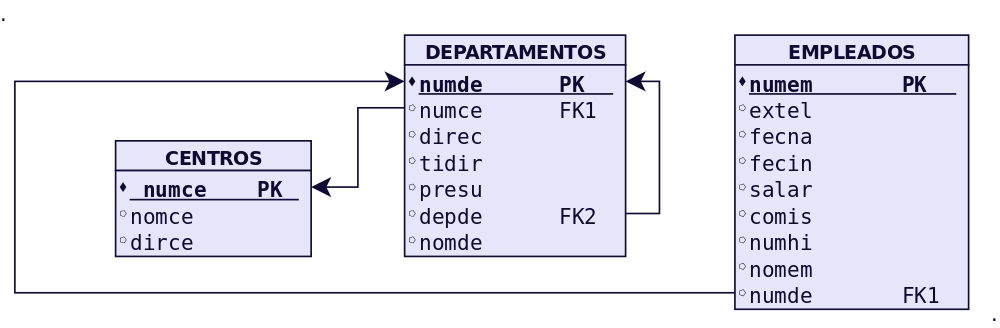

ACTIVIDADES RESUELTAS
========================

.. admonition:: IMPORTANTE

   Todos los scripts que aparecen a continuación deben ejecutarse en SQL*Plus.

Prácticas
---------------

Dado el siguiente modelo relacional:

Práctica 1: Creación de BD e inserción de Datos.
++++++++++++++++++++++++++++++++++++++++++++++++++++

1. Obtener el posible diagrama E/R a partir del modelo relacional anterior.

2. Escribir las sentencias SQL correspondientes para crear las tablas en ORACLE, teniendo en cuenta las siguientes restricciones:

.. csv-table:: CENTROS
   :header: Campo , Nulo , Tipo de datos , Observaciones

   NUMCE,NOT NULL,NUMBER(4),Número de centro
   NOMCE, ,VARCHAR2(25),Nombre de centro
   DIRCE, ,VARCHAR2(25),Dirección del centro

.. csv-table:: DEPARTAMENTOS
   :header: Campo , Nulo , Tipo de datos , Observaciones

   NUMDE,NOT NULL,NUMBER(3),Número de departamento
   NUMCE, ,NUMBER(4),Número de centro
   DIREC, ,NUMBER(3),Director
   TIDIR, ,CHAR(1),"Tipo de director (en Propiedad, en Funciones)"
   PRESU, ,"NUMBER(3,1)",Presupuesto en miles de €
   DEPDE, ,NUMBER(3),Departamento del que  depende
   NOMDE, ,VARCHAR2(20),Nombre de departamento

.. csv-table:: EMPLEADOS
   :header: Campo , Nulo , Tipo de datos , Observaciones

   NUMEM,NOT NULL,NUMBER(3),Número de empleado
   EXTEL, ,NUMBER(3),Extensión telefónica
   FECNA, ,DATE,Fecha de nacimiento
   FECIN, ,DATE,Fecha de incorporación
   SALAR, ,NUMBER(5),Salario
   COMIS, ,NUMBER(3),Comisión
   NUMHI, ,NUMBER(1),Número de hijos
   NOMEM, ,VARCHAR2(10),Nombre de empleado
   NUMDE, ,NUMBER(3),Número de departamento

.. code-block:: sql

  CREATE TABLE CENTROS(
    Numce NUMBER(4) NOT NULL,
    Nomce VARCHAR2(25) NOT NULL UNIQUE,
    Dirce VARCHAR2(25),
    CONSTRAINT PK_CENTROS PRIMARY KEY(numce)
  ); 

  -- Fijaos que no creo la restricción de clave foránea para la relación reflexiva, 
  -- para así evitar que sea necesario un orden concreto de inserción de datos
  CREATE TABLE DEPARTAMENTOS(
    numde NUMBER(3) NOT NULL,
    numce NUMBER(4),
    direc NUMBER(3),
    tidir CHAR(1),
    presu NUMBER(3,1),
    depde NUMBER(3),
    NOMDE VARCHAR2(20),
    CONSTRAINT PK_DEPARTAMENTOS PRIMARY KEY(numde),
    CONSTRAINT FK1_DEPARTAMENTOS FOREIGN KEY(numce) 
      REFERENCES CENTROS(numce)
      ON DELETE CASCADE
  ); 

  -- NO PUEDO DEFINIR LA FORÁNEA REFLEXIVA PORQUE
  -- NO PUEDO HACER REFERENCIA A UNA TABLA QUE 
  -- NO EXISTE. LA CREO AHORA CON UN ALTER TABLE

  /*Ahora introduzco la clave foránea*/

  ALTER TABLE DEPARTAMENTOS
  ADD CONSTRAINT FK2_DEPARTAMENTOS
  FOREIGN KEY(depde)
  REFERENCES DEPARTAMENTOS(numde); 

  CREATE TABLE EMPLEADOS(
    Numem NUMBER(3) NOT NULL,
    Extel NUMBER(3),
    Fecna DATE,
    Fecin DATE,
    Salar NUMBER(5),
    Comis NUMBER(3),
    Numhi NUMBER(1),
    NOMEM VARCHAR2(10),
    Numde NUMBER(3),
    CONSTRAINT PK_EMPLEADOS PRIMARY KEY(numem),
    CONSTRAINT FK1_EMPLEADOS FOREIGN KEY(numde)
      REFERENCES DEPARTAMENTOS(numde)
      ON DELETE CASCADE
  ); 
 

3. Inserta los siguientes datos en la tabla DEPARTAMENTOS.

.. csv-table:: EMPLEADOS
   :header: NUMDE,NUMCE,DIREC,TIDIR,PRESU,DEPDE,NOMDE

   100, 10, 260, P, 72, NULL, DIRECCIÓN GENERAL
   110, 20, 180, P, 90, 100, DIRECC.COMERCIAL
   111, 20, 180, F, 66, 110, SECTOR INDUSTRIAL
   112, 20, 270, P, 54, 110, SECTOR SERVICIOS
   120, 10, 150, F, 18, 100, ORGANIZACIÓN
   121, 10, 150, P, 12, 120, PERSONAL
   122, 10, 350, P, 36, 120, PROCESO DE DATOS
   130, 10, 310, P, 12, 100, FINANZAS

4. ¿Qué ocurre al insertar el primer registro? ¿Por qué? Plantea la solución.

.. code-block:: sql

  --TENGO QUE INTRODUCIR PRIMERO LOS DATOS DE CENTROS
  --EN EL EJERCICIO NOS HEMOS DADO CUENTA QUE SI INTENTAMOS
  --HACER PRIMERO LA INSERCIÓN DE LOS DATOS DE DEPARTAMENTOS
  --NO PODEMOS, PORQUE NO SE PUEDE INTRODUCIR UNA FORÁNEA
  --ANTES DE INTRODUCIR LA PRINCIPAL CORRESPONDIENTE

5. Inserta los siguientes datos en la tabla CENTROS

.. csv-table:: EMPLEADOS
   :header: NUMCE, NOMCE, DIRCE

   10, SEDE CENTRAL, "C/ ATOCHA, 820, MADRID"
   20, RELACIÓN CON CLIENTES, "C/ ATOCHA, 405, MADRID"

.. code-block:: sql

  INSERT INTO CENTROS VALUES(10,'SEDE CENTRAL','C/ATOCHA,820,MADRID'); 
  INSERT INTO CENTROS VALUES(20, 'RELACION CON CLIENTES', 'C/ATOCHA,405,MADRID'); 

  --YA PUEDO INSERTAR LOS DATOS DE DEPARTAMENTOS
  INSERT INTO DEPARTAMENTOS
  VALUES(100, 10,260,'P',72,NULL, 'DIRECCIÓN GENERAL'); 
  INSERT INTO DEPARTAMENTOS
  VALUES(110, 20,180,'P',90,100, 'DIRECC.COMERCIAL'); 
  INSERT INTO DEPARTAMENTOS
  VALUES(111, 20,180,'F',66,110, 'SECTOR INDUSTRIAL'); 
  INSERT INTO DEPARTAMENTOS
  VALUES(112, 20,270,'P',54,110, 'SECTOR SERVICIOS'); 
  INSERT INTO DEPARTAMENTOS
  VALUES(120, 10,150,'F',18,100, 'ORGANIZACIÓN'); 
  INSERT INTO DEPARTAMENTOS
  VALUES(121, 10,150,'P',12,120, 'PERSONAL'); 
  INSERT INTO DEPARTAMENTOS
  VALUES(122, 10,350,'P',36,120, 'PROCESO DE DATOS'); 
  INSERT INTO DEPARTAMENTOS
  VALUES(130, 10,310,'P',12,100, 'FINANZAS'); 

6. Inserta los siguientes datos en la tabla EMPLEADOS. 

.. csv-table:: EMPLEADOS 
   :header: NUMEM, EXTEL, FECNA, FECIN, SALAR, COMIS, NUMHI, NOMEM, NUMDE

   110, 350, 10/11/1970, 15/02/1985, 1800, NULL, 3, CESAR, 121
   120, 840, 09/06/1968, 01/10/1988, 1900, 110, 1, MARIO, 112
   130, 810, 09/09/1965, 01/02/1981, 1500, 110, 2, LUCIANO, 112
   150, 340, 10/08/1972, 15/01/1997, 2600, NULL, 0, JULIO, 121
   160, 740, 09/07/1980, 11/11/2005, 1800, 110, 2, AUREO, 111
   180, 508, 18/10/1974, 18/03/1996, 2800, 50, 2, MARCOS, 110
   190, 350, 12/05/1972, 11/02/1992, 1750, NULL, 4, JULIANA, 121
   210, 200, 28/09/1970, 22/01/1999, 1910, NULL, 2, PILAR, 100
   240, 760, 26/02/1967, 24/02/1989, 1700, 100, 3, LAVINIA, 111
   250, 250, 27/10/1976, 01/03/1997, 2700, NULL, 0, ADRIANA, 100
   260, 220, 03/12/1973, 12/07/2001, 720, NULL, 6, ANTONIO, 100
   270, 800, 21/05/1975, 10/09/2003, 1910, 80, 3, OCTAVIO, 112
   280, 410, 10/01/1978, 08/10/2010, 1500, NULL, 5, DOROTEA, 130
   285, 620, 25/10/1979, 15/02/2011, 1910, NULL, 0, OTILIA, 122
   290, 910, 30/11/1967, 14/02/1988, 1790, NULL, 3, GLORIA, 120
   310, 480, 21/11/1976, 15/01/2001, 1950, NULL, 0, AUGUSTO, 130
   320, 620, 25/12/1977, 05/02/2003, 2400, NULL, 2, CORNELIO, 122
   330, 850, 19/08/1958, 01/03/1980, 1700, 90, 0, AMELIA, 112
   350, 610, 13/04/1979, 10/09/1999, 2700, NULL, 1, AURELIO, 122
   360, 750, 29/10/1978, 10/10/1998, 1800, 100, 2, DORINDA, 111
   370, 360, 22/06/1977, 20/01/2000, 1860, NULL, 1, FABIOLA, 121
   380, 880, 30/03/1978, 01/01/1999, 1100, NULL, 0, MICAELA, 112
   390, 500, 19/02/1976, 08/10/2010, 1290, NULL, 1, CARMEN, 110
   400, 780, 18/08/1979, 01/11/2011, 1150, NULL, 0, LUCRECIA, 111
   410, 660, 14/07/1968, 13/10/1989, 1010, NULL, 0, AZUCENA, 122
   420, 450, 22/10/1966, 19/11/1988, 2400, NULL, 0, CLAUDIA, 130
   430, 650, 26/10/1967, 19/11/1988, 1260, NULL, 1, VALERIANA, 122
   440, 760, 26/09/1966, 28/02/1986, 1260, 100, 0, LIVIA, 111
   450, 880, 21/10/1966, 28/02/1986, 1260, 100, 0, SABINA, 112
   480, 760, 04/04/1965, 28/02/1986, 1260, 100, 1, DIANA, 111
   490, 880, 06/06/1964, 01/01/1988, 1090, 100, 0, HORACIO, 112
   500, 750, 08/10/1965, 01/01/1987, 1200, 100, 0, HONORIA, 111
   510, 550, 04/05/1966, 01/11/1986, 1200, NULL, 1, ROMULO, 110
   550, 780, 10/01/1970, 21/01/1998, 600, 120, 0, SANCHO, 111

.. code-block:: sql

  -- YA INSERTAMOS EMPLEADOS
  		
  INSERT INTO EMPLEADOS VALUES(110,350,'10/11/1970','15/02/1985',1800,NULL,3,'CESAR',121); 
  INSERT INTO EMPLEADOS VALUES(120,840,'09/06/1968','01/10/1988',1900,110,1,'MARIO',112); 
  INSERT INTO EMPLEADOS VALUES(130,810,'09/09/1965','01/02/1981',1500,110,2,'LUCIANO',112); 
  INSERT INTO EMPLEADOS VALUES(150,340,'10/08/1972','15/01/1997',2600,NULL,0,'JULIO',121); 
  INSERT INTO EMPLEADOS VALUES(160,740,'09/07/1980','11/11/2005',1800,110,2,'AUREO',111); 
  INSERT INTO EMPLEADOS VALUES(180,508,'18/10/1974','18/03/1996',2800,50,2,'MARCOS',110); 
  INSERT INTO EMPLEADOS VALUES(190,350,'12/05/1972','11/02/1992',1750,NULL,4,'JULIANA',121); 
  INSERT INTO EMPLEADOS VALUES(210,200,'28/09/1970','22/01/1999',1910,NULL,2,'PILAR',100); 
  INSERT INTO EMPLEADOS VALUES(240,760,'26/02/1967','24/02/1989',1700,100,3,'LAVINIA',111); 
  INSERT INTO EMPLEADOS VALUES(250,250,'27/10/1976','01/03/1997',2700,NULL,0,'ADRIANA',100); 
  INSERT INTO EMPLEADOS VALUES(260,220,'03/12/1973','12/07/2001',720,NULL,6,'ANTONIO',100); 
  INSERT INTO EMPLEADOS VALUES(270,800,'21/05/1975','10/09/2003',1910,80,3,'OCTAVIO',112); 
  INSERT INTO EMPLEADOS VALUES(280,410,'10/01/1978','08/10/2010',1500,NULL,5,'DOROTEA',130); 
  INSERT INTO EMPLEADOS VALUES(285,620,'25/10/1979','15/02/2011',1910,NULL,0,'OTILIA',122); 
  INSERT INTO EMPLEADOS VALUES(290,910,'30/11/1967','14/02/1988',1790,NULL,3,'GLORIA',120); 
  INSERT INTO EMPLEADOS VALUES(310,480,'21/11/1976','15/01/2001',1950,NULL,0,'AUGUSTO',130); 
  INSERT INTO EMPLEADOS VALUES(320,620,'25/12/1977','05/02/2003',2400,NULL,2,'CORNELIO',122); 
  INSERT INTO EMPLEADOS VALUES(330,850,'19/08/1958','01/03/1980',1700,90,0,'AMELIA',112); 
  INSERT INTO EMPLEADOS VALUES(350,610,'13/04/1979','10/09/1999',2700,NULL,1,'AURELIO',122); 
  INSERT INTO EMPLEADOS VALUES(360,750,'29/10/1978','10/10/1998',1800,100,2,'DORINDA',111); 
  INSERT INTO EMPLEADOS VALUES(370,360,'22/06/1977','20/01/2000',1860,NULL,1,'FABIOLA',121); 
  INSERT INTO EMPLEADOS VALUES(380,880,'30/03/1978','01/01/1999',1100,NULL,0,'MICAELA',112); 
  INSERT INTO EMPLEADOS VALUES(390,500,'19/02/1976','08/10/2010',1290,NULL,1,'CARMEN',110); 
  INSERT INTO EMPLEADOS VALUES(400,780,'18/08/1979','01/11/2011',1150,NULL,0,'LUCRECIA',111); 
  INSERT INTO EMPLEADOS VALUES(410,660,'14/07/1968','13/10/1989',1010,NULL,0,'AZUCENA',122); 
  INSERT INTO EMPLEADOS VALUES(420,450,'22/10/1966','19/11/1988',2400,NULL,0,'CLAUDIA',130); 
  INSERT INTO EMPLEADOS VALUES(430,650,'26/10/1967','19/11/1988',1260,NULL,1,'VALERIANA',122); 
  INSERT INTO EMPLEADOS VALUES(440,760,'26/09/1966','28/02/1986',1260,100,0,'LIVIA',111); 
  INSERT INTO EMPLEADOS VALUES(450,880,'21/10/1966','28/02/1986',1260,100,0,'SABINA',112); 
  INSERT INTO EMPLEADOS VALUES(480,760,'04/04/1965','28/02/1986',1260,100,1,'DIANA',111); 
  INSERT INTO EMPLEADOS VALUES(490,880,'06/06/1964','01/01/1988',1090,100,0,'HORACIO',112); 
  INSERT INTO EMPLEADOS VALUES(500,750,'08/10/1965','01/01/1987',1200,100,0,'HONORIA',111); 
  INSERT INTO EMPLEADOS VALUES(510,550,'04/05/1966','01/11/1986',1200,NULL,1,'ROMULO',110); 
  INSERT INTO EMPLEADOS VALUES(550,780,'10/01/1970','21/01/1998',600,120,0,'SANCHO',111); 

.. note::

  En lugar de la inserción de datos, puedes ahorrar tiempo descargando el script EMPLEADOS.SQL que está disponible en la plataforma Moodle. Este script contiene todas las tablas. Si utilizas el script deberás borrar las tablas previas. 

**SOLUCIÓN**

.. literalinclude:: scripts/P401.SQL
   :language: sql

Práctica 2: Consultas Sencillas
++++++++++++++++++++++++++++++++++++++++++++++++++++

1. Hallar, por orden alfabético, los nombres de los departamentos cuyo director lo es en funciones y no en propiedad.

.. code::

    NOMDE       
    ------------------------------                    
    ORGANIZACIÓN       
    SECTOR INDUSTRIAL   

2. Obtener un listín telefónico de los empleados del departamento 121 incluyendo nombre de empleado, número de empleado y extensión telefónica. Por orden alfabético.

.. code:: 

    NOMEM  NUMEM      EXTEL 
    ------------------------------ ---------- ----------  
    CESAR    110        350  
    FABIOLA  370        360    
    JULIANA  190        350   
    JULIO    150        340 

3. Obtener por orden creciente una relación de todos los números de extensiones telefónicas de los empleados, junto con el nombre de estos, para aquellos que trabajen en el departamento 110. Mostrar la consulta tal y como aparece en la imagen.

.. code:: 

    Nombre                         Extensión Telefónica 
    ------------------------------ --------------------  
    CARMEN 500  
    MARCOS 508  
    ROMULO 550  

4. Hallar la comisión, nombre y salario de los empleados que tienen tres hijos, clasificados por comisión, y dentro de comisión por orden alfabético.

.. code:: 

         COMIS NOMEM                          SALAR  
    ---------- ------------------------------ ----------    
            80 OCTAVIO 1910    
           100 LAVINIA 1700     
               CESAR   1800  
               GLORIA  1790        

5. Hallar la comisión, nombre y salario de los empleados que tienen tres hijos, clasificados por comisión, y dentro de comisión por orden alfabético, para aquellos empleados que tienen comisión.

.. code:: 

         COMIS NOMEM                          SALAR  
    ---------- ------------------------------ ----------  
            80 OCTAVIO 1910 
           100 LAVINIA 1700  

 

6. Obtener salario y nombre de los empleados sin hijos y cuyo salario es mayor que 1200 y menor que 1500 €. Se obtendrán por orden decreciente de salario y por orden alfabético dentro de salario.

.. code:: 

         SALAR NOMEM              
    ---------- ------------------------------         
          1260 LIVIA                   
          1260 SABINA        

7. Obtener los números de los departamentos donde trabajan empleados cuyo salario sea inferior a 1500 €

.. code:: 

         NUMDE         
    ----------        
           100         
           110         
           111           
           112         
           122 
	   

8. Obtener las distintas comisiones que hay en el departamento 110.

.. code:: 

         COMIS         
    ----------  
    
            50 

**SOLUCIÓN**

.. literalinclude:: scripts/P402.SQL
   :language: sql

	    
Práctica 3:  Consultas con Predicados Básicos
++++++++++++++++++++++++++++++++++++++++++++++++++++

1. Obtener una relación por orden alfabético de los departamentos cuyo presupuesto es inferior a 30.000 € El nombre de los departamentos vendrá precedido de las palabras 'DEPARTAMENTO DE '. Nota: El presupuesto de los departamentos viene expresado en miles de €.

.. code::

  NOMBRE           
  ----------------------------------------------    
  DEPARTAMENTO DE FINANZAS    
  DEPARTAMENTO DE ORGANIZACIÓN            
  DEPARTAMENTO DE PERSONAL 

2. Muestra el número y el nombre de cada departamento separados por un guión y en un mismo campo llamado “Número-Nombre”, además del tipo de director mostrado como “Tipo de Director”, para aquellos departamentos con presupuesto inferior a 30.000 €.

.. code::

  Número-nombre     T   
  ----------------- ------------   
  120-ORGANIZACIÓN  F   
  121-PERSONAL      P   
  130-FINANZAS      P   

3. Suponiendo que en los próximos dos años el coste de vida va a aumentar un 8% anual y que se suben los salarios solo un 2% anual, hallar para los empleados con más de 4 hijos su nombre y su sueldo anual, actual y para cada uno de los próximos dos años, clasificados por orden alfabético. Muestra la consulta tal y como aparece en la captura.

.. code::

  Nombre                         Salario 2014 Salario 2015 Salario 2016 
  ------------------------------ ------------ ------------ ------------ 
  ANTONIO   8640       8812,8     8989,056 
  DOROTEA  18000        18360      18727,2 

4. Hallar, por orden alfabético, los nombres de los empleados tales que si se les da una gratificación de 120 € por hijo, el total de esta gratificación supera el 20% de su salario.

.. code::

  NOMEM                    
  ------------------------------
  ANTONIO                  
  DOROTEA                  
  GLORIA                   
  JULIANA                  
  LAVINIA                  

5. Para los empleados del departamento 112 hallar el nombre y el salario total (salario más comisión), por orden de salario total decreciente, y por orden alfabético dentro de salario total.

.. code::

  NOMBRE                         SALARIO TOTAL               
  ------------------------------ -------------               
  MICAELA                  
  MARIO      2010               
  OCTAVIO    1990               
  AMELIA     1790               
  LUCIANO    1610               
  SABINA     1360               
  HORACIO    1190               

6. Vemos que para Micaela no se muestra nada en Salario Total, esto es debido a que su comisión es Nula (Lo que no significa que sea 0--> significa que no se ha introducido ningún valor). Esto impide hacer el cálculo de la suma. Muestra entonces la misma consulta anterior pero sólo para aquellos empleados cuya comisión no sea nula.

.. code::

  NOMBRE                         SALARIO TOTAL               
  ------------------------------ -------------               
  MARIO      2010               
  OCTAVIO    1990               
  AMELIA     1790               
  LUCIANO    1610               
  SABINA     1360               
  HORACIO    1190               

7. Repite la consulta anterior para mostrarla como sigue:

.. code::

  NOMBRE                         SALARIO TOTAL               
  ------------------------------ -------------------------------------------- 
  MARIO                          2010 €                      
  OCTAVIO                        1990 €                      
  AMELIA                         1790 €                      
  LUCIANO                        1610 €                      
  SABINA                         1360 €                      
  HORACIO                        1190 €                      

8. En una campaña de ayuda familiar se ha decidido dar a los empleados una paga extra de 60 € por hijo, a partir del cuarto inclusive. Obtener por orden alfabético para estos empleados: nombre y salario total que van a cobrar incluyendo esta paga extra. Mostrarlo como en la imagen.

.. code::

  NOMBRE                         SALARIO TOTAL               
  ------------------------------ --------------------------------------------    
  ANTONIO                        900 €                       
  DOROTEA                        1620 €                      
  JULIANA                        1810 €                      

9. Introducción a SELECT subordinado. Imaginemos la misma consulta anterior, pero en la que se nos pide mostrar los mismos campos pero para aquellos empleados cuyo número de hijos iguale o supere a los de Juliana. Es decir, Juliana tiene 4 hijos pero no lo sabemos. Lo que sabemos es el nombre. En este caso haremos otro SELECT cuyo resultado de la búsqueda sea el número de hijos de Juliana.

.. code::

  NOMBRE                         SALARIO TOTAL               
  ------------------------------ --------------------------------------------     
  ANTONIO                        900 €                       
  DOROTEA                        1620 €                      
  JULIANA                        1810 €                      

10. Obtener por orden alfabético los nombres de los empleados cuyos sueldos igualan o superan al de CLAUDIA en más del 15%.

.. code::

  NOMEM                    
  ------------------------------
  MARCOS                   

11. Obtener los nombres de los departamentos que no dependen funcionalmente de otro.

.. code::

  NOMDE                    
  ------------------------------
  DIRECCIÓN GENERAL        

**SOLUCIÓN**

.. literalinclude:: scripts/P403.SQL
   :language: sql

Práctica 4: Consultas con Predicados Cuantificados. ALL, SOME o ANY.
+++++++++++++++++++++++++++++++++++++++++++++++++++++++++++++++++++++++++++

1. Obtener por orden alfabético los nombres de los empleados cuyo salario supera al máximo salario de los empleados del departamento 122.

.. code::

  NOMEM                    
  ------------------------------
  MARCOS                   

2. La misma consulta pero para el departamento 150. Explica por qué obtenemos la relación de todos los empleados por orden alfabético.        

.. code::

  NOMEM                    
  ------------------------------
  ADRIANA                  
  AMELIA                   
  ANTONIO                  
  AUGUSTO                  
  AURELIO                  
  AUREO                    
  AZUCENA                  
  CARMEN                   
  CESAR                    
  CLAUDIA                  
  CORNELIO                 

  NOMEM                    
  ------------------------------
  DIANA                    
  DORINDA                  
  DOROTEA                  
  FABIOLA                  
  GLORIA                   
  HONORIA                  
  HORACIO                  
  JULIANA                  
  JULIO                    
  LAVINIA                  
  LIVIA                    

  NOMEM                    
  ------------------------------
  LUCIANO                  
  LUCRECIA                 
  MARCOS                   
  MARIO                    
  MICAELA                  
  OCTAVIO                  
  OTILIA                   
  PILAR                    
  ROMULO                   
  SABINA                   
  SANCHO                   

  NOMEM                    
  ------------------------------
  VALERIANA     

3. Obtener por orden alfabético los nombres de los empleados cuyo salario supera en dos veces y media o más al mínimo salario de los empleados del departamento 122.

.. code::

  NOMEM                    
  ------------------------------
  ADRIANA                  
  AURELIO                  
  JULIO                    
  MARCOS                   

4. Obtener los nombres y salarios de los empleados cuyo salario coincide con la comisión multiplicada por 10 de algún otro o la suya propia.

.. code::

  NOMEM  SALAR                  
  ------------------------------ ----------                  
  MICAELA 1100                  
  ROMULO  1200                  
  HONORIA 1200                  

5. Obtener por orden alfabético los nombres y salarios de los empleados cuyo salario es superior a la comisión máxima existente multiplicada por 20.

.. code::

  NOMEM  SALAR                  
  ------------------------------ ----------                  
  ADRIANA 2700                  
  AURELIO 2700                  
  JULIO   2600                  
  MARCOS  2800                  

6. Obtener por orden alfabético los nombres y salarios de los empleados cuyo salario es inferior a veinte veces la comisión más baja existente.

.. code::

  NOMEM  SALAR                  
  ------------------------------ ----------                  
  ANTONIO  720                  
  SANCHO   600                  

**SOLUCIÓN**

.. literalinclude:: scripts/P404.SQL
   :language: sql

Práctica 5: Consultas con Predicados BETWEEN
++++++++++++++++++++++++++++++++++++++++++++++++++++

1. Obtener por orden alfabético los nombres de los empleados cuyo salario está entre 1500 € y 1600 €.-

.. code::

  NOMEM                    
  ------------------------------
  DOROTEA                  
  LUCIANO                  

2. Obtener por orden alfabético los nombres y salarios de los empleados con comisión, cuyo salario dividido por su número de hijos cumpla una, o ambas, de las dos condiciones siguientes:

- Que sea inferior de 720 €
- Que sea superior a 50 veces su comisión.

.. code::

  NOMEM  SALAR                  
  ------------------------------ ----------                  
  AMELIA  1700                  
  HONORIA 1200                  
  HORACIO 1090                  
  LAVINIA 1700                  
  LIVIA   1260                  
  OCTAVIO 1910                  
  SABINA  1260                  
  SANCHO   600           

**SOLUCIÓN**

.. literalinclude:: scripts/P405.SQL
   :language: sql

Práctica 6: Consultas con Predicados LIKE
++++++++++++++++++++++++++++++++++++++++++++++++++++

1. Obtener por orden alfa el nombre y el salario de aquellos empleados que comienzan por la letra 'A' y muestra la consulta como aparece en la captura.

.. code::

  Nombre                         Salario                     
  ------------------------------ --------------------------------------------   
  ADRIANA                        2700 €                      
  AMELIA                         1700 €                      
  ANTONIO                        720 €                       
  AUGUSTO                        1950 €                      
  AURELIO                        2700 €                      
  AUREO                          1800 €                      
  AZUCENA                        1010 €          

2. Obtener por orden alfabético los nombres de los empleados que tengan 8 letras.

.. code::

  NOMEM                    
  ------------------------------
  CORNELIO                 
  LUCRECIA        

3. Obtener por orden alfabético los nombres y el presupuesto de los departamentos que incluyen la palabra “SECTOR”. La consulta la deberás mostrar como la imagen.

.. code::

  Departamento      Presupuesto 
  ---------------------------------------------- ------------------------------------  
  DEPARTAMENTO DE SECTOR INDUSTRIAL              66.000 €    
  DEPARTAMENTO DE SECTOR SERVICIOS               54.000 €    

**SOLUCIÓN**

.. literalinclude:: scripts/P406.SQL
   :language: sql

Práctica 7: Consultas con Predicados IN
++++++++++++++++++++++++++++++++++++++++++++++++++++

1. Obtener por orden alfabético los nombres de los empleados cuya extensión telefónica es 250 o 750.

.. code::

  NOMEM                    
  ------------------------------
  ADRIANA                  
  DORINDA                  
  HONORIA         

2. Obtener por orden alfabético los nombres de los empleados que trabajan en el mismo departamento que PILAR o DOROTEA.

.. code::

  NOMEM                    
  ------------------------------
  ADRIANA                  
  ANTONIO                  
  AUGUSTO                  
  CLAUDIA                  
  DOROTEA                  
  PILAR     

3. Obtener por orden alfabético los nombres de los departamentos cuyo director es el mismo que el del departamento: DIRECC.COMERCIAL o el del departamento: PERSONAL Mostrar la consulta como imagen.

.. code::

  Nombres Departamentos          Identificador de su director
  ------------------------------ ----------------------------
  SECTOR INDUSTRIAL          180
  DIRECC.COMERCIAL           180
  PERSONAL 150
  ORGANIZACIÓN   150

**SOLUCIÓN**

.. literalinclude:: scripts/P407.SQL
   :language: sql

Práctica 8: Consultas con Predicados EXISTS
++++++++++++++++++++++++++++++++++++++++++++++++++++

1. Obtener los nombres de los centros de trabajo si hay alguno que esté en la calle ATOCHA.

.. code::

  NOMCE                    
  ------------------------------
  SEDE CENTRAL             
  RELACIÓN CON CLIENTES   

2. Obtener los nombres y el salario de los empleados del departamento 100 si en él hay alguno que gane más de 1300 €.

.. code::

  NOMEM  SALAR                  
  ------------------------------ ----------                  
  PILAR   1910                  
  ADRIANA 2700                  
  ANTONIO  720                  

3. Obtener los nombres y el salario de los empleados del departamento 100 si en él hay alguno que gane más de 2750 €.

.. code::

  -- no rows selected

4. Obtener los nombres y el salario de los empleados del departamento 100 si en él hay alguno que gane más de 3000 €.

.. code::

  -- no rows selected

**SOLUCIÓN**

.. literalinclude:: scripts/P408.SQL
   :language: sql

Práctica 9: Más Consultas con Predicados
++++++++++++++++++++++++++++++++++++++++++++++++++++

1. Obtener por orden alfabético los nombres y comisiones de los empleados del departamento 110 si en él hay algún empleado que tenga comisión.

.. code::

  NOMEM  COMIS                  
  ------------------------------ ----------                  
  CARMEN                   
  MARCOS    50                  
  ROMULO                   

2. Obtener los nombres de los departamentos que no sean ni de DIRECCION ni de SECTORES.

.. code::

  NOMDE                    
  ------------------------------
  ORGANIZACIÓN             
  PERSONAL                 
  PROCESO DE DATOS         
  FINANZAS             

3. Obtener por orden alfabético los nombres y salarios de los empleados que o bien no tienen hijos y ganan más de 1.500 €, o bien tienen hijos y ganan menos de 1.000 €.

.. code::

  NOMBRE                         SALARIO                     
  ------------------------------ --------------------------------------------    
  ADRIANA                        2700 €                      
  AMELIA                         1700 €                      
  ANTONIO                        720 €                       
  AUGUSTO                        1950 €                      
  CLAUDIA                        2400 €                      
  JULIO                          2600 €                      
  OTILIA                         1910 €                      

4. Hallar por orden de número de empleado el nombre y salario total (salario más comisión) de los empleados cuyo salario total supera al salario mínimo en 1800 € mensuales. Muestra la consulta como aparece en la captura de pantalla.

.. code::

  NÚMERO EMPLEADO          NOMBRE                         SALARIO TOTAL               
  ------------------------ ------------------------------ -----------------------  
   nº 180                  MARCOS                         2850 €              

5. Obtener, por orden alfabético, los nombres y salarios de los empleados del departamento 111 que tienen comisión si hay alguno de ellos cuya comisión supere al 15% de su salario.

.. code::

  NOMEM  SALAR                  
  ------------------------------ ----------                  
  AUREO   1800                  
  DIANA   1260                  
  DORINDA 1800                  
  HONORIA 1200                  
  LAVINIA 1700                  
  LIVIA   1260                  
  SANCHO   600                  

6. Hallar los nombres de departamentos, el tipo de director y su presupuesto, para aquellos departamentos que tienen directores en funciones, o bien en propiedad y su presupuesto anual excede a 30.000 € o no dependen de ningún otro.

.. code::

  Nombre de Departamento         T Presupuesto               
  ------------------------------ - -----------               
  DIRECCIÓN GENERAL              P          72               
  DIRECC.COMERCIAL               P          90               
  SECTOR INDUSTRIAL              F          66               
  SECTOR SERVICIOS               P          54               
  ORGANIZACIÓN                   F          18               
  PROCESO DE DATOS               P          36               

7. Realizamos la misma consulta anterior pero mostrándola del modo siguiente:

.. code::

  Nombre de Departamento         T Presupuesto               
  ------------------------------ - ------------------------------------------------ 
  DIRECCIÓN GENERAL              P 72.000 €                  
  DIRECC.COMERCIAL               P 90.000 €                  
  SECTOR INDUSTRIAL              F 66.000 €                  
  SECTOR SERVICIOS               P 54.000 €                  
  ORGANIZACIÓN                   F 18.000 €                  
  PROCESO DE DATOS               P 36.000 €                  

**SOLUCIÓN**

.. literalinclude:: scripts/P409.SQL
   :language: sql

Práctica 10: Consultas con Fechas
++++++++++++++++++++++++++++++++++++++++++++++++++++

.. note::
  
  En muchos casos, el resultado dependerá de la fecha en la que realizamos la consulta.

1. Obtener por orden alfabético, los nombres y fechas de nacimiento de los empleados que cumplen años en el mes de noviembre.

.. code::

  NOMEM                          NACIMIENTO                  
  ------------------------------ ----------                  
  AUGUSTO                        21/11/1976                  
  CESAR                          10/11/1970                  
  GLORIA                         30/11/1967                  

2. Obtener los nombres de los empleados que cumplen años en el día de hoy.

.. code::

  -- no rows selected

3. Obtener los nombres y fecha exacta de nacimiento de los empleados cuya fecha de nacimiento es anterior al año 1950.

.. code::

  -- no rows selected

4. Obtener los nombres y fecha exacta de incorporación de los empleados cuya fecha de incorporación a la empresa es anterior al año 1970.

.. code::

  -- no rows selected

5. Obtener los nombres, fecha de nacimiento y fecha de incorporación de los empleados cuya  edad a la  fecha de incorporación era inferior a 30 años.

.. code::

  NOMEM                          FECNA    FECIN              
  ------------------------------ -------- --------           
  CESAR                          10/11/70 15/02/85           
  MARIO                          09/06/68 01/10/88           
  LUCIANO                        09/09/65 01/02/81           
  JULIO                          10/08/72 15/01/97           
  AUREO                          09/07/80 11/11/05           
  MARCOS                         18/10/74 18/03/96           
  JULIANA                        12/05/72 11/02/92           
  PILAR                          28/09/70 22/01/99           
  LAVINIA                        26/02/67 24/02/89           
  ADRIANA                        27/10/76 01/03/97           
  ANTONIO                        03/12/73 12/07/01           

  NOMEM                          FECNA    FECIN              
  ------------------------------ -------- --------           
  OCTAVIO                        21/05/75 10/09/03           
  GLORIA                         30/11/67 14/02/88           
  AUGUSTO                        21/11/76 15/01/01           
  CORNELIO                       25/12/77 05/02/03           
  AMELIA                         19/08/58 01/03/80           
  AURELIO                        13/04/79 10/09/99           
  DORINDA                        29/10/78 10/10/98           
  FABIOLA                        22/06/77 20/01/00           
  MICAELA                        30/03/78 01/01/99           
  AZUCENA                        14/07/68 13/10/89           
  CLAUDIA                        22/10/66 19/11/88           

  NOMEM                          FECNA    FECIN              
  ------------------------------ -------- --------           
  VALERIANA                      26/10/67 19/11/88           
  LIVIA                          26/09/66 28/02/86           
  SABINA                         21/10/66 28/02/86           
  DIANA                          04/04/65 28/02/86           
  HORACIO                        06/06/64 01/01/88           
  HONORIA                        08/10/65 01/01/87           
  ROMULO                         04/05/66 01/11/86           
  SANCHO                         10/01/70 21/01/98           

6. Obtener los empleados cuyo nacimiento fue en Lunes.

.. code::

  NOMEM                          Día de nacimiento           
  ------------------------------ ------------------------------------   
  PILAR                          lunes                       
  ANTONIO                        lunes                       
  LIVIA                          lunes                       

7. Obtener los empleados cuyo día de la semana para el nacimiento y la incorporación fue Viernes.

.. code::

  NOMEM                          Viernes para nac. e incorp. 
  ------------------------------ ------------------------------------   
  AURELIO                        viernes                     
  SABINA                         viernes                     

8. Obtener los empleados cuyo día de la semana para el nacimiento y la incorporación coinciden. Es decir nacieron y se incorporaron un Lunes, o nacieron y se incorporaron un Martes, etc

.. code::

  NOMEM                          Mismo día de nac. e incorp. 
  ------------------------------ ------------------------------------   
  OCTAVIO                        miércoles                   
  AURELIO                        viernes                     
  CLAUDIA                        sábado                      
  SABINA                         viernes                     

9. Obtener los  empleados y su mes de incorporación siempre que esté entre los meses de Enero y Junio (ambos inclusive).

.. code::

  NOMEM                          Mes incorporación           
  ------------------------------ ----------------------------------------   
  CESAR                          FEBRERO                     
  LUCIANO                        FEBRERO                     
  JULIO                          ENERO                       
  MARCOS                         MARZO                       
  JULIANA                        FEBRERO                     
  PILAR                          ENERO                       
  LAVINIA                        FEBRERO                     
  ADRIANA                        MARZO                       
  OTILIA                         FEBRERO                     
  GLORIA                         FEBRERO                     
  AUGUSTO                        ENERO                       

  NOMEM                          Mes incorporación           
  ------------------------------ ----------------------------------------   
  CORNELIO                       FEBRERO                     
  AMELIA                         MARZO                       
  FABIOLA                        ENERO                       
  MICAELA                        ENERO                       
  LIVIA                          FEBRERO                     
  SABINA                         FEBRERO                     
  DIANA                          FEBRERO                     
  HORACIO                        ENERO                       
  HONORIA                        ENERO                       
  SANCHO                         ENERO                 

10. Obtener los  empleados y su mes de incorporación siempre que esté entre los meses de Enero y Junio (ambos inclusive) y el mes de nacimiento coincida en dicho mes.

.. code::

  NOMEM                          Mes incorporación y nac.    
  ------------------------------ ---------------------------------------- 
  LAVINIA                        FEBRERO                     
  SANCHO                         ENERO                       

**SOLUCIÓN**

.. literalinclude:: scripts/P410.SQL
   :language: sql

Práctica 11: Consultas con funciones colectivas
++++++++++++++++++++++++++++++++++++++++++++++++++++

1. Hallar el salario medio, mínimo y máximo de los empleados de la empresa.

.. code::

  Salario medio Salario mínimo Salario máximo                
  ------------- -------------- --------------                
           1670            600           2800   

2. Obtener por orden alfabético los salarios y nombres de los empleados tales que su salario más un 40% supera al máximo salario.

.. code::

       SALAR NOMEM         
  ---------- ------------------------------                  
        2700 ADRIANA       
        2700 AURELIO       
        2400 CLAUDIA       
        2400 CORNELIO      
        2600 JULIO         
        2800 MARCOS        

3. Hallar la edad en años cumplidos del empleado más viejo del departamento 110.
.. note::
  
  La edad que obtengamos dependerá de la fecha en la que realicemos la consulta.

.. code::

        Edad               
  ----------               
          50      

4. Hallar la edad en años cumplidos y el nombre del empleado más viejo del departamento 110. 

.. note::
  
  La edad que obtengamos dependerá de la fecha en la que realicemos la consulta.

.. code::

  NOMEM   Edad                  
  ------------------------------ ----------                  
  ROMULO    50                  

5. Hallar el número de empleados del departamento 112, cuántas comisiones distintas hay en ese departamento y la suma de las comisiones.

.. code::

  COUNT(NUMEM) COUNT(DISTINCTCOMIS) SUM(COMIS)               
  ------------ -------------------- ----------               
             6                    4        590           

**SOLUCIÓN**

.. literalinclude:: scripts/P411.SQL
   :language: sql

Práctica 12: Agrupamiento de filas. GROUP BY
++++++++++++++++++++++++++++++++++++++++++++++++++++

1. Hallar cuántos empleados hay en cada departamento.

.. code::

       NUMDE COUNT(NUMEM)  
  ---------- ------------  
         100            3  
         121            4  
         120            1  
         112            7  
         110            3  
         130            3  
         111            8  
         122            5  

2. Hallar para cada departamento el salario medio, el mínimo y el máximo.

.. code::

       NUMDE Salario medio Salario mínimo Salario máximo     
  ---------- ------------- -------------- --------------     
         100       1776,67            720           2700     
         121        2002,5           1750           2600     
         120          1790           1790           1790     
         112       1494,29           1090           1910     
         110       1763,33           1200           2800     
         130          1950           1500           2400     
         111       1346,25            600           1800     
         122          1856           1010           2700     

3. Hallar el salario medio y la edad media en años para cada grupo de empleados con igual comisión.
.. note::

  La edad dependerá de la fecha en la que realicemos la consulta.

.. code::

       COMIS SALARIO MEDIO EDAD MEDIA                        
  ---------- ------------- ----------                        
                      1750         43                        
         100       1367,14         49                        
         120           600         47                        
          90          1700         59                        
         110       1733,33         46                        
          50          2800         42                        
          80          1910         42                        

4. Repite la consulta anterior expresando la edad en años cumplidos.
(Aunque en este caso se obtiene lo mismo, la edad media podría variar de una consulta a otra dependiendo del momento en el que se realice la consulta).

.. code::

       COMIS SALARIO MEDIO EDAD MEDIA                        
  ---------- ------------- ----------                        
                      1750         43                        
         100       1367,14         49                        
         120           600         47                        
          90          1700         58                        
         110       1733,33         45                        
          50          2800         42                        
          80          1910         41                        

5. Hallar el salario medio y la edad media en años cumplidos para cada grupo de empleados del mismo departamento y con igual comisión.

.. code::

       NUMDE      COMIS SALARIO MEDIO EDAD MEDIA             
  ---------- ---------- ------------- ----------             
         100                  1776,67         43             
         110         50          2800         42             
         110                     1245         46             
         111        100          1444         48             
         111        110          1800         36             
         111        120           600         47             
         111                     1150         37             
         112         80          1910         41             
         112         90          1700         58             
         112        100          1175         51             
         112        110          1700         50             

       NUMDE      COMIS SALARIO MEDIO EDAD MEDIA             
  ---------- ---------- ------------- ----------             
         112                     1100         39             
         120                     1790         49             
         121                   2002,5         43             
         122                     1856         42             
         130                     1950         43             

6. Para los departamentos en los que hay algún empleado cuyo salario sea mayor que 2.500 € al mes, hallar el número de empleados y la suma de sus salarios.

.. code::

       NUMDE COUNT(NUMEM) SUM(SALAR)                         
  ---------- ------------ ----------                         
         100            3       5330                         
         121            4       8010                         
         110            3       5290                         
         122            5       9280                         

**SOLUCIÓN**

.. literalinclude:: scripts/P412.SQL
   :language: sql

Práctica 13: Agrupamiento de filas. CLÁUSULA HAVING
++++++++++++++++++++++++++++++++++++++++++++++++++++

1. Hallar el número de empleados que usan la misma extensión telefónica. Solamente se desea mostrar aquellos grupos que tienen más de 1 empleado.

.. code::

       EXTEL COUNT(NUMEM)  
  ---------- ------------  
         620            2  
         880            3  
         350            2  
         750            2  
         760            3  
         780            2  

2. Para cada centro, hallar los presupuestos medios de los departamentos.

.. code::

       NUMCE Presupuesto medio  
  ---------- -----------------  
          20                70  
          10                30  

3. Para cada centro, hallar los presupuestos medios de los departamentos clasificados según estén dirigidos en propiedad o en funciones.

.. code::

       NUMCE T Presupuesto medio
  ---------- - -----------------
          10 P                33
          10 F                18
          20 F                66
          20 P                72

4. Para los departamentos cuyo salario medio supera al de la empresa, hallar cuántas extensiones telefónicas tienen.

.. code::

       NUMDE nº EXTENSIONES TELEFÓNICAS                      
  ---------- --------------------------                      
         100                          3                      
         120                          1                      
         121                          3                      
         110                          3                      
         130                          3                      
         122                          4                      

5. Hallar el máximo valor de la suma de los salarios de los departamentos.

.. code::

       NUMDE SUM(SALAR)    
  ---------- ----------    
         111      10770    

**SOLUCIÓN**

.. literalinclude:: scripts/P413.SQL
   :language: sql

Práctica 14: Consultas sobre varias tablas
++++++++++++++++++++++++++++++++++++++++++++++++++++

1. Para cada departamento con presupuesto inferior a 35.000 €, hallar le nombre del Centro donde está ubicado y el máximo salario de sus empleados (si dicho máximo excede de 1.500 €). Clasificar alfabéticamente por nombre de departamento.

.. code::

  NOMDE                          NOMCE                          MAX(SALAR)
  ------------------------------ ------------------------------ ----------
  FINANZAS                       SEDE CENTRAL                         2400
  ORGANIZACIÓN                   SEDE CENTRAL                         1790
  PERSONAL                       SEDE CENTRAL                         2600   

2. Hallar por orden alfabético los nombres de los departamentos que dependen de los que tienen un presupuesto inferior a 30.000 €. También queremos conocer el nombre del departamento del que dependen y su presupuesto.

.. code::

  Departamento                   Dpt. del que depende                PRESU
  ------------------------------ ------------------------------ ----------
  PERSONAL                       ORGANIZACIÓN                           18
  PROCESO DE DATOS               ORGANIZACIÓN                           18

3. Obtener los nombres y los salarios medios de los departamentos cuyo salario medio supera al salario medio de la empresa.

.. code::

  NOMDE                          SALARIO MEDIO               
  ------------------------------ -------------               
  ORGANIZACIÓN                            1790               
  DIRECC.COMERCIAL                     1763,33               
  FINANZAS   1950               
  PERSONAL 2002,5               
  DIRECCIÓN GENERAL                    1776,67               
  PROCESO DE DATOS                        1856               

4. Para los departamentos cuyo director lo sea en funciones, hallar el número de empleados y la suma de sus salarios, comisiones y número de hijos.

.. code::

  NOMDE                          COUNT(NUMEM) SUM(SALAR) SUM(COMIS) SUM(NUMHI)
  ------------------------------ ------------ ---------- ---------- ----------
  ORGANIZACIÓN                              1       1790                     3
  SECTOR INDUSTRIAL                         8      10770        730          8

5. Para los departamentos cuyo presupuesto anual supera los 35.000 €, hallar cuantos empleados hay por cada extensión telefónica.

.. code::

  NOMDE  EXTEL COUNT(NUMEM)     
  ------------------------------ ---------- ------------     
  DIRECCIÓN GENERAL                     200            1     
  DIRECCIÓN GENERAL                     250            1     
  SECTOR INDUSTRIAL                     760            3     
  SECTOR INDUSTRIAL                     750            2     
  SECTOR INDUSTRIAL                     780            2     
  SECTOR SERVICIOS                      810            1     
  PROCESO DE DATOS                      620            2     
  DIRECC.COMERCIAL                      500            1     
  PROCESO DE DATOS                      660            1     
  DIRECC.COMERCIAL                      508            1     
  SECTOR SERVICIOS                      850            1     

  NOMDE  EXTEL COUNT(NUMEM)     
  ------------------------------ ---------- ------------     
  PROCESO DE DATOS                      610            1     
  SECTOR SERVICIOS                      880            3     
  DIRECC.COMERCIAL                      550            1     
  DIRECCIÓN GENERAL                     220            1     
  SECTOR SERVICIOS                      800            1     
  PROCESO DE DATOS                      650            1     
  SECTOR SERVICIOS                      840            1     
  SECTOR INDUSTRIAL                     740            1     

6. Hallar por orden alfabético los nombres de los empleados y su número de hijos para aquellos que son directores en funciones.

.. code::

  NOMEM  NUMHI                  
  ------------------------------ ----------                  
  JULIO      0                  
  MARCOS     2                  

7. Hallar si hay algún departamento (suponemos que sería de reciente creación) que aún no tenga empleados asignados ni director en propiedad.

.. code::

  -- no rows selected

8. Añadir un nuevo departamento de nombre NUEVO y con director en funciones. 

.. code::

  -- no se muestra salida por ser una inserción.

9.  Añadir un nuevo empleado de nombre NORBERTO y sin departamento asignado. Inventar el resto de datos.

.. code::

  -- no se muestra salida por ser una inserción.

10. Muestra los departamentos que no tienen empleados.

.. code::

  -- no rows selected

11. Muestra los nombres de departamentos que no tienen empleados haciendo uso la combinación externa LEFT JOIN. Muestra una segunda columna con los nombres de empleados para asegurarnos que realmente esta a NULL.

.. code::

  NOMDE                    
  ------------------------------
  NUEVO                    

12. Muestra los nombres de departamentos que no tienen empleados haciendo uso la combinación externa RIGH JOIN. Muestra una segunda columna con los nombres de empleados para asegurarnos que realmente esta a NULL.

.. code::

  NOMDE                    
  ------------------------------
  NUEVO                    

13. Muestra los nombres de empleados que no tienen departamento haciendo uso la combinación externa LEFT JOIN. Muestra una segunda columna con los nombres de departamentos para asegurarnos que realmente esta a NULL.

.. code::

  NOMEM                    
  ------------------------------
  NORBERTO                 

14. Muestra los nombres de empleados que no tienen departamento haciendo uso la combinación externa RIGHT JOIN. Muestra una segunda columna con los nombres de empleados para asegurarnos que realmente esta a NULL.

.. code::

  NOMEM                    
  ------------------------------
  NORBERTO                 

15. Muestra los departamentos que no tienen empleados y los empleados que no tiene departamento haciendo uso la combinación externa FULL  JOIN.

.. code::

  NOMDE                          NOMEM                       
  ------------------------------ ------------------------------ 
  NORBERTO                    
  NUEVO                    

16. Muestra los empleados y sus respectivos departamentos haciendo uso de la combinación interna INNER JOIN. ¿Aparecen el departamento NUEVO y el empleado NORBERTO?¿Por qué?

.. code::

  NOMDE                          NOMEM                       
  ------------------------------ ------------------------------ 
  PERSONAL                       CESAR                       
  SECTOR SERVICIOS               MARIO                       
  SECTOR SERVICIOS               LUCIANO                     
  PERSONAL                       JULIO                       
  SECTOR INDUSTRIAL              AUREO                       
  DIRECC.COMERCIAL               MARCOS                      
  PERSONAL                       JULIANA                     
  DIRECCIÓN GENERAL              PILAR                       
  SECTOR INDUSTRIAL              LAVINIA                     
  DIRECCIÓN GENERAL              ADRIANA                     
  DIRECCIÓN GENERAL              ANTONIO                     

  NOMDE                          NOMEM                       
  ------------------------------ ------------------------------ 
  SECTOR SERVICIOS               OCTAVIO                     
  FINANZAS                       DOROTEA                     
  PROCESO DE DATOS               OTILIA                      
  ORGANIZACIÓN                   GLORIA                      
  FINANZAS                       AUGUSTO                     
  PROCESO DE DATOS               CORNELIO                    
  SECTOR SERVICIOS               AMELIA                      
  PROCESO DE DATOS               AURELIO                     
  SECTOR INDUSTRIAL              DORINDA                     
  PERSONAL                       FABIOLA                     
  SECTOR SERVICIOS               MICAELA                     

  NOMDE                          NOMEM                       
  ------------------------------ ------------------------------ 
  DIRECC.COMERCIAL               CARMEN                      
  SECTOR INDUSTRIAL              LUCRECIA                    
  PROCESO DE DATOS               AZUCENA                     
  FINANZAS                       CLAUDIA                     
  PROCESO DE DATOS               VALERIANA                   
  SECTOR INDUSTRIAL              LIVIA                       
  SECTOR SERVICIOS               SABINA                      
  SECTOR INDUSTRIAL              DIANA                       
  SECTOR SERVICIOS               HORACIO                     
  SECTOR INDUSTRIAL              HONORIA                     
  DIRECC.COMERCIAL               ROMULO                      

  NOMDE                          NOMEM                       
  ------------------------------ ------------------------------ 
  SECTOR INDUSTRIAL              SANCHO                      

17.  Realiza la misma consulta anterior donde se cumpla la condición que NUMDE está a NULL. ¿Aparece algún resultado?¿Por qué?

.. code::

  -- no rows selected

18. Muestra los empleados y sus respectivos departamentos haciendo uso de la combinación interna NATURAL JOIN.

.. code::

  NOMEM                          NOMDE                       
  ------------------------------ ------------------------------ 
  CESAR                          PERSONAL                    
  MARIO                          SECTOR SERVICIOS            
  LUCIANO                        SECTOR SERVICIOS            
  JULIO                          PERSONAL                    
  AUREO                          SECTOR INDUSTRIAL           
  MARCOS                         DIRECC.COMERCIAL            
  JULIANA                        PERSONAL                    
  PILAR                          DIRECCIÓN GENERAL           
  LAVINIA                        SECTOR INDUSTRIAL           
  ADRIANA                        DIRECCIÓN GENERAL           
  ANTONIO                        DIRECCIÓN GENERAL           

  NOMEM                          NOMDE                       
  ------------------------------ ------------------------------ 
  OCTAVIO                        SECTOR SERVICIOS            
  DOROTEA                        FINANZAS                    
  OTILIA                         PROCESO DE DATOS            
  GLORIA                         ORGANIZACIÓN                
  AUGUSTO                        FINANZAS                    
  CORNELIO                       PROCESO DE DATOS            
  AMELIA                         SECTOR SERVICIOS            
  AURELIO                        PROCESO DE DATOS            
  DORINDA                        SECTOR INDUSTRIAL           
  FABIOLA                        PERSONAL                    
  MICAELA                        SECTOR SERVICIOS            

  NOMEM                          NOMDE                       
  ------------------------------ ------------------------------ 
  CARMEN                         DIRECC.COMERCIAL            
  LUCRECIA                       SECTOR INDUSTRIAL           
  AZUCENA                        PROCESO DE DATOS            
  CLAUDIA                        FINANZAS                    
  VALERIANA                      PROCESO DE DATOS            
  LIVIA                          SECTOR INDUSTRIAL           
  SABINA                         SECTOR SERVICIOS            
  DIANA                          SECTOR INDUSTRIAL           
  HORACIO                        SECTOR SERVICIOS            
  HONORIA                        SECTOR INDUSTRIAL           
  ROMULO                         DIRECC.COMERCIAL            

  NOMEM                          NOMDE                       
  ------------------------------ ------------------------------ 
  SANCHO                         SECTOR INDUSTRIAL           

19.  Muestra la combinación de las 3 tablas CENTROS, DEPARTAMENTOS y EMPLEADOS haciendo uso de NATURAL JOIN.

.. code::

       NUMDE      NUMCE NOMCE    ...
  ---------- ---------- ------------------------------ ----------
         121         10 SEDE CENTRAL                          ...
         121         10 SEDE CENTRAL                          ...
         121         10 SEDE CENTRAL                          ...
         100         10 SEDE CENTRAL                          ...
         100         10 SEDE CENTRAL                          ...
         100         10 SEDE CENTRAL                          ...
         130         10 SEDE CENTRAL                          ...
         122         10 SEDE CENTRAL                          ...
         120         10 SEDE CENTRAL                          ...
         130         10 SEDE CENTRAL                          ...
         ...        ... ...      ...

20. Borra los registros dados de alta para el departamento NUEVO y el empleado introducida en el apartado anterior.

.. code::

  -- no se muestra salida por ser una eliminación.

**SOLUCIÓN**

.. literalinclude:: scripts/P414.SQL
   :language: sql

-----------------------

.. code-block:: sql

  --INTRODUCCIÓN A VISTAS

  --1º HACEMOS UNA CONSULTA DONDE MUESTRE
  --PARA CADA EMPLEADO SU NÚMERO DE EMPLEADO,
  --NOMBRE, NUMHI Y NOMBRE DEL DEPARTAMENTO 
  --EN EL QUE TRABAJA
  SELECT numem, NOMEM, numhi, NOMDE
  FROM EMPLEADOS E, DEPARTAMENTOS D
  WHERE E.numde=D.numde; 
   
  --2º CREAMOS UNA VISTA LLAMADA EJEMPLO1
  --CON LA CONSULTA ANTERIOR
  CREATE VIEW EJEMPLO1 AS 
    SELECT numem, NOMEM, numhi, NOMDE
    FROM EMPLEADOS E, DEPARTAMENTOS D
    WHERE E.numde=D.numde; 

  --OBTENER EL NOMBRE DE CADA EMPLEADO
  --Y EL NÚMERO DE HIJOS QUE TIENE Y CREAR
  --UNA VISTA LLAMADA EJEMPLO2

  SELECT NOMEM, NUMHI
  FROM EMPLEADOS; 

  CREATE VIEW EJEMPLO2 AS 
    SELECT NOMEM, NUMHI FROM EMPLEADOS; 

  --HACEMOS LA MISMA VISTA ANTERIOR
  --CON OTRO NOMBRE, PARA MOSTRAR TAMBIÉN
  --EL NUMEM

  CREATE VIEW EJEMPLO3 AS 
    SELECT NUMEM,NOMEM, NUMHI FROM EMPLEADOS; 

-----------------------------

Práctica 15: Vistas
++++++++++++++++++++++++++++++++++++++++++++++++++++

1. Crear una vista con todos los empleados del departamento 111 en donde figuren solo el número de empleado, su nombre, su salario y la comisión. La llamarás VISTA1.

2. Crear una vista que obtenga el máximo valor de la suma de los salarios de los departamentos. Se llamará VISTA2.

3. Utilizar la vista anterior para obtener el departamento con más gasto en salario.

.. code::

       NUMDE               
  ----------               
         111               

4. Utilizar la VISTA1 para obtener por orden alfabético los nombres de los empleados del departamento 111 que tienen comisión.

.. code::

  NOMEM                    
  ------------------------------
  AUREO                    
  DIANA                    
  DORINDA                  
  HONORIA                  
  LAVINIA                  
  LIVIA                    
  SANCHO                   

5. Insertar la siguiente fila en la VISTA1: (999,'RODOLFO',999,999). ¿Qué consecuencias tiene?

6. Borra la fila anterior.

7. Crear una VISTA3 en la que aparezcan los centros con sus departamentos.

8. Utilizar la VISTA3 para mostrar el nombre de cada centro y el total de los presupuestos de sus departamentos.

.. code::

  NOMCE                          Total presupuestos          
  ------------------------------ ------------------          
  RELACIÓN CON CLIENTES                         210          
  SEDE CENTRAL     150          

9. Insertar  la  siguiente  fila en la VISTA3:  (30,'SUCURSAL ÉCIJA',200,120,'F',20,110,'CONTABILIDAD'). 
¿Qué ocurre?

10. Borra la fila anterior

**SOLUCIÓN**

.. literalinclude:: scripts/P415.SQL
   :language: sql

Práctica 16: Repaso
++++++++++++++++++++++++++++++++++++++++++++++++++++

1. Selecciona, por orden alfabético decreciente, el nombre de los empleados junto con su salario aumentado un 1%, para aquellos empleados del departamento 100 que en la fecha de su contratación tenían más de 20 años.

.. code::

  NOMEM                          SALAR+0.01*SALAR            
  ------------------------------ ----------------            
  PILAR                                    1929,1            
  ANTONIO                                   727,2            
  ADRIANA                                    2727            

2. Para cada Centro selecciona el presupuesto medio de los departamentos que tienen su sede en él.

.. code::

       NUMCE AVG(PRESU)    
  ---------- ----------    
          20         70    
          10         30    

3. Selecciona el nombre de los empleados junto con su edad actual para aquellos empleados que trabajan en el departamento de PERSONAL.

.. code::

  NOMEM   EDAD                  
  ------------------------------ ----------                  
  CESAR     46                  
  JULIO     44                  
  JULIANA   44                  
  FABIOLA   39                  

4. Selecciona la dirección del centro donde están ubicados los departamentos que tiene empleados con más de tres hijos. Deberás mostrar también el nombre de dichos departamentos.

.. code::

  DIRCE                          NOMDE                       
  ------------------------------ ------------------------------  
  C/ ATOCHA, 820, MADRID         DIRECCIÓN GENERAL                           
  C/ ATOCHA, 820, MADRID         PERSONAL                    
  C/ ATOCHA, 820, MADRID         FINANZAS            
            

5. Selecciona la dirección del centro donde están ubicados los departamentos si existe alguno que tiene empleados con más de tres hijos. Deberás mostrar también el nombre de dichos departamentos.

.. code::

  DIRCE                          NOMDE                       
  ------------------------------ ------------------------------ 
  C/ ATOCHA, 405, MADRID         DIRECC.COMERCIAL            
  C/ ATOCHA, 820, MADRID         DIRECCIÓN GENERAL           
  C/ ATOCHA, 405, MADRID         SECTOR SERVICIOS            
  C/ ATOCHA, 820, MADRID         ORGANIZACIÓN                
  C/ ATOCHA, 820, MADRID         PROCESO DE DATOS            
  C/ ATOCHA, 820, MADRID         PERSONAL                    
  C/ ATOCHA, 820, MADRID         FINANZAS                    
  C/ ATOCHA, 405, MADRID         SECTOR INDUSTRIAL           

6. Cuenta el número de empleados que tienen el mismo número de hijos. Deberás mostrar también el número de hijos que corresponde en cada caso.

.. code::

       NUMHI NºEmpleados   
  ---------- -----------   
           1           7   
           6           1   
           2           6   
           4           1   
           5           1   
           3           4   
           0          14   

7. Crea una vista llamada “Sin comisión” donde muestres el nombre, la edad y el salario de los empleados que no tienen comisión. El salario deberá aparecer en la consulta seguido de “€” y el nombre del campo en el que aparezca la edad será “Edad actual”.

.. code::

  NOMEM              EDADACTUAL SALARIO          
  ------------------ ---------- ---------------
  CESAR                      46 1800 €           
  JULIO                      44 2600 €           
  JULIANA                    44 1750 €           
  PILAR                      46 1910 €           
  ADRIANA                    40 2700 €           
  ANTONIO                    43 720 €            
  DOROTEA                    39 1500 €           
  OTILIA                     37 1910 €           
  GLORIA                     49 1790 €           
  AUGUSTO                    40 1950 €           
  CORNELIO                   39 2400 €           

  NOMEM              EDADACTUAL SALARIO          
  ------------------ ---------- ---------------
  AURELIO                    37 2700 €           
  FABIOLA                    39 1860 €           
  MICAELA                    39 1100 €           
  CARMEN                     41 1290 €           
  LUCRECIA                   37 1150 €           
  AZUCENA                    48 1010 €           
  CLAUDIA                    50 2400 €           
  VALERIANA                  49 1260 €           
  ROMULO                     50 1200 €     

8. Utiliza la vista anterior para calcular el salario medio de los empleados que no tienen comisión.

.. code::

  MEDIASALARIOS            
  -------------            
           1750   

	
9.	Selecciona el nombre de los departamentos en los que trabajan empleados cuyo salario máximo no supere los 2000 €.

.. code::

  NOMDE                          MAX(SALAR)                  
  ------------------------------ ----------                  
  ORGANIZACIÓN                         1790                  
  SECTOR SERVICIOS                     1910                  
  SECTOR INDUSTRIAL                    1800                  

10. Crea una vista con el nombre “Jubilación” donde muestres el nombre de cada empleado, el nombre del departamento en el que trabajan, su edad y su salario para aquellos cuya edad sea, al menos, de 60 años. 

11.	Utiliza la vista anterior para mostrar el nombre de los empleados que tienen justo 60 años.

.. code::

  -- no rows selected

12.	Muestra la dirección de los centros, el nombre de los empleados que trabajan en él, el nombre del departamento concreto en el que trabajan y quien es el director de dicho departamento  para aquellos empleados cuyo nombre comience por la letra “J”.

.. code::

  DIRCE                          NOMEM                NOMDE  DIREC              
  ------------------------------ -------------------- ------------------------------ ----------              
  C/ ATOCHA, 820, MADRID         JULIANA              PERSONAL 150              
  C/ ATOCHA, 820, MADRID         JULIO                PERSONAL 150     

**SOLUCIÓN**

.. literalinclude:: scripts/P416.SQL
   :language: sql

