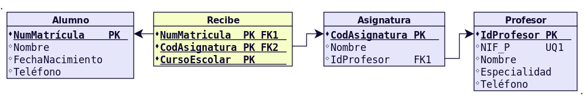
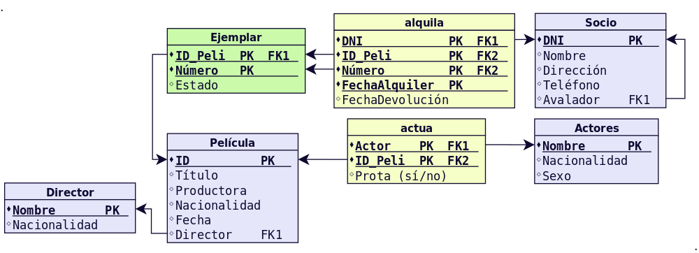

ACTIVIDADES RESUELTAS
=======================

Práctica 1
------------

**INSERT / UPDATE / DELETE**  

Haciendo uso del esquema E01 cuyo diseño físico realizamos en el tema 3, realiza las operaciones de manipulación de datos indicadas a continuación.

Realiza las siguientes inserciones (los datos puedes inventarlos).
+++++++++++++++++++++++++++++++++++++++++++++++++++++++++++++++++++++++++++++++++++++++++++++++++++++++++++++++++

- Inserta 2 profesores.
- Inserta 4 asignaturas.
- Inserta 10 alumnos.
- Cada alumno debe realizar al menos 2 asignaturas.

Introduce 2 profesores con el mismo NIF. ¿Qué sucede? ¿Por qué?
+++++++++++++++++++++++++++++++++++++++++++++++++++++++++++++++++++++++++++++++++++++++++++++++++++++++++++++++++

Introduce 2 alumnos con el mismo NumMatrícula. ¿Qué sucede? ¿Por qué?
+++++++++++++++++++++++++++++++++++++++++++++++++++++++++++++++++++++++++++++++++++++++++++++++++++++++++++++++++

Introduce 3 alumnos para los cuales no conocemos el número de teléfono.
+++++++++++++++++++++++++++++++++++++++++++++++++++++++++++++++++++++++++++++++++++++++++++++++++++++++++++++++++

Modifica los datos de los 3 alumnos anteriores para establecer un número de teléfono.
+++++++++++++++++++++++++++++++++++++++++++++++++++++++++++++++++++++++++++++++++++++++++++++++++++++++++++++++++

Para todos los alumnos, poner 2000 como año de nacimiento.
+++++++++++++++++++++++++++++++++++++++++++++++++++++++++++++++++++++++++++++++++++++++++++++++++++++++++++++++++

Para los profesores que tienen número de teléfono y NIF no comience por 9, poner 'Informática' como especialidad.
+++++++++++++++++++++++++++++++++++++++++++++++++++++++++++++++++++++++++++++++++++++++++++++++++++++++++++++++++++++

Cambia la asignación de asignaturas para los profesores. Es decir, las asignaturas impartidas por un profesor las dará el otro profesor y viceversa.
+++++++++++++++++++++++++++++++++++++++++++++++++++++++++++++++++++++++++++++++++++++++++++++++++++++++++++++++++++++++++++++++++++++++++++++++++++++++++

En la tabla Recibe borra todos los registros que pertenecen a una de las asignaturas.
+++++++++++++++++++++++++++++++++++++++++++++++++++++++++++++++++++++++++++++++++++++++++++++++++++++++++++++++++

En la tabla Asignatura borra dicha asignatura.
+++++++++++++++++++++++++++++++++++++++++++++++++++++++++++++++++++++++++++++++++++++++++++++++++++++++++++++++++

Borra el resto de asignaturas. ¿Qué sucede? ¿Por qué? ¿Como lo solucionarías? ¿Podría haberse evitado el problema con otro diseño físico?¿Cómo?
++++++++++++++++++++++++++++++++++++++++++++++++++++++++++++++++++++++++++++++++++++++++++++++++++++++++++++++++++++++++++++++++++++++++++++++++++++++++++++

Borra todos los profesores. ¿Qué sucede? ¿Por qué? ¿Como lo solucionarías? ¿Podría haberse evitado el problema con otro diseño físico?¿Cómo?
++++++++++++++++++++++++++++++++++++++++++++++++++++++++++++++++++++++++++++++++++++++++++++++++++++++++++++++++++++++++++++++++++++++++++++++++++++

Borra todos los alumnos. ¿Qué sucede? ¿Por qué? ¿Como lo solucionarías? ¿Podría haberse evitado el problema con otro diseño físico?¿Cómo?
+++++++++++++++++++++++++++++++++++++++++++++++++++++++++++++++++++++++++++++++++++++++++++++++++++++++++++++++++++++++++++++++++++++++++++++++++++

**SOLUCIÓN**

.. literalinclude:: scripts/P51.SQL
   :language: plpgsql

Práctica 2
----------------

**INSERT / UPDATE / DELETE**

Haciendo uso del esquema E07 cuyo diseño físico realizamos en el tema 3, realiza las operaciones de manipulación de datos indicadas a continuación.

Teniendo en cuenta las siguientes restricciones que teníamos declaradas:

- No pueden ser nulos los siguientes campos: Nombre de Socio, Título de Película. 
- Sexo toma los valores H o M.
- Por defecto si no se indica nada un actor o actriz no es Protagonista (este campo toma valores S o N).
- FechaDevolución debe ser mayor que FechaAlquiler.

Realiza las siguientes inserciones (los datos puedes inventarlos).
+++++++++++++++++++++++++++++++++++++++++++++++++++++++++++++++++++++++++

- Inserta 2 directores.
- Inserta 4 películas. Todas ellas están dirigidas por alguno de los directores anteriores.
- Inserta 2 ejemplares de cada película.
- Inserta 4 socios.
- Inserta como mínimo 6 actores.
- Cada película debe tener al menos el actor/atriz protagonista asociado.
- Todos los ejemplares deben tener al menos 1 alquiler.

Inserta valores para comprobar que la siguiente restricción funciona correctamente:
++++++++++++++++++++++++++++++++++++++++++++++++++++++++++++++++++++++++++++++++++++++++

- No pueden ser nulos los siguientes campos: Nombre de Socio, Título de Película.

Inserta valores para comprobar que la siguiente restricción funciona correctamente:
+++++++++++++++++++++++++++++++++++++++++++++++++++++++++++++++++++++++++++++++++++++++

- Sexo toma los valores H o M.

Inserta valores para comprobar que la siguiente restricción funciona correctamente:
+++++++++++++++++++++++++++++++++++++++++++++++++++++++++++++++++++++++++++++++++++++++++++

- Por defecto si no se indica nada un actor o actriz no es Protagonista (este campo toma valores S o N).

Inserta valores para comprobar que la siguiente restricción funciona correctamente:
+++++++++++++++++++++++++++++++++++++++++++++++++++++++++++++++++++++++++++++++++++++++++++++

- FechaDevolución debe ser mayor que FechaAlquiler.

Cambia la nacionalidad para los directores. Por ejemplo de 'Estadounidense' a 'USA' o similar, dependiendo de los valores que hayas introducido.
+++++++++++++++++++++++++++++++++++++++++++++++++++++++++++++++++++++++++++++++++++++++++++++++++++++++++++++++++++++++++++++++++++++++++++++++++++++

Cambia la nacionalidad para los actores. Por ejemplo de 'Estadounidense' a 'USA' o similar, dependiendo de los valores que hayas introducido.
+++++++++++++++++++++++++++++++++++++++++++++++++++++++++++++++++++++++++++++++++++++++++++++++++++++++++++++++++++++++++++++++++++++++++++++++++++++

Modifica los datos de todos los socios para que el avalista sea un único socio, siempre el mismo para todos, excepto para el avalista mismo que no dispone de ninguno.
++++++++++++++++++++++++++++++++++++++++++++++++++++++++++++++++++++++++++++++++++++++++++++++++++++++++++++++++++++++++++++++++++++++++++++++++++++++++++++++++++++++++++++++++

Elimina los socios cuyo número de teléfono empiece por una cifra inferior a 5. ¿Qué sucede?¿Por qué?
++++++++++++++++++++++++++++++++++++++++++++++++++++++++++++++++++++++++++++++++++++++++++++++++++++++++++

Elimina los socios cuyo número de teléfono empiece por una cifra superior o igual a 5. ¿Qué sucede?¿Por qué?
++++++++++++++++++++++++++++++++++++++++++++++++++++++++++++++++++++++++++++++++++++++++++++++++++++++++++++++++++++

¿Como lo solucionarías los problemas anteriores? ¿Podría haberse evitado el problema con otro diseño físico?¿Cómo?
+++++++++++++++++++++++++++++++++++++++++++++++++++++++++++++++++++++++++++++++++++++++++++++++++++++++++++++++++++++++++

Elimina todos los directores. ¿Qué sucede?¿Por qué?
++++++++++++++++++++++++++++++++++++++++++++++++++++++++++++++++

Elimina 2 películas, las que desees.¿Qué sucede?¿Por qué?¿Como lo solucionarías? ¿Podría haberse evitado el problema con otro diseño físico?¿Cómo?
++++++++++++++++++++++++++++++++++++++++++++++++++++++++++++++++++++++++++++++++++++++++++++++++++++++++++++++++++++++++++++++++++++++++++++++++++++++++++++++

**SOLUCIÓN**

.. literalinclude:: scripts/P52.SQL
   :language: plpgsql

Práctica 3
-------------

**PL/SQL: Introducción**  

Las siguientes prácticas se realizarán dentro del esquema EMPLEADOS.

Realiza una conexión utilizando el cliente SQL*Plus y muestra el valor de las siguientes variables: USER, ESCAPE, LINESIZE, COLSEP, PAGESIZE, ECHO, SQLPROMPT
++++++++++++++++++++++++++++++++++++++++++++++++++++++++++++++++++++++++++++++++++++++++++++++++++++++++++++++++++++++++++++++++++++++++++++++++++++++++++++++++++

Desde el cliente SQL*Plus muestra el valor de las variables AUTOCOMMIT y SERVEROUTPUT.
++++++++++++++++++++++++++++++++++++++++++++++++++++++++++++++++++++++++++++++++++++++++++++

Desde el cliente SQL*Plus ejecuta el comando HELP SHOW para ver la ayuda acerca del comando SHOW.
+++++++++++++++++++++++++++++++++++++++++++++++++++++++++++++++++++++++++++++++++++++++++++++++++++++++++

Desde el cliente SQL*Plus ejecuta el comando HELP SET para ver la ayuda acerca del comando SET.
++++++++++++++++++++++++++++++++++++++++++++++++++++++++++++++++++++++++++++++++++++++++++++++++++++++

Desde el cliente SQL*Plus pon a ON las variables SERVEROUTPUT y AUTOCOMMIT.
++++++++++++++++++++++++++++++++++++++++++++++++++++++++++++++++++++++++++++++++++

Crea un esquema llamado PLSQL con contraseña PLSQL y rol DBA para realizar las siguientes actividades.Ejecuta el siguiente bloque. Indica cuál es la salida.
++++++++++++++++++++++++++++++++++++++++++++++++++++++++++++++++++++++++++++++++++++++++++++++++++++++++++++++++++++++++++++++++++++++++++++++++++++++++++++++++++

.. code-block:: plpgsql

   BEGIN
     IF 10 > 5 THEN
       DBMS_OUTPUT.PUT_LINE ('Cierto');
     ELSE
       DBMS_OUTPUT.PUT_LINE ('Falso');
     END IF;
   END;
   /

Ejecuta el siguiente bloque. Indica cuál es la salida.
+++++++++++++++++++++++++++++++++++++++++++++++++++++++++++

.. code-block:: plpgsql

   BEGIN
    IF 10 > 5 AND 5 > 1 THEN
      DBMS_OUTPUT.PUT_LINE ('Cierto');
    ELSE
      DBMS_OUTPUT.PUT_LINE ('Falso');
    END IF;
   END;
   /

Ejecuta el siguiente bloque. Indica cuál es la salida.
+++++++++++++++++++++++++++++++++++++++++++++++++++++++++++++++

.. code-block:: plpgsql

   BEGIN
    IF 10 > 5 AND 5 > 50 THEN
      DBMS_OUTPUT.PUT_LINE ('Cierto');
    ELSE
      DBMS_OUTPUT.PUT_LINE ('Falso');
    END IF;
   END;
   /

Ejecuta el siguiente bloque. Indica cuál es la salida.
++++++++++++++++++++++++++++++++++++++++++++++++++++++++++++

.. code-block:: plpgsql

   BEGIN
    CASE 
      WHEN 10 > 5 AND 5 > 50  THEN 
        DBMS_OUTPUT.PUT_LINE ('Cierto');
      ELSE
        DBMS_OUTPUT.PUT_LINE ('Falso');
    END CASE;
   END;
   /

Ejecuta el siguiente bloque. Indica cuál es la salida.
+++++++++++++++++++++++++++++++++++++++++++++++++++++++++++++

.. code-block:: plpgsql

   BEGIN
     FOR i IN 1..10 LOOP
       DBMS_OUTPUT.PUT_LINE (i);
     END LOOP;
   END;
   /

Ejecuta el siguiente bloque. Indica cuál es la salida.
++++++++++++++++++++++++++++++++++++++++++++++++++++++++++++++

.. code-block:: plpgsql

   BEGIN
     FOR i IN REVERSE 1..10 LOOP
       DBMS_OUTPUT.PUT_LINE (i);
     END LOOP;
   END;
   /

Ejecuta el siguiente bloque. Indica cuál es la salida.
++++++++++++++++++++++++++++++++++++++++++++++++++++++++++++

.. code-block:: plpgsql

   DECLARE
     num NUMBER(3) := 0;
   BEGIN
     WHILE num<=100 LOOP
       DBMS_OUTPUT.PUT_LINE (num);
       num:= num+2;
     END LOOP;
   END;
   /

Ejecuta el siguiente bloque. Indica cuál es la salida.
++++++++++++++++++++++++++++++++++++++++++++++++++++++++++++

.. code-block:: plpgsql

   DECLARE
     num NUMBER(3) := 0;
   BEGIN
     LOOP
       DBMS_OUTPUT.PUT_LINE (num);
       IF num > 100 THEN EXIT; END IF;
       num:= num+2;
     END LOOP;
   END;
   /

Ejecuta el siguiente bloque. Indica cuál es la salida.
+++++++++++++++++++++++++++++++++++++++++++++++++++++++++++++

.. code-block:: plpgsql

   DECLARE
     num NUMBER(3) := 0;
   BEGIN
     LOOP
       DBMS_OUTPUT.PUT_LINE (num);
       EXIT WHEN num > 100;
       num:= num+2;
     END LOOP;
   END;
   /

**SOLUCIÓN**

.. literalinclude:: scripts/P53.SQL
   :language: plpgsql

Práctica 4
--------------

**PL/SQL: Procedimientos y Funciones**

Crea un procedimiento llamado ESCRIBE para mostrar por pantalla el mensaje HOLA MUNDO.
+++++++++++++++++++++++++++++++++++++++++++++++++++++++++++++++++++++++++++++++++++++++++++++++++++++++++

Crea un procedimiento llamado ESCRIBE_MENSAJE que tenga un parámetro de tipo VARCHAR2 que recibe un texto y lo muestre por pantalla. La forma del procedimiento será la siguiente:
++++++++++++++++++++++++++++++++++++++++++++++++++++++++++++++++++++++++++++++++++++++++++++++++++++++++++++++++++++++++++++++++++++++++++++++++++++++++++++++++++++++++++++++++++++++++++++++++

`ESCRIBE_MENSAJE (mensaje VARCHAR2)`

Crea un procedimiento llamado SERIE que muestre por pantalla una serie de números desde un mínimo hasta un máximo con un determinado paso. La forma del procedimiento será la siguiente:
++++++++++++++++++++++++++++++++++++++++++++++++++++++++++++++++++++++++++++++++++++++++++++++++++++++++++++++++++++++++++++++++++++++++++++++++++++++++++++++++++++++++++++++++++++++++++++++++++

`SERIE (minimo NUMBER, maximo NUMBER, paso NUMBER)`

Crea una función AZAR que reciba dos parámetros y genere un número al azar entre un mínimo y máximo indicado. La forma de la función será la siguiente:
+++++++++++++++++++++++++++++++++++++++++++++++++++++++++++++++++++++++++++++++++++++++++++++++++++++++++++++++++++++++++++++++++++++++++++++++++++++++++++++++++

`AZAR (minimo NUMBER, maximo NUMBER) RETURN NUMBER`

Crea una función NOTA que reciba un parámetros que será una nota numérica entre 0 y 10 y devuelva una cadena de texto con la calificación (Suficiente, Bien, Notable, ...). La forma de la función será la siguiente:
++++++++++++++++++++++++++++++++++++++++++++++++++++++++++++++++++++++++++++++++++++++++++++++++++++++++++++++++++++++++++++++++++++++++++++++++++++++++++++++++++++++++++++++++++++++++++++++++++++++++++++++++++++++++++++

`NOTA (nota NUMBER) RETURN VARCHAR2`

**SOLUCIÓN**

.. literalinclude:: scripts/P54.SQL
   :language: plpgsql

Práctica 5
--------------

**PL/SQL: Variables, registros y cursores**

Escribe un procedimiento que muestre el número de empleados y el salario mínimo, máximo y medio del departamento de FINANZAS. Debe hacerse uso de cursores implícitos, es decir utilizar SELECT ... INTO. 
++++++++++++++++++++++++++++++++++++++++++++++++++++++++++++++++++++++++++++++++++++++++++++++++++++++++++++++++++++++++++++++++++++++++++++++++++++++++++++++++++++++++++++++++++++++++++++++++++++++++++++++++++

Escribe un procedimiento que suba un 10% el salario a los EMPLEADOS con más de 2 hijos y que ganen menos de 2000 €. Para cada empleado se mostrará por pantalla el código de empleado, nombre, salario anterior y final. Utiliza un cursor explícito. La transacción no puede quedarse a medias. Si por cualquier razón no es posible actualizar todos estos salarios, debe deshacerse el trabajo a la situación inicial.
++++++++++++++++++++++++++++++++++++++++++++++++++++++++++++++++++++++++++++++++++++++++++++++++++++++++++++++++++++++++++++++++++++++++++++++++++++++++++++++++++++++++++++++++++++++++++++++++++++++++++++++++++++++++++++++++++++++++++++++++++++++++++++++++++++++++++++++++++++++++++++++++++++++++++++++++++++++++++++++++++++++++++++++++++++++++++++++++++++++++++++++++++++++++++++++++++++++++++++++++++++++++++++++++++++

Escribe un procedimiento que reciba dos parámetros (número de departamento, hijos). Deberá crearse un cursor explícito al que se le pasarán estos parámetros y que mostrará los datos de los empleados que pertenezcan al departamento y con el número de hijos indicados. Al final se indicará el número de empleados obtenidos. 
++++++++++++++++++++++++++++++++++++++++++++++++++++++++++++++++++++++++++++++++++++++++++++++++++++++++++++++++++++++++++++++++++++++++++++++++++++++++++++++++++++++++++++++++++++++++++++++++++++++++++++++++++++++++++++++++++++++++++++++++++++++++++++++++++++++++++++++++++++++++++++++++++++++++++++++++++++++++++++++++++++++++++++++++++++++++

Escribe un procedimiento con un parámetro para el nombre de empleado, que nos muestre la edad de dicho empleado en años, meses y días. 
++++++++++++++++++++++++++++++++++++++++++++++++++++++++++++++++++++++++++++++++++++++++++++++++++++++++++++++++++++++++++++++++++++++++++++++++

**SOLUCIÓN**

.. literalinclude:: scripts/P55.SQL
   :language: plpgsql

Práctica 6
----------------

**PL/SQL: Paquetes y Excepciones**

Desarrolla el paquete ARITMETICA cuyo código fuente viene en este tema. Crea un archivo para la especificación y otro para el cuerpo. Realiza varias pruebas para comprobar que las llamadas a funciones y procedimiento funcionan correctamente.
+++++++++++++++++++++++++++++++++++++++++++++++++++++++++++++++++++++++++++++++++++++++++++++++++++++++++++++++++++++++++++++++++++++++++++++++++++++++++++++++++++++++++++++++++++++++++++++++++++++++++++++++++++++++++++++++++++++++++++++++++++++++++++++++++

Al paquete anterior añade una función llamada RESTO que reciba dos parámetros, el dividendo y el divisor, y devuelva el resto de la división.
++++++++++++++++++++++++++++++++++++++++++++++++++++++++++++++++++++++++++++++++++++++++++++++++++++++++++++++++++++++++++++++++++++++++++++++++++++++++++

Al paquete anterior añade un procedimiento sin parámetros llamado AYUDA que muestre un mensaje por pantalla de los procedimientos y funciones disponibles en el paquete, su utilidad y forma de uso.
++++++++++++++++++++++++++++++++++++++++++++++++++++++++++++++++++++++++++++++++++++++++++++++++++++++++++++++++++++++++++++++++++++++++++++++++++++++++++++++++++++++++++++++++++++++++++++++++++++++++++++

Desarrolla el paquete GESTION. En un principio tendremos los procedimientos para gestionar los departamentos. Dado el archivo de especificación mostrado más abajo crea el archivo para el cuerpo. Realiza varias pruebas para comprobar que las llamadas a funciones y procedimientos funcionan correctamente.
++++++++++++++++++++++++++++++++++++++++++++++++++++++++++++++++++++++++++++++++++++++++++++++++++++++++++++++++++++++++++++++++++++++++++++++++++++++++++++++++++++++++++++++++++++++++++++++++++++++++++++++++++++++++++++++++++++++++++++++++++++++++++++++++++++++++++++++++++++++++++++++++++++++++++++++++++++++++

**SOLUCIÓN**

.. literalinclude:: scripts/P56.SQL
   :language: plpgsql

Práctica 7
--------------

**PL/SQL: Triggers y Excepciones**

Previamente deberemos crear una tabla AUDITORIA_EMPLEADOS para registrar los eventos a auditar que ocurran sobre la tabla EMPLEADOS.

.. code-block:: plpgsql

  CREATE TABLE AUDITORIA_EMPLEADOS (descripcion VARCHAR2(200));

Y también crearemos una vista SEDE_DEPARTAMENTOS acerca de los departamentos y su localización.

.. code-block:: plpgsql

  CREATE VIEW SEDE_DEPARTAMENTOS AS
  SELECT C.NUMCE, C.NOMCE, C.DIRCE, 
         D.NUMDE, D.NOMDE, D.PRESU, D.DIREC, D.TIDIR, D.DEPDE 
  FROM CENTROS C JOIN DEPARTAMENTOS D ON C.NUMCE=D.NUMCE; 

También insertaremos en la tabla DEPARTAMENTOS uno llamado TEMP donde serán movidos los empleados cuyo departamento desaparezca.

.. code-block:: plpgsql

  INSERT INTO DEPARTAMENTOS VALUES (0, 10,  260, 'F', 10, 100, 'TEMP');

Crea un trigger que, cada vez que se inserte o elimine un empleado, registre una entrada en la tabla AUDITORIA_EMPLEADOS con la fecha del suceso, número y nombre de empleado, así como el tipo de operación realizada (INSERCIÓN o ELIMINACIÓN).
++++++++++++++++++++++++++++++++++++++++++++++++++++++++++++++++++++++++++++++++++++++++++++++++++++++++++++++++++++++++++++++++++++++++++++++++++++++++++++++++++++++++++++++++++++++++++++++++++++++++++++++++++++++++++++++++++++++++++++++++++++++++++++++++++++++++++++++++

Crea un trigger que, cada vez que se modifiquen datos de un empleado, registre una entrada en la tabla AUDITORIA_EMPLEADOS con la fecha del suceso, valor antiguo y valor nuevo de cada campo, así como el tipo de operación realizada (en este caso MODIFICACIÓN).
+++++++++++++++++++++++++++++++++++++++++++++++++++++++++++++++++++++++++++++++++++++++++++++++++++++++++++++++++++++++++++++++++++++++++++++++++++++++++++++++++++++++++++++++++++++++++++++++++++++++++++++++++++++++++++++++++++++++++++++++++++++++++++++++++++++++++++++++++++++++++++

Crea un trigger para que registre en la tabla AUDITORIA_EMPLEADOS las subidas de salarios superiores al 5%. 
++++++++++++++++++++++++++++++++++++++++++++++++++++++++++++++++++++++++++++++++++++++++++++++++++++++++++++++++

Deseamos operar sobre los datos de los departamentos y los centros donde se hallan. Para ello haremos uso de la vista SEDE_DEPARTAMENTOS creada anteriormente. 
++++++++++++++++++++++++++++++++++++++++++++++++++++++++++++++++++++++++++++++++++++++++++++++++++++++++++++++++++++++++++++++++++++++++++++++++++++++++++++++++++++

Al tratarse de una vista que involucra más de una tabla, necesitaremos crear un trigger de sustitución para gestionar las operaciones de actualización de la información. Crea el trigger necesario para realizar inserciones, eliminaciones y modificaciones en la vista anterior.  

Realiza las siguientes operaciones para comprobar si el disparador anterior funciona correctamente.
+++++++++++++++++++++++++++++++++++++++++++++++++++++++++++++++++++++++++++++++++++++++++++++++++++++++++

**SOLUCIÓN**

.. literalinclude:: scripts/P57.SQL
   :language: plpgsql
