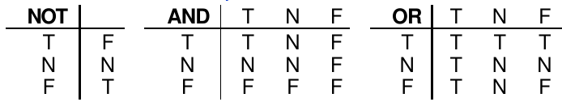

INTRODUCCIÓN
=============

En esta unidad veremos 3 sentencias SQL DML para la modificación de datos. Además aprenderemos el funcionamiento de las transacciones y realizaremos una introducción al lenguaje **PL/SQL**.

LENGUAJE DE MANIPULACIÓN DE DATOS: DML
======================================

Una vez que se ha creado de forma conveniente las tablas, el siguiente paso consiste en insertar datos en ellas, es decir, añadir tuplas. Durante la vida de la base de datos será necesario, además, borrar determinadas tuplas o modificar los valores que contienen.
Los comandos de SQL que se van a estudiar en este apartado son **INSERT, UPDATE y DELETE**. Estos comandos pertenecen al **DML**.

Inserción de datos
---------------------------

El comando INSERT de SQL permite introducir tatos en una tabla o en una vista de la base de datos. La sintaxis del comando es la siguiente:

.. code-block:: plpgsql

  INSERT INTO {nombre_tabla | nombre_vista } [(columna1 [, columna2]...)]
  VALUES (valor1 [, valor2] ... );

Indicando la tabla se añaden los datos que se especifiquen tras el apartado VALUES en un nuevo registro. Los valores deben corresponderse con el orden de las columnas. Si no es así se puede indicar tras el nombre de la tabla y entre paréntesis.

Ejemplos:

Supongamos que tenemos el siguiente diseño físico de una tabla:

.. code-block:: plpgsql

  CREATE TABLE EMPLEADOS (
    COD       NUMBER(2)    PRIMARY KEY, 
    NOMBRE    VARCHAR2(50) NOT NULL,
    LOCALIDAD VARCHAR2(50) DEFAULT 'Écija',
    FECHANAC  DATE
  );

La forma más habitual de introducir datos es la siguiente:

.. code-block:: plpgsql

  INSERT INTO EMPLEADOS VALUES (1, 'Pepe', 'Osuna', '01/01/1970');
  INSERT INTO EMPLEADOS VALUES (2, 'Juan', DEFAULT, NULL);
  INSERT INTO EMPLEADOS VALUES (3, 'Sara', NULL, NULL);

Es obligatorio introducir valores para los campos COD y NOMBRE. Dichos campos no pueden tener valor NULL. Podemos insertar sólo el valor de ciertos campos. En este caso hay que indicar los campos a insertar y el orden en el que los introducimos:

.. code-block:: plpgsql

  INSERT INTO EMPLEADOS(NOMBRE, COD) VALUES ('Ana', 5);

**Inserción de datos obtenidos de una consulta**

También es posible insertar datos en una tabla que hayan sido obtenidos de una consulta realizada a otra tabla/vista u otras tablas/vistas. Su forma es:

.. code-block:: plpgsql

  INSERT INTO tabla
  SELECT ...

Debe respetarse lo dicho anteriormente respecto a los campos. La consulta SELECT debe devolver la misma cantidad y tipo de campos que los definidos en la tabla.

Por ejemplo, suponiendo que disponemos de una tabla SOLICITANTES con el siguiente diseño:

.. code-block:: plpgsql

  CREATE TABLE SOLICITANTES (
    NUM        NUMBER(2) PRIMARY KEY, 
    NOMBRE     VARCHAR2(50),
    CIUDAD     VARCHAR2(50),
    NACIMIENTO DATE,
    ESTUDIOS   VARCHAR2(50)
  );

  INSERT INTO EMPLEADOS
  SELECT NUM, NOMBRE, CIUDAD, NACIMIENTO 
  FROM SOLICITANTES 
  WHERE ESTUDIOS='CFGS ASIR';

También podemos indicar los campos a insertar, teniendo en cuenta que, en este caso los campos COD y NOMBRE de la tabla EMPLEADO no aceptan valores NULL, por tanto es obligatorio introducir valores para ellos:

.. code-block:: plpgsql

  INSERT INTO EMPLEADOS(FECHANAC, NOMBRE, COD)
  SELECT NACIMIENTO, NOMBRE, NUM 
  FROM SOLICITANTES 
  WHERE ESTUDIOS='CFGS ASIR';

Modificación de datos
-------------------------------

Para la modificación de registros dentro de una tabla o vista se utiliza el comando UPDATE. La sintaxis del comando es la siguiente:

.. code-block:: plpgsql

  UPDATE {nombre_tabla | nombre_vista}
  SET columna1=valor1 [, columna2=valor2] ...
  [WHERE condición];

Se modifican las columnas indicadas en el apartado SET con los valores indicados. La cláusula WHERE permite especificar qué registros serán modificados.

Ejemplos:

.. code-block:: plpgsql

  -- Ponemos todos los nombres a mayúsculas 
  -- y todas las localidades a Estepa
  UPDATE EMPLEADOS
  SET NOMBRE=UPPER(NOMBRE), LOCALIDAD='Estepa';

  -- Para los empleados que nacieron a partir de 1970
  -- ponemos nombres con inicial mayúscula y localidades Marchena
  UPDATE EMPLEADOS
  SET NOMBRE=INITCAP(NOMBRE), LOCALIDAD='Marchena'
  WHERE FECHANAC >= '01/01/1970';

**Actualización de datos usando una subconsulta**
  
También se admiten subconsultas. Por ejemplo:

.. code-block:: plpgsql

  UPDATE empleados
  SET sueldo=sueldo*1.10
  WHERE id_seccion = (SELECT id_seccion FROM secciones
                      WHERE nom_seccion='Producción');

Esta instrucción aumenta un 10% el sueldo de los empleados que están dados de alta en la sección llamada Producción. 

Eliminación de datos
------------------------------

Es más sencilla que el resto, elimina los registros de la tabla que cumplan la condición indicada. Se realiza mediante la instrucción DELETE:

.. code-block:: plpgsql
  
  DELETE [ FROM ] {nombre_tabla|nombre_vista}
  [WHERE condición] ;

Ejemplos:

.. code-block:: plpgsql

  -- Borramos empleados de Estepa
  DELETE EMPLEADOS
  WHERE LOCALIDAD='Estepa';

  -- Borramos empleados cuya fecha de nacimiento sea anterior a 1970
  -- y localidad sea Osuna
  DELETE EMPLEADOS
  WHERE FECHANAC < '01/01/1970' AND LOCALIDAD = 'Osuna';

  -- Borramos TODOS los empleados;
  DELETE EMPLEADOS;

Hay que tener en cuenta que el borrado de un registro no puede provocar fallos de integridad y que la opción de integridad ON DELETE CASCADE (clave secundaria o foránea) hace que no sólo se borren los registros indicados sino todos los relacionados. En la práctica esto significa que no se pueden borrar registros cuya clave primaria sea referenciada por alguna clave foránea en otra tabla, a no ser que dicha tabla secundaria tenga activada la clausula ON DELETE CASCADE en su clave foránea, en cuyo caso se borraría el/los registro/s de la tabla principal y los registros de tabla secundaria cuya clave foránea coincide con la clave primaria eliminada en la tabla primera.

**Eliminación de datos usando una subconsulta**

Al igual que en el caso de las instrucciones INSERT o SELECT, DELETE dispone de cláusula WHERE y en dicha cláusula podemos utilizar subconsultas. Por ejemplo:

.. code-block:: plpgsql

  DELETE empleados
  WHERE id_empleado IN (SELECT id_empleado FROM operarios);

En este caso se trata de una subconsulta creada con el operador IN, se eliminarán los empleados cuyo identificador esté dentro de la tabla operarios.

Ejecución de comandos DML sobre vistas.
---------------------------------------

Las instrucciones DML ejecutadas sobre las vistas permiten añadir o modificar los datos de las tablas relacionados con las filas de la vista. Ahora bien, no es posible ejecutar instrucciones DML sobre vistas que:

- Utilicen funciones de grupo (SUM, AVG,...)
- Usen GROUP BY o DISTINCT
- Posean columnas con cálculos (P. ej: PRECIO * 1.16)

Además no se pueden añadir datos a una vista si en las tablas referencias en la consulta SELECT hay campos NOT NULL que no aparecen en la consulta (es lógico ya que al añadir el dato se tendría que añadir el registro colocando el valor NULL en el campo).

Si tenemos la siguiente vista:

.. code-block:: plpgsql

  CREATE VIEW resumen (id_localidad, localidad, poblacion,
                       n_provincia, provincia, superficie, 
                       id_comunidad, comunidad)
  AS SELECT L.IdLocalidad, L.Nombre, L.Poblacion, 
             P.IdProvincia, P.Nombre, P.Superficie, 
             C.IdComunidad, C.Nombre
     FROM LOCALIDADES L JOIN PROVINCIAS P ON L.IdProvincia=P.IdProvincia
                        JOIN COMUNIDADES C ON P.IdComunidad=C.IdComunidad;

Si realizamos la siguiente inserción

.. code-block:: plpgsql
   
   INSERT INTO resumen (id_localidad, localidad, poblacion)
   VALUES (10000, 'Sevilla', 750000);

Se producirá un error, puesto que estamos insertando un registro dentro de la vista donde muchos de sus campos no tienen especificado un valor y por tanto serán insertados a NULL. El problema es que no puede insertarse un NULL en n_provincia ni id_comunidad puesto que son claves primarias de las tablas subyacentes PROVINCIAS y COMUNIDADES.
La solución al problema anterior se soluciona creando un disparador (trigger) de sustitución, que veremos en el apartado de triggers.

GESTIÓN DE TRANSACCIONES
==============================

En términos teóricos, una transacción es un conjunto de tareas relacionadas que se realizan de forma satisfactoria o incorrecta como una unidad. En términos de procesamiento, las transacciones se confirman o se anulan. Para que una transacción se confirme se debe garantizar la permanencia de los cambios efectuados en los datos. Los cambios deben conservarse aunque el sistema se bloquee o tengan lugar otros eventos imprevistos. Existen 4 propiedades necesarias, que son conocidas como **propiedades ACID**: 

- atomicidad (Atomicity)
- coherencia (Consistency)
- aislamiento (Isolation)
- permanencia (Durability). 

Estas propiedades garantizan un comportamiento predecible, reforzando la función de las transacciones como proposiciones de todo o nada.

- **Atomicidad**: Una transacción es una unidad de trabajo el cual se realiza en su totalidad o no se realiza en ningún caso. Las operaciones asociadas a una transacción comparten normalmente un objetivo común y son interdependientes. Si el sistema ejecutase únicamente una parte de las operaciones, podría poner en peligro el objetivo final de la transacción. 
- **Coherencia**: Una transacción es una unidad de integridad porque mantiene la coherencia de los datos, transformando un estado coherente de datos en otro estado de datos igualmente coherente.
- **Aislamiento**: Una transacción es una unidad de aislamiento, permitiendo que transacciones concurrentes se comporten como si cada una fuera la única transacción que se ejecuta en el sistema. El aislamiento requiere que parezca que cada transacción sea la única que manipula el almacén de datos, aunque se puedan estar ejecutando otras transacciones al mismo tiempo. Una transacción nunca debe ver las fases intermedias de otra transacción.
- **Permanencia**: Una transacción también es una unidad de recuperación. Si una transacción se realiza satisfactoriamente, el sistema garantiza que sus actualizaciones se mantienen aunque el equipo falle inmediatamente después de la confirmación. El registro especializado permite que el procedimiento de reinicio del sistema complete las operaciones no finalizadas, garantizando la permanencia de la transacción.

En términos más prácticos, una transacción está formada por una serie de instrucciones DML. Una transacción comienza con la primera instrucción DML que se ejecute y finaliza con una operación COMMIT (si la transacción se confirma) o una operación ROLLBACK (si la operación se cancela).
Hay que tener en cuenta que cualquier instrucción DDL o DCL da lugar a un COMMIT implícito, es decir todas las instrucciones DML ejecutadas hasta ese instante pasan a ser definitivas.

Para poder hacer uso de transacciones en SQL*Plus debemos tener desactivado el modo AUTOCOMMIT.  Podemos ver su estado con la orden:

.. code-block:: plpgsql

  SHOW AUTOCOMMIT

Para desactivar dicho modo, usamos la orden:

.. code-block:: plpgsql

  SET AUTOCOMMIT OFF

COMMIT
------

La instrucción COMMIT hace que los cambios realizados por la transacción sean definitivos, irrevocables. Se dice que tenemos una **transacción confirmada**. Sólo se debe utilizar si estamos de acuerdo con los cambios, conviene asegurarse mucho antes de realizar el COMMIT ya que las instrucciones ejecutadas pueden afectar a miles de registros.  
Además el cierre correcto de la sesión da lugar a un COMMIT, aunque siempre conviene ejecutar explícitamente esta instrucción a fin de asegurarnos de lo que hacemos.

ROLLBACK
---------

Esta instrucción regresa a la instrucción anterior al inicio de la transacción, normalmente el último COMMIT, la última instrucción DDL o DCL o al inicio de sesión. 
Anula definitivamente los cambios, por lo que conviene también asegurarse de esta operación.
Un abandono de sesión incorrecto o un problema de comunicación o de caída del sistema dan lugar a un ROLLBACK implícito.

SAVEPOINT
---------

Esta instrucción permite establecer un punto de ruptura. El problema de la combinación ROLLBACK/COMMIT es que un COMMIT acepta todo y un ROLLBACK anula todo.
SAVEPOINT permite señalar un punto intermedio entre el inicio de la transacción y la situación actual. Su sintaxis es: 

.. code-block:: plpgsql

  -- ... instrucciones DML ...

  SAVEPOINT nombre

  -- ... instrucciones DML ...

Para regresar a un punto de ruptura concreto se utiliza ROLLBACK TO SAVEPOINT seguido del nombre dado al punto de ruptura. También es posible hacer ROLLBACK TO nombre de punto de ruptura. Cuando se vuelve a un punto marcado, las instrucciones que siguieron a esa marca se anulan definitivamente.

Ejemplo de uso:

.. code-block:: plpgsql

  SET AUTOCOMMIT OFF;

.. code-block:: plpgsql

  CREATE TABLE T (FECHA DATE);

  INSERT INTO T VALUES ('01/01/2017');
  INSERT INTO T VALUES ('01/02/2017');

  SAVEPOINT febrero;

  INSERT INTO T VALUES ('01/03/2017');
  INSERT INTO T VALUES ('01/04/2017');

  SAVEPOINT abril;

  INSERT INTO T VALUES ('01/05/2017');

  ROLLBACK TO febrero;   
  -- También puede escribirse ROLLBACK TO SAVEPOINT febrero;
  -- En este ejemplo sólo se guardan en la tabla 
  -- los 2 primeros registros o filas.

Estado de los datos durante la transacción
-------------------------------------------

Si se inicia una transacción usando comandos DML hay que tener en cuenta que:

- Se puede volver a la instrucción anterior a la transacción cuando se desee.
- Las instrucciones de consulta SELECT realizadas por el usuario que inició la transacción muestran los datos ya modificados por las instrucciones DML.
- El resto de usuarios ven los datos tal cual estaban antes de la transacción, de hecho los registros afectados por la transacción aparecen bloqueados hasta que la transacción finalice. Esos usuarios no podrán modificar los valores de dichos registros.
- Tras la transacción todos los usuarios ven los datos tal cual quedan tras el fin de transacción. Los bloqueos son liberados y los puntos de ruptura borrados.

Concurrencia de varias transacciones (Bloqueos)
-------------------------------------------

Cuando se realizan varias transacciones de forma simultánea, pueden darse diversas situaciones en el acceso concurrente a los datos, es decir, cuando se accede a un mismo dato en dos transacciones distintas. Estas situaciones son:

- **Lectura sucia** (Dirty Read). Una transacción lee datos que han sido escritos por otra transacción que aún no se ha confirmado.
- **Lectura no repetible** (Non-repeateable Read). Una transacción vuelve a leer los datos que ha leído anteriormente y descubre que otra transacción confirmada ha modificado o eliminado los datos.
- **Lectura fantasma** (Phantom Read). Una transacción vuelve a ejecutar una consulta que devuelve un conjunto de filas que satisface una condición de búsqueda y descubre que otra transacción confirmada ha insertado filas adicionales que satisfacen la condición.

Para una mejor gestión de estas situaciones debemos indicar el nivel de aislamiento que deseamos. De las cuatro propiedades de ACID de un SGBD, la **propiedad de aislamiento** es la más laxa. Un nivel de aislamiento bajo aumenta la capacidad de muchos usuarios para acceder a los mismos datos al mismo tiempo, pero también aumenta el número de efectos de concurrencia (como lecturas sucias). Un mayor nivel de aislamiento puede dar como resultado una pérdida de concurrencia y el aumento de las posibilidades de que una transacción bloquee a otra. 

Podemos solicitar al SGBD cuatro niveles de aislamiento. De menor a mayor nivel de aislamiento, tenemos:

- **READ UNCOMMITTED** (Lectura no confirmada). Las sentencias SELECT son efectuadas sin realizar bloqueos, por tanto, todos los cambios hechos por una transacción pueden verlos las otras transacciones. Permite que sucedan las 3 situaciones indicadas previamente: lecturas fantasma, no repetibles y sucias. 
- **READ COMMITTED** (Lectura confirmada). Los datos leídos por una transacción pueden ser modificados por otras transacciones. Se pueden dar lectuas fantasma y lecturas no repetibles.
- **REPEATEABLE READ** (Lectura repetible). Consiste en que ningún registro leído con un SELECT se puede cambiar en otra transacción. Solo pueden darse lecturas fantasma. 
- **SERIALIZABLE**. Las transacciones ocurren de forma totalmente aislada a otras transacciones. Se bloquean las transacciones de tal manera que ocurren unas detrás de otras, sin capacidad de concurrencia. El SGBD las ejecuta concurrentemente si puede asegurar que no hay conflicto con el acceso a los datos.

**Nivel de aislamiento y Lecturas**

==================== =============== ====================== ===================
Nivel de aislamiento Lecturas sucias Lecturas no repetibles Lecturas fantasma
==================== =============== ====================== ===================
READ UNCOMMITTED     SÍ              SÍ                     SÍ   
READ COMMITTED 	     NO              SÍ                     SÍ
REPEATEABLE READ 	   NO              NO                     SÍ
SERIALIZABLE 	       NO              NO                     NO
==================== =============== ====================== ===================

Internamente el SGBD proporciona dicho nivel de aislamiento mediante **bloqueos** en los datos.

En Oracle, el nivel por defecto es **READ COMMITED**. Además de éste, solo permite **SERIALIZABLE**. Se puede cambiar ejecutando el comando:

.. code-block:: plpgsql

  SET TRANSACTION ISOLATION LEVEL SERIALIZABLE;

INTRODUCCIÓN A PL/SQL
=====================

Cuando se desea realizar una aplicación completa para el manejo de una base de datos relacional, resulta necesario utilizar alguna herramienta que soporte la capacidad de consulta del SQL y la versatilidad de los lenguajes de programación tradicionales. **PL/SQL** es el lenguaje de programación que proporciona Oracle para extender el SQL estándar con otro tipo de instrucciones.

Casi todos los grandes Sistemas Gestores de Datos incorporan utilidades que permiten ampliar el lenguaje SQL para producir pequeñas utilidades que añaden al SQL mejoras de la programación estructurada (bucles, condiciones, funciones,....). 

A diferencia de SQL, que es un lenguaje declarativo (indicamos qué deseamos obtener sin indicar cómo), PL/SQL es el lenguaje procedimental (indicamos cómo queremos obtener los resultados)

PL/SQL es implementado por el precompilador de Oracle que permite utilizar condiciones y bucles al estilo de lenguajes como Basic, Cobol, C++, Java, etc.

En otros sistemas gestores de bases de datos existen otros lenguajes procedimentales: 

- Microsoft SQL Server utiliza **Transact SQL**
- PostgreSQL usa **PL/pgSQL**
- IBM Informix usa **SPL**
- Firebird usa **PSQL**
- MySQL usa **SQL/PSM**
- El estándar ANSI/ISO indica **SQL/PSM**

El código PL/SQL puede almacenarse:

- En la propia base de datos
- En archivos externos

Las funciones más destacadas que pueden realizarse con PL/SQL son las siguientes:

- Facilitar la realización de tareas administrativas sobre la base de datos (copia de valores antiguos, auditorías, control de usuarios,...)
- Validación y verificación avanzada de usuarios
- Consultas muy avanzadas
- Tareas imposibles de realizar con SQL

Conceptos básicos
-----------------

- bloque PL/SQL
  Se trata de un trozo de código que puede ser interpretado por Oracle. Se encuentra inmerso dentro de las palabras BEGIN y END.
- programa PL/SQL
  Conjunto de bloques que realizan una determinada labor.
- procedimiento
  Programa PL/SQL almacenado en la base de datos y que puede ser ejecutado si se desea con solo saber su nombre (y teniendo permiso para su acceso).
- función
  Programa PL/SQL que a partir de unos datos de entrada obtiene un resultado (datos de salida). Una función puede ser utilizada en cualquier expresión desde cualquier otro programa PL/SQL e incluso desde una instrucción SQL.
- paquete
  Colección de procedimientos y funciones agrupados dentro de la misma estructura. Similar a las bibliotecas y librerías de los lenguajes convencionales.
- trigger (disparador)
  Programa PL/SQL que se ejecuta automáticamente cuando ocurre un determinado suceso a un objeto de la base de datos.

Bloques
-----------------

Cada programa en PL/SQL está formado por grupos de órdenes SQL llamadas bloques.
Cada bloque puede contener, a su vez, nuevos bloques.

**ESTRUCTURA DE UN BLOQUE PL/SQL**

La estructura más sencilla es la siguiente:

.. code-block:: plpgsql

  BEGIN
    Sentencias
    ...
  END;
  /

Ejemplo:

.. code-block:: plpgsql

  BEGIN
    DBMS_OUTPUT.PUT_LINE ('Hola Mundo');
  END;
  /

La barra / se utiliza para ejecutar el código.

.. admonition:: NOTA IMPORTANTE

  Si usas SQL*Plus deberás ejecutar al inicio de sesión la siguiente orden para que se habilite la salida:

  .. code-block:: plpgsql

     SET SERVEROUTPUT ON

La estructura general es:

.. code-block:: plpgsql

  [ DECLARE 
     constantes,
     variables, 
     cursores, 
     excepciones definidas por el usuario
     ... 
  ]
  BEGIN
    Sentencias
  [ EXCEPTION 
     Acciones a realizar cuando se produce alguna excepción  ]
  END;
  /

Ejemplo:

.. code-block:: plpgsql

  DECLARE
    fecha DATE;
  BEGIN
    SELECT sysdate INTO fecha FROM dual;
    dbms_output.put_line 
    (
      to_CHAR(fecha,'day", "dd" de "month" de "yyyy", a las "hh24:mi:ss')
    );
  END;
  /

.. admonition:: NOTA IMPORTANTE

  Dentro de un bloque BEGIN … END la sentencia SELECT adquiere la forma 

  .. code-block:: plpgsql

     SELECT campos INTO variable ...
 

Tipos de Bloques

- Anónimos (anonymous blocks): Se construyen normalmente de manera dinámica para un objetivo muy concreto y se ejecutan, en general, una única vez. Por eso no llevan nombre.
- Nominados (named blocks): Son bloques a los que se les pone un nombre. También se conocen como subprogramas. Los subprogramas pueden ser procedimientos o funciones.

  - Procedimientos: Se construyen para efectuar algún tipo de operación más o menos frecuente y se almacenan para ejecutarlos cuantas veces se desee. Se ejecutan con una llamada al procedimiento.
  - Funciones: Son similares a los procedimientos. Al igual que estos realizan algún tipo de operación, pero además las funciones devuelven un valor que puede ser usado en cualquier sentencia PL/SQL e incluso en sentencias SQL.

- Paquetes: Se usan para agrupar procedimientos y funciones. Facilitan la descomposición modular y el mantenimiento.
- Disparadores (triggers): Son bloques nominados que se almacenan en la BD. Su ejecución está condicionada a cierta condición, como por ejemplo usar una orden concreta del DML.
- Comentarios: Pueden incluirse siempre que se desee.

  - Monolínea: Empiezan con 2 guiones `--` y terminan a final de línea.
  - Multilínea: Empiezan con `/*` y terminan con `*/` (como en C).

Ejemplo de Bloque Anónimo

.. code-block:: plpgsql

  DECLARE 
    fecha  DATE;
  BEGIN
    DBMS_OUTPUT.PUT_LINE ('Salida de información');
    SELECT SYSDATE INTO fecha FROM DUAL;
    DBMS_OUTPUT.PUT_LINE ('Fecha:  ' || fecha);
  END;
  /

Los otros tipos de bloques los veremos con mayor detenimiento más adelante.

Ejecución selectiva: Condicionales
-----------------------------------

Para ejecutar un serie de instrucciones según se cumpla o no una condición tenemos dos estructuras:

- **IF**
- **CASE**

Estas estructuras necesitan que indiquemos la condición o condiciones que deseamos evaluar. Dicha condición se evalúa en la mayoría de los lenguajes de programación como TRUE o FALSE. 
En SQL se usa una lógica trivaluada (TRUE, FALSE y NULL), donde NULL tiene el significado de ”desconocido o no definido”. Cualquier expresión relacional con un operando nulo, devuelve NULL.
Tablas de Verdad:

Estructura IF-THEN-ELSE
++++++++++++++++++++++++

Formato:

.. code-block:: plpgsql

  IF  ExpresiónBooleana1 THEN
    SecuenciaÓrdenes1;
  [ ELSIF ExpresiónBooleana2 THEN
    SecuenciaÓrdenes2; ]
  ...
  [ ELSE
    SecuenciaÓrdenes; ]
  END IF;

Como se muestra, las cláusulas ELSIF y ELSE son opcionales y puede haber tantas cláusulas ELSIF como se desee.
Se ejecuta la SecuenciaÓrdenes1 si ExpresiónBooleana1 es TRUE. Si esa expresión vale FALSE o NULL, no se ejecutará y pasará a ejecutar las siguientes cláusulas.

Los valores NULL hacen que no sea equivalente intercambiar las secuencias de órdenes si se niega la ExpresiónBooleana1.

Ejemplos

Antes de pasar a ver el ejemplo vamos dar unas indicaciones sobre la importancia de comprobar previamente valores nulos, si los hubiera.

.. code-block:: plpgsql

  IF  A < B THEN
    C := 1;
  ELSE
    C := 2;
  END IF;

  -- NO ES EQUIVALENTE A LO SIGUIENTE, si  las variables A o B 
  -- pueden tener valores NULL:

  IF  A >= B THEN
    C := 2;
  ELSE
    C := 1;
  END IF;

  -- LO MEJOR ES COMPROBAR PRIMERO si las variables A o B
  -- tienen valores NULL

  IF  A IS NULL OR B IS NULL THEN
    C := 3;
  ELSIF A < B THEN
    C := 1;
  ELSE
    C := 2;
  END IF;

El código completo del ejemplo anterior es:

.. code-block:: plpgsql

  SET SERVEROUTPUT ON 

  DECLARE
     A NUMBER := NULL;
     B NUMBER := 2;
     C NUMBER;

  BEGIN

    IF  A IS NULL OR B IS NULL THEN
      C := 3;
    ELSIF A < B THEN
      C := 1;
    ELSE
      C := 2;
    END IF;
    DBMS_OUTPUT.PUT_LINE ('El valor de C es ' || C);

  END;
  /

Y la salida sería:

  `El valor de C es 3`

Ejemplo:

.. code-block:: plpgsql

  DECLARE
    nota NUMBER(2);

  BEGIN
    nota := 7;

    IF  nota = 10 OR nota = 9 THEN
      DBMS_OUTPUT.PUT_LINE('Sobresaliente');
    ELSIF nota = 8 OR nota = 7 THEN
      DBMS_OUTPUT.PUT_LINE('Notable');
    ELSIF nota = 6 THEN
      DBMS_OUTPUT.PUT_LINE('Bien');
    ELSIF nota = 5 THEN
      DBMS_OUTPUT. PUT_LINE('Suficiente');
    ELSIF nota < 5 AND nota >=0 THEN
      DBMS_OUTPUT.PUT_LINE('Insuficiente');
    ELSE
      DBMS_OUTPUT.PUT_LINE('Nota no válida');
    END IF;

  END;
  /

Estructura CASE
++++++++++++++++

La estructura CASE tiene la misma finalidad que la estructura IF vista anteriormente. Es decir, para realizar una operación de selección podemos hacer uso de IF o de CASE: son equivalentes. A diferencia de IF, la estructura CASE no está limitada a expresiones booleanas. La evaluación de la expresión puede ser, y a menudo es, un valor númerico o texto.

Su sintaxis es la siguiente:

.. code-block:: plpgsql

    CASE Expresion
      WHEN valor1 THEN 
        Secuencia_de_Órdenes1;
      [ WHEN valor2 THEN 
        Secuencia_de_Órdenes2; ]
      ...
      [ ELSE 
        Secuencia_de_Órdenes; ]
    END CASE;

Ejemplos:

El mismo caso anterior, esta vez con CASE.

.. code-block:: plpgsql

  DECLARE
    nota NUMBER(2);
  BEGIN
    nota := 7;
    CASE nota
      WHEN 10 THEN DBMS_OUTPUT.PUT_LINE('Sobresaliente');
      WHEN 9  THEN DBMS_OUTPUT.PUT_LINE('Sobresaliente');
      WHEN 8  THEN DBMS_OUTPUT.PUT_LINE('Notable'); 
      WHEN 7  THEN DBMS_OUTPUT.PUT_LINE('Notable'); 
      WHEN 6  THEN DBMS_OUTPUT.PUT_LINE('Bien');
      WHEN 5  THEN DBMS_OUTPUT.PUT_LINE('Suficiente');
      WHEN 4  THEN DBMS_OUTPUT.PUT_LINE('Insuficiente');
      WHEN 3  THEN DBMS_OUTPUT.PUT_LINE('Insuficiente');
      WHEN 2  THEN DBMS_OUTPUT.PUT_LINE('Insuficiente');
      WHEN 1  THEN DBMS_OUTPUT.PUT_LINE('Insuficiente');
      WHEN 0  THEN DBMS_OUTPUT.PUT_LINE('Insuficiente');
      ELSE DBMS_OUTPUT.PUT_LINE('Nota no válida');
    END CASE;
  END;
  /

O de forma más resumida:

.. code-block:: plpgsql

  DECLARE
    nota NUMBER(2);
  BEGIN
    nota := 7;
    CASE
      WHEN nota=10 OR nota=9  THEN DBMS_OUTPUT.PUT_LINE('Sobresaliente');
      WHEN nota=8  OR nota=7  THEN DBMS_OUTPUT.PUT_LINE('Notable');
      WHEN nota=6             THEN DBMS_OUTPUT.PUT_LINE('Bien');
      WHEN nota=5             THEN DBMS_OUTPUT.PUT_LINE('Suficiente');
      WHEN nota<5 AND nota>=0 THEN DBMS_OUTPUT.PUT_LINE('Insuficiente');
      ELSE DBMS_OUTPUT.PUT_LINE('Nota no válida');
    END CASE;
  END;
  /

Observa como en este segundo caso no hay nada inmediatamente después de CASE.

Ejecución repetitiva: Bucles
-----------------------------

Para realizar una operación un número elevado de veces utilizamos bucles. Un bucle es una estructura del lenguaje que nos permite indicar que determinado código se repetirá en su ejecución. Existen 3 formas de hacerlo que pasamos a ver a continuación:

- **LOOP**
- **WHILE**
- **FOR**

Estructura LOOP
++++++++++++++++

.. code-block:: plpgsql

  LOOP
    Sentencias;
  END LOOP;

Se ejecutará “infinitamente” hasta que se ejecute la orden:

.. code-block:: plpgsql

  EXIT [WHEN condición];

Son equivalentes:

a. **EXIT WHEN** condición;
b. IF condición **THEN EXIT**; END IF;

Ejemplo:

.. code-block:: plpgsql

  DECLARE
    i  BINARY_INTEGER := 1;
  BEGIN
    LOOP
      INSERT INTO Tabla_Temp VALUES (i*10);
      EXIT WHEN i>=10;
      i:= i+1;
    END LOOP;
  END;
  /

Este código inserta 10 filas en la tabla Tabla_Temp con valores del 10 al 100.

Estructura WHILE
+++++++++++++++++

.. code-block:: plpgsql

  WHILE condición LOOP
    Sentencias;
  END LOOP;

Se ejecuta cero o más veces mientras la condición sea cierta. Puede usarse también la orden EXIT.

Ejemplo:

.. code-block:: plpgsql

  DECLARE
    i  BINARY_INTEGER := 1;
  BEGIN
    WHILE i<=10 LOOP
      INSERT INTO Tabla_Temp VALUES (i*10);
      i:= i+1;
    END LOOP;
  END;
  /

Este código inserta 10 filas en la tabla Tabla_Temp con valores del 10 al 100.

Estructura FOR
+++++++++++++++

.. code-block:: plpgsql

  FOR i IN [REVERSE] min..max LOOP
    Sentencias;
  END LOOP;

.. note::

  i es una variable que se declara automáticamente de tipo BINARY_INTEGER. No hay que declararla. Si se declara una variable de igual nombre ambas serán variables distintas (como en bloques anidados).

- La variable i tomará valores desde min hasta max,
- incrementándose automáticamente en una unidad.
- Con REVERSE los valores se toman en orden inverso, desde max hasta min.
- min y max pueden ser constantes, variables o expresiones.

Ejemplo:

.. code-block:: plpgsql

  BEGIN
    FOR i IN 1..10 LOOP
      INSERT INTO Tabla_Temp VALUES (i*10);
    END LOOP;
  END;
  /

Este código inserta 10 filas en la tabla Tabla_Temp con valores  10, 20, 30, … , 100.

Procedimientos
--------------------------------

Un procedimiento es un bloque que puede recibir parámetros, lo cual permite trabajar con unos datos de entrada, realizar las operaciones deseadas con dichos datos y, en algunos casos guardar ciertos resultados como parámetros de salida.
Se usa la palabra reservada PROCEDURE. Su estructura simplificada es:

.. code-block:: plpgsql

  PROCEDURE nombre IS
  bloque sin palabra DECLARE

Su estructura en detalle es:

.. code-block:: plpgsql

  PROCEDURE nombre 
  [(parámetro1 [modo] tipoDatos[,parámetro2 [modo] tipoDatos [,...])]
  {IS|AS}
  bloque sin palabra DECLARE

Los procedimientos permiten utilizar parámetros para realizar su tarea. El modo, que es opcional, puede ser de 3 tipos: **IN, OUT o  IN OUT**. Si no se indica nada, por defecto es IN.

- Parámetros IN. Son los parámetros que en otros lenguajes se denominan como parámetros por valor. El procedimiento recibe una copia del valor o variable que se utiliza como parámetro al llamar al procedimiento. Estos parámetros pueden ser: valores literales (18 por ejemplo), variables (v_num por ejemplo) o expresiones (como v_num+18). A estos parámetros se les puede asignar un valor por defecto.
- Parámetros OUT. Relacionados con el paso por variable de otros lenguajes. Sólo pueden ser variables y no pueden tener un valor por defecto. Se utilizan para que el procedimiento almacene en ellas algún valor. Es decir, los parámetros OUT son variables sin declarar que se envían al procedimiento de modo que si en el procedimiento cambian su valor, ese valor permanece en ellas cuando el procedimiento termina.
- Parámetros IN OUT. Son una mezcla de los dos anteriores. Se trata de variables declaradas anteriormente cuyo valor puede ser utilizado por el procedimiento que, además, puede almacenar un valor en ellas. No se las puede asignar un valor por defecto.

Para crear el procedimiento debemos anteponer la sentencia 

.. code-block:: plpgsql

  CREATE [ OR REPLACE ]

La opción REPLACE hace que si ya existe un procedimiento con ese nombre, se reemplaza con el que se crea ahora. Los parámetros son la lista de variables que necesita el procedimiento para realizar su tarea. 
Para invocar al procedimiento o procedimientos definidos debemos hacerlo dentro de un bloque BEGIN … END; o también con la sentencia EXEC si lo ejecutamos desde SQL\*Plus.

.. code-block:: plpgsql
  
  BEGIN
    procedimiento1;
    procedimiento2();
    procedimiento3(parametro1, parametro2);
    ...
  END;
  /

o también en SQL\*Plus:

.. code-block:: plpgsql

  EXEC procedimiento1;
  EXEC procedimiento2();
  EXEC procedimiento3(parametro1, parametro2);

Cuando se invoca a un procedimiento, si éste no tiene parámetros, se pueden omitir los paréntesis (es decir la llamada al procedimiento procedimiento2() se puede hacer simplemente escribiendo procedimiento2, sin paréntesis)

Para eliminar un procedimiento utilizamos la sentencia DROP PROCEDURE.

.. code-block:: plpgsql

  DROP PROCEDURE procedimiento;

Ejemplo:

.. code-block:: plpgsql

  CREATE OR REPLACE
  PROCEDURE muestra_fecha IS 
    fecha  DATE;
  BEGIN
    DBMS_OUTPUT.PUT_LINE ('Salida de información');
    SELECT SYSDATE INTO fecha FROM DUAL;
    DBMS_OUTPUT.PUT_LINE ('Fecha:  ' || fecha);
  END muestra_fecha;
  /

Para crear el procedimiento muestra_fecha sin parámetros.

Para invocar el procedimiento muestra_fecha:

.. code-block:: plpgsql

  BEGIN
    muestra_fecha;
  END;
  /

o también en SQL\*Plus:

.. code-block:: plpgsql

  EXEC muestra_fecha;

Ejemplo de procedimiento con parámetros:

.. code-block:: plpgsql

  CREATE OR REPLACE 
  PROCEDURE escribe (texto VARCHAR2)
  IS
  BEGIN
    DBMS_OUTPUT.PUT_LINE(texto);
  END;
  /

  BEGIN
    ESCRIBE('HOLA');
  END;
  /

o también en SQL*Plus:

.. code-block:: plpgsql

  EXEC ESCRIBE('HOLA');

Al declarar cada parámetro se indica el tipo de los mismos, pero no su tamaño; es decir sería VARCHAR2 y no VARCHAR2(50).

Funciones
--------------------------------

Una función es prácticamente idéntica a un procedimiento. También puede recibir parámetros de entrada y realizar operaciones con dichos datos. Lo que distingue a una función de un procedimiento es que la función siempre devuelve algún valor.
Se usa la palabra reservada FUNCTION. Su estructura simplificada es:

.. code-block:: plpgsql

  FUNCTION nombre RETURN tipoDedatos IS
  bloque sin palabra DECLARE

Su estructura en detalle es:

.. code-block:: plpgsql

  FUNCTION nombre 
  [(parámetro1 [modelo] tipoDatos
  [,parámetro2 [modelo] tipoDatos [,...]])]
  RETURN tipoDeDatos
  {IS|AS}
  bloque sin palabra DECLARE

Para crear la función debemos anteponer la sentencia 

.. code-block:: plpgsql

  CREATE [ OR REPLACE ]

La opción REPLACE hace que si ya existe una función con ese nombre, se reemplaza con la que se crea ahora. Los parámetros son la lista de variables que necesita la función para realizar su tarea. 
Para invocar la función debemos hacerlo dentro de una expresión. Ejemplo:

.. code-block:: plpgsql

  SELECT ...función... FROM DUAL;

Para eliminar una función utilizamos la sentencia DROP FUNCTION.

.. code-block:: plpgsql

  DROP FUNCTION función;

Ejemplo:

.. code-block:: plpgsql

 CREATE OR REPLACE
 FUNCTION SUMA (NUM1 NUMBER, NUM2 NUMBER)
 RETURN NUMBER
 IS
 BEGIN
   RETURN NUM1+NUM2;
 END SUMA;
 / 

Para invocar la función definida debemos hacerlo dentro de una expresión. Ejemplos:

.. code-block:: plpgsql

  SELECT SUMA(5.7, 9.3)           FROM DUAL;
  SELECT SUMA(5.7, 9.3)*3         FROM DUAL;
  SELECT 150/(SUMA(5.7, 9.3)*3)   FROM DUAL;
  SELECT SYSDATE+SUMA(10,2)-2     FROM DUAL;

Variables
--------------------------------

Una variable es el nombre que se da a una zona de memoria donde se guardarán ciertos datos.  PL/SQL soporta todos los tipos de SQL más algunos más que veremos a continuación.
Formato:
La variables PL/SQL se declaran con el siguiente formato:

.. code-block:: plpgsql

  Nombre Tipo  [[CONSTANT|NOT NULL] := Valor_Inicial ];

Conversiones de Tipo:

- Explícita: Usando funciones de conversión: TO_CHAR, TO_NUMBER...
- Implícita: PL/SQL realiza conversiones automáticas si es posible, incluso entre datos de distintas familias (numéricos, caracteres, fechas...). Esto es desaconsejado para evitar problemas.

Tipos de datos:

Puede ser cualquier tipo válido en una columna de tabla (vistos anteriormente) y otros tipos adicionales. 
El valor por defecto es NULL, excepto que se especifique un valor como Valor_Inicial (puede sustituirse := por DEFAULT). 
Con NOT NULL se requiere la inicialización.

- Tipos Escalares:

  - Numéricos Reales. 

    - NUMBER(p,e) y sus subtipos totalmente equivalentes definidos por cuestiones de compatibilidad: DEC, DECIMAL, DOUBLE PRECISION, INT, INTEGER, NUMERIC, SMALLINT y REAL.Se almacenan en formato decimal: Para operaciones aritméticas deben traducirse a binario.
  
  - Numéricos Enteros. 
  
    - BINARY_INTEGER, que es un entero en binario (complemento a 2) con rango ±2147483647, ideal para variables sobre las que se efectuarán operaciones (contadores...). Tiene definidos subtipos restringidos en su rango: NATURAL [0, 2147483647], NATURALN (igual que NATURAL pero NOT NULL), POSITIVE [1, 2147483647], POSITIVEN, SIGNTYPE (–1, 0 y 1).
    - PLS_INTEGER es similar a BINARY_INTEGER, pero más rápido en las operaciones aritméticas y que genera un error si se produce un desbordamiento (ORA-1426) al asignarlo a un NUMBER.

- Carácter: 

  - VARCHAR2(max_tam), con max_tam<=32676 bytes (como columna de tabla admite 4000 → Cuidado con los errores). Si se usa un código distinto al código ASCII, el número total de caracteres puede ser menor.
  - CHAR (tam_fijo) con 1 por defecto y 32767 como máximo (como columna de tabla admite 255), se rellena siempre con blancos. LONG es una cadena de longitud variable con un máximo de 32760 (como columna de tabla admite 2GB). 
  - NCHAR y  NVARCHAR2 permiten almacenar cadenas en un conjunto de caracteres nacional distinto al propio de PL/SQL.

- Binarios: 

  - RAW(max_tam), con max_tam<=32676 bytes. 
  - LONG RAW admite un máximo de 32760 bytes. 
  - ROWID es un tipo para almacenar identificadores de fila (pseudocolumna ROWID).

- Fecha: 

  - DATE, como en SQL de Oracle almacena siglo, año, mes, día, hora, min. y segs. (7 bytes).

- Lógico: 

  - BOOLEAN, con los siguientes valores posibles: TRUE, FALSE y NULL.

- Tipos Referencias (punteros):

  - REF CURSOR y REF TipoObjeto.

- Tipos LOB (Large OBject):

  - BFILE, LOB, CLOB y NLOB (se usan con el paquete DBMS_LOB) .

- Tipos Compuestos:

  - RECORD, TABLE y VARRAY.  El tipo RECORD o REGISTRO lo veremos en detalle en el siguiente apartado.

- Notaciones especiales:

  - Tabla.Columna%TYPE: el tipo que tenga asignado una columna de una tabla, independientemente de cómo esté definida ésta.
  - Tabla%ROWTYPE: el tipo que tenga asignado una fila de una tabla, independientemente de cómo esté definida ésta.

Ejemplos:

.. code-block:: plpgsql

  CODIGO         HOTEL.ID%TYPE;
  HABS        HOTEL.NHABS%TYPE;
  DEP       DEPARTAMENTOS%ROWTYPE;
  HOTEL             HOTEL%ROWTYPE; 

Esto hace los programas más robustos frente a cambios de tipo.
Ejemplo completo:
Supongamos que disponemos de una tabla llamada Hotel con el siguiente diseño físico:

.. code-block:: plpgsql

  CREATE TABLE HOTEL (ID NUMBER(2) PRIMARY KEY, NHABS NUMBER(3) );

Si insertamos los siguientes valores:

.. code-block:: plpgsql

  INSERT INTO HOTEL VALUES (1, 10);
  INSERT INTO HOTEL VALUES (2, 60);
  INSERT INTO HOTEL VALUES (3, 200);
  INSERT INTO HOTEL VALUES (99, NULL);

Y definimos el siguiente procedimiento:

.. code-block:: plpgsql

  CREATE OR REPLACE
  PROCEDURE TAMHOTEL (cod Hotel.ID%TYPE)
  AS
    NumHabitaciones  Hotel.Nhabs%TYPE;
    Comentario       VARCHAR2(40);
  BEGIN
    -- Número de habitaciones del Hotel cuyo ID es cod
    SELECT Nhabs INTO NumHabitaciones
    FROM Hotel WHERE ID=cod;

    IF NumHabitaciones IS NULL THEN
      Comentario := 'de tamaño indeterminado';  
    ELSIF NumHabitaciones < 50 THEN
      Comentario := 'Pequeño';
    ELSIF NumHabitaciones < 100 THEN
      Comentario := 'Mediano';
    ELSE 
      Comentario := 'Grande';
    END IF;
    
    DBMS_OUTPUT.PUT_LINE ('El hotel con ID '|| cod ||' es '|| Comentario);
  END;
  /

Si ejecutamos:

.. code-block:: plpgsql

  BEGIN
     TAMHOTEL(1);
     TAMHOTEL(2);
     TAMHOTEL(3);
     TAMHOTEL(99);
  END;
  /

Los resultados serán:

.. code::

  El hotel con ID 1 es Pequeño
  El hotel con ID 2 es Mediano
  El hotel con ID 3 es Grande
  El hotel con ID 99 es de tamaño indeterminado

Registros
--------------------------------

Son agrupaciones de datos relacionados. Permite crear estructuras que albergan un conjunto de tipos de datos. Por ejemplo, podemos crear el registro PERSONA con los campos código, nombre y edad, cada uno de estos campos con diferentes tipos de datos. 
En PL/SQL su importancia proviene de su similitud a la fila (registro) de tabla.
Es necesario definir un Tipo de Dato Registro, para declarar variables.

Formato:

.. code-block:: plpgsql

  TYPE Tipo_Registro IS RECORD 
  (
    Campo1 Tipo1 [[NOT NULL] :=Expr1],
    Campo2 Tipo2 [[NOT NULL] :=Expr2],
    . . .
    CampoN TipoN [[NOT NULL] :=ExprN]
  );

Igual que en los lenguajes de programación, para acceder a un campo se usa la Notación Punto: VariableRegistro.Campo.
Se permite asignar registros si son del mismo tipo. 
Si son de tipos distintos no se pueden asignar, aunque estén definidos igual. En ese caso, se pueden asignar campo a campo.

También se pueden asignar los campos de un SELECT en un registro compatible.

Tabla%ROWTYPE
+++++++++++++

Esta especificación sirve para dar a una variable el tipo que tenga asignado una fila de una tabla, independientemente de cómo esté definida ésta. Esto hace los programas más robustos frente a cambios de tipo.

**Ejemplo 1**

Podemos crear un registro indicando el tipo de datos de cada campo.

.. code-block:: plpgsql

  DECLARE
    TYPE RegPersona IS RECORD 
    (
      CODIGO NUMBER(2),
      NOMBRE VARCHAR2(40),
      EDAD   NUMBER     
    );
    Pepe RegPersona;
  BEGIN
    Pepe.CODIGO := 1;
    Pepe.NOMBRE := 'Pepe';
    Pepe.EDAD   := 30;
    DBMS_OUTPUT.PUT_LINE ('Código: ' || Pepe.CODIGO);
    DBMS_OUTPUT.PUT_LINE ('Nombre: ' || Pepe.NOMBRE);
    DBMS_OUTPUT.PUT_LINE ('Edad  : ' || Pepe.EDAD);
    INSERT INTO PERSONAS VALUES Pepe;
  END;
  / 

.. note::

  Para no tener problemas con la sentencia INSERT deberemos tener creada previamente una tabla cuyas filas (o registros) sean idénticas al registro Pepe. 

Por ejemplo:

.. code-block:: plpgsql

  CREATE TABLE PERSONAS 
  (
     CODIGO  NUMBER(2),
     NOMBRE  VARCHAR2(40),
     EDAD    NUMBER   
  );

**Ejemplo 2 (Usando atributo %TYPE)**

Podemos crear un registro indicando que el tipo de datos de cada campo coincide con  campos de una tabla.

.. code-block:: plpgsql

  DECLARE

    TYPE RegHotel IS RECORD 
    (
      COD   Hotel.ID%TYPE,
      HABS  Hotel.NHABS%TYPE
    );

    Hotel99 RegHotel;

  BEGIN
    SELECT ID, NHABS INTO Hotel99 FROM HOTEL WHERE ID=99;
    DBMS_OUTPUT.PUT_LINE ('Cód. Hotel  : ' || Hotel99.COD);
    DBMS_OUTPUT.PUT_LINE ('Habitaciones: ' || Hotel99.HABS);
  END;
  /

**Ejemplo 3 (Usando atributo %ROWTYPE)**

Podemos indicar que una variable registro coincide con el formato de fila de una tabla. El ejemplo anterior puede simplificarse así:

.. code-block:: plpgsql

  DECLARE
    Hotel99 Hotel%ROWTYPE;
  BEGIN
    SELECT * INTO Hotel99 FROM HOTEL WHERE ID=99;
    DBMS_OUTPUT.PUT_LINE ('Cód. Hotel  : ' || Hotel99.ID);
    DBMS_OUTPUT.PUT_LINE ('Habitaciones: ' || Hotel99.NHABS);
  END;
  /

Cursores
--------------------------------

PL/SQL utiliza cursores para gestionar las instrucciones SELECT. Un cursor es un conjunto de registros devuelto por una instrucción SQL. Técnicamente los cursores son fragmentos de memoria reservados para procesar los resultados de una consulta SELECT.

Hay dos tipos de cursores: **Implícitos** y **Explícitos**.

Un cursor se define como cualquier otra variable de PL/SQL y debe nombrarse de acuerdo a los mismos convenios que cualquier otra variable. Los cursores implícitos no necesitan declaración como tales. Los cursores explícitos debemos declararlos con la palabra CURSOR.

- **IMPLÍCITOS**: Este tipo de cursores se utiliza para operaciones SELECT INTO. Se usan cuando la consulta devuelve un único registro y no es necesario declararlos como tales.

Ejemplo:

.. code-block:: plpgsql

  DECLARE
    Hotel99 Hotel%ROWTYPE;  
  BEGIN
    SELECT * INTO Hotel99    -- Hotel99 es un cursor implícito
    FROM HOTEL WHERE ID=99;  -- Almacena un solo registro

    DBMS_OUTPUT.PUT_LINE ('Cód. Hotel  : ' || Hotel99.ID);
    DBMS_OUTPUT.PUT_LINE ('Habitaciones: ' || Hotel99.NHABS);
  END;
  /

- **EXPLÍCITOS**: Se utilizan cuando la consulta devuelve un conjunto de registros. Ocasionalmente también se utilizan en consultas que devuelven un único registro por razones de eficiencia. Son más rápidos. 

Ejemplo:

.. code-block:: plpgsql

  DECLARE
    CURSOR Hoteles IS        -- Hoteles es un cursor explícito
     SELECT * FROM Hotel;    -- Almacena varios registros
  BEGIN
    FOR registro IN Hoteles  -- No es necesario declarar registro
    LOOP
      DBMS_OUTPUT.PUT_LINE ('Cód. Hotel  : ' || registro.ID);
      DBMS_OUTPUT.PUT_LINE ('Habitaciones: ' || registro.NHABS);
      DBMS_OUTPUT.PUT_LINE ('       ----      '); 
    END LOOP;
  END;
  /

.. note::

  Existe otra forma de trabajar con cursores explícitos, pero resulta más complicada, por lo que se recomienda utilizar, siempre que se pueda, la forma indicada anteriormente.  

La forma complicada de hacerlo sería así:

.. code-block:: plpgsql

  DECLARE
    CURSOR Hoteles IS         -- Hoteles es un cursor explícito
     SELECT * FROM Hotel;     -- Almacena varios registros
    registro Hoteles%ROWTYPE; -- Es necesario declarar esta variable
  BEGIN
    OPEN Hoteles;   -- Abrimos cursor
    LOOP
      FETCH Hoteles INTO registro;  -- Recuperamos un registro
      EXIT WHEN Hoteles%NOTFOUND;   -- Salimos si no hay más registros
      DBMS_OUTPUT.PUT_LINE ('Cód. Hotel  : ' || registro.ID);
      DBMS_OUTPUT.PUT_LINE ('Habitaciones: ' || registro.NHABS);
      DBMS_OUTPUT.PUT_LINE ('       ----      '); 
    END LOOP;
    CLOSE Hoteles;  -- Cerramos cursor
  END;
  /

**Ejemplo de cursor explícito con parámetros:**

Un cursor puede aceptar parámetros. Por ejemplo cuando deseamos que los resultados de la consulta dependan de ciertas variables. Para hacer que el cursor varíe según esos parámetros, se han de indicar los mismos en la declaración del cursor. Para ello se pone entre paréntesis su nombre y tipo tras el nombre del cursor en la declaración.
A continuación se muestra un cursor que admite un parámetro que luego será utilizado en la consulta para mostrar los hoteles cuyo ID sea menor que el valor de dicho parámetro.

.. code-block:: plpgsql

  DECLARE
    CURSOR Hoteles(num NUMBER) IS        -- Hoteles es un cursor explícito
      SELECT * FROM Hotel WHERE ID<num;  -- Almacena varios registros
  BEGIN
    FOR registro IN Hoteles(10)  -- Hoteles con ID < 10
    LOOP
      DBMS_OUTPUT.PUT_LINE ('Cód. Hotel  : ' || registro.ID);
      DBMS_OUTPUT.PUT_LINE ('Habitaciones: ' || registro.NHABS);
      DBMS_OUTPUT.PUT_LINE ('       ----      '); 
    END LOOP;
  END;
  /

Atributos de los cursores
++++++++++++++++++++++++++

Cada cursor, tanto implícito como explícito, tiene una serie de atributos, cada uno de los cuales devuelve información útil sobre la ejecución de una instrucción de manipulación de datos. Los 4 atributos más frecuentes que podemos encontrar son:

- **%ISOPEN**: Devuelve TRUE si un cursor está abierto. Para cursores implícitos siempre devuelve FALSE, porque Oracle cierra el cursor SQL automáticamente después de ejecutar su sentencia SQL asociada.
- **%FOUND**: Devuelve TRUE si una instrucción INSERT, UPDATE o DELETE afectó a una o más filas o una instrucción SELECT INTO devolvió una o más filas. De lo contrario, devuelve FALSE.
- **%NOTFOUND**: Devuelve TRUE si una instrucción INSERT, UPDATE o DELETE no afectó a ninguna fila o una instrucción SELECT INTO no devolvió ninguna fila. De lo contrario, devuelve FALSE.
- **%ROWCOUNT**: Devuelve el número de filas afectadas por una sentencia INSERT, UPDATE o DELETE o devuelta por una sentencia SELECT INTO.

.. note:: 

  - Cuando se usa con cursores implícitos se antepone la palabra SQL. 
  - Cuando se usa con cursores explícitos se antepone el nombre del cursor.

**Ejemplos para cursores implícitos:**

.. code-block:: plpgsql

  UPDATE empleados SET salar = salar * 1.05 WHERE numem = 120;
  IF  SQL%NOTFOUND THEN
     INSERT INTO empleados VALUES (120, 'José', ...);
  END IF;

En el siguiente ejemplo, usamos %ROWCOUNT para lanzar una excepción si se borran más de 5 filas:

.. code-block:: plpgsql

  DELETE empleados WHERE numhi > 0;
  IF  SQL%ROWCOUNT > 5 THEN  -- más de 5 filas borradas
     RAISE borrado_masivo;
  END IF;

**Ejemplos para cursores explícitos:**

.. code-block:: plpgsql

  DECLARE
     CURSOR c IS
     -- ordenamos por empleado con mayor salario
     SELECT nomem, numem, salar FROM empleados ORDER BY salar DESC;
        
     nombre  CHAR(10);
     numero  NUMBER(3);
     salario NUMBER(7,2);
  BEGIN
     OPEN c;
     LOOP
        FETCH c INTO nombre, numero, salario;
        -- mostramos un máximo de 5 empleados
        EXIT WHEN (c%ROWCOUNT > 5) OR (c%NOTFOUND);      
        DBMS_OUTPUT.PUT_LINE (c%ROWCOUNT 
          || ' - ' || salario || ' - ' || numero || ' - ' || nombre);      
     END LOOP;
     CLOSE c;
  END;

Paquetes
--------------------------------

Los paquetes sirven para agrupar bajo un mismo nombre funciones y procedimientos. Facilitan la modularización de programas y su mantenimiento. 
Los paquetes constan de dos partes:

- **Especificación**. Que sirve para declarar los elementos de los que consta el paquete. En esta especificación se indican los procedimientos, funciones y variables públicos del paquete (los que se podrán invocar desde fuera del paquete). De los procedimientos sólo se indica su nombre y parámetros (sin el cuerpo).
- **Cuerpo**. En la que se especifica el funcionamiento del paquete. Consta de la definición de los procedimientos indicados en la especificación. Además se pueden declarar y definir variables y procedimientos privados (sólo visibles para el cuerpo del paquete, no se pueden invocar desde fuera del mismo).

.. code-block:: plpgsql

  -- PAQUETE ARITMETICA – Especificación 
  -- PACKAGE_ARITMETICA.SQL 
  CREATE OR REPLACE 
  PACKAGE aritmetica IS
    version NUMBER := 1.0;

    PROCEDURE mostrar_info;
    FUNCTION suma       (a NUMBER, b NUMBER) RETURN NUMBER;
    FUNCTION resta      (a NUMBER, b NUMBER) RETURN NUMBER;
    FUNCTION multiplica (a NUMBER, b NUMBER) RETURN NUMBER;
    FUNCTION divide     (a NUMBER, b NUMBER) RETURN NUMBER;
  END aritmetica;
  /

.. code-block:: plpgsql

  -- PAQUETE ARITMETICA – Cuerpo 
  -- PACKAGE_BODY_ARITMETICA.SQL 
  CREATE OR REPLACE 
  PACKAGE BODY aritmetica IS

    PROCEDURE mostrar_info IS
    BEGIN
      DBMS_OUTPUT.PUT_LINE 
        ('Paquete de operaciones aritméticas. Versión ' || version);
    END mostrar_info;

    FUNCTION suma       (a NUMBER, b NUMBER) RETURN NUMBER IS
    BEGIN
      RETURN (a+b);
    END suma;

    FUNCTION resta      (a NUMBER, b NUMBER) RETURN NUMBER IS
    BEGIN
      RETURN (a-b);
    END resta;

    FUNCTION multiplica (a NUMBER, b NUMBER) RETURN NUMBER IS
    BEGIN
      RETURN (a*b);
    END multiplica;

    FUNCTION divide     (a NUMBER, b NUMBER) RETURN NUMBER IS
    BEGIN
      RETURN (a/b);
    END divide;

  END aritmetica;
  /

Para utilizar el paquete debemos llamar al procedimiento y funciones deseadas.

Ejemplo de uso, sencillo:

.. code-block:: plpgsql

  BEGIN
    ARITMETICA.MOSTRAR_INFO;  
  END;
  /

  SELECT ARITMETICA.SUMA(4,3) FROM DUAL;
  SELECT ARITMETICA.RESTA(4,3) FROM DUAL;
  SELECT ARITMETICA.MULTIPLICA(4,3) FROM DUAL;
  SELECT ARITMETICA.DIVIDE(4,3) FROM DUAL;

Ejemplo de uso, más elaborado:

.. code-block:: plpgsql

  DECLARE
    num1      NUMBER:= 2;
    num2      NUMBER:= 5;
    resultado NUMBER;
  BEGIN
    ARITMETICA.MOSTRAR_INFO;

    SELECT ARITMETICA.SUMA(num1,num2) INTO resultado FROM DUAL;
    DBMS_OUTPUT.PUT_LINE 
      ('La suma de ' || num1 ||' y '|| num2 ||' es '|| resultado); 

    SELECT ARITMETICA.RESTA(num1,num2) INTO resultado FROM DUAL;
    DBMS_OUTPUT.PUT_LINE 
      ('La resta de ' || num1 ||' y '|| num2 ||' es '|| resultado); 
  END;
  /

Oracle incorpora una serie de paquetes para ser utilizados dentro del código PL/SQL. Es el caso del paquete DBMS_OUTPUT que sirve para utilizar funciones y procedimientos de escritura como PUT_LINE. 
Otro ejemplo es el paquete DBMS_RANDOM, que contiene diversas funciones para utilizar número aleatorios. Quizá la más útil es la función DBMS_RANDOM.RANDOM que devuelve un número entero (positivo o negativo) aleatorio (y muy grande). 
Ejemplos:

.. code-block:: plpgsql

  -- Si deseamos un número aleatorio entre 1 y 10
  MOD(ABS(DBMS_RANDOM.RANDOM),10)+1

  -- Entre 20 y 50
  MOD(ABS(DBMS_RANDOM.RANDOM),31)+20

Disparadores (Triggers)
--------------------------------

Es un bloque PL/SQL que se ejecuta de forma implícita cuando se ejecuta cierta operación DML: INSERT, DELETE o UPDATE. Contrariamente, los procedimientos y las funciones se ejecutan haciendo una llamada explícita a ellos. Un disparador NO admite argumentos.

Sus aplicaciones son inmensas, como por ejemplo:

- Mantenimiento de Restricciones de Integridad complejas. Ej: Restricciones de Estado (como que el sueldo sólo puede aumentar).
- Auditoría de una Tabla, registrando los cambios efectuados y la identidad del que los llevó a cabo.
- Lanzar cualquier acción cuando una tabla es modificada.

Su estructura general es:

.. code-block:: plpgsql

  CREATE [OR REPLACE] 
  TRIGGER Nombre
  { BEFORE | AFTER } Suceso_Disparo ON Tabla
  [ FOR EACH ROW [ WHEN Condición_Disparo ]]
  Bloque_del_TRIGGER;

**Para borrar un disparador:** 

.. code-block:: plpgsql

  DROP TRIGGER Nombre ;

**Para habilitar/deshabilitar un disparador:**

.. code-block:: plpgsql

  ALTER TRIGGER Nombre { ENABLE | DISABLE };

**Para desactivar o activar todos los triggers de una tabla:**

.. code-block:: plpgsql

  ALTER TABLE nombreTabla { DISABLE | ENABLE } ALL TRIGGERS;

Eso permite en una sola instrucción operar con todos los triggers relacionados con una determinada tabla (es decir actúa sobre los triggers que tienen dicha tabla en el apartado ON del trigger). 

Tipos de disparadores
++++++++++++++++++++++++

Tenemos tres tipos de triggers:

- **Triggers de tabla**. Se trata de triggers que se disparan cuando ocurre una acción DML sobre una tabla.
- **Triggers de vista**. Se lanzan cuando ocurre una acción DML sobre una vista.
- **Triggers de sistema**. Se disparan cuando se produce un evento sobre la base de datos (conexión de un usuario, borrado de un objeto,...)

Aquí sólo veremos los del primer y segundo tipo. Por lo que se dará por hecho en todo momento que nos referiremos siempre a ese tipo de triggers.

Los triggers se utilizan para:

- Ejecutar acciones relacionadas con la que dispara el trigger
- Centralizar operaciones globales
- Realizar tareas administrativas de forma automática
- Evitar errores
- Crear reglas de integridad complejas

El código que se lanza con el trigger es PL/SQL. No es conveniente realizar excesivos triggers, sólo los necesarios, de otro modo se ralentiza en exceso la base de datos.

Elementos de los triggers
++++++++++++++++++++++++++

Puesto que un trigger es un código que se dispara, al crearle se deben indicar las siguientes cosas:

1) El evento que da lugar a la ejecución del trigger:

.. code-block:: plpgsql

  INSERT
  UPDATE
  DELETE

2) Cuando se lanza el evento en relación a dicho evento:

.. code-block:: plpgsql

  BEFORE
  AFTER
  INSTEAD OF

- BEFORE: El código del trigger se ejecuta antes de ejecutar la instrucción DML que causó el lanzamiento del trigger.
- AFTER: El código del trigger se ejecuta después de haber ejecutado la instrucción DML que causó el lanzamiento del trigger.
- INSTEAD OF: El trigger sustituye a la operación DML . Se utiliza para vistas que no admiten instrucciones DML.

3) Las veces que el trigger se ejecuta o tipo de trigger:

- **de Instrucción**. El cuerpo del trigger se ejecuta una sola vez por cada evento que lance el trigger. Esta es la opción por defecto. El código se ejecuta aunque la instrucción DML no genere resultados.
- **de Fila**. El código se ejecuta una vez por cada fila afectada por el evento. Por ejemplo si hay una cláusula UPDATE que desencadena un trigger y dicho UPDATE actualiza 10 filas; si el trigger es de fila se ejecuta una vez por cada fila, si es de instrucción se ejecuta sólo una vez.

4) El cuerpo del trigger, es decir el código que ejecuta dicho trigueros. 

Ejemplo:

.. code-block:: plpgsql

  -- TRIGGER para realizar auditoría sobre operaciones en Empleados
  CREATE OR REPLACE 
  TRIGGER Control_Empleados
  AFTER INSERT OR DELETE OR UPDATE ON Empleados
  BEGIN
    INSERT INTO Ctrl_Empleados (Tabla,Usuario,Fecha)
    VALUES ('Empleados', USER, SYSDATE);
  END Control_Empleados;
  /

  -- La información de auditoría se guardará en la siguiente tabla
  CREATE TABLE CTRL_EMPLEADOS 
  (
    TABLA    VARCHAR2(50),
    USUARIO  VARCHAR2(50),
    FECHA    DATE
  );

Triggers de instrucción
++++++++++++++++++++++++++++

.. code-block:: plpgsql

  CREATE [ OR REPLACE ] 
  TRIGGER Nombre
  { BEFORE | AFTER } evento1 [OR evento2[, ...]] ON tabla
  [ DECLARE
    declaraciones ]
  BEGIN
    cuerpo
    [ EXCEPTION
      captura de excepciones ]
  END;

El evento tiene esta sintaxis:

.. code-block:: plpgsql

  { INSERT | UPDATE [OF columna1 [,columna2, ...]] | DELETE}

Los eventos asocian el trigger al uso de una instrucción DML. En el caso de la instrucción UPDATE, el apartado OF hace que el trigger se ejecute sólo cuando se modifique la columna indicada (o columnas si se utiliza una lista de columnas separada por comas).

En la sintaxis del trigger, el apartado OR permite asociar más de un evento al trigger (se puede indicar INSERT OR UPDATE por ejemplo).

Ejemplo:

.. code-block:: plpgsql

  CREATE OR REPLACE 
  TRIGGER ins_personal
  BEFORE INSERT ON personal
  BEGIN
    IF (TO_CHAR(SYSDATE,'HH24') NOT IN ('10','11','12') THEN
      RAISE_APPLICATION_ERROR
     (-20001,'Sólo se puede añadir personal entre las 10 y las 12:59');
    END IF;
  END;

Este trigger impide que se puedan añadir registros a la tabla de personal si no estamos entre las 10 y las 13 horas.

Triggers de fila
++++++++++++++++++++++++

Sintaxis básica:

.. code-block:: plpgsql

  CREATE [ OR REPLACE ] 
  TRIGGER Nombre
  { BEFORE | AFTER } evento1 [OR evento2[, ...]] ON tabla
  FOR EACH ROW [ WHEN condición ]
  [ DECLARE
    declaraciones ]
  BEGIN
    cuerpo
    [ EXCEPTION
      captura de excepciones ]
  END;

La cláusula FOR EACH ROW hace que el trigger sea de fila, es decir que se repita su ejecución por cada fila afectada en la tabla por la instrucción DML. El apartado WHEN permite colocar una condición que deben de cumplir los registros para que el trigger se ejecute. Sólo se ejecuta el trigger para las filas que cumplan dicha condición.

**Referencias NEW y OLD**

Cuando se ejecutan instrucciones UPDATE, hay que tener en cuenta que se modifican valores antiguos (OLD) para cambiarles por valores nuevos (NEW). Las palabras NEW y OLD permiten acceder a los valores nuevos y antiguos respectivamente. En el apartado de instrucciones del trigger (BEGIN ...END)  serían :NEW.nombre y :OLD.nombre.
Imaginemos que deseamos hacer una auditoría sobre una tabla en la que tenemos un listado de las piezas mecánicas que fabrica una determinada empresa. Esa tabla es PIEZAS y contiene el tipo y el modelo de la pieza (los dos campos forman la clave de la tabla) y el precio de venta de la misma. Deseamos almacenar en otra tabla diferente los cambios de precio que realizamos a las piezas, para lo cual creamos la siguiente tabla:

.. code-block:: plpgsql

  CREATE TABLE PIEZAS_AUDITORIA
  (
    precio_viejo NUMBER(11,4),
    precio_nuevo NUMBER(11,4),
    tipo         VARCHAR2(2),
    modelo       NUMBER(2),
    fecha        DATE
  );

Como queremos que la tabla se actualice automáticamente, creamos el siguiente trigger:

.. code-block:: plpgsql

  CREATE OR REPLACE 
  TRIGGER hacer_auditoria_piezas
  BEFORE UPDATE OF precio_venta ON PIEZAS
  FOR EACH ROW WHEN (OLD.precio_venta < NEW.precio_venta)

  BEGIN

    INSERT INTO PIEZAS_AUDITORIA 
    VALUES (
      :OLD.precio_venta, 
      :NEW.precio_venta, 
      :OLD.tipo,
      :OLD.modelo,
      SYSDATE );

  END hacer_auditoria_piezas;

Con este trigger cada vez que se modifiquen un registros de la tabla de piezas, siempre y cuando se esté incrementado el precio, se añade una nueva fila por registro modificado en la tabla de auditorías, observar el uso de NEW y de OLD y el uso de los dos puntos (:NEW y :OLD) en la sección ejecutable.
Cuando se añaden registros, los valores de OLD son todos nulos. Cuando se borran registros, son los valores de NEW los que se borran.

**IF INSERTING, IF UPDATING e IF DELETING**

Son palabras que se utilizan para determinar la instrucción DML que se estaba realizando cuando se lanzó el trigger. Esto se utiliza en triggers que se lanza para varias operaciones (utilizando INSERT OR UPDATE por ejemplo). En ese caso se pueden utilizar sentencias IF seguidas de INSERTING, UPDATING o DELETING; éstas palabras devolverán TRUE si se estaba realizando dicha operación.

.. code-block:: plpgsql

  CREATE OR REPLACE 
  TRIGGER nombre
  BEFORE INSERT OR DELETE OR UPDATE OF campo1 ON tabla
  FOR EACH ROW

  BEGIN
    IF  DELETING THEN
      instrucciones que se ejecutan si el TRIGGER saltó por borrar filas
    ELSIF INSERTING THEN
      instrucciones que se ejecutan si el TRIGGER saltó por insertar filas
    ELSE
      instrucciones que se ejecutan si el TRIGGER saltó por modificar fila
    END IF;
  END;

Triggers sobre vistas 
++++++++++++++++++++++

Hay un tipo de trigger especial que se llama INSTEAD OF y que sólo se utiliza con las vistas. Una vista es una consulta SELECT almacenada. En general sólo sirven para mostrar datos, pero podrían ser interesantes para actualizar, por ejemplo en esta declaración de vista:

.. code-block:: plpgsql

  CREATE VIEW existenciasCompleta (tipo,modelo,precio,almacen,cantidad)
  AS
  SELECT p.tipo, p.modelo, p.precio_venta,e.n_almacen, e.cantidad
  FROM PIEZAS p JOIN EXISTENCIAS e ON p.tipo=e.tipo AND p.modelo=e.modelo
  ORDER BY p.tipo,p.modelo,e.n_almacen;

Esta instrucción daría lugar a error

.. code-block:: plpgsql

  INSERT INTO existenciasCompleta VALUES('ZA',3,4,3,200);

Indicando que esa operación no es válida en esa vista (al utilizar dos tablas). Esta situación la puede arreglar un trigger que inserte primero en la tabla de piezas (sólo si no se encuentra ya insertada esa pieza) y luego inserte en existencias.

Eso lo realiza el trigger de tipo INSTEAD OF, que sustituirá el INSERT original por el código indicado por el trigger:

.. code-block:: plpgsql

  CREATE OR REPLACE 
  TRIGGER ins_piezas_exis
  INSTEAD OF INSERT ON existenciascompleta

  BEGIN
    INSERT INTO piezas(tipo,modelo,precio_venta)
    VALUES(:NEW.tipo,:NEW.modelo,:NEW.precio);

    INSERT INTO existencias(tipo,modelo,n_almacen,cantidad)
    VALUES(:NEW.tipo,:NEW.modelo, :NEW.almacen,:NEW.cantidad);
  END;

Este trigger permite añadir a esa vista añadiendo los campos necesarios en las tablas relacionadas en la vista. Se podría modificar el trigger para permitir actualizar, eliminar o borrar datos directamente desde la vista y así cualquiera desde cualquier acceso a la base de datos utilizaría esa vista como si fuera una tabla más.
Orden de ejecución de los triggers

Puesto que sobre una misma tabla puede haber varios triggers, es necesario conocer en qué orden se ejecutan los mismos. El orden es:

1. Primero disparadores de tipo BEFORE de tipo instrucción
2. Disparadores de tipo BEFORE por cada fila
3. Se ejecuta la propia orden que desencadenó al trigger.
4. Disparadores de tipo AFTER con nivel de fila.
5. Disparadores de tipo AFTER con nivel de instrucción.

Errores de compilación

Es frecuente que cometamos algún tipo de error cuando definimos distintos tipos de bloques. Podemos consultar los errores de compilación mediante la vista USER_ERRORS;

.. code-block:: plpgsql

  SELECT * FROM USER_ERRORS;

Podemos acotar la consulta estableciendo una condición de búsqueda. Las más interesantes suelen ser el nombre del bloque y el tipo de bloque.  

.. code-block:: plpgsql

  SELECT * FROM USER_ERRORS 
  WHERE NAME='nombre_bloque' AND TYPE='tipo_bloque';

La columna TYPE puede tomar uno de los siguientes valores:

.. code-block:: plpgsql

  PROCEDURE
  FUNCTION
  PACKAGE
  PACKAGE BODY
  TRIGGER

Por ejemplo, para ver los errores producidos en el siguiente trigger:

.. code-block:: plpgsql

  CREATE OR REPLACE 
  TRIGGER Control_Empleados
  AFTER INSERT OR DELETE OR UPDATE ON Empleados

  BEGIN
    INSERT INTO Ctrl_Empleados (Tabla,Usuario,Fecha)
    VALUES ('Empleados', USER, SYSDATE);
  END Control_Empleados;
  /

podemos realizar la siguiente consulta:

.. code-block:: plpgsql

  SELECT name, type, text FROM user_errors 
  WHERE name='CONTROL_EMPLEADOS' AND type='TRIGGER';

Otra forma más cómoda de hacerlo es con la sentencia: 

.. code-block:: plpgsql

  SHOW ERRORS;

Gestión de excepciones
--------------------------------

Se llama excepción a todo hecho que le sucede a un programa que causa que la ejecución del mismo finalice. Lógicamente eso causa que el programa termine de forma anormal.
Las excepciones se deben a:

Que ocurra un error detectado por Oracle (por ejemplo si un SELECT no devuelve datos ocurre el error ORA-01403 llamado NO_DATA_FOUND).
Que el propio programador las lance (comando RAISE).
Las excepciones se pueden capturar a fin de que el programa controle mejor la existencia de las mismas.

Captura de excepciones
+++++++++++++++++++++++

La captura se realiza utilizando el bloque EXCEPTION que es el bloque que está justo antes del END del bloque. Cuando una excepción ocurre, se comprueba el bloque EXCEPTION para ver si ha sido capturada, si no se captura, el error se propaga a Oracle que se encargará de indicar el error existente.

Las excepciones pueden ser de estos tipos:

- Excepciones predefinidas de Oracle. Que tienen ya asignado un nombre de excepción.
- Excepciones de Oracle sin definir. No tienen nombre asignado pero se les puede asignar. 
- Definidas por el usuario. Las lanza el programador.

La captura de excepciones se realiza con esta sintaxis:

.. code-block:: plpgsql

  DECLARE
    sección de declaraciones
  BEGIN
    instrucciones
    EXCEPTION
      WHEN excepción1 [OR excepción2 ...] THEN
        instrucciones que se ejcutan si suceden esas excepciones
      [WHEN excepción3 [OR...] THEN
        instrucciones que se ejcutan si suceden esas excepciones]
      [WHEN OTHERS THEN
        instrucciones que se ejecutan si suceden otras excepciones]
  END;

Cuando ocurre una determinada excepción, se comprueba el primer WHEN para comprobar si el nombre de la excepción ocurrida coincide con el que dicho WHEN captura; si es así se ejecutan las instrucciones, si no es así se comprueba el siguiente WHEN y así sucesivamente.

Si existen cláusula WHEN OTHERS, entonces las excepciones que no estaban reflejadas en los demás apartados WHEN ejecutan las instrucciones del WHEN OTHERS. Ésta cláusula debe ser la última.

Excepciones predefinidas
+++++++++++++++++++++++++

Oracle tiene muchas excepciones predefinidas. Son errores a los que Oracle asigna un nombre de excepción. Algunas de las que aparecen con mayor frecuencia son:

==================== ========== =================================================================================
Nombre de excepción  Número     Ocurre cuando...
==================== ========== =================================================================================
CASE_NOT_FOUND       ORA-06592  Ninguna opción WHEN dentro de la instrucción CASE captura el valor, y no hay instrucción ELSE
DUP_VAL_ON_INDEX     ORA-00001  Se intentó añadir una fila que provoca que un índice único repita valores
INVALID_NUMBER       ORA-01722  Falla la conversión de carácter a número
NO_DATA_FOUND        ORA-01403  El SELECT de fila única no devolvió valores
TOO_MANY_ROWS        ORA-01422  El SELECT de fila única devuelve más de una fila
VALUE_ERROR          ORA-06502  Hay un error aritmético, de conversión, de redondeo o de tamaño en una operación
ZERO_DIVIDE          ORA-01476  Se intenta dividir entre el número cero.
==================== ========== =================================================================================

Ejemplos:

En el siguiente ejemplo  se producirá una excepción ZERO_DIVIDE puesto que el divisor x es igual a 0.

.. code-block:: plpgsql

  DECLARE
    x NUMBER := 0;
    y NUMBER := 3;
    res NUMBER;
  BEGIN
    res:=y/x;
    DBMS_OUTPUT.PUT_LINE(res);

    EXCEPTION
      WHEN ZERO_DIVIDE THEN
        DBMS_OUTPUT.PUT_LINE('No se puede dividir por cero') ;

      WHEN OTHERS THEN
        DBMS_OUTPUT.PUT_LINE('Error inesperado') ;
  END;
  /

En el siguiente ejemplo el cursor implícito Hotel99 sólo puede recibir una única fila o registro como resultado de una consulta. En este caso podrían producirse 2 excepciones: NO_DATA_FOUND (la consulta select no devuelve ningún registro) o TO_MANY_ROWS (la consulta select devuelve más de un registro). En el primer caso insertamos un nuevo registro. En el segundo caso borramos el registro duplicado.

.. code-block:: plpgsql

  DECLARE
    Hotel99 Hotel%ROWTYPE;
  BEGIN
   SELECT * INTO Hotel99 WHERE Nombre='Costanera';
   -- IF  SQL%NOTFOUND THEN ...     // Esto no tiene sentido aquí
   -- IF  SQL%ROWCOUNT > 1 THEN ... // Tampoco tiene sentido aquí 

   EXCEPTION
     WHEN NO_DATA_FOUND THEN  -- Cuando no se recupera ninguna fila
       INSERT INTO Hotel VALUES (99, 'Costanera', 110, 60, 'S', 3 );

     WHEN TOO_MANY_ROWS THEN  -- Cuando se recuperan varias filas
        DELETE Hotel WHERE Nombre='Costanera' AND HotelID<>99;
  END;

Si una instrucción SELECT INTO no devuelve una fila, PL/SQL lanza la excepción predefinida NO_DATA_FOUND tanto si se comprueba SQL%NOTFOUND en la línea siguiente como si no. Si una instrucción  SELECT INTO devuelve más de una fila, PL/SQL lanza la excepción predefinida TOO_MANY_ROWS tanto si se comprueba SQL%ROWCOUNT en la línea siguiente como si no.

Funciones de uso con excepciones
+++++++++++++++++++++++++++++++++

Se suelen usar dos funciones cuando se trabaja con excepciones:

- **SQLCODE**. Retorna el código de error del error ocurrido
- **SQLERRM**. Devuelve el mensaje de error de Oracle asociado a ese número de error.

Ejemplo:

.. code-block:: plpgsql

  EXCEPTION
    ...
    WHEN OTHERS THEN
      DBMS_OUTPUT.PUT_LINE
        ('Ocurrió el error ' ||  SQLCODE ||'mensaje: ' || SQLERRM);
  END;

Excepciones de usuario
+++++++++++++++++++++++

El programador puede lanzar sus propias excepciones simulando errores del programa.
Para ello hay que:

1) Declarar un nombre para la excepción en el apartado DECLARE, al igual que para las excepciones sin definir:

.. code-block:: plpgsql

  miExcepcion EXCEPTION;

2) En la sección ejecutable (BEGIN … END) utilizar la instrucción RAISE para lanzar la excepción:

.. code-block:: plpgsql

  RAISE miExcepcion;

3) En el apartado de excepciones capturar el nombre de excepción declarado:

.. code-block:: plpgsql

  EXCEPTION
    ...
    WHEN miExcepcion THEN
    ...

Ejemplo:

.. code-block:: plpgsql

  DECLARE
    error_al_eliminar EXCEPTION;
  BEGIN
    DELETE piezas WHERE tipo='ZU' AND modelo=26;
    IF  SQL%NOTFOUND THEN
      RAISE error_al_eliminar;
    END IF;
    EXCEPTION
      WHEN error_al_eliminar THEN
        DBMS_OUTPUT.PUT_LINE ('Error -20001: No existe esa pieza');
  END;
  /

Otra forma es utilizar la función RAISE_APPLICATION_ERROR que simplifica los tres pasos anteriores. Sintaxis:

.. code-block:: plpgsql

  RAISE_APPLICATION_ERROR (noDeError, mensaje, [,{TRUE|FALSE}]);

Esta instrucción se coloca en la sección ejecutable o en la de excepciones y sustituye a los tres pasos anteriores. Lo que hace es lanzar un error cuyo número debe de estar entre el -20000 y el -20999 y hace que Oracle muestre el mensaje indicado. El tercer parámetro opciones puede ser TRUE o FALSE (por defecto TRUE) e indica si el error se añade a la pila de errores existentes.

**Ejemplo con RAISE_APPLICATION_ERROR:**

.. code-block:: plpgsql

  DECLARE
  BEGIN
    DELETE piezas WHERE tipo='ZU' AND modelo=26;
    IF  SQL%NOTFOUND THEN
      RAISE_APPLICATION_ERROR(-20001,'No existe esa pieza');
    END IF;
  END;
  /

En el ejemplo, si la pieza no existe, entonces SQL%NOTFOUND devuelve verdadero ya que el DELETE no elimina ninguna pieza. Se lanza la excepción de usuario -20001 haciendo que Oracle utilice el mensaje indicado. Oracle lanzará el mensaje: ORA-20001: No existe esa pieza.

