CONFIGURACIÓN
==============

Usuarios
--------------

A nivel global existen 2 grandes grupos de usuarios:

- Usuarios de la Base de Datos Oracle.
- Usuarios de la interfaz web APEX.

Usuarios de la base de datos
+++++++++++++++++++++++++++++

Los usuarios de la base de datos son los usuarios más importantes. Cada usuario de la base de datos tiene asignado un esquema del mismo nombre (USUARIO = ESQUEMA). Para crear, modificar y eliminar este tipo de usuarios se utilizan las siguientes sentencias:

.. code-block:: plpgsql

	CREATE USER ...
	ALTER USER ...
	DROP USER ...

Podemos ver todos los usuarios con una consulta a la vista ALL_USERS;

.. code-block:: plpgsql

	SELECT USERNAME FROM ALL_USERS;

Existen 2 usuarios, que se crean automáticamente durante la instalación. Los dos poseen rol DBA (DataBase Administrator), es decir son administradores.

- **SYS**

	Esta cuenta puede realizar todas las funciones administrativas. Todas las tablas base (subyacentes) y las vistas del diccionario de datos de base de datos se almacenan en el esquema SYS. Estas tablas base y vistas son fundamentales para el funcionamiento de Oracle Database. Para mantener la integridad del diccionario de datos, las tablas del esquema SYS solo son manipuladas por la base de datos. Nunca deben ser modificadas por ningún usuario o administrador de base de datos. No se debe crear ninguna tabla en el esquema SYS. Al usuario SYS se le concede el privilegio SYSDBA, que permite al usuario realizar tareas administrativas de alto nivel, como copia de seguridad y recuperación.

- **SYSTEM**

	Esta cuenta puede realizar todas las funciones administrativas excepto las siguientes:

	- Copia de seguridad y recuperación.
	- Actualización de la base de datos.

    Si bien esta cuenta puede utilizarse para realizar tareas administrativas diarias, Oracle recomienda encarecidamente la creación de cuentas de usuarios con nombre para administrar la base de datos Oracle para permitir el seguimiento de la actividad de la base de datos.

    Podemos modificar la contraseña del usuario SYSTEM desde SQLPLUS de la siguiente forma:

    .. code-block:: plpgsql

       SQLPLUS / AS SYSDBA

       ALTER USER SYSTEM IDENTIFIED BY "SYSTEM";

Usuarios de la interfaz web APEX
+++++++++++++++++++++++++++++++++

Los usuarios de APEX son los utilizados para trabajar en los espacios de trabajo (Workspace). 

.. important::

	Estos usuarios NO son usuarios de la base de datos. Por tanto, no podremos conectarnos a la base de datos con estos usuarios. Sólo pueden conectarse a un workspace de APEX.

Existe un usuario administrador cuyo nombre es **ADMIN**, que se encarga de gestionar la creación, modificación y eliminación de espacios de trabajo, entre otras cosas. 

Justo después de la instalación este usuario tiene la misma contraseña que el usuario SYSTEM de la base de datos. Pero en el primer acceso a APEX con ADMIN, se nos pedirá que cambiemos la contraseña.

Si por cualquier motivo perdemos u olvidamos su contraseña, podemos establecerla de nuevo con el script :file:`C:\oraclexe\app\oracle\product\11.2.0\server\apex\apxchpwd.sql`.

Para ello ejecutamos en un terminal de texto:

.. code-block:: none

	CD C:\oraclexe\app\oracle\product\11.2.0\server\apex
	SQLPLUS / AS SYSDBA
	@APXCHPWD

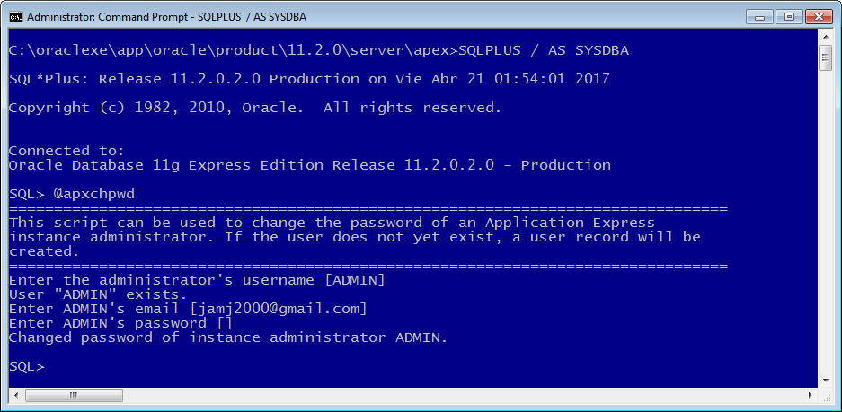

En este caso es aconsejable poner una contraseña corta y sencilla, puesto que después, cuando accedamos a APEX, nos pedirá que la cambiemos, y entonces la política de contraseñas es bastante estricta:

- al menos 6 caracteres
- debe contener algún carácter numérico
- debe contener algún carácter no alfanumérico: % & $ _...
- debe contener alguna minúscula
- no contener el nombre de usuario
- no parecerse a la contraseña anterior

Interfaces
----------------

Durante este curso hemos trabajado con Oracle Express Edition (XE) 11gR2.
Hemos hecho uso de 2 interfaces:

- Interfaz de texto o comandos: **SQL\*PLUS**.
- Interfaz web: **APEX** (Application Express)

La interfaz de comandos es muy útil para realizar tareas administrativas de forma rápida y cómoda. Por ejemplo, crear, modificar o eliminar esquemas (usuarios); conceder privilegios; ejecutar scripts SQL, etc.

La interfaz web es más cómoda para trabajar con código PL/SQL. También para la importación y exportación de datos en un entorno amigable. Por supuesto, además puede utilizarse para realizar operaciones DML (consultas, inserciones, modificaciones y eliminaciones).

Podemos comprobar la versión de APEX consultando la vista APEX_RELEASE:

.. code-block:: plpgsql

	SELECT VERSION_NO FROM APEX_RELEASE;

Captura de pantalla de interface APEX 4, la que viene con Oracle XE 11gR2:

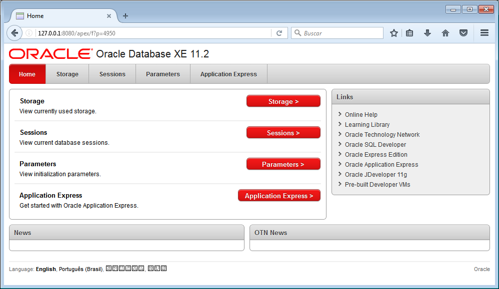

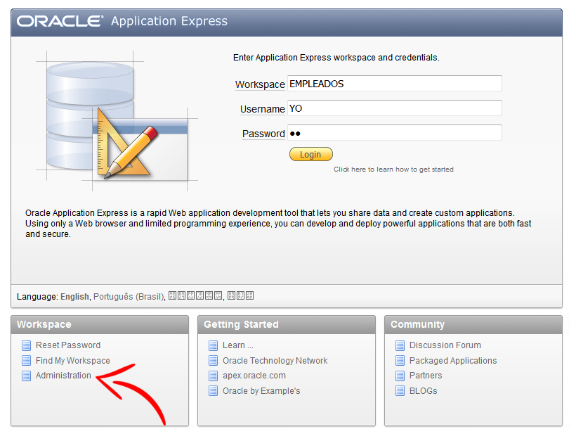

Observa, donde se encuentra la página de administración para APEX 4. En ella podremos crear, modificar y eliminar espacios de trabajo (workspaces), entre otras cosas.

Configuración de Oracle XE
---------------------------

Cuanto instalamos Oracle Express Edition, éste viene con una configuración que establece una serie de parámetros que condicionan la forma en la que se guardan y representan los datos.

Debemos distinguir entre 2 tipos de configuraciones:

- Configuración del Sistema Gestor de BBDD.
- Configuración de las sesiones.

Configuración del Sistema Gestor de BBDD.
++++++++++++++++++++++++++++++++++++++++++

Para ver dichos parámetros ejecutamos la siguiente sentencia:

.. code-block:: plpgsql

	SELECT * FROM NLS_DATABASE_PARAMETERS;

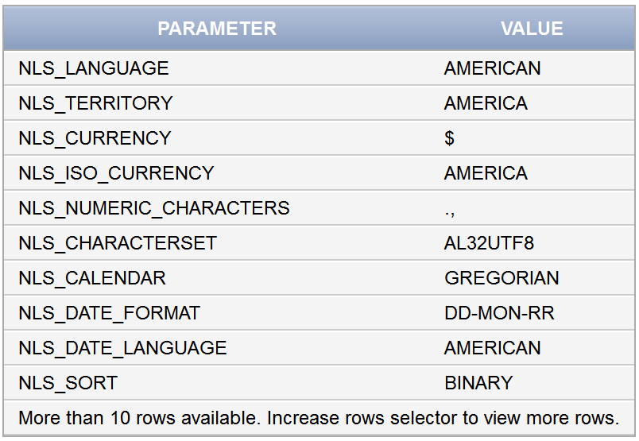

Los parámetros más importantes son:

- La codificación de caracteres (**NLS_CHARACTERSET**): Unicode (UTF8 u otro), Windows-1252, ... Esto afecta a la representación de tildes y caracteres como Ñ.
- El idioma (**NLS_LANGUAGE**)
- El país (**NLS_TERRITORY**)
- La moneda (**NLS_CURRENCY**): $, €, ...
- Los separadores en los números (**NLS_NUMERIC_CHARACTERS**):

  - Separador decimal (D). En Estados Unidos es el punto.
  - Separador de grupo (G). En Estados Unidos es la coma.

- El formato de fecha (**NLS_DATE_FORMAT**). Este puede variar en gran manera de un país a otro. A continuación se muestra un gráfico tomado de Wikipedia.

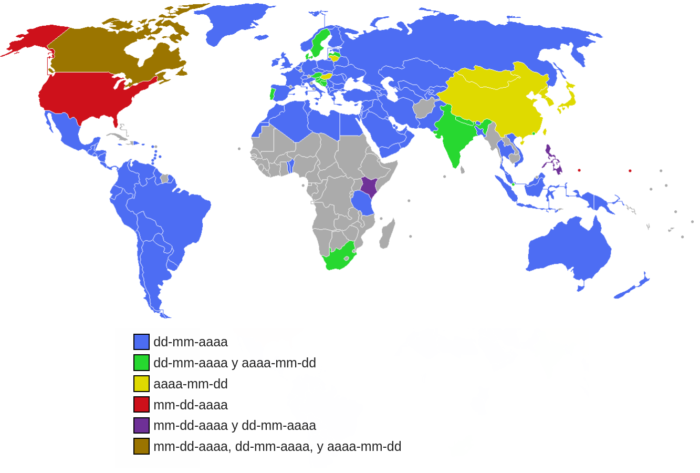

Configuración de las sesiones.
+++++++++++++++++++++++++++++++

Para comprobar los parámetros NLS de la sesión:

.. code-block:: plpgsql
	
	SELECT * FROM NLS_SESSION_PARAMETERS;

**Ejecutado en APEX:**

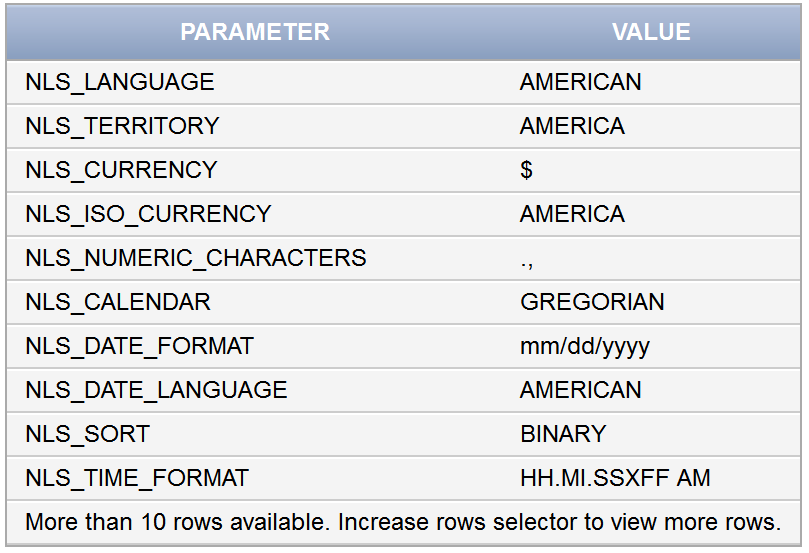

**Ejecutado en SQL\*Plus:**

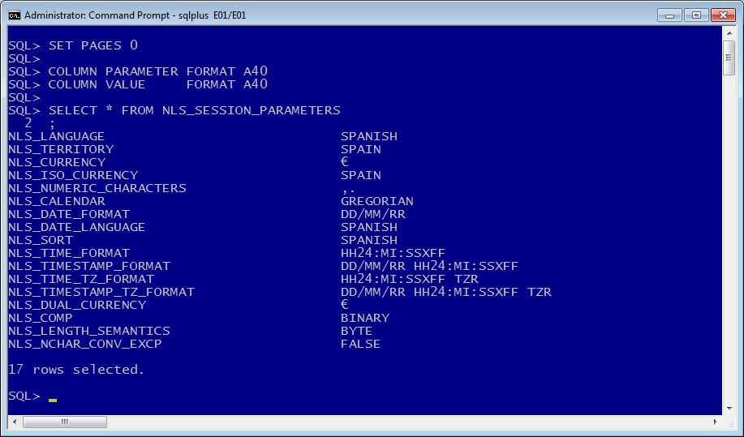

Podemos cambiar la configuración de la sesión. Ejemplos:

.. code-block:: plpgsql

	ALTER SESSION SET NLS_DATE_FORMAT = 'DD/MM/YYYY';
	ALTER SESSION SET NLS_LANGUAGE = SPANISH;

.. important::
	
	Las sentencias anteriores funcionan sólo para SQL*Plus.

Para APEX deberemos reinstalar dicho entorno y habilitar el idioma español. Lo vemos en el siguiente apartado.

Instalación de APEX 5.1
-----------------------------

Pasos para instalar una nueva versión de APEX y ponerla en Español:

1. Descargar Oracle Application Express - All languages. El archivo :file:`apex_5.1.zip` contiene APEX 5.1. Es posible bajarlo desde el sitio web oficial de Oracle habiéndonos registrado previamente.
2. Descomprimir :file:`apex_5.1.zip` en :file:`C:\oraclexe\app\oracle\product\11.2.0\server` sobreescribiendo la carpeta apex existente.

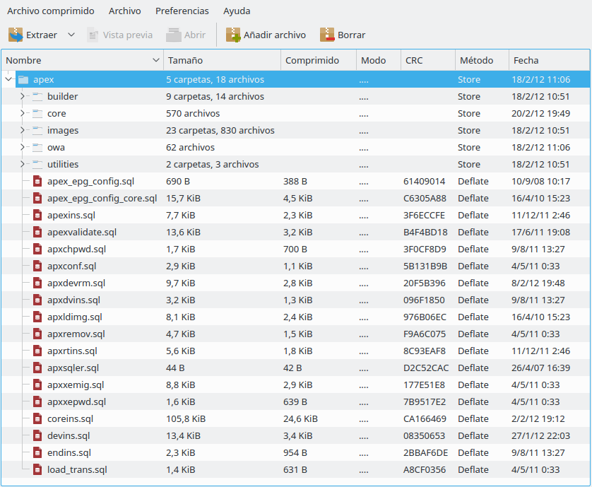

3. Abrir un terminal CMD
4. Ejecutar: :code:`CD C:\oraclexe\app\oracle\product\11.2.0\server\apex`
5. Ejecutar: :code:`SQLPLUS / AS SYSDBA`
6. Ejecutar script del instalador: :code:`@apexins SYSAUX SYSAUX TEMP /i/`

.. note::
	
	Tardará un buen rato. Al finalizar se cierra SQL\*Plus automáticamente.

7. Volver a SQLPLUS: :code:`SQLPLUS / AS SYSDBA`
8. Ejecutar script de carga de imágenes: :code:`@apex_epg_config.sql C:\oraclexe\app\oracle\product\11.2.0\server`
9. Ya tenemos instalada la nueva versión de APEX.

Poner en español APEX 5.1
--------------------------

Para poner el idioma en español realizamos los siguientes pasos:

1. Abrir un terminal :code:`CMD`
2. Ejecutar: :code:`CD C:\oraclexe\app\oracle\product\11.2.0\server\apex`
3. Poner página de códigos a Unicode: :code:`CHCP 65001`
4. Establecer variable de entorno: :code:`SET NLS_LANG=SPANISH_SPAIN.AL32UTF8`
5. Iniciar :code:`SQLPLUS / AS SYSDBA`
6. Ejecutar script: :code:`@load_trans.sql SPANISH`

La variable de entorno **NLS_LANG** indica a Oracle qué codificación usa el cliente, así puede hacer las conversiones necesarias para que el cliente visualice correctamente el contenido.

.. code::

	NLS_LANG=LANGUAGE_TERRITORY.CHARACTERSET

Ejemplos en CMD de Windows:

.. code::

	SET NLS_LANG=AMERICAN_AMERICA.AL32UTF8
	SET NLS_LANG=SPANISH_SPAIN.WE8ISO8859P1

Acceso a APEX 5.1
-------------------

Usuario normal
++++++++++++++

http://127.0.0.1:8080/apex

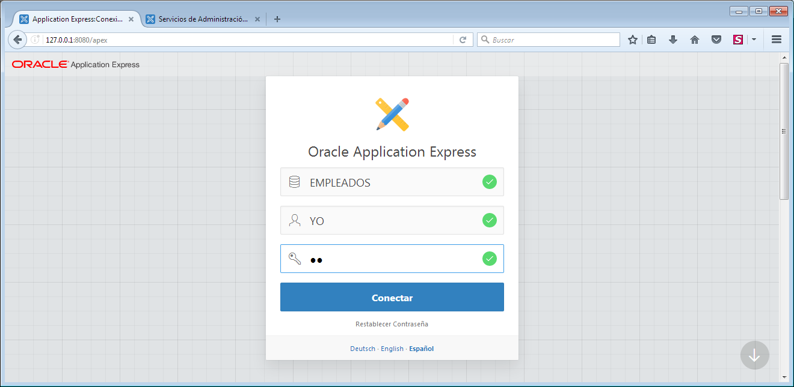
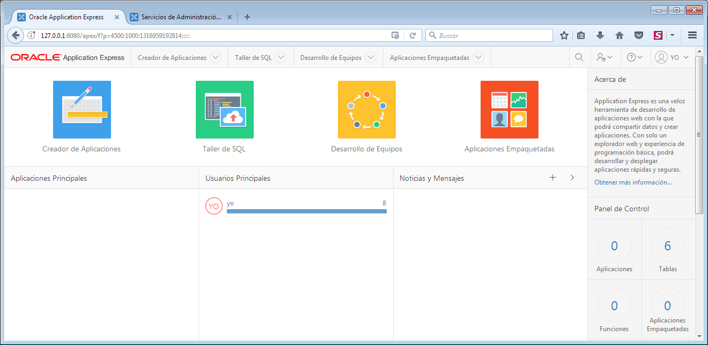

Usuario ADMIN
+++++++++++++++

http://127.0.0.1:8080/apex/apex_admin

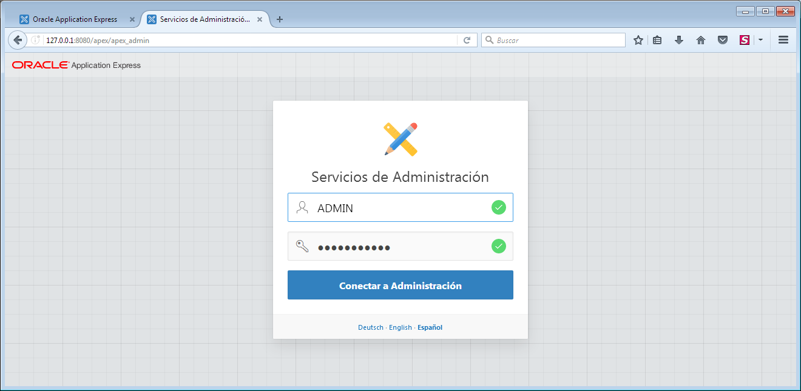
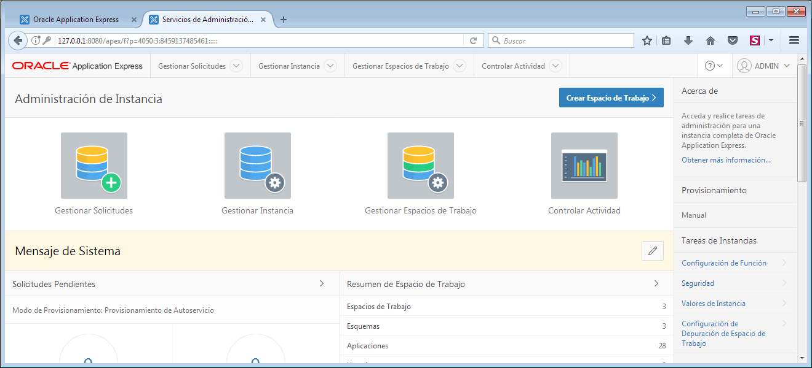

SEGURIDAD DE LOS DATOS
=========================

Privilegios
----------------

Los privilegios son permisos que damos a los usuarios para que puedan realizar ciertas operaciones con la base de datos. En Oracle hay más de cien posibles privilegios. Se dividen en:

- **Privilegios de sistema**. Son permisos para modificar el funcionamiento de la base de datos. Son cambios, en definitiva, que afectan a todos los usuarios.
- **Privilegios de objeto**. Son permisos que se aplican a un objeto concreto de la base de datos.

Privilegios del sistema
+++++++++++++++++++++++++

Hay más de 100 privilegios de sistema distintos. Cada privilegio del sistema permite al usuario realizar una operación de base de datos o una clase de operaciones de base de datos concretas. Algunos de los privilegios del sistema, entre los muchos que existen, son:

.. csv-table:: PRIVILEGIOS DE SISTEMA MÁS FRECUENTES
	:header: Privilegio, Descripción
	:widths: 30, 70

	CREATE SESSION, "Permite al usuario conectar con la base de datos."
	CREATE TABLE, "Permite crear tablas. Incluye la posibilidad de modificarlas y borrarlas."
	CREATE VIEW, "Permite crear vistas. Incluye la posibilidad de modificarlas y borrarlas."
	CREATE MATERIZALIZED VIEW, "Permite crear vistas materializadas. Incluye la posibilidad de modificarlas y borrarlas."
	CREATE SEQUENCE, "Permite crear secuencias. Incluye la posibilidad de modificarlas y borrarlas."
	CREATE SYNONYM, "Permite crear sinónimos. Incluye la posibilidad de modificarlos y borrarlos."
	CREATE PROCEDURE, "Permite crear, modificar y borrar un procedimiento PL/SQL, una función o un paquete."
	CREATE TRIGGER, "Permite crear triggers. Incluye la posibilidad de modificarlos y borrarlos."

Oracle posee dos privilegios de sistema asociados a tareas administrativas, son:

- **SYSDBA**. Con capacidad de parar e iniciar (instrucciones SHUTDOWN y STARTUP) la instancia de base de datos; modificar la base de datos (ALTER DATABASE), crear y borrar bases de datos (CREATE y DROP DATABASE), crear elarchivo de parámetros (CREATE SPFILE), cambiar el modo de archivado de la base de datos, recuperar la base de datos y además incluye el privilegio de sistema RESTRICTED SESSION. En la práctica es usar el usuario SYS.
- **SYSOPER**. Permite lo mismo que el anterior salvo: crear y borrar la base de datos y recuperar en todas las formas la base de datos (hay modos de recuperación que requieren el privilegio anterior).

Privilegios de objeto
+++++++++++++++++++++++

Los privilegios de objeto más frecuentes son:

.. csv-table:: PRIVILEGIOS DE OBJETO MÁS FRECUENTES
	:header: Privilegio, Objeto, Descripción
	:widths: 10, 20, 70

	INSERT, "Tabla o sinónimo", "Permite al usuario insertar en una tabla directamente o a través de un sinónimo."
	UPDATE, "Tabla", "Permite al usuario modificar una tabla."
	DELETE, "Tabla", "Permite al usuario borrar una tabla."
	SELECT, "Tabla, vista, vista materializada, secuencia o sinónimo", "Permite al usuario seleccionar desde una tabla, secuencia, vista, vista materializada o sinónimo."
	EXECUTE, "Paquete, procedimiento,función de PL/SQL", "Permite al usuario ejecutar directamente un  o paquete, procedimiento o función." 

Conceder privilegios de sistema
++++++++++++++++++++++++++++++++

Se usa con la instrucción GRANT que funciona así:

.. code-block:: plpgsql

	GRANT privilegio1 [,privilegio2[,...]] TO usuario
	[WITH ADMIN OPTION];

La opción **WITH ADMIN OPTION** permite que el usuario al que se le concede el privilegio puede conceder dicho privilegio a otros usuarios. Es, por tanto, una opción a utilizar con cautela. Se utiliza únicamente con privilegios de sistema.

Ejemplo:

.. code-block:: plpgsql

	GRANT CREATE SESSION, CREATE TABLE, CREATE PROCEDURE
	TO usuario;

Conceder privilegios de objeto
+++++++++++++++++++++++++++++++++

Se trata de privilegios que se colocan a un objeto para dar permiso de uso a un usuario.

Sintaxis:

.. code-block:: plpgsql

	GRANT {privilegio [(listaColumnas)] [,...]] | ALL [PRIVILEGES]}
	ON [esquema.]objeto
	TO {usuario | rol} [,{usuario | rol } [,...]]
	[WITH GRANT OPTION];

La opción **ALL** concede todos los privilegios posibles sobre el objeto. Se pueden asignar varios privilegios a la vez y también varios posibles usuarios. 

La opción **WITH GRANT OPTION** permite al usuario al que se le conceden los privilegios, que pueda, a su vez,
concederlos a otro. Se utiliza únicamente con privilegios de objeto.

Ejemplo:

.. code-block:: plpgsql

	GRANT UPDATE, INSERT ON EMPLEADOS.centros TO jose;

Revocar privilegios de sistema
+++++++++++++++++++++++++++++++++

.. code-block:: plpgsql

	REVOKE privilegio1 [,privilegio2 [,...]] FROM usuario;

Revocar privilegios de objeto
++++++++++++++++++++++++++++++++

.. code-block:: plpgsql

	REVOKE {privilegio1 [,privilegio2] [,...]] | ALL [PRIVILEGES]}
	ON [esquema.]objeto
	FROM {usuario | rol } [,{usuario | rol } [,...]]
	[CASCADE CONSTRAINTS];

CASCADE CONSTRAINTS elimina cualquier restricción que impida el borrado del privilegio.

Consultar privilegios
+++++++++++++++++++++++++

Para ver los privilegios en activo para el usuario y sesión actuales ejecutamos la sentencia:

.. code-block:: plpgsql

	SELECT * FROM SESSION_PRIVS;

.. note:: 
	
	El uso de "WITH ADMIN OPTION" y "WITH GRANT OPTION" se considera peligroso en Oracle, porque si no se administran cuidadosamente puede tener efectos secundarios no deseados, resultando en un agujero de seguridad.

Roles
-------------

Un rol es un conjunto de privilegios bajo un nombre.

Creación de rol
++++++++++++++++

.. code-block:: plpgsql

	CREATE ROLE nombre_rol;

Asignación y retirada de privilegios a roles
++++++++++++++++++++++++++++++++++++++++++++

Se realiza con la instrucción **GRANT**. A los roles se les asignan privilegios igual que a los usuarios, pueden ser de sistema y/o de objeto. Lógicamente se eliminan mediante **REVOKE**.

.. code-block:: plpgsql

	-- Asignación de privilegios de sistema al rol
	GRANT privilegios_de_sistema TO nombre_rol;
	-- Asignación de privilegios de objeto al rol
	GRANT privilegios_de_objeto ON objeto TO nombre_rol;
	-- Retirada de privilegios de sistema al rol
	REVOKE privilegios_de_sistema FROM nombre_rol;
	-- Retirada de privilegios de objeto al rol
	REVOKE privilegios_de_objeto ON objeto FROM nombre_rol;

Eliminación de rol
+++++++++++++++++++

.. code-block:: plpgsql

	DROP ROLE nombre_rol;

Ejemplo:

.. code-block:: plpgsql

	-- Creación de rol
	CREATE ROLE JEFE;
	-- Añadimos privilegios de objeto al rol
	GRANT INSERT, SELECT, UPDATE, DELETE ON EMPLEADOS.departamentos TO JEFE;
	-- Añadimos privilegios de sistema al rol
	GRANT CREATE SESSION, CREATE TABLE, CREATE VIEW TO JEFE;
	-- Eliminación de rol
	DROP ROLE JEFE;

Asignación de roles a los usuarios
+++++++++++++++++++++++++++++++++++

Se pueden asignar roles a un usuario e incluso a otro rol. La sintaxis es:

.. code-block:: plpgsql

	GRANT rol1 [,rol2 [,...]]
	TO {usuario|rol [,{usuario|rol } [,...] }
	[WITH ADMIN OPTION];

Al igual que en las instrucciones anteriores, WITH ADMIN OPTION permite al usuario al que se le concede el rol, conceder él dicho rol a otros usuarios/as.

Roles predefinidos
+++++++++++++++++++

Existen 3 roles predefinidos en Oracle:

.. csv-table:: ROLES PREDEFINIDOS
	:header: Rol, Descripción
	:widths: 10, 90

	CONNECT, "Permite al usuario conectarse a la base de datos. Debemos conceder este rol a cualquier usuario o aplicación que necesite acceso a la base de datos."
	RESOURCE, "Permite a un usuario crear, modificar y eliminar ciertos tipos de objetos de esquema en el esquema asociado con ese usuario. Debemos conceder este rol sólo a los desarrolladores y a otros usuarios que deben crear objetos de esquema. Esta función otorga un subconjunto de los privilegios del sistema de objetos de creación. Por ejemplo, concede el privilegio del sistema CREATE TABLE, pero **no otorga el privilegio del sistema CREATE VIEW**. Sólo otorga los siguientes privilegios: CREATE CLUSTER, CREATE INDEX TYPE, CREATE OPERATOR, CREATE PROCEDURE, CREATE SEQUENCE, CREATE TABLE, CREATE TRIGGER y CREATE TYPE."
	DBA, "Permite al usuario realizar la mayoría de las funciones administrativas, incluyendo la creación de usuarios y la concesión de privilegios; Crear y otorgar roles; Crear, modificar y eliminar objetos de esquema en cualquier esquema; y más. Concede todos los privilegios del sistema, pero no incluye los privilegios para iniciar o cerrar la instancia de la base de datos. Esto se concede por defecto a los usuarios SYS y SYSTEM."

Consultar roles
+++++++++++++++

Para ver los roles en activo para el usuario y sesión actuales ejecutamos la sentencia:

.. code-block:: plpgsql

	SELECT * FROM SESSION_ROLES;

IMPORTACIÓN Y EXPORTACIÓN DE DATOS
======================================

En este apartado comentaremos brevemente como importar y exportar datos en Oracle, aunque en muchos casos es aplicable a otros sistemas gestores de BB.DD. puesto que la forma de proceder suele ser parecida.

Antes de empezar, debemos diferenciar entre dos conceptos:

- **Migración**: mover de un sitio a otro datos y esquemas.
- **Importación/Exportación**: mover de un sitio a otro datos únicamente.

Migración
-----------

La migración es el proceso de pasar una base de datos desarrollada bajo un SGBD a otro SGBD distinto. Por ejemplo pasar una base de datos Oracle a MySQL o SQL Server, por poner sólo dos ejemplos.

Los principales aspectos a tener en cuenta, y que pueden ser problemáticos son:

- La definición e interpretación de los distintos tipos de datos
	Deberán realizarse cambios en algunos tipos de datos que existen en una base de datos pero no en otras. Especialmente delicados son los campos fecha, los numéricos (enteros, reales, etc) y los de tipo texto variable, entre otros, ya que cada SGBD los trata o los "espera" de manera diferente.
- El código procedimental almacenado
	Procedimientos, funciones, paquetes y triggers se escriben en un lenguaje específico para cada SGBD. Por ejemplo Oracle lo hace en PL/SQL, mientras SQL Server lo hace en Transact-SQL. Asimismo MySQL posee también su propio lenguaje procedimental.

Actualmente la mayoría de SGBD incluyen herramientas de ayuda a la migración más o menos "fiables" que permiten realizar este proceso de manera automatizada en gran medida.

Otra forma de realizar la migración es hacerlo de forma manual, mediante la revisión y adaptación del código, tanto declarativo (SQL) como procedimental (PL/SQL, Transact-SQL, ...), así como la revisión y formateo de datos.

No obstante, ni que decir tiene que el proceso de migración de datos es lo suficientemente delicado como para realizarlo en un entorno de pruebas, contemplando toda la casuística posible en cuanto a tipos de datos a manejar, tablas involucradas y sus relaciones, etc. Sólo en el momento en el que estemos seguros de que la migración se ha realizado con éxito, sin problemas de interpretación de datos ni pérdida de ellos, podemos pasar a un entorno de producción, teniendo en cuenta que una migración mal realizada podría dar por terminada una estructura de información completa.

La migración es un proceso complejo y que debería evitarse siempre que sea posible. Para ello es importante decidir correctamente en un principio el SGBD a utilizar y mantenerlo durante toda la vida útil de la base de datos.

La importación/exportación de datos es un proceso relativamente sencillo, si la comparamos con la migración. Básicamente, el aspecto más importante a tener en cuenta es el formato de datos que se utilizará para el intercambio de datos.

Importación/Exportación
-------------------------

Tanto en la importación como la exportación es bastante frecuente utilizar texto plano para realizar el intercambio de información. Los formatos más usados son:

- **CSV**
- **XML**
- **JSON**
- **SQL**

CSV (Comma Separate Values)
++++++++++++++++++++++++++++

Es un formato extremadamente sencillo pero muy potente.

Los archivos CSV (del inglés comma-separated values) son un tipo de documento en formato abierto sencillo para representar datos en forma de tabla, en las que las columnas se separan por comas (o punto y coma en donde la coma es el separador decimal: Argentina, España, Brasil...) y las filas por saltos de línea.

El formato CSV es muy sencillo y no indica un juego de caracteres concreto, ni cómo van situados los bytes, ni el formato para el salto de línea. Estos puntos deben indicarse muchas veces al abrir el archivo, por ejemplo, con una hoja de cálculo.

El formato CSV no está estandarizado. La idea básica de separar los campos con una coma es muy clara, pero se vuelve complicada cuando el valor del campo también contienen comillas dobles o saltos de línea. Las implementaciones de CSV pueden no manejar esos datos, o usar comillas de otra clase para envolver el campo. Pero esto no resuelve el problema: algunos campos también necesitan embeber estas comillas, así que las implementaciones de CSV pueden incluir caracteres o secuencias de escape.

Además, el término "CSV" también denota otros formatos de valores separados por delimitadores que usan delimitadores diferentes a la coma (como los valores separados por tabuladores).

Ejemplo en forma de tabla:

.. csv-table:: 
   :header: NUMCE,NOMCE,DIRCE

   10,SEDE CENTRAL,"C/ ATOCHA, 820, MADRID"
   20,RELACIÓN CON CLIENTES,"C/ ATOCHA, 405, MADRID"

Datos en formato CSV:

.. code::

	NUMCE,NOMCE,DIRCE
	10,SEDE CENTRAL,"C/ ATOCHA, 820, MADRID"
	20,RELACIÓN CON CLIENTES,"C/ ATOCHA, 405, MADRID"

Una de las grandes ventajas del uso de este formato es que puede editarse utilizando cualquier editor de texto. Además está muy bien soportado por cualquier hoja de cálculo, por ejemplo puede abrirse con LibreOffice Calc y nos mostrará su contenido en forma de tabla.

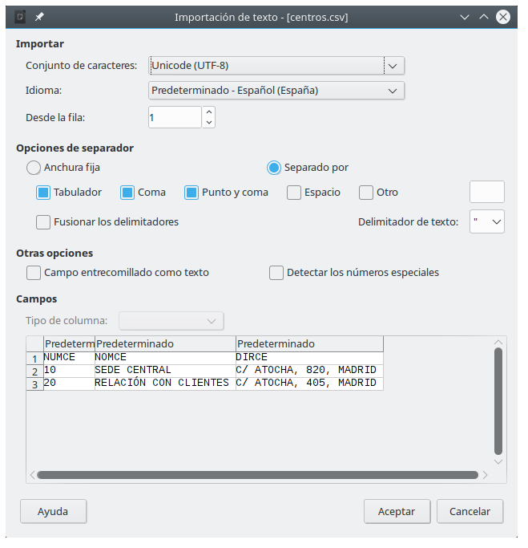

Esto permite aplicar cualquier tipo de operación disponible en una hoja de cálculo: ordenar por columnas, realizar cálculos, etc y finalmente volver a guardar el resultado en formato CSV.

XML (eXtensible Markup Language)
++++++++++++++++++++++++++++++++++

XML, siglas en inglés deC eXtensible Markup Language, traducido como "Lenguaje de Marcado Extensible" o "Lenguaje de Marcas Extensible", es un meta-lenguaje que permite definir lenguajes de marcas desarrollado por el World Wide Web Consortium (W3C) utilizado para almacenar datos en forma legible.

XML no ha nacido únicamente para su aplicación en Internet, sino que se propone como un estándar para el intercambio de información estructurada entre diferentes plataformas. Se puede usar en bases de datos, editores de texto, hojas de cálculo y casi cualquier cosa imaginable.

XML es una tecnología sencilla que tiene a su alrededor otras que la complementan y la hacen mucho más grande, con unas posibilidades mucho mayores. Tiene un papel muy importante en la actualidad ya que permite la compatibilidad entre sistemas para compartir la información de una manera segura, fiable y fácil.

JSON (JavaScript Object Notation)
+++++++++++++++++++++++++++++++++++

JSON, acrónimo de JavaScript Object Notation, es un formato de texto ligero para el intercambio de datos. JSON es un subconjunto de la notación literal de objetos de JavaScript aunque hoy, debido a su amplia adopción como alternativa a XML, se considera un formato de lenguaje independiente.

Una de las supuestas ventajas de JSON sobre XML como formato de intercambio de datos es que es mucho más sencillo escribir un analizador sintáctico (parser) de JSON. Si bien es frecuente ver JSON posicionado contra XML, también es frecuente el uso de JSON y XML en la misma aplicación.

XML goza de mayor soporte y ofrece muchas más herramientas de desarrollo (tanto en el lado del cliente como en el lado del servidor). Hay muchos analizadores JSON en el lado del servidor, existiendo al menos un analizador para la mayoría de los entornos. En algunos lenguajes, como Java o PHP, hay diferentes implementaciones donde escoger. En JavaScript, el análisis es posible de manera nativa con la función eval(). Ambos formatoscarecen de un mecanismo para representar grandes objetos binarios.

Actualmente JSON tiene su principal nicho en aplicaciones JavaScript y en algunas bases de datos noSQL.

SQL (Structured Query Language)
++++++++++++++++++++++++++++++++

Por último, tenemos el lenguaje SQL, soportado por todas las bases de datos relacionales.

Podemos hacer uso de scripts SQL con sentencias INSERT para realizar la “importación” de datos dentro de un SGBDR. Si bien en este caso es necesario el procesamiento previo de las sentencias, algo que no sucedía con los formatos anteriores.

Ejemplo de script SQL para importación de datos:

.. code-block:: plpgsql

  INSERT INTO DEPARTAMENTOS VALUES(100, 10,260,'P',72,NULL, 'DIRECCIÓN GENERAL'); 
  INSERT INTO DEPARTAMENTOS VALUES(110, 20,180,'P',90,100, 'DIRECC.COMERCIAL'); 
  INSERT INTO DEPARTAMENTOS VALUES(111, 20,180,'F',66,110, 'SECTOR INDUSTRIAL'); 
  INSERT INTO DEPARTAMENTOS VALUES(112, 20,270,'P',54,110, 'SECTOR SERVICIOS'); 
  INSERT INTO DEPARTAMENTOS VALUES(120, 10,150,'F',18,100, 'ORGANIZACIÓN'); 
  INSERT INTO DEPARTAMENTOS VALUES(121, 10,150,'P',12,120, 'PERSONAL'); 
  INSERT INTO DEPARTAMENTOS VALUES(122, 10,350,'P',36,120, 'PROCESO DE DATOS'); 
  INSERT INTO DEPARTAMENTOS VALUES(130, 10,310,'P',12,100, 'FINANZAS'); 

  COMMIT;

